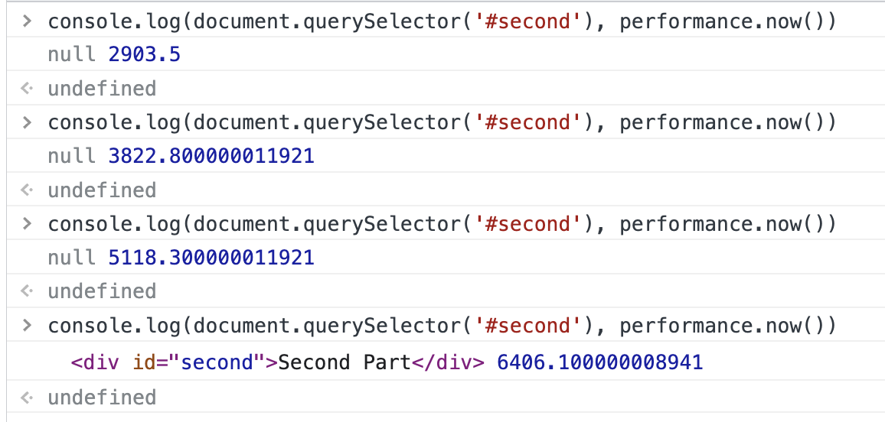
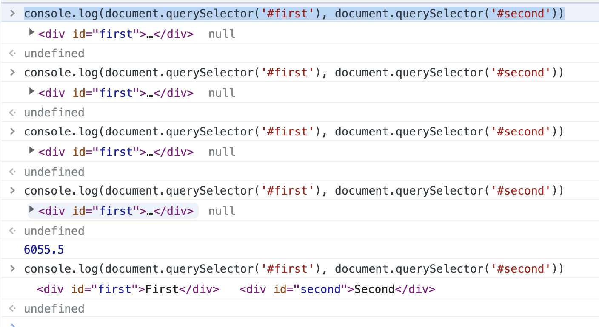

# 前言

浏览器在解析 HTML 时，遇到 CSS 和 JS 可能会阻塞住，这个结论网上有很多，可自行搜索。

对于 JS，有如下结论：

1. JS 加载会阻塞 HTML 的解析和渲染
2. JS 执行会阻塞 HTML 的解析和渲染

对于 CSS，有如下结论：

1. CSS 加载不会阻塞 HTML 的解析，会阻塞 HTML 的渲染
2. CSS 加载不会阻塞 JS 的加载，会阻塞 JS 的执行

下面，我们做几个实验来验证上述的结论。

# 实验验证

## JS 加载会阻塞 HTML 的解析和渲染

这个只需验证会阻塞解析即可，因为渲染的前提是先解析。我们构造这样一个 HTML 文件：

```html
<!DOCTYPE html>
<html lang="en">
  <head>
    <meta charset="UTF-8" />
    <title>Test for Parsing HTML</title>
  </head>
  <body>
    <div id="first">First Part</div>
    <script src="./big.js"></script>
    <div id="second">Second Part</div>
  </body>
</html>
```

其中 `big.js` 里面放一些注释就好了，体积大概 1 MB 左右。启动静态文件服务器，打开浏览器器并限速为 Fast 3G（这样 `big.js` 加载时间会大于 5s），访问上述文件，此时快速打开 console 面板，多次输入：

```js
console.log(document.querySelector('#second'), performance.now())
```

以下是我的结果：



我们知道 HTML 的解析目的是为了生成 DOM。从上面的验证结果中发现，在 `big.js` 的加载过程中，第二个 `div` 的 DOM 确实一直没有构建出来，所以 “JS 加载会阻塞 HTML 的解析” 是成立的。

## JS 执行会阻塞 HTML 的解析和渲染

同样的，我们也只需要验证会阻塞解析即可。聪明的你肯定想到把上面例子中的 JS 改成内联的就可以验证了，但是如果你这么做的话，发现当 JS 在运行时，根本没法在 console 面板中进行输入。我们换成下面的例子：

```html
<!DOCTYPE html>
<html lang="en">
  <head>
    <meta charset="UTF-8" />
    <title>Test for Parsing HTML</title>
  </head>
  <body>
    <div id="first">First Part</div>
    <script>
      const start = performance.now()
      while (performance.now() - start < 1000) {}
      console.log(document.querySelector('#second'))
    </script>
    <div id="second">Second Part</div>
  </body>
</html>
```

输出结果是 `null`。当然，这个结果对于我们来说是显而易见的事情，那为啥这可以用来证明呢？现在假设 JS 的执行不阻塞 HTML 的解析，那么在执行 `while` 循环的时候后面的内容应该早就解析完成了（毕竟有 1 秒钟的时间），那么 `console.log` 就不应该输出 `null`。而现在输出了 `null`，说明假设不成立，“JS 的执行会阻塞 HTML 的解析”。

## CSS 加载不会阻塞 HTML 的解析，会阻塞 HTML 的渲染

还是先上例子：

```html
<!DOCTYPE html>
<html lang="en">
  <head>
    <meta charset="UTF-8" />
    <title>Test for Parsing HTML</title>
    <link rel="stylesheet" href="./big.css" />
  </head>
  <body>
    <div id="div">I am a DIV.</div>
  </body>
</html>
```

其中 `big.css` 里面也是放 1mb 左右的注释即可。然后启动静态文件服务器，打开浏览器器并限速为 Fast 3G（这样 `big.css` 加载时间会大于 5s），访问上述文件，此时快速打开 console 面板，多次输入：

```js
console.log(document.querySelector('#div'), performance.now())
```

可以看到输出结果都不是 `null`，从而可以验证“CSS 加载不会阻塞 HTML 的解析”。

还是这个例子，我们通过肉眼可以发现页面内容要等待比较长的时间才能显示出来，从而可以验证“CSS 加载会阻塞 HTML 的渲染”。

## CSS 加载不会阻塞 JS 的加载，会阻塞 JS 的执行

第一部分很好证明，用下面这个例子即可：

```html
<!DOCTYPE html>
<html lang="en">
  <head>
    <meta charset="UTF-8" />
    <title>Test for Parsing HTML</title>
    <link rel="stylesheet" href="./big.css" />
    <script src="./big.js"></script>
  </head>
  <body>
    <div id="div">I am a DIV.</div>
  </body>
</html>
```

打开浏览器 Network 面板，可以看到两个资源是几乎是同时加载的：


从而证明“CSS 加载不会阻塞 JS 的加载”。

对于后面一部分，我们构造这样的例子：

```html
<!DOCTYPE html>
<html lang="en">
  <head>
    <meta charset="UTF-8" />
    <title>Test for Parsing HTML</title>
    <link rel="stylesheet" href="./big.css" />
  </head>
  <body>
    <div id="first">First</div>
    <script>
      console.log(performance.now())
    </script>
    <div id="second">Second</div>
  </body>
</html>
```

上面的例子中，最后输出的结果在我的机器上是 6000 多毫秒（限速为 Fast 3G），从而证明了“CSS 加载会阻塞 JS 的执行”。

同时，如果我们在浏览器中多次输入 `console.log(document.querySelector('#first'), document.querySelector('#second'))`，会得到如下结果：



分析这个结果，我们发现在 `big.css` 加载的时候，第一个 `div` 已经被解析出来了，但是由于 JS 的执行被 CSS 的加载所阻塞，而 JS 的执行又会阻塞 HTML 的解析，所以第二个 `div` 还未被解析。直到 JS 被执行完后，第二个 `div` 才被解析出来。

通过这几个例子，是不是对浏览器解析 HTML 的过程又有了进一步的理解呢？
