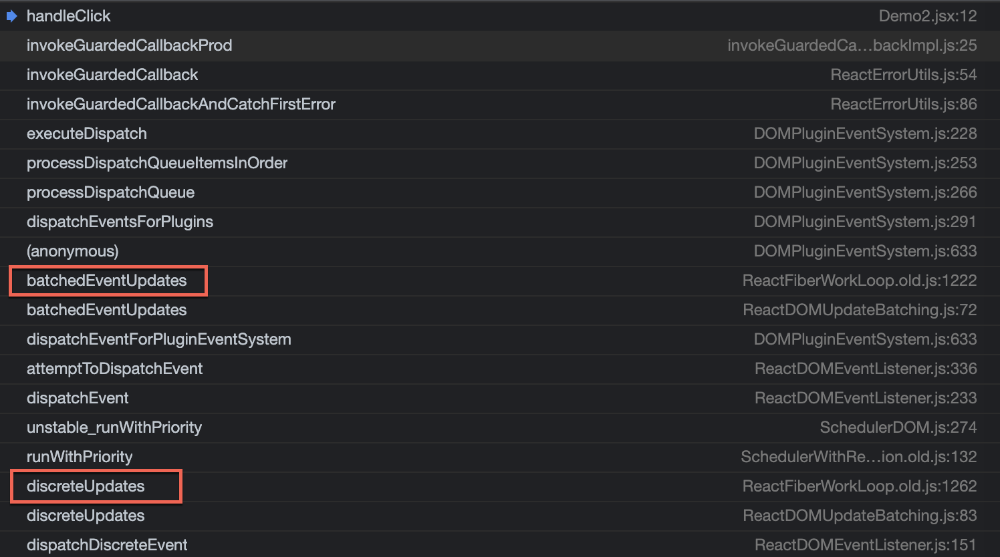

# 引言
最近，React 团队给出了 [React 18 版本的计划](https://reactjs.org/blog/2021/06/08/the-plan-for-react-18.html)，其中提到了一个优化：Automatic Batching。关于该优化，React 成员之一 Dan 在 Github 上进行了[解释](https://github.com/reactwg/react-18/discussions/21)，本文基于该解释在进行一下拓展。

# 什么是批处理
批处理是 React 将多个状态更新合并成一个重新渲染以取得更好的性能的一种优化方式，比如下面这个[例子](https://codesandbox.io/s/spring-water-929i6?file=/src/index.js)（React 17.0.2）：

```javascript
import { useState, useLayoutEffect } from "react";
import * as ReactDOM from "react-dom";

function App() {
  const [count, setCount] = useState(0);
  const [flag, setFlag] = useState(false);

  function handleClick() {
    console.log("=== click ===");
    // 触发一次重新渲染
    setCount((c) => c + 1);
    setFlag((f) => !f);
  }

  return (
    <div>
      <button onClick={handleClick}>Next</button>
      <h1 style={{ color: flag ? "blue" : "black" }}>{count}</h1>
      <LogEvents />
    </div>
  );
}

function LogEvents(props) {
  useLayoutEffect(() => {
    console.log("Commit");
  });
  console.log("Render");
  return null;
}

const rootElement = document.getElementById("root");
ReactDOM.render(<App />, rootElement);
```

点击按钮，虽然有两次状态的更新，但是只会触发一次重新渲染，即打印完 `=== click ===` 后，只会打印一次：

```
Render
Commit
```

这里拓展一下，Legacy 模式下（调用 `ReactDOM.render`） React 是如何实现批处理的的。

## Legacy 模式批处理实现方式
我们在 `handleClick` 函数头部打一个断点，点击 `button` 后，查看调用栈如下：

我们重点关注下标红的两处，首先是 `discreteUpdates`：
```javascript
export function discreteUpdates<A, B, C, D, R>(
  fn: (A, B, C) => R,
  a: A,
  b: B,
  c: C,
  d: D,
): R {
  const prevExecutionContext = executionContext;
  executionContext |= DiscreteEventContext;

  if (decoupleUpdatePriorityFromScheduler) {
    ...
  } else {
    // 走的这里
    try {
      return runWithPriority(
        UserBlockingSchedulerPriority,
        fn.bind(null, a, b, c, d),
      );
    } finally {
      executionContext = prevExecutionContext;
      if (executionContext === NoContext) {
        // Flush the immediate callbacks that were scheduled during this batch
        resetRenderTimer();
        flushSyncCallbackQueue();
      }
    }
  }
}
```
这里需要注意的是在当前执行上下文 `executionContext` 上加入了 `DiscreteEventContext` （值为 4）。然后是 `batchedEventUpdates`：

```javascript
export function batchedEventUpdates<A, R>(fn: (A) => R, a: A): R {
  const prevExecutionContext = executionContext;
  executionContext |= EventContext;
  try {
    return fn(a);
  } finally {
    executionContext = prevExecutionContext;
    if (executionContext === NoContext) {
      // Flush the immediate callbacks that were scheduled during this batch
      resetRenderTimer();
      flushSyncCallbackQueue();
    }
  }
}
```

这里同上面类似，在 `executionContext` 上加入了 `EventContext`（值为2）。此时 `executionContext` 值为 6。

然后执行 `setCount`，顺藤摸瓜一路会来到 `scheduleUpdateOnFiber`：

```javascript
export function scheduleUpdateOnFiber(
  fiber: Fiber,
  lane: Lane,
  eventTime: number,
): FiberRoot | null {
  ...
  if (lane === SyncLane) {
    if (
      // Check if we're inside unbatchedUpdates
      (executionContext & LegacyUnbatchedContext) !== NoContext &&
      // Check if we're not already rendering
      (executionContext & (RenderContext | CommitContext)) === NoContext
    ) {
      ...
    } else {
      // 来到这里
      ensureRootIsScheduled(root, eventTime);
      schedulePendingInteractions(root, lane);
      if (executionContext === NoContext) {
        // Flush the synchronous work now, unless we're already working or inside
        // a batch. This is intentionally inside scheduleUpdateOnFiber instead of
        // scheduleCallbackForFiber to preserve the ability to schedule a callback
        // without immediately flushing it. We only do this for user-initiated
        // updates, to preserve historical behavior of legacy mode.
        resetRenderTimer();
        flushSyncCallbackQueue();
      }
    }
  } else {
    ...
  }

  // We use this when assigning a lane for a transition inside
  // `requestUpdateLane`. We assume it's the same as the root being updated,
  // since in the common case of a single root app it probably is. If it's not
  // the same root, then it's not a huge deal, we just might batch more stuff
  // together more than necessary.
  mostRecentlyUpdatedRoot = root;

  return root;
}
```

这里，会调用 `ensureRootIsScheduled`：

```javascript
function ensureRootIsScheduled(root: FiberRoot, currentTime: number) {
  const existingCallbackNode = root.callbackNode;
  ...
  // Check if there's an existing task. We may be able to reuse it.
  if (existingCallbackNode !== null) {
    const existingCallbackPriority = root.callbackPriority;
    if (existingCallbackPriority === newCallbackPriority) {
      // The priority hasn't changed. We can reuse the existing task. Exit.
      return;
    }
    // The priority changed. Cancel the existing callback. We'll schedule a new
    // one below.
    cancelCallback(existingCallbackNode);
  }
  // Schedule a new callback.
  let newCallbackNode;
  if (newCallbackPriority === SyncLanePriority) {
    // Special case: Sync React callbacks are scheduled on a special
    // internal queue
    // 进入这里
    newCallbackNode = scheduleSyncCallback(
      performSyncWorkOnRoot.bind(null, root),
    );
  } else if (newCallbackPriority === SyncBatchedLanePriority) {
    ...
  } else {
    ...
  }
  // console.log(root.callbackNode, newCallbackNode);

  root.callbackPriority = newCallbackPriority;
  root.callbackNode = newCallbackNode;
}
```

这里会通过 React 的调度器调度一个任务（更多关于调度器的内容可以参考[React 源码解读之 Concurrent 模式之时间切片](/2020/12/30/react-concurrent-1/)）：

```javascript
    newCallbackNode = scheduleSyncCallback(
      performSyncWorkOnRoot.bind(null, root),
    );
```

然后把这个任务挂载到 `root` 上：

```javascript
  root.callbackNode = newCallbackNode;
```

然后继续执行 `setFlag`，最终也会进入 `ensureRootIsScheduled`，但是由于此时 `root.callbackNode` 不会空，则会进入：

```javascript
const existingCallbackNode = root.callbackNode;
const nextLanes = getNextLanes(
  root,
  root === workInProgressRoot ? workInProgressRootRenderLanes : NoLanes,
);
// This returns the priority level computed during the `getNextLanes` call.
const newCallbackPriority = returnNextLanesPriority();

...
if (existingCallbackNode !== null) {
  const existingCallbackPriority = root.callbackPriority;
  if (existingCallbackPriority === newCallbackPriority) {
    // The priority hasn't changed. We can reuse the existing task. Exit.
    return;
  }
  // The priority changed. Cancel the existing callback. We'll schedule a new
  // one below.
  cancelCallback(existingCallbackNode);
}
```

这里因为 `existingCallbackNode` 不为空，且更新的优先级没有发生变化，所以直接返回了。从上面的分析中可以看到，最后只调度了一个更新任务，也就是 `setCount` 触发的（这里的任务是我们常说的宏任务，宏任务中会执行 `performSyncWorkOnRoot`），这个宏任务会在下一个事件循环中取出执行，一次性处理这两个更新。

# 批处理失效
但是，批处理有时候会失效，比如，当在 `setTimeout` 中连续发起两次更新时：

```javascript
import { useState, useLayoutEffect } from "react";
import * as ReactDOM from "react-dom";

function App() {
  const [count, setCount] = useState(0);
  const [flag, setFlag] = useState(false);

  function handleClick() {
    setTimeout(() => {
      // 每次都会触发重新渲染
      setCount(c => c + 1);
      setFlag(f => !f);
    })
  }

  return (
    <div>
      <button onClick={handleClick}>Next</button>
      <h1 style={{ color: flag ? "blue" : "black" }}>{count}</h1>
      <LogEvents />
    </div>
  );
}

function LogEvents(props) {
  useLayoutEffect(() => {
    console.log("Commit");
  });
  console.log("Render");
  return null;
}

const rootElement = document.getElementById("root");
ReactDOM.render(<App />, rootElement);
```

有了上面的基础，这个问题就好回答了，`handleClick` 执行完后，`discreteUpdates` 和 `batchedEventUpdates` 都会恢复 `executionContext`：

```javascript
export function discreteUpdates<A, B, C, D, R>(
  fn: (A, B, C) => R,
  a: A,
  b: B,
  c: C,
  d: D,
): R {
  const prevExecutionContext = executionContext;
  executionContext |= DiscreteEventContext;

  if (decoupleUpdatePriorityFromScheduler) {
    ...
  } else {
    try {
      ...
    } finally {
      executionContext = prevExecutionContext;
      ...
    }
  }
}
```

```javascript
export function batchedEventUpdates<A, R>(fn: (A) => R, a: A): R {
  const prevExecutionContext = executionContext;
  executionContext |= EventContext;
  try {
    return fn(a);
  } finally {
    executionContext = prevExecutionContext;
    ...
  }
}
```

等到 `setTimeout` 里面的函数执行的时候，`executionContext` 的值已经为 0 了。当执行 `setCount` 的时候，会进入 `scheduleUpdateOnFiber`：

```javascript
export function scheduleUpdateOnFiber(
  fiber: Fiber,
  lane: Lane,
  eventTime: number,
): FiberRoot | null {
  ...
  if (lane === SyncLane) {
    if (
      // Check if we're inside unbatchedUpdates
      (executionContext & LegacyUnbatchedContext) !== NoContext &&
      // Check if we're not already rendering
      (executionContext & (RenderContext | CommitContext)) === NoContext
    ) {
      ...
    } else {
      // 来到这里
      ensureRootIsScheduled(root, eventTime);
      schedulePendingInteractions(root, lane);
      if (executionContext === NoContext) {
        // Flush the synchronous work now, unless we're already working or inside
        // a batch. This is intentionally inside scheduleUpdateOnFiber instead of
        // scheduleCallbackForFiber to preserve the ability to schedule a callback
        // without immediately flushing it. We only do this for user-initiated
        // updates, to preserve historical behavior of legacy mode.
        resetRenderTimer();
        flushSyncCallbackQueue();
      }
    }
  } else {
    ...
  }
  ...
}
```

执行完 `ensureRootIsScheduled` 后，由于 `executionContext` 为 0，会调用 `flushSyncCallbackQueue`，该函数会导致 `ensureRootIsScheduled` 中调度的更新任务立即执行。

更新完成后，接下来执行 `setFlag` 时同样也会走上面的逻辑。为了在定时器等异步逻辑中避免批处理失效，我们可以使用 `unstable_batchedUpdates `：

```javascript
import { unstable_batchedUpdates } from 'react-dom';
...
  function handleClick() {
    setTimeout(() => {
      unstable_batchedUpdates(() => {
        // 触发一次重新渲染
        setCount(c => c + 1);
        setFlag(f => !f);
      })
    })
  }
...
```

而 `unstable_batchedUpdates` 也没什么秘密可言，无非就是执行函数前先给 `executionContext` 添加 `BatchedContext`，执行完后进行恢复：

```javascript
export function batchedUpdates<A, R>(fn: (A) => R, a: A): R {
  const prevExecutionContext = executionContext;
  executionContext |= BatchedContext;
  try {
    return fn(a);
  } finally {
    executionContext = prevExecutionContext;
    if (executionContext === NoContext) {
      // Flush the immediate callbacks that were scheduled during this batch
      resetRenderTimer();
      flushSyncCallbackQueue();
    }
  }
}
```

# Automatic Batching（自动批处理）
而 18 版本以后，无论是在什么情况之下，都可以进行自动批处理了，不过需要使用 `createRoot` 开启 Concurrent 模式（参考[React 源码解读之 Concurrent 模式之时间切片](/2020/12/30/react-concurrent-1/)），还是刚才定时器的例子：

```js
import { useState, useLayoutEffect } from "react";
import * as ReactDOM from "react-dom";

function App() {
  const [count, setCount] = useState(0);
  const [flag, setFlag] = useState(false);

  function handleClick() {
    setTimeout(() => {
      // React 18 以后，以下也只触发一次重新渲染
      setCount(c => c + 1);
      setFlag(f => !f);
    })
  }

  return (
    <div>
      <button onClick={handleClick}>Next</button>
      <h1 style={{ color: flag ? "blue" : "black" }}>{count}</h1>
      <LogEvents />
    </div>
  );
}

function LogEvents(props) {
  useLayoutEffect(() => {
    console.log("Commit");
  });
  console.log("Render");
  return null;
}

const rootElement = document.getElementById("root");
// 使用 concurrent 模式
ReactDOM.createRoot(rootElement).render(<App />)
```

那么，它是怎么实现的呢？

当 `setCount` 的时候，还是顺藤摸瓜来到 `scheduleUpdateOnFiber`：

```javascript
export function scheduleUpdateOnFiber(
  fiber: Fiber,
  lane: Lane,
  eventTime: number,
): FiberRoot | null {
  ...
  if (lane === SyncLane) {
    ...
  } else {
    // 会进入这个分支
    // Schedule a discrete update but only if it's not Sync.
    if (
      (executionContext & DiscreteEventContext) !== NoContext &&
      // Only updates at user-blocking priority or greater are considered
      // discrete, even inside a discrete event.
      (priorityLevel === UserBlockingSchedulerPriority ||
        priorityLevel === ImmediateSchedulerPriority)
    ) {
      // This is the result of a discrete event. Track the lowest priority
      // discrete update per root so we can flush them early, if needed.
      if (rootsWithPendingDiscreteUpdates === null) {
        rootsWithPendingDiscreteUpdates = new Set([root]);
      } else {
        rootsWithPendingDiscreteUpdates.add(root);
      }
    }
    // Schedule other updates after in case the callback is sync.
    ensureRootIsScheduled(root, eventTime);
    schedulePendingInteractions(root, lane);
  }

  // We use this when assigning a lane for a transition inside
  // `requestUpdateLane`. We assume it's the same as the root being updated,
  // since in the common case of a single root app it probably is. If it's not
  // the same root, then it's not a huge deal, we just might batch more stuff
  // together more than necessary.
  mostRecentlyUpdatedRoot = root;

  return root;
}
```

这里还是会进入 `ensureRootIsScheduled`，去开启一个更新任务。

下一次 `setFlag` 的时候，也同样会进入 `ensureRootIsScheduled`，前面分析的时候说过，如果 root 上面已经有 `callbackNode` 且这次更新的优先级没有发生变化时，会直接返回。

对比 Legacy 模式和 Concurrent 模式，两者之间的差别就在于，Legacy 模式下多了这一段代码：

```js
  if (executionContext === NoContext) {
    // Flush the synchronous work now, unless we're already working or inside
    // a batch. This is intentionally inside scheduleUpdateOnFiber instead of
    // scheduleCallbackForFiber to preserve the ability to schedule a callback
    // without immediately flushing it. We only do this for user-initiated
    // updates, to preserve historical behavior of legacy mode.
    resetRenderTimer();
    flushSyncCallbackQueue();
  }
```

从注释最后的评论看，Legacy 模式下加入这段代码是为了保持和历史行为一致。

# 总结
本文介绍了 Legacy 模式下 React 17 更新批处理的实现方式，以及在某些场景下失效的原因，对比了 React 18 Concurrent 模式下自动批处理的相关知识。简单来说，Legacy 模式是通过某个变量来标识是否处于批处理的状态，而 Concurrent 模式是通过判断 root 上是否已调度了任务以及更新优先级是否变化来决定是否开启新的更新任务还是复用已调度的任务。
