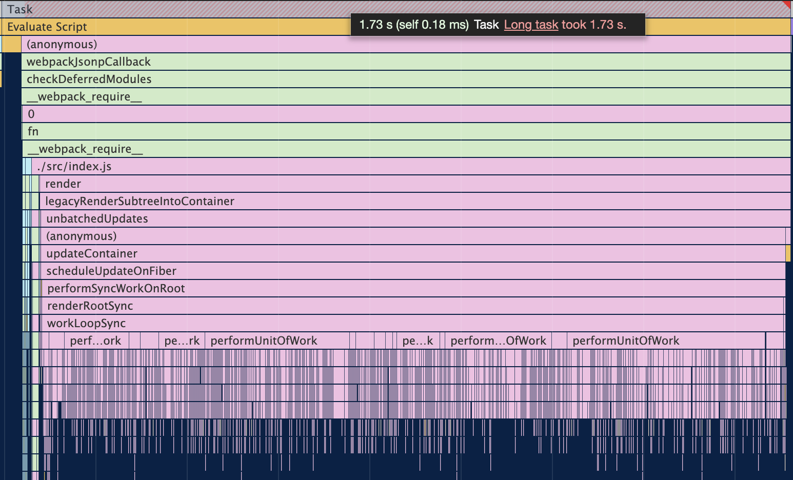
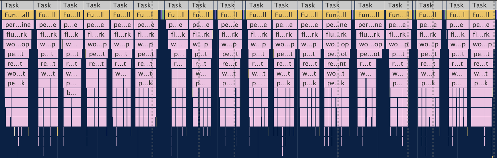
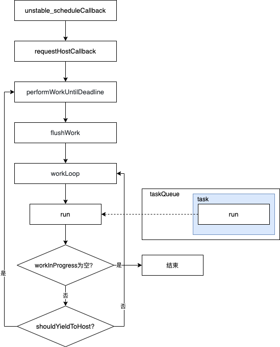

# 引言
为了提升用户体验，React 团队提出了 Concurrent 模式。Concurrent 模式可以在应用更新的同时保持浏览器对用户的响应，并根据用户的设备性能和网速进行适当的调整。我们通过一个例子来看看 Legacy 模式和 Concurrent 模式之间的区别：

例子中的页面有个正方形，我们给它加了一个动画效果，会左右来回移动。`id` 为 `root` 的 `div` 为 React 应用的挂载点。
```html
<style>
@keyframes move {
  from {
    margin-left: 0;
  }
  to {
    margin-left: 200px;
  }
}
#square {
  width: 100px;
  height: 100px;
  margin-top: 10px;
  background-color: red;
  animation: move 2s ease 0s infinite alternate;
}
</style>
<body>
  <div id="square"></div>
  <div id="root"></div>
</body>
```

我们的 React 应用比较简单，渲染了 2000 个颜色不一的正方形，为了模拟繁重的渲染工作，我们让每一个 `Item` 函数组件执行的时候运行一个比较耗时的 `for` 循环：

```javascript
const Item = ({i}) => {
  for (let i = 0; i< 999999;i++){}
  return <span key={i} style={{
    display: 'inline-block',
    width: '5px',
    height: '5px',
    backgroundColor: `rgb(${255*Math.random()},${255*Math.random()},${255*Math.random()})`
  }} />
}

const App = () => {
  const n = 2000
  return (
    <div style={{fontSize:0}}>
      {[...new Array(n)].map((_, i) => {
        return <Item i={i} />
      })}
    </div>
  )
}

```

以下是 Legacy （`ReactDOM.render(<App />, rootEle)`） 和 Concurrent （`ReactDOM.unstable_createRoot(rootEle).render(<App />)`） 两种模式渲染效果的对比：

| Legacy | Concurrent |
| :-: | :-: |
|  |  |

可以看到，Legacy 模式下，正方形出现后就不动了，一直要等到渲染过程完全结束后动画才开始进行，而 Concurrent 模式下则没有出现这种情况。

通过浏览器的 performance 面板，我们发现 Legacy 模式下 `Render` 阶段（详见[React 源码解读之首次渲染流程](/2020/07/26/react-first-render/)）都在一个 Task 中完成，导致该 Task 执行时间过长，阻塞了浏览器的其他工作：



而 Concurrent 模式下， `Render` 阶段被分成了一个个的小任务：



实现时间切片这个功能，少不了 React 新加入的 `Scheduler`（调度器），这个就是本文所要研究的内容。

# Scheduler
Scheduler（调度器）是 React16 新增的内容，它负责调度任务的优先级。从该库的说明中可看到，该库未来是想要成为一个通用的库：

```
This is a package for cooperative scheduling in a browser environment. It is currently used internally by React, but we plan to make it more generic.
```

所以我们这里也先抛开 React，来看看它有些什么功能。

## 调度任务优先级
```javascript
import Scheduler from 'react/packages/scheduler'

const task1 = Scheduler.unstable_scheduleCallback(2, function func1() {
  console.log('1')
})

const task2 = Scheduler.unstable_scheduleCallback(1, function func2(didTimeout) {
  console.log('2')
})
```

`Scheduler.unstable_scheduleCallback` 第一个参数为任务的优先级（越小越高）。所以上面的例子先打印 2，再打印 1。

这里有几个点需要注意：

1 `Scheduler.unstable_scheduleCallback` 会返回一个 `task`，该 `task` 有如下属性：

| 属性 | 说明 |
| :-: | :-: |
| id |  |
| callback | 传入 unstable_scheduleCallback 的函数 |
| priorityLevel | 传入 unstable_scheduleCallback 的优先级 |
| startTime | 任务的开始时间 |
| expirationTime | 任务的过期时间 |
| sortIndex | 任务用于排序的字段，一般为 startTime 或 expirationTime 的值 |

2 任务回调函数在执行时会传入一个参数，即上述代码中的 `didTimeout`，该参数表示当前任务是否已经过期。

## 延迟任务执行

```javascript
import Scheduler from 'react/packages/scheduler'

const task1 = Scheduler.unstable_scheduleCallback(2, function func1() {
  console.log('1')
})

const task2 = Scheduler.unstable_scheduleCallback(1, function func2() {
  console.log('2')
}, {delay: 100})
```

`Scheduler.unstable_scheduleCallback` 第三个参数的 `delay` 字段可以让当前任务延时执行，即使当前任务优先级较高。所以上面的例子先打印 1，再打印 2。注意到

## 取消任务

```javascript
import Scheduler from 'react/packages/scheduler'

const task1 = Scheduler.unstable_scheduleCallback(2, function func1 () {
  console.log('1')
})

const task2 = Scheduler.unstable_scheduleCallback(1, function func2(){
  console.log('2')
})

Scheduler.unstable_cancelCallback(task)
```

通过 `Scheduler.unstable_cancelCallback` 可以取消某个任务。所以上面的例子只会打印 1。

## 持续调度

```javascript
import Scheduler from 'react/packages/scheduler'

function func2(didTimeout) {
  if (!didTimeout) console.log(2)
}

function func1() {
  console.log(1)
  return func2
}

const task = Scheduler.unstable_scheduleCallback(1, func1)

```

当 `Scheduler.unstable_scheduleCallback` 所调度的任务的 `callback` 返回值仍然为函数时，会继续在当前 Task 中执行这个返回的函数。所以上面的例子会先打印 1，当再次执行 `func2` 的时候由于 `didTimeout` 为 `true`，所以不会打印 2。

## 让出时间
```javascript
import Scheduler from 'react/packages/scheduler'

function work() {
  while(!Scheduler.unstable_shouldYield()) {
    console.log('work')
  }
  console.log('yield to host')
}

const task = Scheduler.unstable_scheduleCallback(1, function func2(){
  work()
})
```

通过 `Scheduler.unstable_shouldYield` 可以判断当前是否还有时间供任务运行。上面的例子会持续打印 `work` 一段时间后，最后打印 `yield to host`。

## 时间切片
了解上述基本用法之后，我们来模拟一下 React 中使用时间切片来进行 `Render` 的过程：

```javascript
import Scheduler from 'react/packages/scheduler'


function createLinkedList(n) {
  let p = {
    value: `Node 1`,
    next: null
  }
  const head = p

  for (let index = 1; index < n; index++) {
    p.next = {
      value: `Node ${index+1}`,
      next: null
    }
    p = p.next
  }

  return head
}

const head = createLinkedList(9000)
let workInProgress = head

function workLoopConcurrent() {
  while (workInProgress !== null && !Scheduler.unstable_shouldYield()) {
    performUnitOfWork(workInProgress);
  }
}

function workLoopSync() {
  while (workInProgress !== null) {
    performUnitOfWork(workInProgress);
  }
}

function performUnitOfWork(unitOfWork) {
  for (let i = 0; i< 999999;i++){}

  console.log(performance.now(), unitOfWork.value)
  workInProgress = unitOfWork.next
}

function run(didTimeout) {
  // 当前这个 task 已经过期了，啥都不管了，同步把剩下的工作完成
  if (didTimeout) workLoopSync()
  // 当前这个 task 还没过期，可以悠着点，干一会歇一会
  else workLoopConcurrent()

  if (workInProgress !== null) {
    return run
  }
  return null
}

const NormalPriority = 3;


animate()
Scheduler.unstable_scheduleCallback(NormalPriority, run)
```

该例子首先创建了一个包含 2000 节点的链表，并将表头赋值给 `workInProgress`，然后调度了一个任务来执行 `run`，该函数中根据当前任务是否过期分别调用 `workLoopSync` 或 `workLoopConcurrent`。两者的区别是，`workLoopSync` 会一次性同步把整个链表处理完，而 `workLoopConcurrent` 会在每个时间切片中处理一部分任务，当需要让出时间时，会停止 `while` 循环。

回到 `run` 函数，如果 `workInProgress` 不为空，即链表还未遍历完时，会返回 `run` 函数继续在当前调度的这个 task 中运行。这样循环了若干次后，当某次再执行 `run` 时 `didTimeout` 会为 `true`，此时会使用同步方式把剩下的任务一次性全部完成。

接下来我们看看这个时间切片到底是怎么实现的吧：

## 时间切片实现原理
首先，我们先来看看 `unstable_scheduleCallback`：

```javascript
function unstable_scheduleCallback(priorityLevel, callback, options) {
  var currentTime = getCurrentTime();

  // 根据 options 确定 startTime
  var startTime;
  if (typeof options === 'object' && options !== null) {
    ...
  } else {
    ...
  }

  // 根据优先级确定 timeout，优先级越大 timeout 越小，即越早过期
  var timeout;
  switch (priorityLevel) {
    ...
  }
  var expirationTime = startTime + timeout;

  // 一个新的任务
  var newTask = {
    id: taskIdCounter++,
    callback,
    priorityLevel,
    startTime,
    expirationTime,
    sortIndex: -1,
  };
  if (enableProfiling) {
    newTask.isQueued = false;
  }

  if (startTime > currentTime) {
    // 任务被延迟，即 options 中指定了 delay
    newTask.sortIndex = startTime;
    push(timerQueue, newTask);
    if (peek(taskQueue) === null && newTask === peek(timerQueue)) {
      // All tasks are delayed, and this is the task with the earliest delay.
      if (isHostTimeoutScheduled) {
        // Cancel an existing timeout.
        cancelHostTimeout();
      } else {
        isHostTimeoutScheduled = true;
      }
      // Schedule a timeout.
      requestHostTimeout(handleTimeout, startTime - currentTime);
    }
  } else {
    newTask.sortIndex = expirationTime;
    push(taskQueue, newTask);
    if (enableProfiling) {
      markTaskStart(newTask, currentTime);
      newTask.isQueued = true;
    }
    // 调度一个 host callback.如果当前已经调度了一个则等到下一次让出时间的时候再说
    if (!isHostCallbackScheduled && !isPerformingWork) {
      isHostCallbackScheduled = true;
      requestHostCallback(flushWork);
    }
  }

  return newTask;
}
```

该方法首先会确定 `currentTime`、`startTime`、`expirationTime`，然后会新建一个 `newTask`，并将要调度的方法作为该对象的 `callback` 属性。

接着，根据该任务是否已经开始来确定走不同的分支，如果该任务还未就绪，则将其放入 `timerQueue` 中，如果开始了则放入 `taskQueue`。其中 `timerQueue` 和 `taskQueue` 都是通过最小堆实现的优先级队列，`timerQueue` 中的元素通过 `startTime` 来排序，`taskQueue` 中的元素通过 `expirationTime` 排序。

我们的时间切片例子中没有指定 `delay`，所以我们这里会走到 `else` 中，将 `newTask` 放入到 `taskQueue` 中后，会执行 `requestHostCallback(flushWork)`。这一步会开启一个宏任务，在该任务中执行 `flushWork`。

查看代码可知 React 是通过 `MessageChannel` 来实现的：

```js
const channel = new MessageChannel();
const port = channel.port2;
channel.port1.onmessage = performWorkUntilDeadline;

function requestHostCallback(callback) {
  scheduledHostCallback = callback;
  if (!isMessageLoopRunning) {
    isMessageLoopRunning = true;
    port.postMessage(null);
  }
}
```

这里先用 `scheduledHostCallback` 缓存了传递过来的 `flushWork`，当执行 `port.postMessage(null)` 时会触发执行 `performWorkUntilDeadline`：

```js
const performWorkUntilDeadline = () => {
  if (scheduledHostCallback !== null) {
    const currentTime = getCurrentTime();

    // shouldYieldToHost 中通过这个来判断是否应该让出时间
    // yieldInterval 为 5ms，即一个时间切片内任务执行超过 5ms 就需要让出
    deadline = currentTime + yieldInterval;

    const hasTimeRemaining = true;

    let hasMoreWork = true;
    try {
      hasMoreWork = scheduledHostCallback(hasTimeRemaining, currentTime);
    } finally {
      if (hasMoreWork) {
        port.postMessage(null);
      } else {
        isMessageLoopRunning = false;
        scheduledHostCallback = null;
      }
    }
  } else {
    isMessageLoopRunning = false;
  }
  needsPaint = false;
};
```

该函数中首先会更新 `deadline`，这个变量比较重要，`shouldYieldToHost` 中就是通过这个来判断是否应该让出时间，其中 `yieldInterval` 为 5ms，即一个时间切片内任务执行超过 5ms 就需要让出。该函数中最后调用了 `scheduledHostCallback` 即 `flushWork`：

```javascript
function flushWork(hasTimeRemaining, initialTime) {
  ...

  isPerformingWork = true;
  const previousPriorityLevel = currentPriorityLevel;
  try {
    if (enableProfiling) {
      try {
        return workLoop(hasTimeRemaining, initialTime);
      } catch (error) {
        ...
      }
    } else {
      // No catch in prod code path.
      return workLoop(hasTimeRemaining, initialTime);
    }
  } finally {
    currentTask = null;
    currentPriorityLevel = previousPriorityLevel;
    isPerformingWork = false;
    ...
  }
}
```

这里，主要是执行了 `workLoop`，该函数的工作主要是不断从 `taskQueue` 中拿出任务 `currentTask` 进行处理：

```javascript
function workLoop(hasTimeRemaining, initialTime) {
  let currentTime = initialTime;
  // 把 timerQueue 中开始的任务挪到 taskQueue 中
  advanceTimers(currentTime);
  currentTask = peek(taskQueue);
  while (
    currentTask !== null &&
    !(enableSchedulerDebugging && isSchedulerPaused)
  ) {
    if (
      currentTask.expirationTime > currentTime &&
      (!hasTimeRemaining || shouldYieldToHost())
    ) {
      // 当前任务没有过期且时间切片用完了，需要让出
      break;
    }
    // 这里的 callback 是我们调用 unstable_scheduleCallback 传入的 callback
    const callback = currentTask.callback;
    if (typeof callback === 'function') {
      // 重置当前 task 的 callback 为 null
      currentTask.callback = null;
      currentPriorityLevel = currentTask.priorityLevel;
      const didUserCallbackTimeout = currentTask.expirationTime <= currentTime;
      markTaskRun(currentTask, currentTime);
      const continuationCallback = callback(didUserCallbackTimeout);
      currentTime = getCurrentTime();
      if (typeof continuationCallback === 'function') {
        // 调用 unstable_scheduleCallback 传入的 callback 返回值仍然为函数时，继续使用当前任务来调度这个函数，这样一个任务中就会做很多件事情
        currentTask.callback = continuationCallback;
        markTaskYield(currentTask, currentTime);
      } else {
        // 调用 unstable_scheduleCallback 传入的 callback 返回值不会函数
        if (enableProfiling) {
          markTaskCompleted(currentTask, currentTime);
          currentTask.isQueued = false;
        }
        // 这里要判断一下的原因是有可能 callback 中又插入了优先级更高的任务
        if (currentTask === peek(taskQueue)) {
          pop(taskQueue);
        }
      }
      advanceTimers(currentTime);
    } else {
      pop(taskQueue);
    }
    currentTask = peek(taskQueue);
  }

  if (currentTask !== null) {
    // 告诉 performWorkUntilDeadline 还有任务，则 performWorkUntilDeadline 会再开启一个任务：
    /**
      try {
        hasMoreWork = scheduledHostCallback(hasTimeRemaining, currentTime);
      } finally {
        if (hasMoreWork) {
          port.postMessage(null);
        } else {
          isMessageLoopRunning = false;
          scheduledHostCallback = null;
        }
      }
    **/
    return true;
  } else {
    // taskQueue 中没有任务了，timerQueue 有任务
    const firstTimer = peek(timerQueue);
    if (firstTimer !== null) {
      // requestHostTimeout 就是 setTimeout
      // 此时我们拿出 timerQueue 第一个任务 firstTimer，即最早开始的那个任务
      // 我们延迟 firstTimer.startTime - currentTime 这个时间后，执行 handleTimeout
      requestHostTimeout(handleTimeout, firstTimer.startTime - currentTime);
    }
    return false;
  }
}
```

当结束循环时，有两种情况：

* `currentTask` 不为空，此时返回 `true` 告诉 `performWorkUntilDeadline` 还有工作，则 `performWorkUntilDeadline` 会开启一个新的宏任务来继续处理。这样，就又开启了新一轮的 `performWorkUntilDeadline` -> `flushWork` -> `workLoop`。
* `currentTask` 为空，此时如果 `timerQueue` 也不为空的话，按理说跟 `currentTask` 不为空时一样的处理方式也可，因为 `timerQueue` 中的任务总会在某一次调度的过程中开始，但是这样可能会导致有很多宏任务中什么任务都没有执行，白白造成浪费。于是这里采用了一个更高效的做法，即直接通过 `setTimeout` 来开启一个宏任务，而 `setTimeout` 的延迟时间是 `timerQueue` 第一个任务（即最早开始的那个任务）与当前时间的差值。而 `setTimeout` 开启的宏任务中，执行的是 `handleTimeout`：

```javascript
function handleTimeout(currentTime) {
  isHostTimeoutScheduled = false;
  // 将 timerQueue 中已开始的任务移到 taskQueue 中
  advanceTimers(currentTime);

  if (!isHostCallbackScheduled) {
    if (peek(taskQueue) !== null) {
      isHostCallbackScheduled = true;
      requestHostCallback(flushWork);
    } else {
      const firstTimer = peek(timerQueue);
      if (firstTimer !== null) {
        requestHostTimeout(handleTimeout, firstTimer.startTime - currentTime);
      }
    }
  }
}
```

这里调用了 `requestHostCallback(flushWork)`，剩下的流程就跟之前的一样了。也许你会好奇这里为什么存在 `peek(taskQueue)` 为空这种情况，因为有可能从 `requestHostTimeout` 到 `handleTimeout` 这一段时间内，用户取消掉了最早开始的那个任务。

至此，时间切片的大致运行流程就分析完了，可用下图表示：


# 总结
本文首先通过一个列子引出了 React 的 Concurrent 模式，然后介绍了 `Scheduler` 的基本使用方法并模拟了 React 在 Concurrent 模式下是如何使用时间切片来进行 `Render` 的，最后分析了时间切片的实现原理。

# 参考
1. [Introducing Concurrent Mode (Experimental)](https://reactjs.org/docs/concurrent-mode-intro.html)

2. [React技术揭秘](https://react.iamkasong.com/)