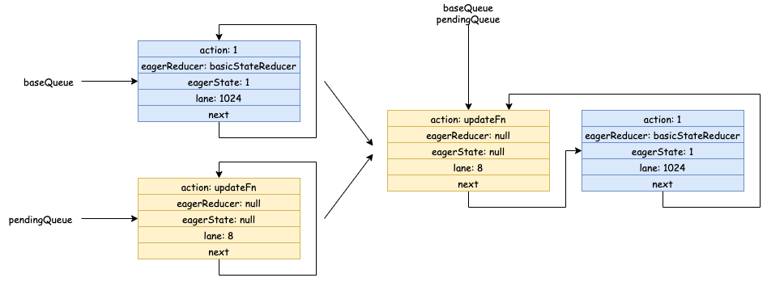
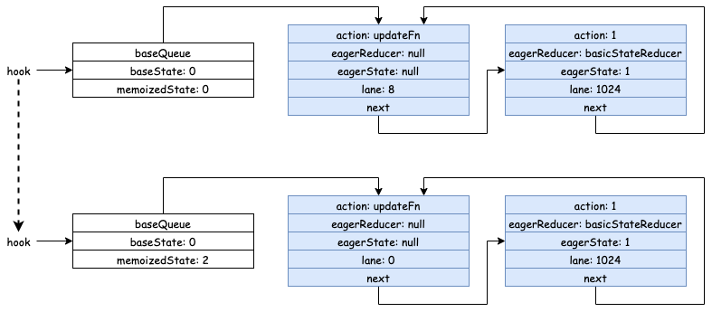

# 引言
[上篇](/2020/12/30/react-concurrent-1/)讲述了 Concurrent 模式中关于时间切片的实现方式，本文来讲讲 Concurrent 模式中另外一个特性：高优先级更新打断低优先级更新。我们先来看一个例子：

```javascript
import React from 'react'
import {useRef, useState, useEffect} from 'react'

const Item = ({i, children}) => {
  for (let i = 0; i< 999999;i++){}
  return <span key={i}>{children}</span>
}

function updateFn(count) {
  return count + 2
}

export default () => {
  const buttonRef = useRef(null);
  const [count, updateCount] = useState(0);

  const onClick = () => {
    updateCount(updateFn);
  };

  useEffect(() => {
    const button = buttonRef.current;
    setTimeout(() => updateCount(1), 1000);
    setTimeout(() => button.click(), 1040);
  }, []);

  return (
    <div>
      <button ref={buttonRef} onClick={onClick}>
        增加2
      </button>
      <div style={{wordWrap: 'break-word'}}>
        {Array.from(new Array(4000)).map((v, index) => (
          <Item i={index}>{count}</Item>
        ))}
      </div>
    </div>
  );
};
```

我们的页面中渲染了一个按钮以及 4000 个 `Item` 函数组件，每个函数组件中添加了一段比较耗时的循环语句。`useEffect` 中有两个 `setTimout` 定时器，第一个定时器延迟 `1000` 毫秒执行 `updateCount(1)`，第二个定时器延迟 `1040` 毫秒执行 `button.click()`，即点击按钮。需要注意的是，4000 个 `Item` 组件更新过程中的 `Render` （参考[React 源码解读之首次渲染流程](/2020/07/26/react-first-render/)） 阶段肯定远超 40 毫秒。我们来看看，Legacy 和 Concurrent 两种模式的区别：

***Legacy***


***Concurrent***


可以看到，Legacy 模式下数字从 0 变成 1，最后变成 3，而 Concurrent 模式下数字从 0 变成 2，最后变成 3。

为什么两者会有这样的区别呢？下面就让我们来分析一下吧。

# 更新流程
## Legacy 模式
我们知道执行 `updateCount(1)` 时，最终会通过 `MessageChannel` 开启一个宏任务来进行更新，且这个宏任务是在第二个定时器之前执行。又因为 Legacy 模式下更新过程（`Render` 阶段和 `Commit` 阶段）是同步的，所以会一直等到第一次更新完成后，浏览器才有空闲去执行第二个定时器中的方法，即第一次定时器触发后，实际上超过了 40 毫秒才触发了第二个定时器。所以 Legacy 模式下先渲染 1，再渲染 2，最后渲染为 3 这个结果还是比较好理解的。

## Concurrent 模式
## 高优先级任务打断低优先级任务
Concurrent 模式下，前面步骤是一样的，执行 `updateCount(1)` 时，最终也会通过 `MessageChannel` 开启一个宏任务来进行更新，但是更新过程的 `Render` 阶段是放在一个个时间切片中去完成的，某个时间切片结束后，浏览器会调用第二个定时器中的方法 `button.click()`，最终执行 `updateCount(updateFn)`，产生一个更新。由于用户事件产生的更新优先级要更高，所以 `React` 会打断上一次的任务：

```javascript
  if (existingCallbackNode !== null) {
    const existingCallbackPriority = root.callbackPriority;
    if (existingCallbackPriority === newCallbackPriority) {
      // The priority hasn't changed. We can reuse the existing task. Exit.
      return;
    }
    cancelCallback(existingCallbackNode);
  }
```


然后开启一个新的任务：

```javascript
    const schedulerPriorityLevel = lanePriorityToSchedulerPriority(
      newCallbackPriority,
    );
    newCallbackNode = scheduleCallback(
      schedulerPriorityLevel,
      performConcurrentWorkOnRoot.bind(null, root),
    );
```

此时，React 会丢弃当前已经构建了一部分的 Fiber Tree，从头开始构建：

```javascript
  ...
  // If the root or lanes have changed, throw out the existing stack
  // and prepare a fresh one. Otherwise we'll continue where we left off.
  if (workInProgressRoot !== root || workInProgressRootRenderLanes !== lanes) {
    ...
    prepareFreshStack(root, lanes);
    ...
  }
  ...
```


## 更新队列的处理
当我们在 `Render` 阶段执行 `App` 这个函数组件中的 `useState` 时，最终会进入 `updateReducer`，由于当前这个 `Hook` 的 `baseQueue` 还保留着上一次更新的数据，所以我们会进入 `if (baseQueue !== null)` 这个分支：

```javascript
  let baseQueue = current.baseQueue;
  // The last pending update that hasn't been processed yet.
  const pendingQueue = queue.pending;
  if (pendingQueue !== null) {
    // We have new updates that haven't been processed yet.
    // We'll add them to the base queue.
    if (baseQueue !== null) {
      // Merge the pending queue and the base queue.
      const baseFirst = baseQueue.next;
      const pendingFirst = pendingQueue.next;
      baseQueue.next = pendingFirst;
      pendingQueue.next = baseFirst;
    }
    current.baseQueue = baseQueue = pendingQueue;
    queue.pending = null;
  }
```

这里其实就是将 `baseQueue` 和 `pendingQueue` 两个循环链表进行合并：


具体到我们的例子：





注意，`baseQueue` 和 `pending` 指向的是链表的尾部，他们的 `next` 才是链表的头部。

接着，React 会从头部开始进行遍历处理这些更新，不满足条件的会被跳过：

```javascript
   do {
      const updateLane = update.lane;
      if (!isSubsetOfLanes(renderLanes, updateLane)) {
        // Priority is insufficient. Skip this update. If this is the first
        // skipped update, the previous update/state is the new base
        // update/state.
        const clone: Update<S, A> = {
          lane: updateLane,
          action: update.action,
          eagerReducer: update.eagerReducer,
          eagerState: update.eagerState,
          next: (null: any),
        };
        if (newBaseQueueLast === null) {
          newBaseQueueFirst = newBaseQueueLast = clone;
          newBaseState = newState;
        } else {
          newBaseQueueLast = newBaseQueueLast.next = clone;
        }
        // Update the remaining priority in the queue.
        // TODO: Don't need to accumulate this. Instead, we can remove
        // renderLanes from the original lanes.
        currentlyRenderingFiber.lanes = mergeLanes(
          currentlyRenderingFiber.lanes,
          updateLane,
        );
        markSkippedUpdateLanes(updateLane);
      } else {
        // This update does have sufficient priority.
        if (newBaseQueueLast !== null) {
          const clone: Update<S, A> = {
            // This update is going to be committed so we never want uncommit
            // it. Using NoLane works because 0 is a subset of all bitmasks, so
            // this will never be skipped by the check above.
            lane: NoLane,
            action: update.action,
            eagerReducer: update.eagerReducer,
            eagerState: update.eagerState,
            next: (null: any),
          };
          newBaseQueueLast = newBaseQueueLast.next = clone;
        }
        // Process this update.
        if (update.eagerReducer === reducer) {
          // If this update was processed eagerly, and its reducer matches the
          // current reducer, we can use the eagerly computed state.
          newState = ((update.eagerState: any): S);
        } else {
          const action = update.action;
          newState = reducer(newState, action);
        }
      }
      update = update.next;
    } while (update !== null && update !== first);

    if (newBaseQueueLast === null) {
      newBaseState = newState;
    } else {
      newBaseQueueLast.next = (newBaseQueueFirst: any);
    }
    // Mark that the fiber performed work, but only if the new state is
    // different from the current state.
    if (!is(newState, hook.memoizedState)) {
      markWorkInProgressReceivedUpdate();
    }
    hook.memoizedState = newState;
    hook.baseState = newBaseState;
    hook.baseQueue = newBaseQueueLast;
    queue.lastRenderedState = newState;
```

其中 `!isSubsetOfLanes(renderLanes, updateLane)` 根据当前渲染的优先级 `renderLanes` 和正在遍历的这个更新的优先级 `updateLane` 来判断是否需要跳过当前这个更新，比如当前渲染的优先级是 `0b11000`，那么 `updateLane` 为 `0b1000` 的更新就会被处理。

跳过的这些更新会被保存在一个循环链表中，链表头为 `newBaseQueueFirst`。而满足条件的更新会被处理生成新的 `newState`，且处理过的这些更新也会存到同样的循环链表中，只是其 `lane` 会赋值为 `0`，以便后面进行低优先级的更新时，这些已经被处理过的更新也仍旧会被处理，保证最后渲染的数据是正确的。

最后，将新的 `newState`，`newBaseState`，`newBaseQueueLast` 都赋值给当前 `hook` 对应的字段。

比如，我们的例子中 `useState` 对应的 `hook` 变化过程如下：




如图，我们这次渲染的优先级是 8，所以 `action` 为 1 的更新被跳过，这样，我们这次更新最终渲染的就是 `memoizedState` 的值 2。

而当低优先级的更新重新开始时，因为上一次高优先级的更新的 `lane` 已经被赋值为了 0，所以此时两个更新都会被处理，最终 `memoizedState` 会是 3，这样最终结果跟 Legacy 模式是一致的。

那么，低优先级的任务又是如何重新开始的呢？

## 重新开始低优先级任务
我们知道 `Commit` 阶段（[React 源码解读之首次渲染流程](https://product.mdnice.com/articles/)）最终会调用 `commitRootImpl`，该函数中会调用 `ensureRootIsScheduled` 开启一轮新的更新过程：

```javascript
  // Always call this before exiting `commitRoot`, to ensure that any
  // additional work on this root is scheduled.
  ensureRootIsScheduled(root, now());
```


# 总结
本文参考 React 17.0.2 的源码，分析了 Concurrent 模式下高优先级更新打断低优先级更新的实现原理。
