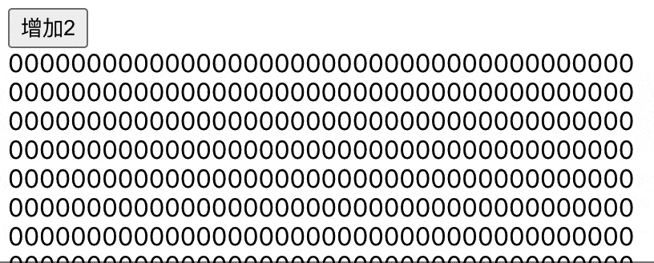

# 引言
上篇讲述了 Concurrent 模式中关于时间切片的实现方式，本文来讲讲 Concurrent 模式中另外一个特性：任务插队。我们先来看一个例子：

```javascript
import React from 'react'
import {useRef, useState, useEffect} from 'react'

const Item = ({i, children}) => {
  for (let i = 0; i< 999999;i++){}
  return <span key={i}>{children}</span>
}

export default () => {
  const buttonRef = useRef(null);
  const [count, updateCount] = useState(0);

  const onClick = () => {
    updateCount((count) => count + 2);
  };

  useEffect(() => {
    const button = buttonRef.current;
    setTimeout(() => updateCount(1), 1000);
    setTimeout(() => button.click(), 1040);
  }, []);

  return (
    <div>
      <button ref={buttonRef} onClick={onClick}>
        增加2
      </button>
      <div style={{wordWrap: 'break-word'}}>
        {Array.from(new Array(4000)).map((v, index) => (
          <Item i={index}>{count}</Item>
        ))}
      </div>
    </div>
  );
};
```

我们的页面中渲染了一个按钮以及 4000 个 `Item` 函数组件，每个函数组件中添加了一段比较耗时的循环语句。`useEffect` 中有两个 `setTimout` 定时器，第一个定时器延迟 `1000` 毫秒执行 `updateCount(1)`，第二个定时器延迟 `1040` 毫秒执行 `button.click()`，即点击按钮。需要注意的是，4000 个 `Item` 组件更新过程中的 `Render` （参考[React 源码解读之首次渲染流程](/2020/07/26/react-first-render/)） 阶段肯定远超 40 毫秒。我们来看看，Legacy 和 Concurrent 两种模式的区别：

***Legacy***


***Concurrent***


可以看到，Legacy 模式下数字从 0 变成 1，最后变成 3，而 Concurrent 模式下数字从 0 变成 2，最后变成 3。

为什么两者会有这样的区别呢？下面就让我们来分析一下吧。

# 更新流程
我们知道执行 `updateCount(1)` 时，最终会通过 `MessageChannel` 开启一个宏任务来进行更新，且这个宏任务是在第二个定时器之前执行。又因为 Legacy 模式下更新过程是同步的，所以会一直等到第一次更新完成后，浏览器才有空闲去执行第二个定时器中的方法，即第一次定时器触发后，实际上超过了 40 毫秒才触发了第二个定时器。

Concurrent 模式下，前面步骤是一样的，执行 `updateCount(1)` 时，最终也会通过 `MessageChannel` 开启一个宏任务来进行更新，但是更新过程的 `Render` 阶段是放在一个个时间切片中去完成的，某个时间切片结束后，浏览器会调用第二个定时器中的方法，最终执行 `updateCount((count) => count + 2)`，此时：


