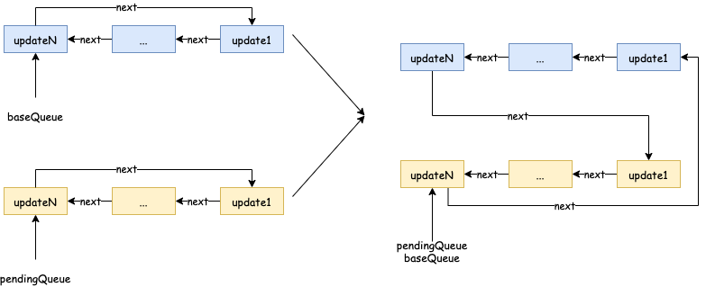

# 引言
上篇讲述了 Concurrent 模式中关于时间切片的实现方式，本文来讲讲 Concurrent 模式中另外一个特性：任务插队。我们先来看一个例子：

```javascript
import React from 'react'
import {useRef, useState, useEffect} from 'react'

const Item = ({i, children}) => {
  for (let i = 0; i< 999999;i++){}
  return <span key={i}>{children}</span>
}

function updateFn(count) {
  return count + 2
}

export default () => {
  const buttonRef = useRef(null);
  const [count, updateCount] = useState(0);

  const onClick = () => {
    updateCount(updateFn);
  };

  useEffect(() => {
    const button = buttonRef.current;
    setTimeout(() => updateCount(1), 1000);
    setTimeout(() => button.click(), 1040);
  }, []);

  return (
    <div>
      <button ref={buttonRef} onClick={onClick}>
        增加2
      </button>
      <div style={{wordWrap: 'break-word'}}>
        {Array.from(new Array(4000)).map((v, index) => (
          <Item i={index}>{count}</Item>
        ))}
      </div>
    </div>
  );
};
```

我们的页面中渲染了一个按钮以及 4000 个 `Item` 函数组件，每个函数组件中添加了一段比较耗时的循环语句。`useEffect` 中有两个 `setTimout` 定时器，第一个定时器延迟 `1000` 毫秒执行 `updateCount(1)`，第二个定时器延迟 `1040` 毫秒执行 `button.click()`，即点击按钮。需要注意的是，4000 个 `Item` 组件更新过程中的 `Render` （参考[React 源码解读之首次渲染流程](/2020/07/26/react-first-render/)） 阶段肯定远超 40 毫秒。我们来看看，Legacy 和 Concurrent 两种模式的区别：

***Legacy***


***Concurrent***


可以看到，Legacy 模式下数字从 0 变成 1，最后变成 3，而 Concurrent 模式下数字从 0 变成 2，最后变成 3。

为什么两者会有这样的区别呢？下面就让我们来分析一下吧。

# 更新流程
## Legacy 模式
我们知道执行 `updateCount(1)` 时，最终会通过 `MessageChannel` 开启一个宏任务来进行更新，且这个宏任务是在第二个定时器之前执行。又因为 Legacy 模式下更新过程（`Render` 阶段和 `Commit` 阶段）是同步的，所以会一直等到第一次更新完成后，浏览器才有空闲去执行第二个定时器中的方法，即第一次定时器触发后，实际上超过了 40 毫秒才触发了第二个定时器。所以 Legacy 模式下先渲染 1，再渲染 2，最后渲染为 3 这个结果还是比较好理解的。

## Concurrent 模式
Concurrent 模式下，前面步骤是一样的，执行 `updateCount(1)` 时，最终也会通过 `MessageChannel` 开启一个宏任务来进行更新，但是更新过程的 `Render` 阶段是放在一个个时间切片中去完成的，某个时间切片结束后，浏览器会调用第二个定时器中的方法 `button.click()`，最终执行 `updateCount((count) => count + 2)`。由于用户事件产生的更新优先级要更高，所以 `React` 会打断上一次的任务：

```javascript
  if (existingCallbackNode !== null) {
    const existingCallbackPriority = root.callbackPriority;
    if (existingCallbackPriority === newCallbackPriority) {
      // The priority hasn't changed. We can reuse the existing task. Exit.
      return;
    }
    cancelCallback(existingCallbackNode);
  }
```


然后开启一个新的任务：

```javascript
    const schedulerPriorityLevel = lanePriorityToSchedulerPriority(
      newCallbackPriority,
    );
    newCallbackNode = scheduleCallback(
      schedulerPriorityLevel,
      performConcurrentWorkOnRoot.bind(null, root),
    );
```

此时，React 会丢弃当前已经构建了一部分的 Fiber Tree，从头开始构建：

```javascript
  ...
  // If the root or lanes have changed, throw out the existing stack
  // and prepare a fresh one. Otherwise we'll continue where we left off.
  if (workInProgressRoot !== root || workInProgressRootRenderLanes !== lanes) {
    ...
    prepareFreshStack(root, lanes);
    ...
  }
  ...
```

当我们在 `Render` 阶段执行 `App` 这个函数组件中的 `useState` 时，最终会进入 `updateReducer`，由于当前这个 `Hook` 的 `baseQueue` 还保留着上一次更新的数据，所以我们会进入 `if (baseQueue !== null)` 这个分支：

```javascript
  let baseQueue = current.baseQueue;
  // The last pending update that hasn't been processed yet.
  const pendingQueue = queue.pending;
  if (pendingQueue !== null) {
    // We have new updates that haven't been processed yet.
    // We'll add them to the base queue.
    if (baseQueue !== null) {
      // Merge the pending queue and the base queue.
      const baseFirst = baseQueue.next;
      const pendingFirst = pendingQueue.next;
      baseQueue.next = pendingFirst;
      pendingQueue.next = baseFirst;
    }
    current.baseQueue = baseQueue = pendingQueue;
    queue.pending = null;
  }
```

这里其实就是将 `baseQueue` 和 `pendingQueue` 两个链表进行合并：





具体到我们的例子：

