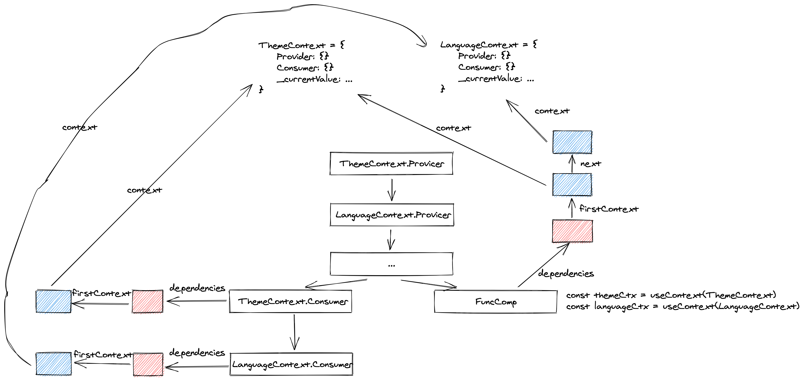
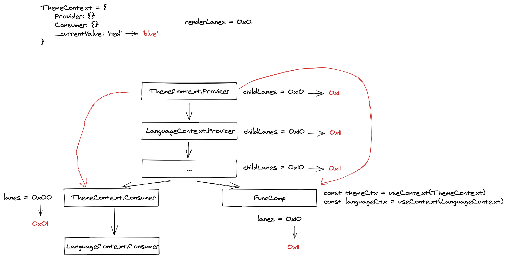

# 引言
React 源码系列继续进行，今天来讲讲 `Context` 相关的内容。从何讲起呢？我们还是先从一个案例开始吧：

```javascript
import React, { Component } from 'react'
import PropTypes from 'prop-types';

class Grandson extends Component {
  render() {
    console.log('Grandson render')
    return <span>{this.context.theme}</span>
  }
}

Grandson.contextTypes = {
  theme: PropTypes.string
}

class Son extends Component {
  render() {
    console.log('Son render');
    return <Grandson />
  }
}

export default class Parent extends Component {
  state = {
    theme: 'blue'
  }
  getChildContext() {
    return this.state
  }
  componentDidMount() {
    setTimeout(() => {
      this.setState({
        theme: 'red'
      })
    }, 1000)
  }
  render() {
    return <Son />;
  }
}

Parent.childContextTypes = {
  theme: PropTypes.string
}
```

上述代码使用了 React 已废弃的 Context API。`Parent` 组件提供了一个 `context`，该 `context` 只在孙组件 `Grandson` 里面用到了。既然这样，那 `context` 变化的时候子组件 `Son` 不应该调用 `render` 方法（目前是会的）。所以，我们用 `PureComponent` 来优化一下：

```javascript
class Son extends PureComponent {
  render() {
    console.log('Son render');
    return <Grandson />
  }
}
```

现在 `Son` 组件确实不会调用 `render` 方法了，然而悲剧的是 `Grandson` 也不会更新了。原因在于 `Son` 组件协调时进入了 [`bailout`](/2021/02/08/react-reconcile-bailout/) 逻辑，阻断了子组件的更新：

```javascript
function bailoutOnAlreadyFinishedWork(
  current: Fiber | null,
  workInProgress: Fiber,
  renderLanes: Lanes,
): Fiber | null {
  ...
  if (!includesSomeLane(renderLanes, workInProgress.childLanes)) {
    // 协调 Son 组件的时候走到了这里
    return null;
  } else {
    cloneChildFibers(current, workInProgress);
    return workInProgress.child;
  }
}
```

但是如果换成新的 API 则不会有这个问题：

```javascript
import React, {Component, PureComponent} from 'react'

const Context = React.createContext()

class Grandson extends Component {
  render() {
    console.log('Grandson render')
    return (
      <Context.Consumer>
        {
          value => <span>{value}</span>
        }
      </Context.Consumer>
    )
  }
}

class Son extends PureComponent {
  render() {
    console.log('Son render')
    return <Grandson />
  }
}


export default class Parent extends Component {
  state = {
    theme: 'blue'
  }

  componentDidMount() {
    setTimeout(() => {
      this.setState({
        theme: 'red'
      })
    }, 1000)
  }

  render() {
    return (
      <Context.Provider value={this.state.theme}>
        <Son />
      </Context.Provider>
    )
  }
}
```

明显新 API 的效果更符合常理，那么它到底是怎么实现的呢？接下来就分析一下新 API 的源码，来解答一下我们的疑惑。

# 新的 Context API 源码分析
## createContext
作为使用 `Context` 的第一步，首先当然要看看 `createContext` 做了什么：

```javascript

export function createContext<T>(
  defaultValue: T,
  calculateChangedBits: ?(a: T, b: T) => number,
): ReactContext<T> {
  if (calculateChangedBits === undefined) {
    calculateChangedBits = null;
  } else {
    ....
  }

  const context: ReactContext<T> = {
    $$typeof: REACT_CONTEXT_TYPE,
    _calculateChangedBits: calculateChangedBits,
    // 为了支持多个并发渲染器，我们把渲染器分成了
    // primary 和 secondary。我们只希望
    // 最多有两个并发渲染器:React Native (primary) 和
    // Fabric(secondary);React DOM(primary)和React ART(secondary)。
    // secondary 渲染器将它们的上下文值存储在单独的字段中。
    _currentValue: defaultValue,
    _currentValue2: defaultValue,
    _threadCount: 0,
    Provider: (null: any),
    Consumer: (null: any),
  };

  context.Provider = {
    $$typeof: REACT_PROVIDER_TYPE,
    _context: context,
  };

  ...
  if (__DEV__) {
    ...
  } else {
    context.Consumer = context;
  }

  return context;
}

```

可以看到， `createContext` 返回了一个 `context` 对象，该对象上有 `_currentValue` 属性（用来存储当前 `context` 的值）以及 `Provider`、 `Consumer` 属性（两种类型的组件）。接下来我们看看 `Provider` 是怎么处理更新的。

## Provider
从下面的代码可知，`Provider` 的更新首先是取到最新的 `value`，并调用 `pushProvider` 将其更新到 `context` 的 `_currentValue` 之上：
```javascript
function updateContextProvider(
  current: Fiber | null,
  workInProgress: Fiber,
  renderLanes: Lanes,
) {
  const providerType: ReactProviderType<any> = workInProgress.type;
  const context: ReactContext<any> = providerType._context;

  const newProps = workInProgress.pendingProps;
  const oldProps = workInProgress.memoizedProps;

  const newValue = newProps.value;

  ...

  pushProvider(workInProgress, context, newValue);

  ...
}


export function pushProvider<T>(
  providerFiber: Fiber,
  context: ReactContext<T>,
  nextValue: T,
): void {
  if (isPrimaryRenderer) {
    push(valueCursor, context._currentValue, providerFiber);

    context._currentValue = nextValue;
    ...
  } else {
    push(valueCursor, context._currentValue2, providerFiber);

    context._currentValue2 = nextValue;
    ...
  }
}
```
剩下的语句我们先不分析，我们来看看 `Consumer` 更新时是怎么处理的。

## Consumer
更新 `Consumer` 时会调用 `updateContextConsumer`：
```javascript
function updateContextConsumer(
  current: Fiber | null,
  workInProgress: Fiber,
  renderLanes: Lanes,
) {
  let context: ReactContext<any> = workInProgress.type;

  ...
  const newProps = workInProgress.pendingProps;
  const render = newProps.children;

  ...

  prepareToReadContext(workInProgress, renderLanes);
  const newValue = readContext(context, newProps.unstable_observedBits);
  let newChildren;
  if (__DEV__) {
    ...
  } else {
    newChildren = render(newValue);
  }

  // React DevTools reads this flag.
  workInProgress.flags |= PerformedWork;
  reconcileChildren(current, workInProgress, newChildren, renderLanes);
  return workInProgress.child;
}
```
该函数中的核心方法是 `readContext`，即从 `context` 读取最新的值：

```javascript

export function readContext<T>(
  context: ReactContext<T>,
  observedBits: void | number | boolean,
): T {
  ...
  if (lastContextWithAllBitsObserved === context) {
    // Nothing to do. We already observe everything in this context.
  } else if (observedBits === false || observedBits === 0) {
    // Do not observe any updates.
  } else {
    let resolvedObservedBits; // Avoid deopting on observable arguments or heterogeneous types.
    if (
      typeof observedBits !== 'number' ||
      observedBits === MAX_SIGNED_31_BIT_INT
    ) {
      // Observe all updates.
      lastContextWithAllBitsObserved = ((context: any): ReactContext<mixed>);
      resolvedObservedBits = MAX_SIGNED_31_BIT_INT;
    } else {
      resolvedObservedBits = observedBits;
    }

    const contextItem = {
      f: ((context: any): ReactContext<mixed>),
      observedBits: resolvedObservedBits,
      next: null,
    };

    if (lastContextDependency === null) {
      ...

      // This is the first dependency for this component. Create a new list.
      lastContextDependency = contextItem;
      currentlyRenderingFiber.dependencies = {
        lanes: NoLanes,
        firstContext: contextItem,
        responders: null,
      };
    } else {
      // Append a new context item.
      lastContextDependency = lastContextDependency.next = contextItem;
    }
  }
  return isPrimaryRenderer ? context._currentValue : context._currentValue2;
}
```

所谓读取 `context` 最新的值，也很简单，看当前渲染器是不是 `primary`，如果是就返回 `context._currentValue`，不是就返回 `context._currentValue2`。同时还会标记当前 `Fiber` 节点对于 `context` 的依赖，该依赖对于后续 `context` 的更新非常有用。从代码中可以看到有时 `Fiber` 节点可能会依赖多个 `context`，形成一条依赖链表，这种情况出现在函数组件中使用 `useContext` hooks 时。下图更加直观地表示了各 `Fiber` 的 `dependencies`：



## 答案揭晓
了解了 `Provider` 和 `Consumer` 后，接下来我们分析一下文章开始的问题：为什么 `Context` 更新可以透过经过了 `bailout` 的组件往下传递？答案还是在 `updateContextProvider`：

```javascript
function updateContextProvider(
  current: Fiber | null,
  workInProgress: Fiber,
  renderLanes: Lanes,
) {
  const providerType: ReactProviderType<any> = workInProgress.type;
  const context: ReactContext<any> = providerType._context;

  const newProps = workInProgress.pendingProps;
  const oldProps = workInProgress.memoizedProps;

  const newValue = newProps.value;

  ...

  pushProvider(workInProgress, context, newValue);

  if (oldProps !== null) {
    const oldValue = oldProps.value;
    const changedBits = calculateChangedBits(context, newValue, oldValue);
    if (changedBits === 0) {
      ...
    } else {
      // The context value changed. Search for matching consumers and schedule
      // them to update.
      propagateContextChange(workInProgress, context, changedBits, renderLanes);
    }
  }

  const newChildren = newProps.children;
  reconcileChildren(current, workInProgress, newChildren, renderLanes);
  return workInProgress.child;
}
```
当 `context` 的新值相对旧值有变化时会执行 `propagateContextChange`，该函数的作用就是沿着 `workInProgress` 往下深度优先的遍历子树，找到依赖当前 `context` 的 `Fiber`，更新他们的 `lanes`（`lanes` 可以理解为更新的优先级），同时更新他们的祖先 `Fiber` 的 `childLanes`。比如说下面这个例子：



当进入某个 `Fiber` 的 `bailout` 时，如果检测到当前 `Fiber` 的 `lanes` 和 `renderLanes` 有交集时，会继续协调其子节点：

```javascript
function bailoutOnAlreadyFinishedWork(
  current: Fiber | null,
  workInProgress: Fiber,
  renderLanes: Lanes,
): Fiber | null {
  ...
  if (!includesSomeLane(renderLanes, workInProgress.childLanes)) {
    return null;
  } else {
    cloneChildFibers(current, workInProgress);
    return workInProgress.child;
  }
}
```

# 总结
本文通过一个案例引出了 React 中新旧 `Context` 处理组件更新的一些不同，并着重分析了新 API 的实现思路并解释了为什么 `Context` 更新可以透过经过了 `bailout` 的组件往下传递。