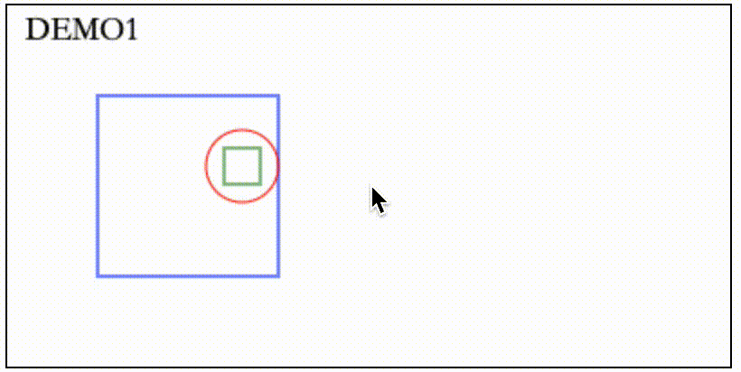
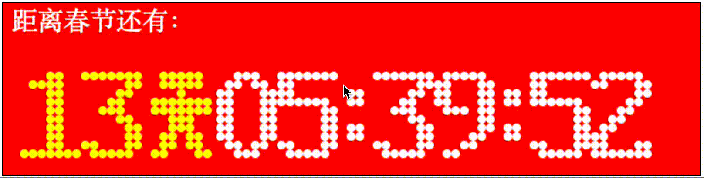
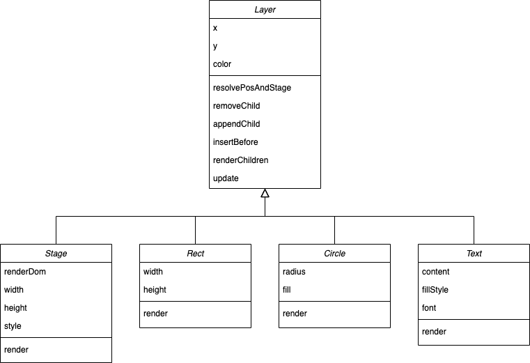
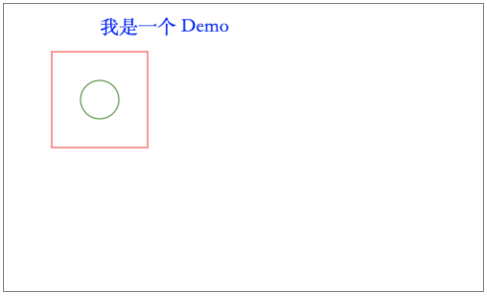

# 引言
从[React的渲染流程](/2020/07/26/react-first-render/)我们知道，JSX 会先转为一颗 Fiber Tree，然后通过 `Renderer` 渲染成页面。对于 Web 平台，这个 `Renderer` 就是 `react-dom`，对于 Native 平台，这个 `Renderer` 就是 `react-native`。当然，我们也可以创建我们自己的 `Renderer`，将 React 应用渲染到其他目标平台，比如本文中的 Canvas：




下面我们以第一个 Demo 为例，来分析我们 `Canvas` `Renderer` 的实现方式。

# Canvas Renderer
## 组件
如图，我们的 `Canvas` `Renderer` 包括 `Stage`，`Rect`，`Circle`，`Text` 这些组件，其中将他们一些公共的特征抽离成了一个父类 `Layer`。



不需要 React，现在的 `Canvas` `Renderer` 已经可以渲染出内容了，比如：

```javascript
const renderDom = document.getElementById('demo')

const stage = new Stage({
  renderDom,
  width: 500,
  height: 300,
  style: {border: '1px solid gray'},
})
const rect = new Rect({x: 50, y: 50, width: 100, height: 100, color: 'red'})
const circle = new Circle({x: 50, y: 50, radius: 20, color: 'green'})
const text = new Text({
  content: '我是一个 Demo',
  fillStyle: 'blue',
  x: 100,
  y: 30,
  font: '20px serif',
})
rect.appendChild(circle)
stage.appendChild(text)
stage.appendChild(rect)
stage.render()
```




## Custom Renderer 实现方式
```javascript

const reconcilerInstance = Reconciler(HostConfig)

const CanvasRenderer = {
  render(element, renderDom, {width, height, style}, callback) {
    const stage = new Stage({renderDom, width, height, style})
    const isAsync = false // Disables async rendering
    const container = reconcilerInstance.createContainer(stage, isAsync) // Creates root fiber node.
    const parentComponent = null // Since there is no parent (since this is the root fiber). We set parentComponent to null.

    reconcilerInstance.updateContainer(
      element,
      container,
      parentComponent,
      callback
    ) // Start reconcilation and render the result
  },
}

```

```javascript
const HostConfig = {
  supportsMutation: true,
  // 通过 FiberNode 创建 instance，会保存在 FiberNode 的 stateNode 属性上
  createInstance: function (
    type,
    newProps,
    rootContainerInstance,
    currentHostContext,
    workInProgress
  ) {
    let element
    switch (type) {
      case 'rect':
        element = new Rect(newProps)
        break
      case 'circle':
        element = new Circle(newProps)
        break
      case 'text':
        element = new Text(newProps)
        break
      default:
        break
    }
    return element
  },

  /* 操作子组件相关 */
  appendInitialChild(parent, child) {
    parent.appendChild(child)
  },
  appendChildToContainer(parent, child) {
    parent.appendChild(child)
  },
  appendChild: function (parent, child) {
    parent.appendChild(child)
  },
  insertBefore(parent, child, beforeChild) {
    parent.insertBefore(child, beforeChild)
  },
  removeChild(parent, child) {
    parent.removeChild(child)
  },

  /* 组件属性发生变化时会调用该方法 */
  commitUpdate: function (
    instance,
    updatePayload,
    type,
    oldProps,
    newProps,
    finishedWork
  ) {
    instance.update(newProps)
  },

  // react 流程结束后，调用此方法，我们可以在这里触发我们的渲染器重新渲染
  // 此处参考 remax：https://github.com/remaxjs/remax/blob/80606f640b08c79b9fc61d52a03355f0282c5e14/packages/remax-runtime/src/hostConfig/index.ts#L63
  resetAfterCommit(container) {
    container.render()
  },
  getRootHostContext(nextRootInstance) {
    const rootContext = {}
    return rootContext
  },
  getChildHostContext: function (parentContext, fiberType, rootInstance) {
    const context = {}
    return context
  },
  prepareForCommit: function (rootContainerInstance) {
    return null
  },
  prepareUpdate(
    instance,
    type,
    oldProps,
    newProps,
    rootContainerInstance,
    currentHostContext
  ) {
    return {}
  },
  // 暂时不需要实现的接口
  finalizeInitialChildren: function () {},
  appendAllChildren(...args) {},
  commitTextUpdate: function (textInstance, oldText, newText) {},
  removeChildFromContainer(container, child) {},
  commitMount: (domElement, type, newProps, fiberNode) => {},
  clearContainer(...args) {},
  createTextInstance: function (
    newText,
    rootContainerInstance,
    currentHostContext,
    workInProgress
  ) {},
  shouldSetTextContent: function (...args) {},
}

```


如图，我们使用 React 绘制了一个简单的动画，代码如下：

```javascript
import React from 'react'
import {useEffect, useState} from 'react'

const R = 20
const W = 100
const H = 100

function App() {
  const [x, setX] = useState(R)
  const [y, setY] = useState(R)
  useEffect(() => {
    setTimeout(() => {
      if (y === R && x < W - R) {
        setX(x + 1)
      } else if (x === W - R && y < H - R) {
        setY(y + 1)
      } else if (y === H - R && x > R) {
        setX(x - 1)
      } else {
        setY(y - 1)
      }
    }, 10)
  }, [x, y])
  return (
    <rect x={50} y={50} width={W} height={H} color='blue'>
      <circle x={x} y={y} radius={R} color='red'>
        <rect x={-10} y={-10} width={20} height={20} color='green' />
      </circle>
    </rect>
  )
}

export default App
```

其中， `App` 组件中返回的 `rect` 和 `circle` 分别表示矩形和圆，`x`、`y`、`width`、`height`、`radius`、`color` 是这些图形的参数。`x`、`y` 是相对于父组件的坐标，矩形以左上角作为基准，圆形以圆心作为基准。比如，`cirlce` 里面 `rect` 的 `x` 和 `y` 都为 -10，表示 `rect` 的左上角位于圆心往左和往上各 10 个像素。

