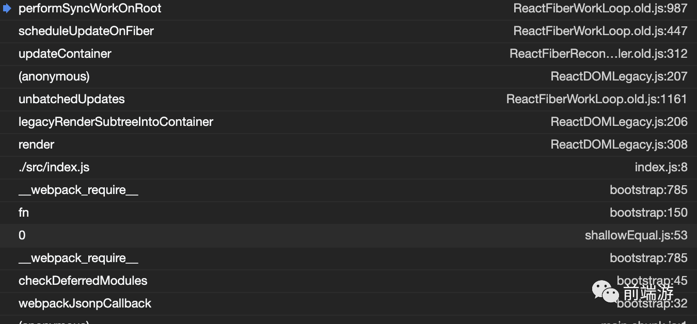
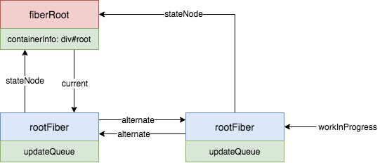
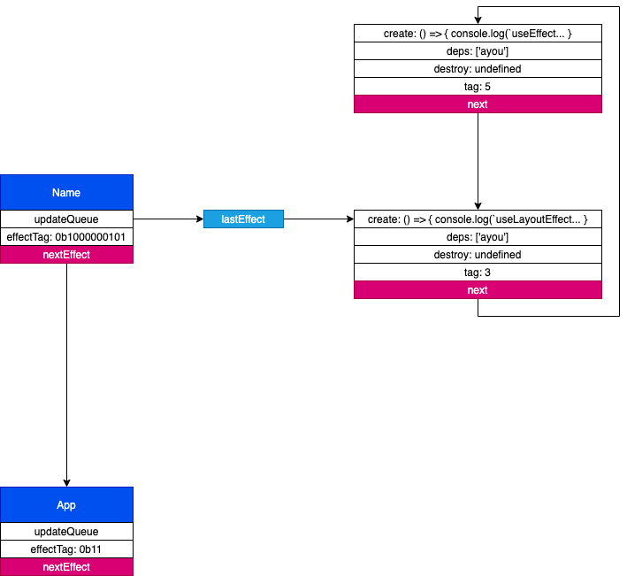
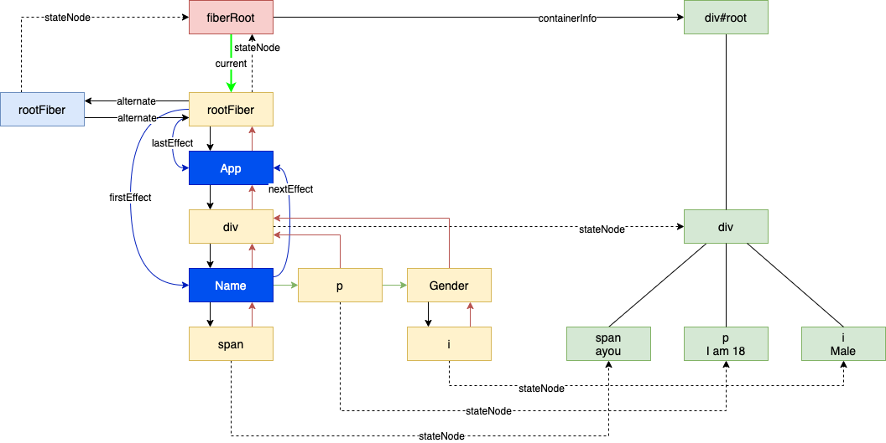

> 说明：本文结论均基于 React 16.13.1 得出，若有出入请参考对应版本源码

# 题目
在开始进行源码分析前，我们先来看几个题目：

题目一：

渲染下面的组件，打印顺序是什么？


```javascript
import React from 'react'
const channel = new MessageChannel()

// onmessage 是一个宏任务
channel.port1.onmessage = () => {
  console.log('1')
}

export default function App() {
  React.useEffect(() => {
    console.log('2')
  }, [])

  Promise.resolve().then(() => {
    console.log('3')
  })

  React.useLayoutEffect(() => {
    console.log('4')
    channel.port2.postMessage('')
  }, [])
  return <div>App</div>
}
```

答案：4 3 2 1

题目二：

点击 `p` 标签后，下面事件发生的顺序？

```
1. 页面显示 b
2. console.log('useLayoutEffect destroy a')
3. console.log('useLayoutEffect create b')
4. console.log('useEffect destroy a')
5. console.log('useEffect create b')
```

```javascript
import React from 'react'
import {useState, useEffect} from 'react'
​
function Name({name}) {
  useEffect(() => {
    console.log(`useEffect create ${name}`)
    return () => {
      console.log(`useEffect destroy ${name}`)
    }
  }, [name])
​
  useLayoutEffect(() => {
    console.log(`useLayoutEffect create ${name}`)
    return () => {
      console.log(`useLayoutEffect destroy ${name}`)
    }
  }, [name])
  return <span>{name}</span>
}
​
export default function App() {
  const [name, setName] = useState('a')
  return (
    <div>
      <Name name={name} />
      <p onClick={() => setName('b')}>I am 18</p>
    </div>
  )
}
```

答案：1 2 3 4 5

你是不是都答对了呢？

# 首次渲染流程

我们以下面这个例子来阐述下首次渲染的流程：

```javascript
function Name({name}) {
  useEffect(() => {
    console.log(`useEffect create ${name}`)
    return () => {
      console.log(`useEffect destroy ${name}`)
    }
  }, [name])
​
  useLayoutEffect(() => {
    console.log(`useLayoutEffect create ${name}`)
    return () => {
      console.log(`useLayoutEffect destroy ${name}`)
    }
  }, [name])
  return <span>{name}</span>
}
​
function Gender() {
  return <i>Male</i>
}
​
export default function App() {
  const [name, setName] = useState('ayou')
  return (
    <div>
      <Name name={name} />
      <p>I am 18</p>
      <Gender />
    </div>
  )
}
...
ReactDOM.render(<App />, document.getElementById('root'))
```

顺着入口我们回来到 `performSyncWorkOnRoot`：



```javascript
function performSyncWorkOnRoot(root) {
  ...
  let expirationTime
  if (lastExpiredTime !== NoWork) {
    ...
  } else {
    // There's no expired work. This must be a new, synchronous render.
    expirationTime = Sync
  }
  
  // Render 阶段
  let exitStatus = renderRootSync(root, expirationTime)
​
  ...
  const finishedWork: Fiber = (root.current.alternate: any);
  root.finishedWork = finishedWork;
  root.finishedExpirationTime = expirationTime;
  root.nextKnownPendingLevel = getRemainingExpirationTime(finishedWork);
  // Commit 阶段
  commitRoot(root);
​
  return null
}
```

到这里的时候，我们会得到一个如下的数据结构：


从代码中，我们可以知道 `performSyncWorkOnRoot` 可以分为两个大的阶段：

1. Render
2. Commit


## Render

首先看看 `renderRootSync`：

```javascript
function renderRootSync(root, expirationTime) {
  const prevExecutionContext = executionContext
  executionContext |= RenderContext
  const prevDispatcher = pushDispatcher(root)
​
  // If the root or expiration time have changed, throw out the existing stack
  // and prepare a fresh one. Otherwise we'll continue where we left off.
  if (root !== workInProgressRoot || expirationTime !== renderExpirationTime) {
    // 主要是给 workInProgress 赋值
    prepareFreshStack(root, expirationTime)
    startWorkOnPendingInteractions(root, expirationTime)
  }
​
  const prevInteractions = pushInteractions(root)
​
  do {
    try {
      workLoopSync()
      break
    } catch (thrownValue) {
      handleError(root, thrownValue)
    }
  } while (true)
  resetContextDependencies()
  if (enableSchedulerTracing) {
    popInteractions(((prevInteractions: any): Set<Interaction>))
  }
​
  executionContext = prevExecutionContext
  popDispatcher(prevDispatcher)
  ...
​
  // Set this to null to indicate there's no in-progress render.
  workInProgressRoot = null
​
  return workInProgressRootExitStatus
}
```

这里首先调用 `prepareFreshStack(root, expirationTime)`，这一句主要是通过 `root.current` 来创建 `workInProgress`。调用后，数据结构成了这样：



左右两个分别是两棵 `Fiber` 树，其中左边的是当前正在使用的树，右边是正在构建的树，首次渲染时当前正在使用的树为空。

跳过中间的一些语句，我们来到 `workLoopSync`：

```javascript
function workLoopSync() {
  // Already timed out, so perform work without checking if we need to yield.
  while (workInProgress !== null) {
    performUnitOfWork(workInProgress)
  }
}
```

很简单，就是不停的调用 `performUnitOfWork`：

```javascript
function performUnitOfWork(unitOfWork: Fiber): void {
  // The current, flushed, state of this fiber is the alternate. Ideally
  // nothing should rely on this, but relying on it here means that we don't
  // need an additional field on the work in progress.
  const current = unitOfWork.alternate
  setCurrentDebugFiberInDEV(unitOfWork)
​
  let next
  if (enableProfilerTimer && (unitOfWork.mode & ProfileMode) !== NoMode) {
    startProfilerTimer(unitOfWork)
    next = beginWork(current, unitOfWork, renderExpirationTime)
    stopProfilerTimerIfRunningAndRecordDelta(unitOfWork, true)
  } else {
    next = beginWork(current, unitOfWork, renderExpirationTime)
  }
​
  resetCurrentDebugFiberInDEV()
  unitOfWork.memoizedProps = unitOfWork.pendingProps
  if (next === null) {
    // If this doesn't spawn new work, complete the current work.
    completeUnitOfWork(unitOfWork)
  } else {
    workInProgress = next
  }
​
  ReactCurrentOwner.current = null
}
```

这里又分为两个步骤：

1. `beginWork`，传入当前 Fiber 节点，创建子 Fiber 节点。
2. `completeUnitOfWork`，通过 Fiber 节点创建真实 DOM 节点。


这两个步骤会交替的执行，其目标是：
* 构建出新的 Fiber 树
* 与旧 Fiber 比较得到 effect 链表（插入、更新、删除、useEffect 等都会产生 effect），该链表会在 commit 阶段使用

### beginWork

```javascript
function beginWork(
  current: Fiber | null,
  workInProgress: Fiber,
  renderExpirationTime: ExpirationTime
): Fiber | null {
  ...
  workInProgress.expirationTime = NoWork
​
  switch (workInProgress.tag) {
    case IndeterminateComponent:
    // ...省略
    case LazyComponent:
    // ...省略
    case FunctionComponent:
    // ...省略
    case ClassComponent:
    // ...省略
    case HostRoot:
      return updateHostRoot(current, workInProgress, renderExpirationTime)
    case HostComponent:
    // ...省略
    case HostText:
    // ...省略
    // ...省略其他类型
  }
}
```

这里因为是 `rootFiber`，所以会走到 `updateHostRoot`：

```javascript
function updateHostRoot(current, workInProgress, renderExpirationTime) {
  // 暂时不看
  pushHostRootContext(workInProgress)
  const updateQueue = workInProgress.updateQueue

  const nextProps = workInProgress.pendingProps
  const prevState = workInProgress.memoizedState
  const prevChildren = pfunction updateHostRoot(current, workInProgress, renderExpirationTime) {
  ...
  const nextChildren = nextState.element
  if (nextChildren === prevChildren) {
    // 省略
  }
  const root: FiberRoot = workInProgress.stateNode
  if (root.hydrate && enterHydrationState(workInProgress)) {
    // 省略
  } else {
    // 给 rootFiber 生成子 fiber
    reconcileChildren(
      current,
      workInProgress,
      nextChildren,
      renderExpirationTime
    )
    resetHydrationState()
  }
  return workInProgress.child
}
```

经过 `updateHostRoot` 后，会返回 `workInProgress.child` 作为下一个 `workInProgress`，最后的数据结构如下（这里先忽略 `reconcileChildren` 这个比较复杂的函数）：


接着会继续进行 `beginWork`，这次会来到 `mountIndeterminateComponent` （暂时忽略）。总之，经过不断的 `beginWork` 后，我们会得到如下的一个结构（这里只列出了右边的部分）：


此时 `beginWork` 返回的 `next` 为空，我们会走到：

```javascript
if (next === null) {
  // If this doesn't spawn new work, complete the current work.
  completeUnitOfWork(unitOfWork)
} else {
  ...
}
```

### completeUnitOfWork

```javascript
function completeUnitOfWork(unitOfWork: Fiber): void {
  // Attempt to complete the current unit of work, then move to the next
  // sibling. If there are no more siblings, return to the parent fiber.
  ...
  if ((completedWork.effectTag & Incomplete) === NoEffect) {
    setCurrentDebugFiberInDEV(completedWork)
    let next
    if (
      !enableProfilerTimer ||
      (completedWork.mode & ProfileMode) === NoMode
    ) {
      next = completeWork(current, completedWork, renderExpirationTime)
    } else {
      startProfilerTimer(completedWork)
      next = completeWork(current, completedWork, renderExpirationTime)
      // Update render duration assuming we didn't error.
      stopProfilerTimerIfRunningAndRecordDelta(completedWork, false)
    }
    resetCurrentDebugFiberInDEV()
    resetChildExpirationTime(completedWork)
  ...
}
```

此时这里的 `unitOfWork` 是 `span` 对应的 `FiberNode`。从函数头部的注释我们可以大致知道该函数的功能：

```javascript
// Attempt to complete the current unit of work, then move to the next
// sibling. If there are no more siblings, return to the parent fiber.

// 尝试去完成当前的工作单元，然后处理下一个 sibling。如果没有 sibling 了，就返回去完成父 fiber
```

这里一路走下去最后会来到 `completeWork` 这里 ：

```javascript
case HostComponent:
  ...
  // 会调用 ReactDOMComponent.js 中的 createELement 方法创建 span 标签
  const instance = createInstance(
    type,
    newProps,
    rootContainerInstance,
    currentHostContext,
    workInProgress
  )

  // 将子元素 append 到 instance 中
  appendAllChildren(instance, workInProgress, false, false)

  workInProgress.stateNode = instance;
```

执行完后，我们的结构如下所示（我们用绿色来表示真实 dom）：


此时 `completeWork` 返回的 `next` 将会是 `null`，我们需要找到下一个 `FiberNode` 来进行处理，因为 `span` 没有兄弟节点，所以只能往上找到它的父节点 `Name` 进行处理。

因为 `Name` 是一个 `FunctionComponent`，所以在 `completeWork` 中直接返回了 `null`。

```javascript
function completeWork(
  current: Fiber | null,
  workInProgress: Fiber,
  renderExpirationTime: ExpirationTime,
): Fiber | null {
  const newProps = workInProgress.pendingProps;
​
  switch (workInProgress.tag) {
    case IndeterminateComponent:
    case LazyComponent:
    case SimpleMemoComponent:
    case FunctionComponent:
    case ForwardRef:
    case Fragment:
    case Mode:
    case Profiler:
    case ContextConsumer:
    case MemoComponent:
      return null;
  ...
```

又因为它有 `sibling`，所以会将它的 `sibling` 赋值给 `workInProgress`，并返回对其进行 `beginWork`。

```javascript
const siblingFiber = completedWork.sibling
if (siblingFiber !== null) {
  // If there is more work to do in this returnFiber, do that next.
  // workInProgress 更新为 sibling
  workInProgress = siblingFiber
  // 直接返回，回到了 performUnitOfWork
  return
}
```

```javascript
function performUnitOfWork(unitOfWork: Fiber): void {
  ...
  if (next === null) {
    // If this doesn't spawn new work, complete the current work.
    // 上面的代码回到了这里
    completeUnitOfWork(unitOfWork)
  } else {
    workInProgress = next
  }

  ReactCurrentOwner.current = null
}
```

这样 `beginWork` 和 `completeWork` 不断交替的执行，当我们执行到 `div` 的时候，我们的结构如下所示：


之所以要额外的分析 `div` 的 `complete` 过程，是因为这个例子方便我们分析 `appendAllChildren`：

```javascript
appendAllChildren = function (
  parent: Instance,
  workInProgress: Fiber,
  needsVisibilityToggle: boolean,
  isHidden: boolean
) {
  // We only have the top Fiber that was created but we need recurse down its
  // children to find all the terminal nodes.
  let node = workInProgress.child
  while (node !== null) {
    if (node.tag === HostComponent || node.tag === HostText) {
      appendInitialChild(parent, node.stateNode)
    } else if (enableFundamentalAPI && node.tag === FundamentalComponent) {
      appendInitialChild(parent, node.stateNode.instance)
    } else if (node.tag === HostPortal) {
      // If we have a portal child, then we don't want to traverse
      // down its children. Instead, we'll get insertions from each child in
      // the portal directly.
    } else if (node.child !== null) {
      node.child.return = node
      node = node.child
      continue
    }
    if (node === workInProgress) {
      return
    }
    while (node.sibling === null) {
      if (node.return === null || node.return === workInProgress) {
        return
      }
      node = node.return
    }
    node.sibling.return = node.return
    node = node.sibling
  }
}
```

由于 `workInProgress` 指向 `div` 这个 `fiber`，他的 `child` 是 `Name`，会进入 `else if (node.child !== null)` 这个条件分支。然后继续下一个循环，此时 `node` 为 `span` 这个 `fiber`，会进入第一个分支，将 `span` 对应的 `dom` 元素插入到 `parent` （这里的 `parent` 就是 `div` 的真实 dom）之中。

这样不停的循环，最后会执行到 `if (node === workInProgress)` 退出，此时所有的子元素都 append 到了 `parent` 之中：


然后继续 `beginWork` 和 `completeWork`，最后会来到 `rootFiber`。不同的是，该节点的 `alternate` 并不为空，且该节点 `tag` 为 `HootRoot`，所以 `completeWork` 时会来到这里：

```javascript
case HostRoot: {
  ...
  updateHostContainer(workInProgress);
  return null;
}
```

```javascript
updateHostContainer = function (workInProgress: Fiber) {
  // Noop
}
```

看来几乎没有做什么事情，到这我们的 `render` 阶段就结束了，最后的结构如下所示：


其中蓝色表示是有 effect 的 `Fiber` 节点，他们组成了一个链表，方便 commit 过程进行遍历。

可以访问 http://www.paradeto.com/react-render/ ，点击屏幕中的 beginWork 按钮，可以查看 render 过程的动画，建议横屏。

## commit

`commit` 大致可分为以下过程：

- 准备阶段
- before mutation 阶段（执行 DOM 操作前）
- mutation 阶段（执行 DOM 操作）
- 切换 Fiber Tree
- layout 阶段（执行 DOM 操作后）

### 准备阶段

```js
do {
  // 触发useEffect回调与其他同步任务。由于这些任务可能触发新的渲染，所以这里要一直遍历执行直到没有任务
  flushPassiveEffects()
  // 暂时没有复现出 rootWithPendingPassiveEffects !== null 的情景
  // 首次渲染 rootWithPendingPassiveEffects 为 null
} while (rootWithPendingPassiveEffects !== null)
// finishedWork 就是正在工作的 rootFiber
const finishedWork = root.
// 优先级相关暂时不看
const expirationTime = root.finishedExpirationTime
if (finishedWork === null) {
  return null
}
root.finishedWork = null
root.finishedExpirationTime = NoWork

root.callbackNode = null
root.callbackExpirationTime = NoWork
root.callbackPriority_old = NoPriority

const remainingExpirationTimeBeforeCommit = getRemainingExpirationTime(
  finishedWork
)
markRootFinishedAtTime(
  root,
  expirationTime,
  remainingExpirationTimeBeforeCommit
)

if (rootsWithPendingDiscreteUpdates !== null) {
  const lastDiscreteTime = rootsWithPendingDiscreteUpdates.get(root)
  if (
    lastDiscreteTime !== undefined &&
    remainingExpirationTimeBeforeCommit < lastDiscreteTime
  ) {
    rootsWithPendingDiscreteUpdates.delete(root)
  }
}

if (root === workInProgressRoot) {
  workInProgressRoot = null
  workInProgress = null
  renderExpirationTime = NoWork
} else {
}

// 将effectList赋值给firstEffect
// 由于每个fiber的effectList只包含他的子孙节点
// 所以根节点如果有effectTag则不会被包含进来
// 所以这里将有effectTag的根节点插入到effectList尾部
// 这样才能保证有effect的fiber都在effectList中
let firstEffect
if (finishedWork.effectTag > PerformedWork) {
  if (finishedWork.lastEffect !== null) {
    finishedWork.lastEffect.nextEffect = finishedWork
    firstEffect = finishedWork.firstEffect
  } else {
    firstEffect = finishedWork
  }
} else {
  firstEffect = finishedWork.firstEffect
}
```

准备阶段主要是确定 `firstEffect`，我们的例子中就是 `Name` 这个 `fiber`。

### before mutation 阶段

`before mutation` 阶段主要是调用了 `commitBeforeMutationEffects` 方法：

```javascript
function commitBeforeMutationEffects() {
  while (nextEffect !== null) {
    if (
      !shouldFireAfterActiveInstanceBlur &&
      focusedInstanceHandle !== null &&
      isFiberHiddenOrDeletedAndContains(nextEffect, focusedInstanceHandle)
    ) {
      shouldFireAfterActiveInstanceBlur = true
      beforeActiveInstanceBlur()
    }
    const effectTag = nextEffect.effectTag
    if ((effectTag & Snapshot) !== NoEffect) {
      setCurrentDebugFiberInDEV(nextEffect)

      const current = nextEffect.alternate
      // 调用getSnapshotBeforeUpdate
      commitBeforeMutationEffectOnFiber(current, nextEffect)

      resetCurrentDebugFiberInDEV()
    }
    if ((effectTag & Passive) !== NoEffect) {
      // If there are passive effects, schedule a callback to flush at
      // the earliest opportunity.
      if (!rootDoesHavePassiveEffects) {
        rootDoesHavePassiveEffects = true
        scheduleCallback(NormalPriority, () => {
          flushPassiveEffects()
          return null
        })
      }
    }
    nextEffect = nextEffect.nextEffect
  }
}
```

因为 `Name`  中 `effectTag` 包括了 `Passive`，所以这里会执行：

```javascript
scheduleCallback(NormalPriority, () => {
  flushPassiveEffects()
  return null
})
```

这里主要是对 `useEffect` 中的任务进行异步调用，最终会在下个事件循环中执行 `commitPassiveHookEffects`：

```javascript
export function commitPassiveHookEffects(finishedWork: Fiber): void {
  if ((finishedWork.effectTag & Passive) !== NoEffect) {
    switch (finishedWork.tag) {
      case FunctionComponent:
      case ForwardRef:
      case SimpleMemoComponent:
      case Block: {
        if (
          enableProfilerTimer &&
          enableProfilerCommitHooks &&
          finishedWork.mode & ProfileMode
        ) {
          try {
            startPassiveEffectTimer();
            commitHookEffectListUnmount(
              HookPassive | HookHasEffect,
              finishedWork,
            );
            commitHookEffectListMount(
              HookPassive | HookHasEffect,
              finishedWork,
            );
          } finally {
            recordPassiveEffectDuration(finishedWork);
          }
        } else {
          commitHookEffectListUnmount(
            HookPassive | HookHasEffect,
            finishedWork,
          );
          commitHookEffectListMount(HookPassive | HookHasEffect, finishedWork);
        }
        break;
      }
      default:
        break;
    }
  }
}
function commitHookEffectListUnmount(tag: number, finishedWork: Fiber) {
  const updateQueue: FunctionComponentUpdateQueue | null = (finishedWork.updateQueue: any);
  const lastEffect = updateQueue !== null ? updateQueue.lastEffect : null;
  if (lastEffect !== null) {
    const firstEffect = lastEffect.next;
    let effect = firstEffect;
    do {
      if ((effect.tag & tag) === tag) {
        // Unmount
        const destroy = effect.destroy;
        effect.destroy = undefined;
        if (destroy !== undefined) {
          destroy();
        }
      }
      effect = effect.next;
    } while (effect !== firstEffect);
  }
}

function commitHookEffectListMount(tag: number, finishedWork: Fiber) {
  const updateQueue: FunctionComponentUpdateQueue | null = (finishedWork.updateQueue: any);
  const lastEffect = updateQueue !== null ? updateQueue.lastEffect : null;
  if (lastEffect !== null) {
    const firstEffect = lastEffect.next;
    let effect = firstEffect;
    do {
      if ((effect.tag & tag) === tag) {
        // Mount
        const create = effect.create;
        effect.destroy = create();

        ...
      }
      effect = effect.next;
    } while (effect !== firstEffect);
  }
}
```

其中，`commitHookEffectListUnmount` 会执行 `useEffect` 上次渲染返回的 `destroy` 方法，`commitHookEffectListMount` 会执行 `useEffect` 本次渲染的 `create` 方法。具体到我们的例子：



因为是首次渲染，所以 `destroy` 都是 undefined，所以只会打印 `useEffect ayou`。

### mutation 阶段

`mutation` 阶段主要是执行了 `commitMutationEffects` 这个方法：

```javascript
function commitMutationEffects(root: FiberRoot, renderPriorityLevel) {
  // TODO: Should probably move the bulk of this function to commitWork.
  while (nextEffect !== null) {
    setCurrentDebugFiberInDEV(nextEffect)

    const effectTag = nextEffect.effectTag

    ...

    // The following switch statement is only concerned about placement,
    // updates, and deletions. To avoid needing to add a case for every possible
    // bitmap value, we remove the secondary effects from the effect tag and
    // switch on that value.
    const primaryEffectTag =
      effectTag & (Placement | Update | Deletion | Hydrating)
    switch (primaryEffectTag) {
     case Placement: {
        commitPlacement(nextEffect);
        // Clear the "placement" from effect tag so that we know that this is
        // inserted, before any life-cycles like componentDidMount gets called.
        // TODO: findDOMNode doesn't rely on this any more but isMounted does
        // and isMounted is deprecated anyway so we should be able to kill this.
        nextEffect.effectTag &= ~Placement;
        break;
      }
      case PlacementAndUpdate: {
        // Placement
        commitPlacement(nextEffect);
        // Clear the "placement" from effect tag so that we know that this is
        // inserted, before any life-cycles like componentDidMount gets called.
        nextEffect.effectTag &= ~Placement;

        // Update
        const current = nextEffect.alternate;
        commitWork(current, nextEffect);
        break;
      }
      case Hydrating: {
        nextEffect.effectTag &= ~Hydrating;
        break;
      }
      case HydratingAndUpdate: {
        nextEffect.effectTag &= ~Hydrating;

        // Update
        const current = nextEffect.alternate;
        commitWork(current, nextEffect);
        break;
      }
      case Update: {
        const current = nextEffect.alternate;
        commitWork(current, nextEffect);
        break;
      }
      case Deletion: {
        commitDeletion(root, nextEffect, renderPriorityLevel);
        break;
      }
    }
  }
}
```

其中，`Name` 会走 `Update` 这个分支，执行 `commitWork`，最终会执行到 `commitHookEffectListUnmount`：


```javascript
function commitHookEffectListUnmount(tag: number, finishedWork: Fiber) {
  const updateQueue: FunctionComponentUpdateQueue | null = (finishedWork.updateQueue: any);
  const lastEffect = updateQueue !== null ? updateQueue.lastEffect : null;
  if (lastEffect !== null) {
    const firstEffect = lastEffect.next;
    let effect = firstEffect;
    do {
      if ((effect.tag & tag) === tag) {
        // Unmount
        const destroy = effect.destroy;
        effect.destroy = undefined;
        if (destroy !== undefined) {
          destroy();
        }
      }
      effect = effect.next;
    } while (effect !== firstEffect);
  }
}
```


这里会执行 `useLayoutEffect` 上次渲染返回的 `destroy` 方法，我们的例子里是 undefined。

而 `App` 会走到 `Placement` 这个分支，执行 `commitPlacement`，这里的主要工作是把整棵 dom 树插入到了 `<div id='root'></div>` 之中。

### 切换 Fiber Tree

`mutation 阶段完成后`，会执行：

```javascript
root.current = finishedWork
```

完成后， `fiberRoot` 会指向 `current Fiber` 树。



### layout 阶段
layout 阶段会执行 `commitLayoutEffects`：
```javascript
do {
  if (__DEV__) {
    ...
  } else {
    try {
      commitLayoutEffects(root, expirationTime);
    } catch (error) {
      invariant(nextEffect !== null, 'Should be working on an effect.');
      captureCommitPhaseError(nextEffect, error);
      nextEffect = nextEffect.nextEffect;
    }
  }
} while (nextEffect !== null);
...
```

```javascript
import {
  ...
  commitLifeCycles as commitLayoutEffectOnFiber,
  ...
} from './ReactFiberCommitWork.old';
...
function commitLayoutEffects(
  root: FiberRoot,
  committedExpirationTime: ExpirationTime,
) {
  ...

  // TODO: Should probably move the bulk of this function to commitWork.
  while (nextEffect !== null) {
    setCurrentDebugFiberInDEV(nextEffect);

    const effectTag = nextEffect.effectTag;

    if (effectTag & (Update | Callback)) {
      const current = nextEffect.alternate;
      commitLayoutEffectOnFiber(
        root,
        current,
        nextEffect,
        committedExpirationTime,
      );
    }

    if (effectTag & Ref) {
      commitAttachRef(nextEffect);
    }

    resetCurrentDebugFiberInDEV();
    nextEffect = nextEffect.nextEffect;
  }
  ...
}
```
`commitLayoutEffects` 中核心代码是遍历 effect 链表，对符合条件的执行 `commitLayoutEffectOnFiber` 即 `commitLifeCycles`:

```javascript
function commitLifeCycles(
  finishedRoot: FiberRoot,
  current: Fiber | null,
  finishedWork: Fiber,
  committedExpirationTime: ExpirationTime,
): void {
 switch (finishedWork.tag) {
    case FunctionComponent:
    case ForwardRef:
    case SimpleMemoComponent:
    case Block: {
      // At this point layout effects have already been destroyed (during mutation phase).
      // This is done to prevent sibling component effects from interfering with each other,
      // e.g. a destroy function in one component should never override a ref set
      // by a create function in another component during the same commit.
      if (
        enableProfilerTimer &&
        enableProfilerCommitHooks &&
        finishedWork.mode & ProfileMode
      ) {
        try {
          startLayoutEffectTimer();
          commitHookEffectListMount(HookLayout | HookHasEffect, finishedWork);
        } finally {
          recordLayoutEffectDuration(finishedWork);
        }
      } else {
        commitHookEffectListMount(HookLayout | HookHasEffect, finishedWork);
      }

      if (runAllPassiveEffectDestroysBeforeCreates) {
        schedulePassiveEffects(finishedWork);
      }
      return;
    }
  ...
}
```

其中 `commitHookEffectListMount` 我们在介绍 `before mutation` 的时候提到过，这里只是调用的时候所传的参数不同而已（`HookLayout` 表示当前的 effect 是 `useLayoutEffect` 产生的）。

所以，具体到我们的例子，这里会执行 `useLayoutEffect` 中的 `create` 函数，所以会打印 `useLayoutEffect ayou`。

# 题目解析
现在，我们来分析下文章开始的两个题目：

题目一：

渲染下面的组件，打印顺序是什么？


```javascript
import React from 'react'
const channel = new MessageChannel()

// onmessage 是一个宏任务
channel.port1.onmessage = () => {
  console.log('1')
}

export default function App() {
  React.useEffect(() => {
    console.log('2')
  }, [])

  Promise.resolve().then(() => {
    console.log('3')
  })

  React.useLayoutEffect(() => {
    console.log('4')
    channel.port2.postMessage('')
  }, [])
  return <div>App</div>
}
```

解析：

1. `useLayoutEffect` 中的任务会跟随渲染过程同步执行，所以先打印 4

2. `Promise` 对象 `then` 中的任务是一个微任务，所以在 4 后面执行，打印 3

3. `console.log('1')` 和 `console.log('2')` 都会在宏任务中执行，执行顺序就看谁先生成，这里 2 比 1 先，所以先打印 2，再打印 1。


题目二：

点击 `p` 标签后，下面事件发生的顺序？

```
1. 页面显示 b
2. console.log('useLayoutEffect destroy a')
3. console.log('useLayoutEffect create b')
4. console.log('useEffect destroy a')
5. console.log('useEffect create b')
```

```javascript
import React from 'react'
import {useState, useEffect} from 'react'
​
function Name({name}) {
  useEffect(() => {
    console.log(`useEffect create ${name}`)
    return () => {
      console.log(`useEffect destroy ${name}`)
    }
  }, [name])
​
  useLayoutEffect(() => {
    console.log(`useLayoutEffect create ${name}`)
    return () => {
      console.log(`useLayoutEffect destroy ${name}`)
    }
  }, [name])
  return <span>{name}</span>
}
​
export default function App() {
  const [name, setName] = useState('a')
  return (
    <div>
      <Name name={name} />
      <p onClick={() => setName('b')}>I am 18</p>
    </div>
  )
}
```

解析：

1. span 这个 Fiber 位于 effect 链表的首部，在 commitMutations 中会先处理，所以页面先显示 b。

2. Name 这个 Fiber 位于 span 之后，所以 useLayoutEffect 中上一次的 destroy 紧接着其执行。打印 useLayoutEffect destroy a。

3. commitLayoutEffects 中执行 useLayoutEffect 这一次的 create。打印 useLayoutEffect create b。

4. useEffect 在下一个宏任务中执行，先执行上一次的 destroy，再执行这一次的 create。所以先打印 useEffect destroy a，再打印 useEffect create b。


# 参考
[React技术揭秘](https://react.iamkasong.com/preparation/newConstructure.html#react16%E6%9E%B6%E6%9E%84)