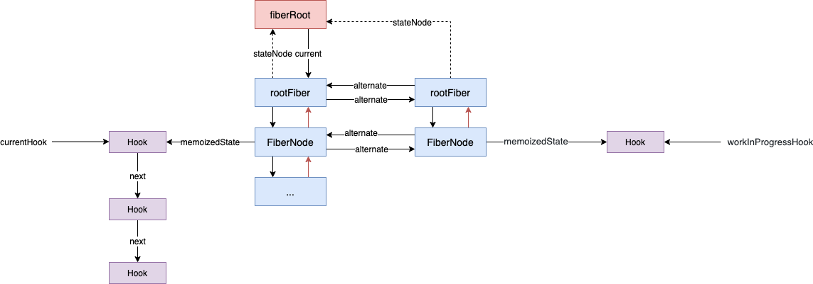
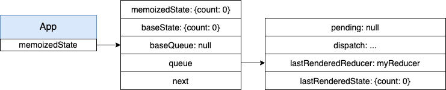
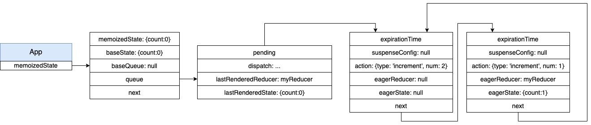
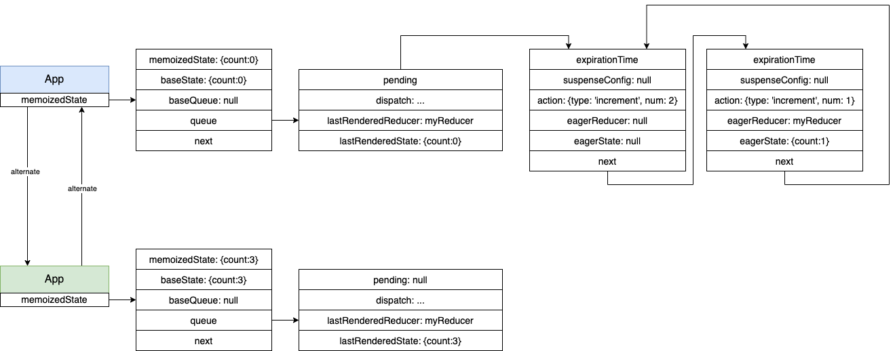
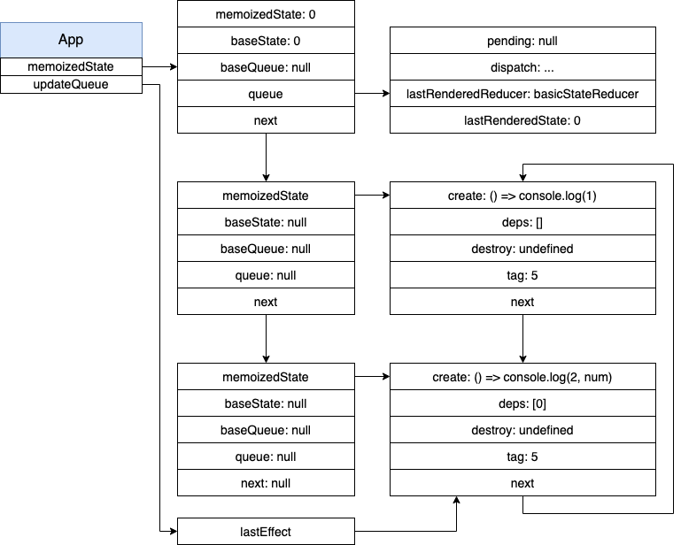
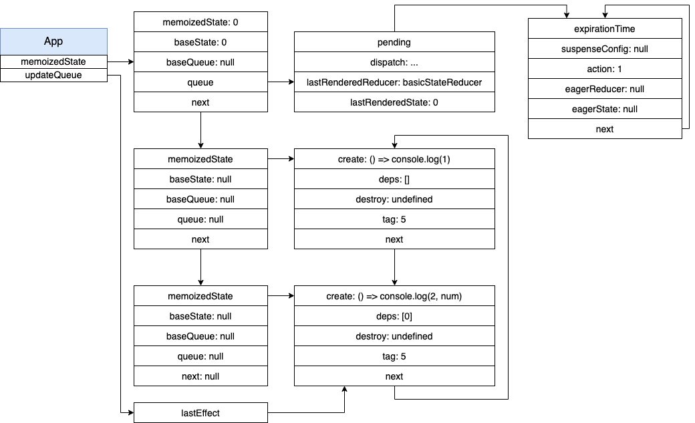
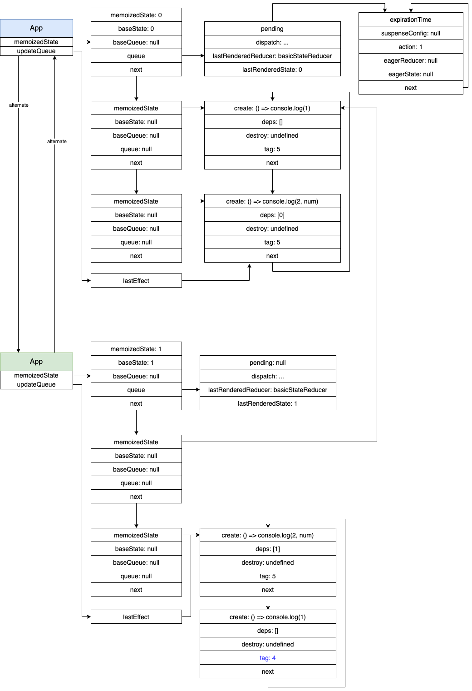
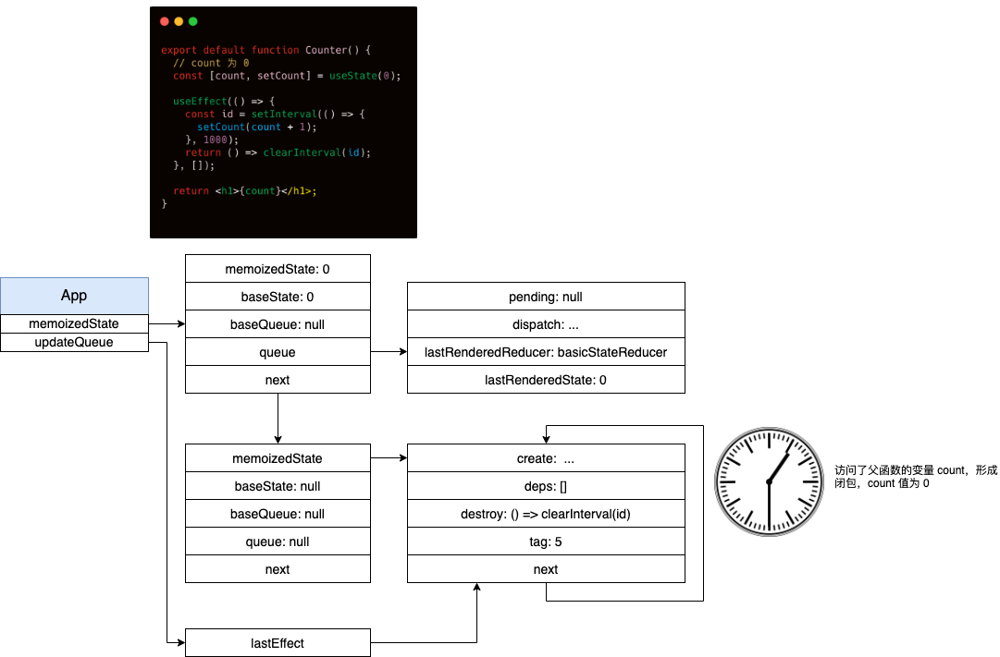
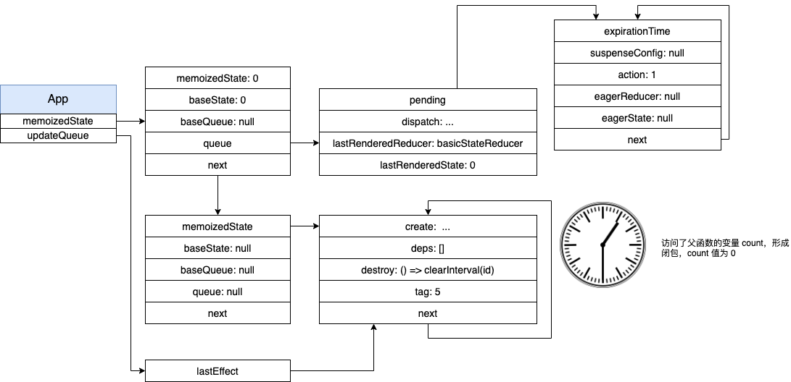
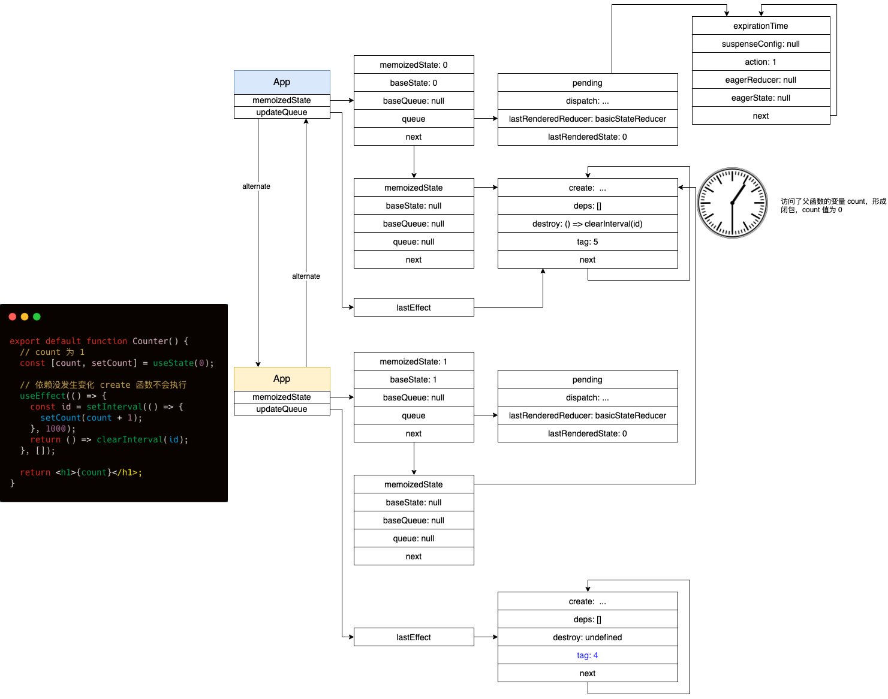

> 说明：本文结论均基于 React 16.13.1 得出，若有出入请参考对应版本源码

# 题目
老规矩，在进入正题前，先做个题目：

下面的组件能按照期望工作吗（每隔一秒数字增加 1）？Why?

```javascript
export default function Counter() {
  const [count, setCount] = useState(0);

  useEffect(() => {
    const id = setInterval(() => {
      setCount(count + 1);
    }, 1000);
    return () => clearInterval(id);
  }, []);

  return <h1>{count}</h1>;
}
```

答案：不能，永远都渲染 1。

你做对了吗？

# Hooks
## Hook 是什么
可以理解为 `Hook` 就是一个对象，源码中定义如下：

```javascript
export type Hook = {|
  memoizedState: any,
  baseState: any,
  baseQueue: Update<any, any> | null,
  queue: UpdateQueue<any, any> | null,
  next: Hook | null,
|};
```

## Hooks 是怎么存储的
如下图所示，hooks 之间会形成一个链表并保持在 `FiberNode` 的 `memoizedState` 属性之上，链表通过游标 `currentHook` 或 `workInProgressHook` 来进行遍历。我们知道 React 更新的时候会存在两棵 Fiber 树，一颗是上次已经构建好的 Fiber 树，一颗是正在构建的 Fiber 树，而 `currentHook` 和 `workInProgressHook` 分别是为这两棵树工作的。



## 怎么区分首次渲染和更新
首次渲染时，因为 hooks 链表还未形成，所以需要构建 hooks 链表，当调用 `useState`, `useEffect` 等函数时，最终都会调用 `mountState`, `mountEffect` 等方法。更新的时候，因为 hooks 链表已存在，需要对其进行更新，当调用 `useState`, `useEffect` 等函数时，最终都会调用 `updateState`, `updateEffect` 等方法：

```javascript
const HooksDispatcherOnMount: Dispatcher = {
  readContext,

  useCallback: mountCallback,
  useContext: readContext,
  useEffect: mountEffect,
  useImperativeHandle: mountImperativeHandle,
  useLayoutEffect: mountLayoutEffect,
  useMemo: mountMemo,
  useReducer: mountReducer,
  useRef: mountRef,
  useState: mountState,
  useDebugValue: mountDebugValue,
  useResponder: createDeprecatedResponderListener,
  useDeferredValue: mountDeferredValue,
  useTransition: mountTransition,
  useMutableSource: mountMutableSource,
  useOpaqueIdentifier: mountOpaqueIdentifier,
};

const HooksDispatcherOnUpdate: Dispatcher = {
  readContext,

  useCallback: updateCallback,
  useContext: readContext,
  useEffect: updateEffect,
  useImperativeHandle: updateImperativeHandle,
  useLayoutEffect: updateLayoutEffect,
  useMemo: updateMemo,
  useReducer: updateReducer,
  useRef: updateRef,
  useState: updateState,
  useDebugValue: updateDebugValue,
  useResponder: createDeprecatedResponderListener,
  useDeferredValue: updateDeferredValue,
  useTransition: updateTransition,
  useMutableSource: updateMutableSource,
  useOpaqueIdentifier: updateOpaqueIdentifier,
};
```

React 通过当前正在构建的 `workInProgress` 所指向的 `FibeNode` 是否有对应的 `current` 来判断是否为首次渲染，从而调用不同的 hooks 方法：

```javascript
ReactCurrentDispatcher.current =
  current === null || current.memoizedState === null
    ? HooksDispatcherOnMount
    : HooksDispatcherOnUpdate;
...
function resolveDispatcher() {
  const dispatcher = ReactCurrentDispatcher.current;
  return dispatcher;
}
...
export function useReducer<S, I, A>(
  reducer: (S, A) => S,
  initialArg: I,
  init?: (I) => S,
): [S, Dispatch<A>] {
  const dispatcher = resolveDispatcher();
  return dispatcher.useReducer(reducer, initialArg, init);
}
```

了解了 Hooks 的一些基本信息后，接下来看看常用的一些 Hooks 到底是怎么工作的吧。

# 常见 Hooks 分析
官网中列出了如下常用的 hooks：

Basic Hooks:
  * useState
  * useEffect
  * useContext


Additional Hooks:
  * useReducer
  * useCallback
  * useMemo
  * useRef
  * useImperativeHandle
  * useLayoutEffect
  * useDebugValue

这里我们暂时先不讨论 `useContext` 和 `useDebugValue`。而这些 hooks 中只需要搞清楚 `useReducer` 和 `useEffect` 即可，其他几个要么比较简单，要么跟 `useReducer` 和 `useEffect` 类似。

## useReducer
我们以下面的例子来分析 `useReducer` 的运作流程：
```javascript
export default function App(props) {
  const [state, dispatch] = useReducer(function myReducer(state, action) {
    switch (action.type) {
      case 'increment':
        return {count: state.count + action.num};
      case 'decrement':
        return {count: state.count - action.num};
      default:
        throw new Error();
    }
  }, {count: 0})
  return (
    <div>
      {state.count}
      <button onClick={() => dispatch({type: 'decrement', num: 1})}>-</button>
      <button onClick={() => {
        dispatch({type: 'increment', num: 1})
        dispatch({type: 'increment', num: 2})
      }}>+</button>
    </div>
  )
}

```

### 首次渲染
首次渲染时，会执行 `mountReducer`:

```javascript
function mountReducer<S, I, A>(
  reducer: (S, A) => S,
  initialArg: I,
  init?: (I) => S,
): [S, Dispatch<A>] {
  const hook = mountWorkInProgressHook();
  let initialState;
  if (init !== undefined) {
    initialState = init(initialArg);
  } else {
    initialState = ((initialArg: any): S);
  }
  hook.memoizedState = hook.baseState = initialState;
  const queue = (hook.queue = {
    pending: null,
    dispatch: null,
    lastRenderedReducer: reducer,
    lastRenderedState: (initialState: any),
  });
  const dispatch: Dispatch<A> = (queue.dispatch = (dispatchAction.bind(
    null,
    currentlyRenderingFiber,
    queue,
  ): any));
  return [hook.memoizedState, dispatch];
}

function mountWorkInProgressHook(): Hook {
  const hook: Hook = {
    memoizedState: null,

    baseState: null,
    baseQueue: null,
    queue: null,

    next: null,
  };

  if (workInProgressHook === null) {
    // This is the first hook in the list
    currentlyRenderingFiber.memoizedState = workInProgressHook = hook;
  } else {
    // Append to the end of the list
    workInProgressHook = workInProgressHook.next = hook;
  }
  return workInProgressHook;
}

```

这里调用 `mountWorkInProgressHook` 生成一个新的 `hook`，如果是第一个 `hook`，会挂载到 `FibeNode` 的 `memoizedState` 上面，否则放到 hook 链表的末尾。最后，返回这个新的 hook。

接着会更新 hook 上面的属性，并返回 `hook.memoizedState` 和 `dispatch`（该方法后续再讨论）。总之，最后我们会得到如下的数据结构：




### 点击+号
当我们点击 + 号时，会执行两次 `dispatch` 方法：

```javascript

function dispatchAction<S, A>(
  fiber: Fiber,
  queue: UpdateQueue<S, A>,
  action: A,
) {
  // 1
  const update: Update<S, A> = {
    expirationTime,
    suspenseConfig,
    action,
    eagerReducer: null,
    eagerState: null,
    next: (null: any),
  };

  // Append the update to the end of the list.
  const pending = queue.pending;
  if (pending === null) {
    // This is the first update. Create a circular list.
    update.next = update;
  } else {
    update.next = pending.next;
    pending.next = update;
  }
  queue.pending = update;

  // 2
  const alternate = fiber.alternate;
  if (
    fiber === currentlyRenderingFiber ||
    (alternate !== null && alternate === currentlyRenderingFiber)
  ) {
    ...
  } else {
    if (
      fiber.expirationTime === NoWork &&
      (alternate === null || alternate.expirationTime === NoWork)
    ) {
      // The queue is currently empty, which means we can eagerly compute the
      // next state before entering the render phase. If the new state is the
      // same as the current state, we may be able to bail out entirely.
      const lastRenderedReducer = queue.lastRenderedReducer;
      if (lastRenderedReducer !== null) {
        let prevDispatcher;
        try {
          const currentState: S = (queue.lastRenderedState: any);
          const eagerState = lastRenderedReducer(currentState, action);
          // Stash the eagerly computed state, and the reducer used to compute
          // it, on the update object. If the reducer hasn't changed by the
          // time we enter the render phase, then the eager state can be used
          // without calling the reducer again.
          update.eagerReducer = lastRenderedReducer;
          update.eagerState = eagerState;
          if (is(eagerState, currentState)) {
            // Fast path. We can bail out without scheduling React to re-render.
            // It's still possible that we'll need to rebase this update later,
            // if the component re-renders for a different reason and by that
            // time the reducer has changed.
            return;
          }
        } catch (error) {
          // Suppress the error. It will throw again in the render phase.
        } finally {
        }
      }
    }

    // 3
    scheduleUpdateOnFiber(fiber, expirationTime);
  }
}

```

我们去掉一些暂时不关心的代码，整个代码就分成了三个部分：

1. 创建一个新的更新，将所有的更新形成一个环状链表并挂载到 `queue.pending` 上面
2. 计算出 `eagerReducer` 和 `eagerState`
3. 在 `FiberNode` 上调度更新（暂时不关心，只需要知道它会开启一个宏任务，在下一个事件循环对组件进行更新）

经过两次 `dispatch` 后，我们的数据结构会变成如下这样：



### 更新时
下一个事件循环时，React 会进行更新，当执行到 `useReducer` 时会执行 `updateReducer`：

```javascript
function updateReducer<S, I, A>(
  reducer: (S, A) => S,
  initialArg: I,
  init?: (I) => S,
): [S, Dispatch<A>] {
  const hook = updateWorkInProgressHook();
  const queue = hook.queue;

  queue.lastRenderedReducer = reducer;

  const current: Hook = (currentHook: any);

  // 得到更新链表的入口
  let baseQueue = current.baseQueue;
  const pendingQueue = queue.pending;
  if (pendingQueue !== null) {
    if (baseQueue !== null) {
      const baseFirst = baseQueue.next;
      const pendingFirst = pendingQueue.next;
      baseQueue.next = pendingFirst;
      pendingQueue.next = baseFirst;
    }
    current.baseQueue = baseQueue = pendingQueue;
    queue.pending = null;
  }

  if (baseQueue !== null) {
    const first = baseQueue.next;
    let newState = current.baseState;

    let newBaseState = null;
    let newBaseQueueFirst = null;
    let newBaseQueueLast = null;
    let update = first;
    // 遍历更新链表，对 state 进行更新
    do {
      const updateExpirationTime = update.expirationTime;
      if (updateExpirationTime < renderExpirationTime) {
        ...
      } else {
        ...
        // Process this update.
        if (update.eagerReducer === reducer) {
          // If this update was processed eagerly, and its reducer matches the
          // current reducer, we can use the eagerly computed state.
          newState = ((update.eagerState: any): S);
        } else {
          const action = update.action;
          newState = reducer(newState, action);
        }
      }
      update = update.next;
    } while (update !== null && update !== first);

    if (newBaseQueueLast === null) {
      newBaseState = newState;
    } else {
      newBaseQueueLast.next = (newBaseQueueFirst: any);
    }

    if (!is(newState, hook.memoizedState)) {
      markWorkInProgressReceivedUpdate();
    }

    hook.memoizedState = newState;
    hook.baseState = newBaseState;
    hook.baseQueue = newBaseQueueLast;

    queue.lastRenderedState = newState;
  }

  const dispatch: Dispatch<A> = (queue.dispatch: any);
  return [hook.memoizedState, dispatch];
}
```

这里首先调用了 `updateWorkInProgressHook`，即通过当前 `FiberNode` 上的 Hook 来生成新的 `FiberNode` 上新的 Hook。剩下的代码较长，但其核心思想就是遍历更新链表中的 `action` 对 state 进行更新，最终数据结构会变成如下所示：



注意到我们新生成的 `FiberNode` 中的 hook 的 state 已经更新成了 `{ count: 3 }`。

## useState
搞清楚了 `useReducer`，`useState` 就比较简单了，对比一下代码就可以发现，两者是很类似的。

首次渲染时，主要不同之处在于 `mountState` 中的 `lastRenderedReducer` 用的是内置的 `basicStateReducer`：

```javascript
function mountReducer<S, I, A>(
  reducer: (S, A) => S,
  initialArg: I,
  init?: I => S,
): [S, Dispatch<A>] {
  const hook = mountWorkInProgressHook();
  let initialState;
  if (init !== undefined) {
    initialState = init(initialArg);
  } else {
    initialState = ((initialArg: any): S);
  }
  hook.memoizedState = hook.baseState = initialState;
  const queue = (hook.queue = {
    pending: null,
    dispatch: null,
    lastRenderedReducer: reducer,
    lastRenderedState: (initialState: any),
  });
  const dispatch: Dispatch<A> = (queue.dispatch = (dispatchAction.bind(
    null,
    currentlyRenderingFiber,
    queue,
  ): any));
  return [hook.memoizedState, dispatch];
}

function mountState<S>(
  initialState: (() => S) | S,
): [S, Dispatch<BasicStateAction<S>>] {
  const hook = mountWorkInProgressHook();
  if (typeof initialState === 'function') {
    // $FlowFixMe: Flow doesn't like mixed types
    initialState = initialState();
  }
  hook.memoizedState = hook.baseState = initialState;
  const queue = (hook.queue = {
    pending: null,
    dispatch: null,
    /**
    不同之处，useState 使用的是内置的 reducer
    function basicStateReducer<S>(state: S, action: BasicStateAction<S>): S {
      // $FlowFixMe: Flow doesn't like mixed types
      return typeof action === 'function' ? action(state) : action;
    }
    */
    lastRenderedReducer: basicStateReducer,
    lastRenderedState: (initialState: any),
  });
  const dispatch: Dispatch<
    BasicStateAction<S>,
  > = (queue.dispatch = (dispatchAction.bind(
    null,
    currentlyRenderingFiber,
    queue,
  ): any));
  return [hook.memoizedState, dispatch];
}
```

更新时，`updateState` 内部用的就是 `updateReducer`：

```javascript
function updateState<S>(
  initialState: (() => S) | S,
): [S, Dispatch<BasicStateAction<S>>] {
  return updateReducer(basicStateReducer, (initialState: any));
}
```

## useEffect
我们通过下面这个例子来分析 `useEffect`：

```javascript
export default function App(props) {
  const [num, setNum] = useState(0)
  useEffect(() => {
    console.log(1)
  }, [])
  useEffect(() => {
    console.log(2, num)
  }, [num])
  return <div onClick={() => setNum(num+1)}>{num}</div>
}
```

### 首次渲染
首次渲染会执行 `mountEffect`：

```javascript
function mountEffect(
  create: () => (() => void) | void,
  deps: Array<mixed> | void | null,
): void {
  return mountEffectImpl(
    UpdateEffect | PassiveEffect,
    HookPassive,
    create,
    deps,
  );
}
```

实际上执行的是 `mountEffectImpl`：

```javascript
function mountEffectImpl(fiberEffectTag, hookEffectTag, create, deps): void {
  const hook = mountWorkInProgressHook();
  const nextDeps = deps === undefined ? null : deps;
  currentlyRenderingFiber.effectTag |= fiberEffectTag;
  hook.memoizedState = pushEffect(
    HookHasEffect | hookEffectTag,
    create,
    undefined,
    nextDeps,
  );
}
```
这里首先也是生成了一个 `hook`，然后对当前的 `FiberNode` 的 `effectTag` 进行标记，表示这个节点是有 `useEffect` 的副作用的。最后会调用 `pushEffect`：


```javascript
function pushEffect(tag, create, destroy, deps) {
  const effect: Effect = {
    tag,
    create,
    destroy,
    deps,
    // Circular
    next: (null: any),
  };
  let componentUpdateQueue: null | FunctionComponentUpdateQueue = (currentlyRenderingFiber.updateQueue: any);
  if (componentUpdateQueue === null) {
    componentUpdateQueue = createFunctionComponentUpdateQueue();
    currentlyRenderingFiber.updateQueue = (componentUpdateQueue: any);
    componentUpdateQueue.lastEffect = effect.next = effect;
  } else {
    const lastEffect = componentUpdateQueue.lastEffect;
    if (lastEffect === null) {
      componentUpdateQueue.lastEffect = effect.next = effect;
    } else {
      const firstEffect = lastEffect.next;
      lastEffect.next = effect;
      effect.next = firstEffect;
      componentUpdateQueue.lastEffect = effect;
    }
  }
  return effect;
}
```
该方法会返回一个 `Effect` 类型的对象挂载到 `hook` 的 `memoizedState` 属性之上。同时，通过 `FiberNode` 上的 `updateQueue.lastEffect` 会将所有 `Effect` 串起来。具体到我们的例子，首次渲染后，会形成如下的结构：




在 React 渲染流程的 commit 阶段会遍历这些 `updateQueue.lastEffect` 下的所有 `Effect` 进行处理（详见[React 源码解读之一首次渲染流程](/2020/07/26/react-first-render/)）：


```javascript
...
commitHookEffectListMount(
  HookPassive | HookHasEffect, // 值为 5
  finishedWork,
);
...

function commitHookEffectListMount(tag: number, finishedWork: Fiber) {
  const updateQueue: FunctionComponentUpdateQueue | null = (finishedWork.updateQueue: any);
  const lastEffect = updateQueue !== null ? updateQueue.lastEffect : null;
  if (lastEffect !== null) {
    const firstEffect = lastEffect.next;
    let effect = firstEffect;
    do {
      if ((effect.tag & tag) === tag) {
        const create = effect.create;
        effect.destroy = create();
      }
      effect = effect.next;
    } while (effect !== firstEffect);
  }
}
```

### 点击 div 后
点击 div 后，产生一个更新：


### 更新时
更新时，会执行 `updateEffect`：

```javascript
function updateEffect(
  create: () => (() => void) | void,
  deps: Array<mixed> | void | null,
): void {
  return updateEffectImpl(
    UpdateEffect | PassiveEffect, // 值为 4
    HookPassive,
    create,
    deps,
  );
}
```

最终执行的是 `updateEffectImpl`:

```javascript
function updateEffectImpl(fiberEffectTag, hookEffectTag, create, deps): void {
  const hook = updateWorkInProgressHook();
  const nextDeps = deps === undefined ? null : deps;
  let destroy = undefined;

  if (currentHook !== null) {
    const prevEffect = currentHook.memoizedState;
    destroy = prevEffect.destroy;
    if (nextDeps !== null) {
      const prevDeps = prevEffect.deps;
      if (areHookInputsEqual(nextDeps, prevDeps)) {
        pushEffect(hookEffectTag, create, destroy, nextDeps);
        return;
      }
    }
  }

  currentlyRenderingFiber.effectTag |= fiberEffectTag;

  hook.memoizedState = pushEffect(
    HookHasEffect | hookEffectTag, // 值为 5
    create,
    destroy,
    nextDeps,
  );
}
```

如果这次更新时的 `deps` 没有发生变化，则推到 `updateQueue.lastEffect` 里面的 `Effect` 的 `tag` 将会是 4，否则为 5。所以，两次 `useEffect` 执行完后，我们的结构变成如下所示：



这样，在 React 渲染流程的 commit 阶段执行副作用时就不会执行 `tag` 为 4 的 `Effect` 了：

```javascript
commitHookEffectListMount(
  HookPassive | HookHasEffect, // 值为 5
  finishedWork,
);
```

## useLayoutEffect
搞清楚了 `useEffect`， `useLayoutEffect` 就比较简单了，在首次渲染和更新时也是分别调用 `mountEffectImpl` 和 `updateEffectImpl`，仅传参不同而已：


```javascript
function mountLayoutEffect(
  create: () => (() => void) | void,
  deps: Array<mixed> | void | null,
): void {
  return mountEffectImpl(UpdateEffect, HookLayout, create, deps);
}

function updateLayoutEffect(
  create: () => (() => void) | void,
  deps: Array<mixed> | void | null,
): void {
  return updateEffectImpl(UpdateEffect, HookLayout, create, deps);
}
```

两种最主要的不同之处在于执行的时机，详见[React 源码解读之一首次渲染流程](/2020/07/26/react-first-render/)。

## useRef
`useRef` 非常简单：
```javascript
function mountRef<T>(initialValue: T): {|current: T|} {
  const hook = mountWorkInProgressHook();
  const ref = {current: initialValue};
  if (__DEV__) {
    Object.seal(ref);
  }
  hook.memoizedState = ref;
  return ref;
}

function updateRef<T>(initialValue: T): {|current: T|} {
  const hook = updateWorkInProgressHook();
  return hook.memoizedState;
}
```
与 `useState` 的不同之处在于：

1. `useRef` 常用来记录与当前 `FiberNode` 相关的数据，且这些数据的变更不触发渲染
2. 对 `Ref` 值的修改是“即时”的

## useCallback
`useCallback` 也很简单。首次渲染时将传入的函数和依赖 `[callback, nextDeps]` 保存在 `Hook` 的 `memoizedState` 之上。更新时判断依赖是否发生变化，如果变化了，则返回新传入的函数，否则返回上次保存的函数。
```javascript
function mountCallback<T>(callback: T, deps: Array<mixed> | void | null): T {
  const hook = mountWorkInProgressHook();
  const nextDeps = deps === undefined ? null : deps;
  hook.memoizedState = [callback, nextDeps];
  return callback;
}

function updateCallback<T>(callback: T, deps: Array<mixed> | void | null): T {
  const hook = updateWorkInProgressHook();
  const nextDeps = deps === undefined ? null : deps;
  const prevState = hook.memoizedState;
  if (prevState !== null) {
    if (nextDeps !== null) {
      const prevDeps: Array<mixed> | null = prevState[1];
      if (areHookInputsEqual(nextDeps, prevDeps)) {
        return prevState[0];
      }
    }
  }
  hook.memoizedState = [callback, nextDeps];
  return callback;
}
```

## useMemo
`useMemo` 与 `useCallback` 类似，只不过 `useMemo` 会把传入的函数执行后返回其结果：
```javascript
function mountMemo<T>(
  nextCreate: () => T,
  deps: Array<mixed> | void | null,
): T {
  const hook = mountWorkInProgressHook();
  const nextDeps = deps === undefined ? null : deps;
  const nextValue = nextCreate();
  hook.memoizedState = [nextValue, nextDeps];
  return nextValue;
}

function updateMemo<T>(
  nextCreate: () => T,
  deps: Array<mixed> | void | null,
): T {
  const hook = updateWorkInProgressHook();
  const nextDeps = deps === undefined ? null : deps;
  const prevState = hook.memoizedState;
  if (prevState !== null) {
    // Assume these are defined. If they're not, areHookInputsEqual will warn.
    if (nextDeps !== null) {
      const prevDeps: Array<mixed> | null = prevState[1];
      if (areHookInputsEqual(nextDeps, prevDeps)) {
        return prevState[0];
      }
    }
  }
  const nextValue = nextCreate();
  hook.memoizedState = [nextValue, nextDeps];
  return nextValue;
}

```

## useImperativeHandle
这个函数可能很多人没有用到过，不过它很强大。比如，现在我写了一个函数型的 `Form` 组件：

```javascript
class FormStore {
  // 提交表单
  submit = () => {}
  // 验证表单
  validate = () => {}
}

function useForm() {
  const formRef = useRef()
  if (!formRef.current) {
    formRef.current = new FormStore()
  }
}

const Form = forwardRef((props, ref) => {
  const formInst = useForm()
  // TODO 怎么把 formInst 传递给使用者？
  return <form onSubmit={formInst.submit} />
})

// 使用
function App() {
  const form = useRef()
  useEffect(() => {
    // 一秒后自动提交表单
    setTimeout(() => {
      form.submit()
    }, 1000)
  }, [])

  return (
    <div>
      <Form ref={form} />
    </div>
  )
}
```

现在的问题是我该如何让使用者拿到我组件内的 `formInst` 这个对象能？如果是类组件的话比较好办，我们把 `formInst` 挂载到类组件的实例上面，外部通过 `ref` 拿到的本身就是实例了。如果是函数组件的话，就轮到 `useImperativeHandle` 上场了：

```javascript
const Form = forwardRef((props, ref) => {
  const formInst = useForm()
  useImperativeHandle(ref, () => formInst)
  return <form onSubmit={formInst.submit} />
})
```

更多可以参考 [rc-field-form](https://github.com/react-component/field-form)。

那这个神奇的方法到底是怎么实现的呢？我们来看看：

```javascript
function mountImperativeHandle<T>(
  ref: {|current: T | null|} | ((inst: T | null) => mixed) | null | void,
  create: () => T,
  deps: Array<mixed> | void | null,
): void {
  const effectDeps =
    deps !== null && deps !== undefined ? deps.concat([ref]) : null;

  return mountEffectImpl(
    UpdateEffect,
    HookLayout,
    imperativeHandleEffect.bind(null, create, ref),
    effectDeps,
  );
}

function updateImperativeHandle<T>(
  ref: {|current: T | null|} | ((inst: T | null) => mixed) | null | void,
  create: () => T,
  deps: Array<mixed> | void | null,
): void {
  const effectDeps =
    deps !== null && deps !== undefined ? deps.concat([ref]) : null;

  return updateEffectImpl(
    UpdateEffect,
    HookLayout,
    imperativeHandleEffect.bind(null, create, ref),
    effectDeps,
  );
}
```

原来他就是一种特殊的 `useLayoutEffect`，所以我们只需要搞清楚 `imperativeHandleEffect` 做了什么就好了：

```javascript
function imperativeHandleEffect<T>(
  create: () => T,
  ref: {|current: T | null|} | ((inst: T | null) => mixed) | null | void,
) {
  if (typeof ref === 'function') {
    const refCallback = ref;
    const inst = create();
    refCallback(inst);
    return () => {
      refCallback(null);
    };
  } else if (ref !== null && ref !== undefined) {
    const refObject = ref;
    const inst = create();
    refObject.current = inst;
    return () => {
      refObject.current = null;
    };
  }
}
```

这里无非就是把传入 `useImperativeHandle` 的第二个参数执行后的结果作为 `ref` 的值而已。

# 题目解答
现在，让我们来看看文章开头的题目：

下面的组件能按照期望工作吗（每隔一秒数字增加 1）？Why?

```javascript
export default function Counter() {
  const [count, setCount] = useState(0);

  useEffect(() => {
    const id = setInterval(() => {
      setCount(count + 1);
    }, 1000);
    return () => clearInterval(id);
  }, []);

  return <h1>{count}</h1>;
}
```

我们还是通过数据结构来一步步分析这个问题吧：

首次渲染时，会形成如下数据结构：


当我们执行 `useEffect` 的 `create` 方法时，会生成一个定时器，该定时器中访问了父函数的变量 `count`，形成闭包，`count` 值为 0。

1 秒后，定时器执行，此时会产生一个更新，且 `action` 为 1：



之后会进入更新的流程，生成新的 `FiberNode`：



因为 `useEffect` 的依赖没有变化，所以它的 `create` 不会执行，不会产生新的定时器。


1 秒后，首次渲染生成的定时器又会产生一个更新，且 `action` 仍然为 1，之后的过程就是一样的了。

所以页面会一直显示 1。

产生这个 Bug 的原因是，我们对 `useEffect` 撒谎了，既然 `useEffect` 里面依赖了 `count`，那依赖数组里面就必须写上：


```javascript
  useEffect(() => {
    const id = setInterval(() => {
      setCount(count + 1);
    }, 1000);
    return () => clearInterval(id);
  }, [count]);
```

这样，每次更新的时候，我们都会执行 `useEffect` 对应的 `Hook` 中的 `destroy` 方法取消上一次的定时器，然后执行 `create` 产生新的定时器，所以就能得到我们需要的结果了。

当然，还有一种做法，就是 `setCount` 的时候，使用回调函数的方式：

```javascript
  useEffect(() => {
    const id = setInterval(() => {
      setCount(count => count + 1);
    }, 1000);
    return () => clearInterval(id);
  }, []);
```

这里就不再分析了。

# 总结
本文阐述了 React 中 hooks 的结构及存储模型，并结合源码介绍了常用的一些 hooks，最后对一个经典的题目进行了分析。
