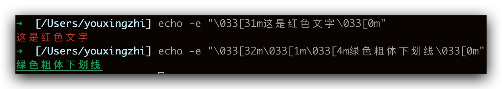
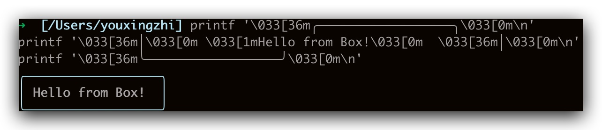
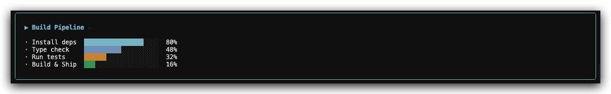
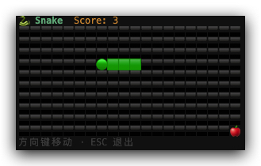
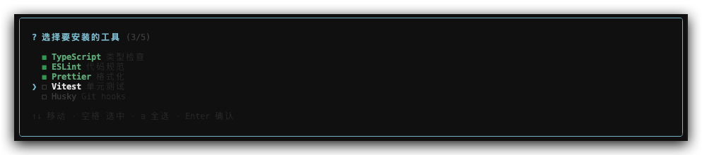

# 前言

用过 Claude Code 的同学应该都注意到，它的终端界面相当精致——输入框、加载动画、对话气泡，甚至还有颜色高亮和布局对齐。第一次看到的时候我就在想：这是怎么做到的？

翻了下 Claude Code 的技术栈，发现它用的是一个叫 **[Ink](https://github.com/vadimdemedes/ink)** 的库。Ink 的口号很简单：**React for CLIs**。没错，就是用写网页的那套 React 组件化思路，来构建命令行界面。

目前 Ink 在 GitHub 上有 **36.7k stars**，除了 Claude Code，Gemini CLI、GitHub Copilot CLI、Cloudflare Wrangler 都在用它。这篇文章就来看看 Ink 到底是什么，怎么用，以及它的核心原理是什么。

# 一、Ink 是什么

Ink 是一个 **自定义 React 渲染器（Custom Renderer）**，它把 React 的组件模型移植到了命令行环境中。

普通的 React 渲染到 DOM，React Native 渲染到原生控件，而 Ink 渲染到**终端的字符流**。你写的每一个 `<Box>`、`<Text>` 组件，最终都会被转换成 **ANSI 转义序列**输出到 stdout。

> 什么是 ANSI 转义序列？简单说，终端本身只认纯文本，但如果你在文本里插入一些以 `\x1b[`（等价写法 `\033[`）开头的特殊字符序列，终端就会把它们解释为"指令"而不是可见字符。所有你在终端里看到的颜色、粗体、光标移动，背后都是这套机制。

打开终端试试：

```bash
# 红色文字
echo -e '\033[31m这是红色文字\033[0m\n'

# 组合：绿色 + 粗体 + 下划线
echo -e '\033[32m\033[1m\033[4m绿色粗体下划线\033[0m\n'
```



| 序列        | 含义          |
| ----------- | ------------- |
| `\033[31m`  | 红色前景      |
| `\033[32m`  | 绿色前景      |
| `\033[1m`   | 粗体          |
| `\033[4m`   | 下划线        |
| `\033[0m`   | 重置所有样式  |
| `\033[{n}A` | 光标上移 n 行 |
| `\033[{n}C` | 光标右移 n 列 |

有了颜色和光标控制，就可以"画"出带边框的 Box 了。用纯 `printf` 模拟一下 Ink 的 `<Box borderStyle="round">` 效果：

```bash
printf '\033[36m╭──────────────────╮\033[0m\n'
printf '\033[36m│\033[0m \033[1mHello from Box!\033[0m  \033[36m│\033[0m\n'
printf '\033[36m╰──────────────────╯\033[0m\n'
```

终端输出：



这就是 Ink 在做的事情的最底层——算好每个字符的坐标，拼上 ANSI 颜色码和 Unicode 制表符（`╭╮╰╯│─`），输出到 stdout。区别在于 Ink 让你用 React 组件声明式地描述 UI，它来帮你生成这些字符。

# 二、快速上手

安装：

```bash
npm install ink react
```

先上效果——一个实时更新的 Build Pipeline 进度看板：



核心代码：

```tsx
const Pipeline = () => {
  const [tick, setTick] = useState(0)
  const [tasks, setTasks] = useState<Task[]>([...])

  useEffect(() => {
    const id = setInterval(() => {
      setTick(t => t + 1)
      setTasks(prev => prev.map((t, i) => ({
        ...t, progress: Math.min(100, t.progress + [5, 3, 2, 1][i]),
      })))
    }, 80)
    return () => clearInterval(id)
  }, [])

  return (
    <Box flexDirection="column" borderStyle="round" borderColor="cyan" paddingX={2} paddingY={1}>
      <Box marginBottom={1} gap={1}>
        <Text bold color="cyan">▶ Build Pipeline</Text>
        <Text color="gray">{done ? '✓ done' : SPINNERS[tick % 10]}</Text>
      </Box>
      {tasks.map(t => (
        <Box key={t.label} gap={1}>
          <Text>{t.progress === 100 ? '✓' : '·'} {t.label}</Text>
          <Bar value={t.progress} color={t.color} />
        </Box>
      ))}
    </Box>
  )
}
```

`useState`、`useEffect` 全部照用，`<Box>` 对标 `<div>`，Flexbox 布局直接搬过来，唯一的区别是渲染目标从浏览器 DOM 变成了终端字符流。

再来一个更好玩的——**终端贪吃蛇**：



```tsx
const Snake = () => {
  const {exit} = useApp()
  const dir = useRef<Pos>([1, 0])
  const [state, setState] = useState({
    snake: [[10, 5]] as Pos[],
    food: [15, 3] as Pos,
    score: 0,
    dead: false,
  })

  // 方向键控制，useRef 避免闭包陷阱，禁止直接掉头
  useInput((_, key) => {
    const [dx, dy] = dir.current
    if (key.upArrow && dy !== 1) dir.current = [0, -1]
    if (key.downArrow && dy !== -1) dir.current = [0, 1]
    if (key.leftArrow && dx !== 1) dir.current = [-1, 0]
    if (key.rightArrow && dx !== -1) dir.current = [1, 0]
  })

  // 每 150ms 推进一帧，setState(prev => ...) 保证读到最新状态
  useEffect(() => {
    if (state.dead) return
    const id = setInterval(() => {
      setState((prev) => {
        const [dx, dy] = dir.current
        const head: Pos = [prev.snake[0]![0] + dx, prev.snake[0]![1] + dy]
        // 撞墙或撞自己 → Game Over
        if (
          head[0] < 0 ||
          head[0] >= W ||
          head[1] < 0 ||
          head[1] >= H ||
          prev.snake.some((s) => eq(s, head))
        )
          return {...prev, dead: true}
        const ate = eq(head, prev.food)
        return {
          snake: [head, ...prev.snake.slice(0, ate ? prev.snake.length : -1)],
          food: ate ? randPos() : prev.food,
          score: prev.score + (ate ? 1 : 0),
          dead: false,
        }
      })
    }, 150)
    return () => clearInterval(id)
  }, [state.dead])

  // 渲染：遍历 20×10 网格，按坐标填 emoji
  const grid = Array.from({length: H}, (_, y) =>
    Array.from({length: W}, (_, x) => {
      if (eq(snake[0]!, [x, y])) return '🟢'
      if (snake.some((s) => eq(s, [x, y]))) return '🟩'
      if (eq(food, [x, y])) return '🍎'
      return '⬛'
    }).join(''),
  )

  return (
    <Box flexDirection='column'>
      <Box gap={2}>
        <Text bold color='green'>
          🐍 Snake
        </Text>
        <Text color='yellow'>Score: {state.score}</Text>
      </Box>
      {grid.map((row, i) => (
        <Text key={i}>{row}</Text>
      ))}
      {state.dead ? (
        <Text color='red' bold>
          Game Over!
        </Text>
      ) : (
        <Text color='gray'>方向键移动 · ESC 退出</Text>
      )}
    </Box>
  )
}
```

整个游戏的模式跟写 React 网页一模一样——`useInput` 处理输入，`setInterval` + `setState` 驱动帧更新，JSX 描述 UI。Ink 在底层把 emoji 网格转成 ANSI 字符串、原地刷新终端，上层代码完全不用管。

最后来个实用的——**多选交互**，Claude Code 里经常能看到这种：



```tsx
const OPTIONS = [
  {label: 'TypeScript', desc: '类型检查', value: 'ts'},
  {label: 'ESLint', desc: '代码规范', value: 'eslint'},
  // ...
]

const MultiSelect = () => {
  const [cursor, setCursor] = useState(0)
  const [selected, setSelected] = useState(new Set<string>())
  const [done, setDone] = useState(false)

  useInput((input, key) => {
    if (key.upArrow) setCursor((i) => (i - 1 + OPTIONS.length) % OPTIONS.length)
    if (key.downArrow) setCursor((i) => (i + 1) % OPTIONS.length)
    if (input === ' ') {
      /* toggle selected */
    }
    if (input === 'a') {
      /* 全选/全不选 */
    }
    if (key.return) setDone(true)
  })

  return (
    <Box
      flexDirection='column'
      borderStyle='round'
      borderColor='cyan'
      paddingX={2}
      paddingY={1}>
      <Text color='cyan' bold>
        ? 选择要安装的工具 ({selected.size}/{OPTIONS.length})
      </Text>
      {OPTIONS.map((opt, i) => (
        <Box key={opt.value} gap={1}>
          <Text color={i === cursor ? 'cyan' : 'gray'}>
            {i === cursor ? '❯' : ' '}
          </Text>
          <Text color={selected.has(opt.value) ? 'green' : 'gray'}>
            {selected.has(opt.value) ? '◼' : '◻'}
          </Text>
          <Text
            color={selected.has(opt.value) ? 'green' : undefined}
            bold={i === cursor || selected.has(opt.value)}>
            {opt.label}
          </Text>
          <Text dimColor>{opt.desc}</Text>
        </Box>
      ))}
      <Text color='gray' dimColor>
        ↑↓ 移动 · 空格 选中 · a 全选 · Enter 确认
      </Text>
    </Box>
  )
}
```

三个 `useState`：`cursor` 控制高亮行，`selected`（`Set`）存选中项，`done` 标记是否确认。渲染部分用 `<Box borderStyle="round">` 画圆角边框，每行根据状态切换 `❯` / 空格、`◼` / `◻`、高亮 / 暗色——跟写 React 网页的 checkbox 列表没什么区别。

怎么跟实际 CLI 脚本结合呢？关键是 `render()` 返回的 `waitUntilExit()`——它是一个 Promise，在组件调用 `exit()` 时 resolve。所以主流程长这样：

```typescript
let userChoices: string[] = []

async function main() {
  // 第一步：Ink 交互，收集用户选择
  const instance = render(<MultiSelect onDone={choices => { userChoices = choices }} />)
  await instance.waitUntilExit()

  // 第二步：Ink 已退出，终端恢复正常，执行实际逻辑
  console.log(`安装中: ${userChoices.join(', ')}...`)
  execSync(`npm install -D ${userChoices.join(' ')}`, {stdio: 'inherit'})
}

main()
```

先用 Ink 做交互收集输入，`exit()` 后 Promise resolve，接着就是普通的 Node.js 逻辑了。

# 三、核心 API

## 3.1 `<Text>` 组件

`<Text>` 是 Ink 中输出文本的唯一方式，支持颜色、样式等属性：

```tsx
import {render, Text} from 'ink'

const Demo = () => (
  <>
    <Text color='green'>绿色文字</Text>
    <Text color='#005cc5' bold>
      蓝色加粗
    </Text>
    <Text backgroundColor='white' color='black'>
      黑底白字
    </Text>
    <Text italic underline>
      斜体下划线
    </Text>
    <Text strikethrough>删除线</Text>
  </>
)

render(<Demo />)
```

颜色底层用的是 [chalk](https://github.com/chalk/chalk)，支持所有 chalk 格式：颜色名、hex、rgb 都可以。

> 注意：`<Text>` 内部只能嵌套文本节点或其他 `<Text>`，不能放 `<Box>`。

## 3.2 `<Box>` 与 Flexbox 布局

`<Box>` 是 Ink 的布局容器，对标 HTML 的 `<div>`。Ink 内置了 **[Yoga](https://github.com/facebook/yoga)** 这个 Flexbox 布局引擎（Facebook 开源，React Native 也在用），所以你可以直接用 CSS Flexbox 的思路写布局：

```tsx
import {render, Box, Text} from 'ink'

const Layout = () => (
  <Box flexDirection='row' gap={2}>
    <Box flexDirection='column' width={20}>
      <Text bold>左侧菜单</Text>
      <Text>- 选项一</Text>
      <Text>- 选项二</Text>
    </Box>
    <Box flexGrow={1} borderStyle='round' padding={1}>
      <Text>右侧内容区域</Text>
    </Box>
  </Box>
)

render(<Layout />)
```

常用的 Flexbox 属性（`flexDirection`、`flexGrow`、`alignItems`、`justifyContent`、`gap`、`padding`、`margin`、`width`、`height`）基本都支持。每个 `<Box>` 默认就是 `display: flex`。

## 3.3 常用 Hooks

**`useInput`** — 监听键盘输入：

```tsx
import {useInput, render, Text} from 'ink'
import {useState} from 'react'

const App = () => {
  const [key, setKey] = useState('')

  useInput((input, key) => {
    if (key.escape) process.exit()
    setKey(input)
  })

  return <Text>你按了：{key}（按 ESC 退出）</Text>
}

render(<App />)
```

**`useApp`** — 控制应用生命周期：

```tsx
import {useApp, render, Text} from 'ink'
import {useEffect} from 'react'

const App = () => {
  const {exit} = useApp()

  useEffect(() => {
    // 3 秒后自动退出
    setTimeout(exit, 3000)
  }, [])

  return <Text>3 秒后自动退出...</Text>
}

render(<App />)
```

其他常用 Hook 还有：`useStdin`、`useStdout`、`useWindowSize`（监听终端窗口大小变化）、`useFocus`（焦点管理）等。

# 四、它是怎么工作的

这部分是源码层面的分析，看看 Ink 的核心架构。整体流程分四步：

```
React 组件树
    ↓  (react-reconciler)
虚拟 DOM（ink-box / ink-text 节点）
    ↓  (Yoga 计算 Flexbox 布局)
带坐标的布局结果
    ↓  (render-to-string)
ANSI 字符串
    ↓
  stdout
```

## 4.1 自定义 React Reconciler

Ink 的核心是 `src/reconciler.ts`，它用 `react-reconciler` 包实现了一个自定义渲染器：

```typescript
import createReconciler from 'react-reconciler'
import Yoga from 'yoga-layout'
import {
  createNode,
  createTextNode,
  appendChildNode,
  // ...
} from './dom.js'

const reconciler = createReconciler({
  createInstance(type, props) {
    // 把 React 组件映射到 Ink 的虚拟 DOM 节点
    const node = createNode(type)
    // ...
    return node
  },
  appendChild(parentInstance, child) {
    appendChildNode(parentInstance, child)
  },
  // ...
})
```

`react-reconciler` 是 React 官方提供的底层包，React DOM 和 React Native 都是基于它实现的。你只需要实现一套"宿主环境"的 API（怎么创建节点、怎么插入节点、怎么更新属性等），React 的 diff 和调度逻辑就全部复用了。

## 4.2 虚拟 DOM

Ink 有自己的一套虚拟 DOM，定义在 `src/dom.ts`：

```typescript
export type ElementNames =
  | 'ink-root'
  | 'ink-box'
  | 'ink-text'
  | 'ink-virtual-text'

export type DOMElement = {
  nodeName: ElementNames
  attributes: Record<string, DOMNodeAttribute>
  childNodes: DOMNode[]
  yogaNode?: YogaNode // 对应 Yoga 布局节点
  style: Styles
  // ...
}
```

你写的 `<Box>` 对应 `ink-box` 节点，`<Text>` 对应 `ink-text` 节点。每个节点都挂了一个 **Yoga 节点**（`yogaNode`），这是 Flexbox 布局计算的基础。

## 4.3 Yoga 布局计算

Yoga 是 Facebook 开源的跨平台 Flexbox 实现，React Native 也用它。Ink 把每个 DOM 节点的 `flexDirection`、`padding`、`width` 等属性同步给对应的 Yoga 节点，然后调用 Yoga 的 `calculateLayout()` 来计算出每个节点的精确位置和尺寸。

这就是为什么你能在终端里用 CSS Flexbox 布局——本质上 Yoga 给你做了完整的盒模型计算。

## 4.4 渲染成字符串

布局算好之后，`src/renderer.ts` 把虚拟 DOM 树渲染成字符串：

```typescript
const renderer = (node: DOMElement): Result => {
  const output = new Output({
    width: node.yogaNode.getComputedWidth(),
    height: node.yogaNode.getComputedHeight(),
  })

  renderNodeToOutput(node, output, {skipStaticElements: true})

  const {output: generatedOutput, height: outputHeight} = output.get()
  return {output: generatedOutput, outputHeight, staticOutput}
}
```

`Output` 是一个二维字符缓冲区，每个位置存一个字符（加上 ANSI 样式信息）。`renderNodeToOutput` 递归遍历节点树，根据 Yoga 计算好的坐标把每个节点的内容"画"到缓冲区里，最后一次性 flush 到终端。

比如你写 `<Text color="red" bold>Error</Text>`，最终输出到 stdout 的其实是：

```
\x1b[1m\x1b[31mError\x1b[39m\x1b[22m
```

拆开看：`\x1b[1m`（开启粗体）→ `\x1b[31m`（红色前景）→ `Error`（可见文字）→ `\x1b[39m`（重置前景色）→ `\x1b[22m`（关闭粗体）。终端收到这串字符后，就会渲染出红色加粗的 "Error"。Ink 底层用 [chalk](https://github.com/chalk/chalk) 来生成这些序列，开发者不需要手写。

再看一个带坐标和边框的例子。你写：

```tsx
<Box borderStyle='round' borderColor='cyan' width={12}>
  <Text color='green'>Hi Ink</Text>
</Box>
```

Yoga 算出：Box 在第 0 行第 0 列，宽 12 高 3；文本 "Hi Ink" 在第 1 行第 1 列（边框内 padding）。Ink 把它们"画"到二维缓冲区后，输出的 ANSI 序列大致是：

```
\x1b[36m╭──────────╮\x1b[39m\n
\x1b[36m│\x1b[39m \x1b[32mHi Ink\x1b[39m   \x1b[36m│\x1b[39m\n
\x1b[36m╰──────────╯\x1b[39m
```

翻译成人话：

```
第 0 行: [青色]╭──────────╮[重置]
第 1 行: [青色]│[重置] [绿色]Hi Ink[重置]   [青色]│[重置]
第 2 行: [青色]╰──────────╯[重置]
```

每个字符的位置都由 Yoga 布局精确决定，颜色由 chalk 生成 ANSI 码包裹——这就是从 React 组件到终端像素的完整链路。

## 4.5 终端输出与更新

有了 ANSI 字符串，还需要解决一个问题：怎么"原地刷新"？普通的 `console.log` 只会不断往下追加，但 Ink 需要像浏览器一样在同一块区域反复重绘。

做法是利用 ANSI 的光标控制序列：每次重渲染时，先用 `\x1b[{N}A`（光标上移 N 行）+ `\x1b[J`（清除光标以下内容）抹掉上一帧，再输出新内容。这就是 `log-update` 的核心思路，Ink 在此基础上封装了自己的实现。

主类 `src/ink.tsx` 负责把以上所有环节串起来，同时处理：

- 终端窗口大小变化（重新计算布局）
- CI 环境检测（`is-in-ci`，CI 里不刷新直接输出）
- 信号处理（`signal-exit`，优雅退出时恢复光标）
- 无障碍支持（screen reader 输出）

# 五、总结

Ink 做的事情本质上是：**把 React 的组件模型接到终端这个"宿主环境"上**。技术上，它实现了一个自定义 React Reconciler，把 React 组件树翻译成内部虚拟 DOM，再用 Yoga 做 Flexbox 布局计算，最终渲染成 ANSI 字符串输出到终端。

它适合什么场景？

- 交互式 CLI 工具（带输入、菜单、进度条）
- 需要复杂布局的终端 UI（多列、嵌套）
- 团队已经熟悉 React，希望复用同一套思维模型

和传统 CLI 库（chalk + inquirer）相比，Ink 的优势是**组件化和状态管理**——UI 逻辑和状态都在组件里，复杂界面拆成小组件，比一堆命令式代码好维护得多。代价是有一定的学习曲线，以及 Node.js 里跑 React 的额外开销。

如果你要写一个功能简单的 CLI，chalk + inquirer 够用。但如果你在做 Claude Code 这种复杂的交互式工具，Ink 几乎是目前最好的选择。
