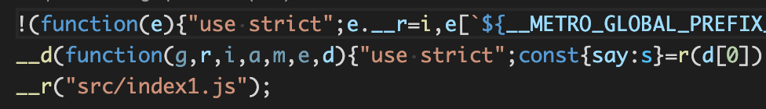

# 引言

React Native 应用默认会将我们的 JS 代码打包成一个文件，当我们的 React Native 应用变得很庞大了以后，一次性下载所有 JS 代码往往耗时很长，这时我们可能会想到可以通过按需加载来进行优化。而按需加载的首要任务就是对代码进行拆分，本文会一步步揭示 React Native 拆包的秘密。

# Metro 介绍

因为 React Native 使用 Metro 来进行打包，所以我们得先来了解一下它，研究一个打包器最好的方式就是先看看它的构建产物。

## 构建产物分析

假设我们有如下代码：

```javascript
// index.js
const {say} = require('./utils')

say('就是开不了口让她知道')

// utils.js
exports.say = (word) => console.log(word)
```

我们使用 Metro 对其进行打包（需要安装 metro 和 metro-core）：

```js
metro build index.js --out bundle.js -z false
```

其中 `-z` 表示是否对代码进行 minify，为了方便查看，我们选择 `false`。

打包后的文件如下所示（省略掉了前面的代码）：

```js
...
__d(
  function (
    global,
    _$$_REQUIRE,
    _$$_IMPORT_DEFAULT,
    _$$_IMPORT_ALL,
    module,
    exports,
    _dependencyMap
  ) {
    'use strict'

    const {say} = _$$_REQUIRE(_dependencyMap[0])

    say('就是开不了口让她知道')
  },
  0,
  [1]
)
__d(
  function (
    global,
    _$$_REQUIRE,
    _$$_IMPORT_DEFAULT,
    _$$_IMPORT_ALL,
    module,
    exports,
    _dependencyMap
  ) {
    'use strict'

    exports.say = (word) => console.log(word)
  },
  1,
  []
)
__r(0)
```

### \_\_d

`__d` 是 define 的意思，即定义一个模块：

```js
;(function (global) {
  'use strict'

  global[`${__METRO_GLOBAL_PREFIX__}__d`] = define

  var modules = clear()
  function clear() {
    modules = Object.create(null)
    return modules
  }

  function define(factory, moduleId, dependencyMap) {
    if (modules[moduleId] != null) {
      return
    }

    const mod = {
      dependencyMap,
      factory,
      hasError: false,
      importedAll: EMPTY,
      importedDefault: EMPTY,
      isInitialized: false,
      publicModule: {
        exports: {},
      },
    }
    modules[moduleId] = mod
  }
  //...
})(
  typeof globalThis !== 'undefined'
    ? globalThis
    : typeof global !== 'undefined'
    ? global
    : typeof window !== 'undefined'
    ? window
    : this
)
```

`define` 函数接受 3 个参数，`factory` 是模块的工厂方法，`moduleId` 是模块的 id，`dependencyMap` 是模块的依赖列表，里面存储的是所依赖的其他模块的 id，这个函数很简单，生成了一个 `mod`，然后保存到了 modules 中而已。

### \_\_r

`__r` 有点复杂，不过我们顺藤摸瓜，最后会来到这个函数：

```js
function loadModuleImplementation(moduleId, module) {
  ...
  module.isInitialized = true
  const {factory, dependencyMap} = module

  try {
    const moduleObject = module.publicModule
    moduleObject.id = moduleId
    factory(
      global,
      metroRequire,
      metroImportDefault,
      metroImportAll,
      moduleObject,
      moduleObject.exports,
      dependencyMap
    )
    {
      module.factory = undefined
      module.dependencyMap = undefined
    }
    return moduleObject.exports
  } catch (e) {
    //...
  } finally {
  }
}
```

该函数通过模块 id 从 `modules` 中获取到该模块，然后执行模块的工厂方法，方法里面会对传进去的 `exports` 对象进行一些修改（比如下面这个模块在 `exports` 上面添加了字段 `say`）。

```js
__d(
  function (
    global,
    _$$_REQUIRE,
    _$$_IMPORT_DEFAULT,
    _$$_IMPORT_ALL,
    module,
    exports,
    _dependencyMap
  ) {
    'use strict'

    exports.say = (word) => console.log(word)
  },
  1,
  []
)
```

`loadModuleImplementation` 最后会返回修改后的 `exports` 对象。

回到上面的例子，我们现在其实可以手动对其进行拆包了，方法很简单，将打包的产物分成两个文件即可：

```js
// utils.bundle.js
...
__d(
  function (
    global,
    _$$_REQUIRE,
    _$$_IMPORT_DEFAULT,
    _$$_IMPORT_ALL,
    module,
    exports,
    _dependencyMap
  ) {
    'use strict'

    const {say} = _$$_REQUIRE(_dependencyMap[0])

    say('就是开不了口让她知道')
  },
  0,
  [1]
)
// index.bundle.js
__d(
  function (
    global,
    _$$_REQUIRE,
    _$$_IMPORT_DEFAULT,
    _$$_IMPORT_ALL,
    module,
    exports,
    _dependencyMap
  ) {
    'use strict'

    exports.say = (word) => console.log(word)
  },
  1,
  []
)
__r(0)
```

使用时，我们只需要保证先加载 `utils.bundle.js`，再加载 `index.bundle.js` 即可。那么如何自动的实现呢？我们先要了解一下 Metro 打包的一些配置才行。

## 配置文件

关于 Metro 的配置文件有如下这些：

```js
module.exports = {
  /* general options */

  resolver: {
    /* resolver options */
  },
  transformer: {
    /* transformer options */
  },
  serializer: {
    /* serializer options */
  },
  server: {
    /* server options */
  },
}
```

但是这里我们只需要了解 `serializer` 即可，即构建产物输出相关的配置，`serializer` 下的配置我们也仅需要了解 `createModuleIdFactory` 和 `processModuleFilter`。

### createModuleIdFactory

该配置用于生成模块的 id，比如当配置成如下所示时：

```js
module.exports = {
  serializer: {
    createModuleIdFactory() {
      return (path) => {
        return path
      }
    },
  },
}
```

打包出的模块将会以文件路径作为模块 id：

```js
...
__d(function (global, _$$_REQUIRE, _$$_IMPORT_DEFAULT, _$$_IMPORT_ALL, module, exports, _dependencyMap) {
  "use strict";

  const {
    say
  } = _$$_REQUIRE(_dependencyMap[0]);

  say('就是开不了口让她知道');
},"/demo1/src/index.js",["/demo1/src/utils.js"]);
__d(function (global, _$$_REQUIRE, _$$_IMPORT_DEFAULT, _$$_IMPORT_ALL, module, exports, _dependencyMap) {
  "use strict";

  exports.say = word => console.log(word);
},"/demo1/src/utils.js",[]);
__r("/demo1/src/index.js");
```

### processModuleFilter

该配置用于过滤掉模块的输出，还是用一个例子来说明：

```js
// index.js
require('./unused.js')
const {say} = require('./utils')

say('就是开不了口让她知道')

// metro.config.js
module.exports = {
  serializer: {
    processModuleFilter: function (module) {
      return module.path.indexOf('unused') === -1
    },
  },
}
```

基于上面这个配置打包，会把 `unused.js` 模块从构建产物中去掉。

# 拆包实战

基于上面的知识，我们终于可以开始进行拆包实战了。我们还是用一个例子来说明：

```js
// utils.js
exports.say = (word) => console.log(word)

// index1.js
const {say} = require('./utils')

say('就是开不了口让她知道')

// index2.js
const {say} = require('./utils')

say('窗外的麻雀，在电线杆上多嘴')
```

可以看到 `index1.js` 和 `index2.js` 两个文件中都使用到了 `utils.js`，我们的目的是将它单独提取出来打成一个叫做 `base.js` 的包，`index1.js` 和 `index2.js` 分别打包成 `bundle1.js` 和 `bundle2.js`。加载时先加载 `base.js`，然后加载 `bundle1.js` 和 `bundle2.js`。

我们首先来打包 `base.js`，其打包配置如下：

```js
const fs = require('fs')
module.exports = {
  serializer: {
    createModuleIdFactory: function () {
      const moduleMap = {}
      const projectRootPath = __dirname
      const moduleFile = 'modules.txt'

      if (fs.existsSync(moduleFile)) {
        fs.unlinkSync(moduleFile)
      }

      return function (path) {
        const modulePath = path.substr(projectRootPath.length + 1)

        if (!moduleMap[modulePath]) {
          moduleMap[modulePath] = true
          fs.appendFileSync(moduleFile, `${modulePath}\n`)
        }
        return modulePath
      }
    },
  },
}
```

该配置的含义是用模块在项目中的相对路径作为模块 id，并将已打包过的模块 id 记录到 `modules.txt` 中，`base.js` 打包完成后，该文件内容为：

```
src/utils.js
```

接下来打包 `bundle1.js`，其打包配置为：

```js
const fs = require('fs')

const moduleFile = 'modules.txt'
const existModuleMap = {}

fs.readFileSync(moduleFile, 'utf8')
  .toString()
  .split('\n')
  .forEach((path) => {
    existModuleMap[path] = true
  })

function getParsedModulePath(path) {
  const projectRootPath = __dirname
  return path.substr(projectRootPath.length + 1)
}

module.exports = {
  serializer: {
    createModuleIdFactory: function () {
      const currentModuleMap = {}

      return function (path) {
        const modulePath = getParsedModulePath(path)
        if (!(existModuleMap[modulePath] || currentModuleMap[modulePath])) {
          currentModuleMap[modulePath] = true
          fs.appendFileSync(moduleFile, `${modulePath}\n`)
        }
        return modulePath
      }
    },
    processModuleFilter: function (modules) {
      const modulePath = getParsedModulePath(modules.path)
      if (existModuleMap[modulePath]) {
        return false
      }
      return true
    },
  },
}
```

该配置的含义是用模块在项目中的相对路径作为模块 id，并过滤掉 `modules.txt` 已存在的模块。`bundle1.js` 打包结果如下所示：



其中第一行是模块系统的一些初始化代码，这些代码在 `base.js` 已经存在了，所以这里需要删掉这一行，可以使用 `line-replace` 这个包来实现：

```js
// package.json
{
  ...
  "scripts": {
    "build:bundle1": "metro build src/index1.js --out bundle1.js -z true -c metro.bundle.js",
    "postbuild:bundle1": "node removeFirstLine.js ./bundle1.js",
  },
  "devDependencies": {
    "line-replace": "^2.0.1",
  }
}

// removeFirstLine.js
const lineReplace = require('line-replace')

lineReplace({
  file: process.argv[2],
  line: 1,
  text: '',
  addNewLine: false,
  callback: ({file, line, text, replacedText, error}) => {
    if (!error) {
      console.log(`Removed ${replacedText}`)
    } else {
      console.error(error)
    }
  },
})
```

到这，`bundle1.js` 的打包就完成了，同样的可以按照这个方式打包 `bundle2.js`。

最后，验证一下打包出来的产物是否能够正常运行：

```html
<!DOCTYPE html>
<html lang="en">
  <body>
    <script src="./base.js"></script>
    <script src="./bundle1.js"></script>
    <script src="./bundle2.js"></script>
  </body>
</html>
```


# 结语

React Native 拆包听起来是个很高端的概念，但是实操一下发现还是很简单的。不过，这只是第一步，接下来我们需要修改 Native 的代码来真正实现我们前面所说的按需加载，答案在下一篇文章揭晓。
