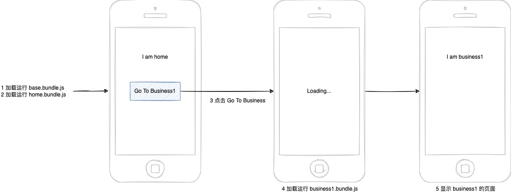
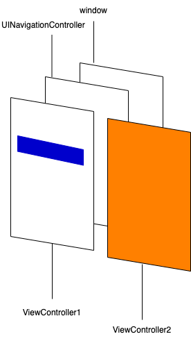

# 前言

[上一篇文章](/2021/12/24/react-native-split-1/)介绍了如何对 React Native 项目的 JS 文件进行拆包，这次我们仍然用一个例子来演示如何按需加载拆包后的各文件。

# 目标

如下图所示，最终想实现如下效果：

1. 进入应用时，先加载运行 `base.bundle.js`（包含 `react` 及 `react-native` 等基础库），然后加载运行 `home.bundle.js`，此时页面显示 home 相关的内容。
2. 点击 home 页面上的 `Go To Business1` 跳转到 business1 页面，此时会加载运行 `business1.bundle.js`，然后显示 business1 页面。



# 前置知识

## Objective—C 语法简单介绍

Objective—C（以下简称 OC）是一门强类型语言，需要声明变量的类型：

```objc
NSSttring * appDelegateClassName;
```

OC 中函数调用非常奇怪，是用 `[]` 包起来的：

```objc
self.view.backgroundColor = [UIColor whiteColor];
```

OC 中也支持函数作为参数：

```objc
[Helper loadBundleWithURL:bundleUrl onComplete:^{
  [Helper runApplicationOnView:view];
}]
```

OC 中也有类的概念：

```objc
// 类声明文件 ViewController.h（继承自 UIViewController）
@interface ViewController : UIViewController
 ...
@end

// 类实现文件 ViewController.m
@implementation ViewController
- (void)viewDidLoad {

}
@end
```

更多知识请自行补充。

## iOS 开发简单介绍

### UIView

`UIView` 是最基础的视图类，管理屏幕上一定的内容展示，作为各种视图类型的父类，提供一些基础的能力，如外观、事件等，它可以布局和管理子视图。下面这个例子实现了在当前页面上新增了一个黄色的子视图：

```objc
@implementation ViewController
- (void)viewDidLoad {
  [super viewDidLoad];
  self.view.backgroundColor = [UIColor redColor];
  // subview
  UIView *view = [[UIView alloc] init];
  view.frame = CGRectMake(50, 50, 100, 50);
  view.backgroundColor = [UIColor yellowColor];
  [self.view addSubview:view];
}
@end
```


### UIViewController

`UIViewController` 是视图控制器，用于管理视图的层级结构，它自身默认包含一个视图。他可以管理视图的生命周期，视图之间的切换等，且 `UIViewController` 又可以管理别的 `UIViewController`。这里有个[例子](https://github1s.com/ParadeTo/for-money/blob/master/react-native/simple/simple/AppDelegate.m)通过 `UINavigationController` 实现了两个 `UIViewController` 之间的切换：



## React Native 页面加载流程介绍

我们通过以下命令新建一个 RN 项目：

```bash
npx react-native init demo
```

我们先来看看入口文件 `index.js`：

```js
import {AppRegistry} from 'react-native'
import App from './App'
import {name as appName} from './app.json'

AppRegistry.registerComponent(appName, () => App)
```

显然，需要了解 `AppRegistry.registerComponent` 是做了什么，我们来看看：

```js
/**
   * Registers an app's root component.
   *
   * See https://reactnative.dev/docs/appregistry.html#registercomponent
   */
  registerComponent(
    appKey: string,
    componentProvider: ComponentProvider,
    section?: boolean,
  ): string {
    let scopedPerformanceLogger = createPerformanceLogger();
    runnables[appKey] = {
      componentProvider,
      run: (appParameters, displayMode) => {
        renderApplication(
          componentProviderInstrumentationHook(
            componentProvider,
            scopedPerformanceLogger,
          ),
          appParameters.initialProps,
          appParameters.rootTag,
          wrapperComponentProvider && wrapperComponentProvider(appParameters),
          appParameters.fabric,
          showArchitectureIndicator,
          scopedPerformanceLogger,
          appKey === 'LogBox',
          appKey,
          coerceDisplayMode(displayMode),
          appParameters.concurrentRoot,
        );
      },
    };
    if (section) {
      sections[appKey] = runnables[appKey];
    }
    return appKey;
  },
```
