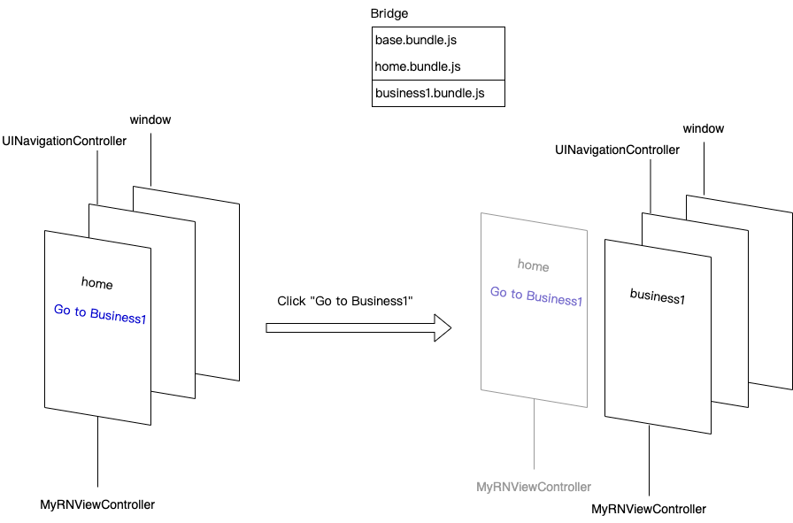

# 前言

[上一篇文章](/2021/12/24/react-native-split-1/)介绍了如何对 React Native 项目的 JS 文件进行拆包，这次我们仍然用一个例子来演示如何按需加载拆包后的各文件。

# 目标


如上图所示，最终想实现如下效果：

1. 利用[上一篇文章](/2021/12/24/react-native-split-1/)的方法，把 React Native 应用打包成三个 `bundle`:

其中 _base.bundle.js_ 仅包括基础库:

```js
import 'react'
import 'react-native'
```

_home.bundle.js_ 包括的内容如下：

```js
// 打包入口文件 index.js
import {AppRegistry} from 'react-native'
import Home from './App'

AppRegistry.registerComponent('home', () => Home)

// App.js
import React, {useEffect} from 'react'
import {View, Text, Button, StyleSheet, NativeModules} from 'react-native'

const Home = () => {
  return (
    <View>
      <View>
        <Text>Home</Text>
      </View>
      <View>
        <Button
          title='Go To Business1'
          onPress={() => {
            NativeModules.Navigator.push('business1')
          }}
        />
      </View>
    </View>
  )
}

export default Home
```

注意，这里我们实现了一个 Native Module `Navigator`，后面会介绍。

_business1.bundle.js_ 包括的内容如下：

```js
// 打包入口文件 index.js
import {AppRegistry} from 'react-native'
import Business1 from './App'

AppRegistry.registerComponent('business1', () => Business1)

// App.js
import React, {useEffect} from 'react'
import {View, Text, StyleSheet, Alert} from 'react-native'

const Business1 = () => {
  useEffect(() => {
    Alert.alert(global.name)
  }, [])
  return (
    <View>
      <Text>Business1</Text>
    </View>
  )
}
export default Business1
```

2. 进入应用时，先加载运行 `base.bundle.js`（包含 `react` 及 `react-native` 等基础库），然后加载运行 `home.bundle.js`，此时页面显示 home 相关的内容。
3. 点击 home 页面上的 `Go To Business1` 跳转到 business1 页面，此时会加载运行 `business1.bundle.js`，然后显示 business1 页面。

# 前置知识

## Objective—C 语法简单介绍

Objective—C（以下简称 OC）是一门强类型语言，需要声明变量的类型：

```objc
NSSttring * appDelegateClassName;
```

OC 中函数调用非常奇怪，是用 `[]` 包起来的：

```objc
self.view.backgroundColor = [UIColor whiteColor];
```

OC 中也支持函数作为参数：

```objc
[Helper loadBundleWithURL:bundleUrl onComplete:^{
  [Helper runApplicationOnView:view];
}]
```

OC 中也有类的概念：

```objc
// 类声明文件 ViewController.h（继承自 UIViewController）
@interface ViewController : UIViewController
 ...
@end

// 类实现文件 ViewController.m
@implementation ViewController
- (void)viewDidLoad {

}
@end
```

更多知识请自行补充。

## iOS 开发简单介绍

### UIView

`UIView` 是最基础的视图类，管理屏幕上一定的内容展示，作为各种视图类型的父类，提供一些基础的能力，如外观、事件等，它可以布局和管理子视图。下面这个例子实现了在当前页面上新增了一个黄色的子视图：

```objc
@implementation ViewController
- (void)viewDidLoad {
  [super viewDidLoad];
  self.view.backgroundColor = [UIColor redColor];
  // subview
  UIView *view = [[UIView alloc] init];
  view.frame = CGRectMake(50, 50, 100, 50);
  view.backgroundColor = [UIColor yellowColor];
  [self.view addSubview:view];
}
@end
```


### UIViewController

`UIViewController` 是视图控制器，用于管理视图的层级结构，它自身默认包含一个视图。他可以管理视图的生命周期，视图之间的切换等，且 `UIViewController` 又可以管理别的 `UIViewController`。这里有个[例子](https://github1s.com/ParadeTo/for-money/blob/master/react-native/simple/simple/AppDelegate.m)通过 `UINavigationController` 实现了两个 `UIViewController` 之间的切换：


## React Native 页面加载流程介绍

首先，我们通过以下命令新建一个 RN 项目：

```bash
npx react-native init demo
```

我们先来看看入口文件 `index.js`：

```js
import {AppRegistry} from 'react-native'
import App from './App'
import {name as appName} from './app.json'

AppRegistry.registerComponent(appName, () => App)
```

显然，需要了解 `AppRegistry.registerComponent` 是做了什么，我们来看看：

```js
/**
   * Registers an app's root component.
   *
   * See https://reactnative.dev/docs/appregistry.html#registercomponent
   */
  registerComponent(
    appKey: string,
    componentProvider: ComponentProvider,
    section?: boolean,
  ): string {
    let scopedPerformanceLogger = createPerformanceLogger();
    runnables[appKey] = {
      componentProvider,
      run: (appParameters, displayMode) => {
        renderApplication(
          componentProviderInstrumentationHook(
            componentProvider,
            scopedPerformanceLogger,
          ),
          appParameters.initialProps,
          appParameters.rootTag,
          wrapperComponentProvider && wrapperComponentProvider(appParameters),
          appParameters.fabric,
          showArchitectureIndicator,
          scopedPerformanceLogger,
          appKey === 'LogBox',
          appKey,
          coerceDisplayMode(displayMode),
          appParameters.concurrentRoot,
        );
      },
    };
    if (section) {
      sections[appKey] = runnables[appKey];
    }
    return appKey;
  },
```

从上面的代码来看，它只是将组件存放在了 `runnables` 中，并没有真正的渲染。那什么时候渲染呢？这就需要看看 native 的代码了，我们打开 `ios` 目录下的 `AppDelegate.m` 文件，可以看到：

```objc
- (BOOL)application:(UIApplication *)application didFinishLaunchingWithOptions:(NSDictionary *)launchOptions
{
  ...
  RCTBridge *bridge = [[RCTBridge alloc] initWithDelegate:self launchOptions:launchOptions];
  RCTRootView *rootView = [[RCTRootView alloc] initWithBridge:bridge
                                                   moduleName:@"rnDemo"
                                            initialProperties:nil];
  ...
}
```

第一行代码会进行 `bridge` 的初始化等工作，然后会异步加载 JS 文件并执行。也就是会执行 `AppRegistry.registerComponent`。

第二行代码会准备一个视图容器用于渲染，并会监听 JS 文件加载。当加载成功时，会调用 JS 代码中的 `AppRegistry.runApplication`：

```objc
- (void)runApplication:(RCTBridge *)bridge
{
  NSString *moduleName = _moduleName ?: @"";
  NSDictionary *appParameters = @{
    @"rootTag" : _contentView.reactTag,
    @"initialProps" : _appProperties ?: @{},
  };

  RCTLogInfo(@"Running application %@ (%@)", moduleName, appParameters);
  // 调用 JS 代码中的方法
  [bridge enqueueJSCall:@"AppRegistry" method:@"runApplication" args:@[ moduleName, appParameters ] completion:NULL];
}
```

而 JS 代码中的 `AppRegistry.runApplication` 会执行 `runnables` 中相应的 `run` 方法最终进行页面的渲染：

```js
runApplication(
    appKey: string,
    appParameters: any,
    displayMode?: number,
  ): void {
    ...
    runnables[appKey].run(appParameters, displayMode);
  },
```

# 实现

介绍了这么多准备知识以后，我们终于要开始实现我们的按需加载了，首先介绍一下整体方案。

## 方案设计


如图所示，在应用启动的时候我们会初始化一个 `MyRNViewController` 并通过 `UINavigationContoller` 来管理。当 `MyRNViewController` 中的试图加载完成后，会通过 `Bridge` 加载并执行 `base.bundle.js` 和 `home.bundle.js`，成功后会执行 `runApplication` 方法渲染页面。

当点击 `Go To Business1` 按钮时，会使用 `UINavigationContoller` 推入一个新的 `MyRNViewController`，当 `MyRNViewController` 中的试图加载完成后，会使用相同的 `Bridge` 加载执行 `business1.bundle.js`，成功后会执行 `runApplication` 方法渲染页面。

接下来详细介绍一下。

## AppDelegate.m 的改造

如上文所说，应用启动的时候会初始化一个 `MyRNViewController` 并通过 `UINavigationContoller`，这一步在 `AppDelegate.m` 的 `application` 方法中来实现：

```objc
- (BOOL)application:(UIApplication *)application didFinishLaunchingWithOptions:(NSDictionary *)launchOptions
{
  ...
  self.window = [[UIWindow alloc] initWithFrame:[UIScreen mainScreen].bounds];
  MyRNViewController *vc =  [[MyRNViewController alloc] initWithModuleName:@"home"];
  self.window.rootViewController = [[UINavigationController alloc] initWithRootViewController:vc];
  [self.window makeKeyAndVisible];
  return YES;
}
```

## MyRNViewController

```objc
// MyRNViewController 初始化后会自动调用
- (void)loadView {
  RCTRootView *rootView = [Helper createRootViewWithModuleName:_moduleName
                                                    initialProperties:@{}];
  self.view = rootView;
}
```

`MyRNViewController` 初始化的时候会自动调用 `loadView` 这个方法，该方法创建了一个 `RCTRootView` 并作为该 `ViewController` 的默认视图：

```objc
+ (RCTRootView *) createRootViewWithModuleName:(NSString *)moduleName initialProperties:(NSDictionary *)initialProperties {
  // _sharedBridge 全局共享的 RCTBridge
  // 如果还未初始化则初始化
  if (!_sharedBridge) {
    [self createBridgeWithURL:[NSURL URLWithString:baseUrl]];
  }

  RCTRootView *rootView = [[RCTRootView alloc] initWithBridge:_sharedBridge
                                                   moduleName: moduleName
                                            initialProperties: initialProperties];
  return rootView;
}

```

`MyRNViewController` 的默认视图加载完成后会执行 `viewDidLoad` 方法：

```objc
// MyRNViewController 中的试图加载完成后
- (void)viewDidLoad {
  NSString *randStr = [Helper randomStr:2];
  NSURL *moduleUrl = [NSURL URLWithString:[NSString stringWithFormat:@"http://127.0.0.1:8080/%@.bundle.js?v=%@", _moduleName, randStr]];
  [Helper loadBundle:moduleUrl runAppOnView:self.view];
}
```

该方法中会去加载执行对应的 `bundle` 并在当前 `view` 上执行 `runApplication` 方法：

```objc
+ (void) loadBundle:(NSString *)bundleUrl runAppOnView:(RCTRootView*)view {
  // 确保 base bundle 只加载一次
  if (needLoadBaseBundle) {
    [Helper loadBundleWithURL:[NSURL URLWithString:baseUrl] onComplete:^{
      needLoadBaseBundle = false;
      [Helper loadBundleWithURL:bundleUrl onComplete:^{
        [Helper runApplicationOnView:view];
      }];
    }];
  } else {
    [Helper loadBundleWithURL:bundleUrl onComplete:^{
      [Helper runApplicationOnView:view];
    }];
  }
}

+ (void) loadBundleWithURL:(NSURL *)bundleURL onComplete:(dispatch_block_t)onComplete {
  [_sharedBridge loadAndExecuteSplitBundleURL2:bundleURL onError:^(void){} onComplete:^{
    NSLog([NSString stringWithFormat: @"%@", bundleURL]);
    onComplete();
  }];
}

+ (void) runApplicationOnView:(RCTRootView *)view {
  [view runApplication:_sharedBridge];
}
```

这里 `loadAndExecuteSplitBundleURL2` 是在 `react-native` 源码中新加的方法，同时还把 `(void)runApplication:(RCTBridge *)bridge;` 声明为了公共方法，供外部使用。详情见[这里](https://github.com/ParadeTo/react-native/commit/3701a3484f3adfb68e5bd9163eb4d8eef3e2bb6b)。

## 按需加载

当我们点击 `Go To Business1` 按钮的时候会触发按需加载，这个又是如何实现的呢？我们来看看 home 页面的代码：

```js
import {View, Text, Button, StyleSheet, NativeModules} from 'react-native';
...
<Button
  title='Go To Business1'
  onPress={() => {
    NativeModules.Navigator.push('business1')
  }}
/>
...
```

这里我们其实是实现了一个 Native Module `Navigator`：

```objc
// Navigator.h
#import <Foundation/Foundation.h>
#import <React/RCTBridgeModule.h>

@interface Navigator : NSObject <RCTBridgeModule>

@end
// Navigator.m
#import <UIKit/UIKit.h>

#import "Navigator.h"
#import "Helper.h"
#import "MyRNViewController.h"

@implementation Navigator

RCT_EXPORT_MODULE(Navigator);

/**
 * We are doing navigation operations, so make sure they are all on the UI Thread.
 * Or you can wrap specific methods that require the main queue like this:
 */
- (dispatch_queue_t)methodQueue
{
  return dispatch_get_main_queue();
}

RCT_EXPORT_METHOD(push:(NSString *)moduleName) {
  MyRNViewController *newVc = [[MyRNViewController alloc] initWithModuleName:moduleName];
  [[Helper getNavigationController] showViewController:newVc sender:self];
}

@end
```

当调用 `push` 方法时，会向 `UINavigationContoller` 中新推入一个 `MyRNViewController`，之后的逻辑就跟上面说过的类似了。

# 总结

基于[上一篇文章](/2021/12/24/react-native-split-1/)的研究成果，本文对一个实际的 React Native 例子进行了拆包。然后通过改写 native 端的代码，实现了对不同业务包的按需加载。项目完整代码[在此](https://github.com/ParadeTo/for-money/tree/master/react-native/split)。

不过，当前只是简单实现，演示过程而已，实际上还有很多优化可以做：

- 当前加载过的 bundle 并没有缓存起来，每次都会重新去下载。加上缓存后，还可以做差量更新的优化，即每次发布最新的 bundle 时，计算其与之前版本的差异，客户端加载 bundle 时仅需要在旧 bundle 上应用差异的部分。
- 所有 bundle 运行在同一个上下文之中，存在全局变量污染、某个 bundle 运行 crash 会导致所有业务奔溃等问题。
