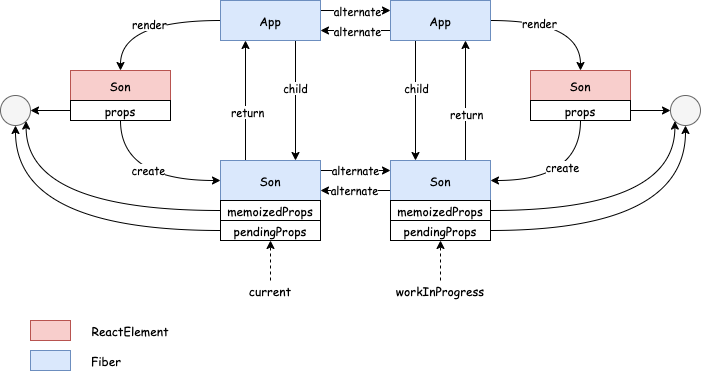
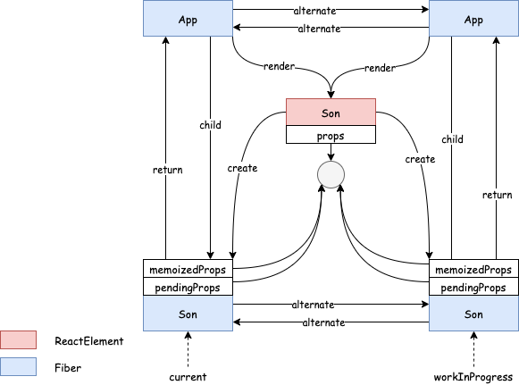
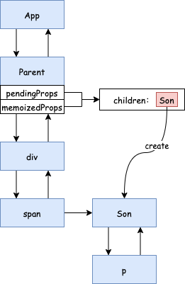
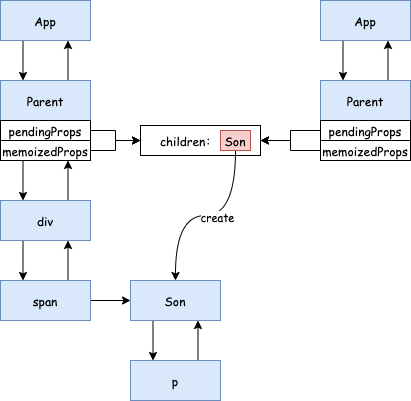
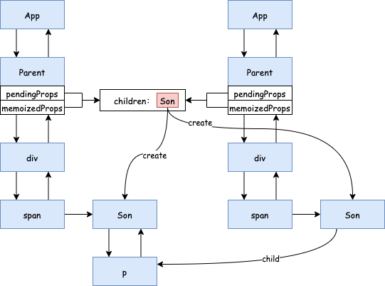

# 引言
在[React 源码解读之首次渲染流程](/2020/07/26/react-first-render/)中我们讲到了 React 在首次渲染过程（其实更新过程也一样）中存在 `Render` 和 `Commit` 两大阶段，其中 `Render` 阶段又可称为协调阶段，它包括 `beginWork` 和 `completeWork`，本文着重讲讲 `beginWork`。

# beginWork
将 `beginWork` 进行简化后，我们发现该函数可以分为两大部分，以 `workInProgress.lanes = NoLanes;` 为分界线，前面部分是关于复用 `Fiber` 节点的逻辑，即进入 `bailout` 流程，后面部分是关于更新当前 `Fiber` 节点的逻辑。

```javascript
function beginWork(
  current: Fiber | null,
  workInProgress: Fiber,
  renderLanes: Lanes,
): Fiber | null {
  const updateLanes = workInProgress.lanes;

  if (current !== null) {
    const oldProps = current.memoizedProps;
    const newProps = workInProgress.pendingProps;

    if (
      oldProps !== newProps ||
      hasLegacyContextChanged() ||
      // Force a re-render if the implementation changed due to hot reload:
      (__DEV__ ? workInProgress.type !== current.type : false)
    ) {
      // If props or context changed, mark the fiber as having performed work.
      // This may be unset if the props are determined to be equal later (memo).
      didReceiveUpdate = true;
    } else if (!includesSomeLane(renderLanes, updateLanes)) {
      didReceiveUpdate = false;
      // This fiber does not have any pending work. Bailout without entering
      // the begin phase. There's still some bookkeeping we that needs to be done
      // in this optimized path, mostly pushing stuff onto the stack.
      switch (workInProgress.tag) {
        case HostRoot:
          ...
        case HostComponent:
          ...
        case ClassComponent:
          ...
        case HostPortal:
          ...
      }
      return bailoutOnAlreadyFinishedWork(current, workInProgress, renderLanes);
    } else {
      if ((current.flags & ForceUpdateForLegacySuspense) !== NoFlags) {
        // This is a special case that only exists for legacy mode.
        // See https://github.com/facebook/react/pull/19216.
        didReceiveUpdate = true;
      } else {
        // An update was scheduled on this fiber, but there are no new props
        // nor legacy context. Set this to false. If an update queue or context
        // consumer produces a changed value, it will set this to true. Otherwise,
        // the component will assume the children have not changed and bail out.
        didReceiveUpdate = false;
      }
    }
  } else {
    didReceiveUpdate = false;
  }

  // Before entering the begin phase, clear pending update priority.
  // TODO: This assumes that we're about to evaluate the component and process
  // the update queue. However, there's an exception: SimpleMemoComponent
  // sometimes bails out later in the begin phase. This indicates that we should
  // move this assignment out of the common path and into each branch.
  workInProgress.lanes = NoLanes;

  switch (workInProgress.tag) {
    case IndeterminateComponent: {
      ...
    case LazyComponent: {
      ...
    case FunctionComponent: {
      ...
    case ClassComponent: {
      ...
    case HostRoot:
      ...
  }
}
```

这里的第一个问题是：`bailout` 是在干什么，有什么意义？

## bailout 的意义
在[React 源码解读之首次渲染流程](/2020/07/26/react-first-render/)中，我们通过一个动画分析了 React 首次渲染的 `Render` 过程，在 `beginWork` 阶段会重新构建一颗 `Fiber` 树，但是当 命中 `bailout` 逻辑且子孙节点没有更新任务时，会复用以当前 `Fiber` 节点为根的整颗子树。

```javascript

function bailoutOnAlreadyFinishedWork(
  current: Fiber | null,
  workInProgress: Fiber,
  renderLanes: Lanes,
): Fiber | null {
  if (current !== null) {
    // Reuse previous dependencies
    workInProgress.dependencies = current.dependencies;
  }

  if (enableProfilerTimer) {
    // Don't update "base" render times for bailouts.
    stopProfilerTimerIfRunning(workInProgress);
  }

  markSkippedUpdateLanes(workInProgress.lanes);

  // Check if the children have any pending work.
  if (!includesSomeLane(renderLanes, workInProgress.childLanes)) {
    // The children don't have any work either. We can skip them.
    // TODO: Once we add back resuming, we should check if the children are
    // a work-in-progress set. If so, we need to transfer their effects.
    return null;
  } else {
    // This fiber doesn't have work, but its subtree does. Clone the child
    // fibers and continue.
    cloneChildFibers(current, workInProgress);
    return workInProgress.child;
  }
}
```

这里要注意的是是否返回 `null` 还要看当前 `Fiber` 节点的子孙节点们中是否有更新任务，如果有则不能直接返回 `null`，仍然需要对子节点进行处理。这里有个问题，当前节点是怎么知道子孙节点是否有更新任务的？答案是因为当某个节点触发了更新时，会沿着 `Fiber` 一直往上冒泡，这个过程中每个节点都能收集到自己子孙节点的相关信息：

```javascript
function markUpdateLaneFromFiberToRoot(
  sourceFiber: Fiber,
  lane: Lane,
): FiberRoot | null {
  // Update the source fiber's lanes
  sourceFiber.lanes = mergeLanes(sourceFiber.lanes, lane);
  let alternate = sourceFiber.alternate;
  if (alternate !== null) {
    alternate.lanes = mergeLanes(alternate.lanes, lane);
  }
  // Walk the parent path to the root and update the child expiration time.
  let node = sourceFiber;
  let parent = sourceFiber.return;
  while (parent !== null) {
    parent.childLanes = mergeLanes(parent.childLanes, lane);
    alternate = parent.alternate;
    if (alternate !== null) {
      alternate.childLanes = mergeLanes(alternate.childLanes, lane);
    } else {
      ...
    }
    node = parent;
    parent = parent.return;
  }
  if (node.tag === HostRoot) {
    const root: FiberRoot = node.stateNode;
    return root;
  } else {
    return null;
  }
}
```

接下来就是第二个问题了，什么时候会进入 `bailout`？
## bailout 条件
从代码中我们可以知道 `bailout` 的前提是：

1. `oldProps === newProps`
2. `hasLegacyContextChanged()` 为 `false`
3. `includesSomeLane(renderLanes, updateLanes)` 为 `false`

注意，因为我们只考虑生产环境，所以这里忽略 ` (__DEV__ ? workInProgress.type !== current.type : false)`，下面来分别分析一下这三种情况：


### `oldProps === newProps`
我们通过一个例子来分析一下，下面例子中当 `App` 触发更新时 `Son` 对应的 `Fiber` 节点能复用吗？

```javascript
import React from 'react'

function Son() {
  console.log('son render')
  return <div>Son</div>;
}


export default class App extends React.Component {
  state = {
    name: 'a'
  }

  componentDidMount() {
    setTimeout(() => {
      this.setState({
        name: 'b'
      })
    }, 1000)
  }

  render() {
    return <Son />
  }
}
```

答案是不能。因为 `return <Son />` 实际是上为转换为 `return React.createElement(Son)`。两次 `render` 函数返回的对象完全不同，故这里 `oldProps !== newProps`：



若想复用的话，可以这样写：

```javascript
import React from 'react'

function Son() {
  console.log('son render')
  return <div>Son</div>;
}

const memoizedSon = <Son />

export default class App extends React.Component {
  state = {
    name: 'a'
  }

  componentDidMount() {
    setTimeout(() => {
      this.setState({
        name: 'b'
      })
    }, 1000)
  }

  render() {
    return memoizedSon
  }
}
```

这样，每次 `render` 返回的都是同一个 `ReactElement` 对象，通过其创建的 `Fiber` 上的 `pendingProps` 和 `memoizedProps` 也都指向同一个对象：



### `hasLegacyContextChanged` 为 `true`
这个判断条件是留给已废弃的 `context` 使用的：

```javascript
class Son extends React.Component {
  render() {
    console.log('child render')
    return <span>{this.context.value}</span>
  }
}

Son.contextTypes = {
  value: PropTypes.string
};

const memoizedSon = <Son />

export default class App extends React.Component {
  state = {
    value: 'context'
  }
  getChildContext() {
    return this.state
  }
  componentDidMount() {
    setTimeout(() => {
      this.setState({
        value: 'new context'
      })
    }, 1000)
  }
  render() {
    return memoizedSon;
  }
}

App.childContextTypes = {
  value: PropTypes.string
}
```

这里我们跟前面一样缓存了 `<Son />`，但是由于使用了旧的已废弃的 `Context`，`hasLegacyContextChanged()` 会为 `true`，所以这个例子不会走 `bailout`。关于 `Context`，这里还有很多可以展开的内容，这个留给以后单独写一篇 `Context` 的文章吧。

### `includesSomeLane(renderLanes, updateLanes)` 为 `false`
`includesSomeLane(renderLanes, updateLanes)` 这句代码是为了判断当前节点上的更新任务的优先级是否包含在了此次更新
的优先级之中。如果当前节点的更新优先级大于等于此次更新的优先级，则 `includesSomeLane(renderLanes, updateLanes)` 会返回 `true`。

```javascript
import React from 'react'

function Son() {
  const [count, setCount] = React.useState(1)
  return <div onClick={() => setCount(2)}>{count}</div>;
}

const memoizedSon = <Son />

export default class App extends React.Component {
  render() {
    return memoizedSon
  }
}
```

上面的例子当点击 `div` 时会触发一轮更新， `App` 会进入 `bailout` 逻辑，且 `includesSomeLane(renderLanes, workInProgress.childLanes)` 为 `true` 所以会继续处理子节点 `Son`。而 `Son` 节点对应的更新优先级是等于此次更新的优先级的，所以 `Son` 不会走 `bailout`。

### 第四种情况
到这里，`bailout` 的三个条件就讨论完了，不过这里还有一种情况，也是我们比较常用的，那就是 `shouldComponentUpdate` 和 `React.memo`，这两个都比较熟悉，就不啰嗦了，直接贴出源代码：


*shouldComponentUpdate*

```javascript
function checkShouldComponentUpdate(
  workInProgress,
  ctor,
  oldProps,
  newProps,
  oldState,
  newState,
  nextContext,
) {
  const instance = workInProgress.stateNode;
  if (typeof instance.shouldComponentUpdate === 'function') {
    const shouldUpdate = instance.shouldComponentUpdate(
      newProps,
      newState,
      nextContext,
    );

    return shouldUpdate;
  }

  if (ctor.prototype && ctor.prototype.isPureReactComponent) {
    return (
      !shallowEqual(oldProps, newProps) || !shallowEqual(oldState, newState)
    );
  }

  return true;
}

function finishClassComponent(
  current: Fiber | null,
  workInProgress: Fiber,
  Component: any,
  shouldUpdate: boolean,
  hasContext: boolean,
  renderLanes: Lanes,
) {
  ...
  if (!shouldUpdate && !didCaptureError) {
    // Context providers should defer to sCU for rendering
    if (hasContext) {
      invalidateContextProvider(workInProgress, Component, false);
    }

    return bailoutOnAlreadyFinishedWork(current, workInProgress, renderLanes);
  }
  ...
}

```

*React.memo*

```javascript

function updateSimpleMemoComponent(
  current: Fiber | null,
  workInProgress: Fiber,
  Component: any,
  nextProps: any,
  updateLanes: Lanes,
  renderLanes: Lanes,
): null | Fiber {
  ...
  if (current !== null) {
    const prevProps = current.memoizedProps;
    if (
      shallowEqual(prevProps, nextProps) &&
      current.ref === workInProgress.ref &&
      // Prevent bailout if the implementation changed due to hot reload.
      (__DEV__ ? workInProgress.type === current.type : true)
    ) {
      didReceiveUpdate = false;
      if (!includesSomeLane(renderLanes, updateLanes)) {
        workInProgress.lanes = current.lanes;
        return bailoutOnAlreadyFinishedWork(
          current,
          workInProgress,
          renderLanes,
        );
      } else if ((current.flags & ForceUpdateForLegacySuspense) !== NoFlags) {
        // This is a special case that only exists for legacy mode.
        // See https://github.com/facebook/react/pull/19216.
        didReceiveUpdate = true;
      }
    }
  }
  return updateFunctionComponent(
    current,
    workInProgress,
    Component,
    nextProps,
    renderLanes,
  );
}
```

说了这么多，下面我们用一个题目来结束这篇文章。下面的代码，点击 `div`，`Son` 函数组件会重新执行吗？

```javascript
import * as React from 'react'

function Son() {
  console.log('child render!');
  return <p>Son</p>;
}


function Parent(props) {
  const [count, setCount] = React.useState(0);

  return (
    <div onClick={() => {setCount(count + 1)}}>
      <span>{count}</span>
      {props.children}
    </div>
  );
}


export default function App() {
  return (
    <Parent>
      <Son />
    </Parent>
  );
}
```

答案是不会。下面我们来分析一下：

* 首次渲染完成后，我们有如下所示的 `Fiber` 数结构：



* 更新时，`App` 进入 `bailout` 流程，但是因为子节点有更新任务，所以不会返回 `null`，会执行 `cloneChildFibers(current, workInProgress);`，此时，数据结构如下所示：




* `Parent` 上面有更新任务，不会走 `bailout` 逻辑，会更新 `Parent`，执行 `render` 方法，返回新的 `div` 和 `span` 对应的 `ReactElement` 对象，而返回的 `props.children` 还是首次渲染的那个 `Son` `ReactElement`。所以 `div` 和 `span` 不会走 `bailout` 流程，而 `Son` 会走 `bailout` 流程：




# 结语
本文介绍了 `beginWork` 中的前半部分，即 `bailout`，下一篇会分析下半部分，即组件更新的相关内容，其中会涉及到面试必考的 `diff` 算法。