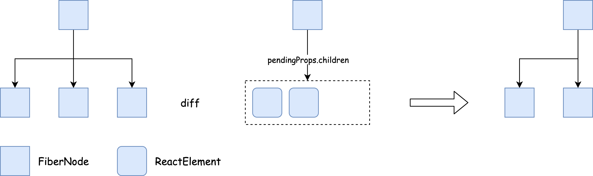
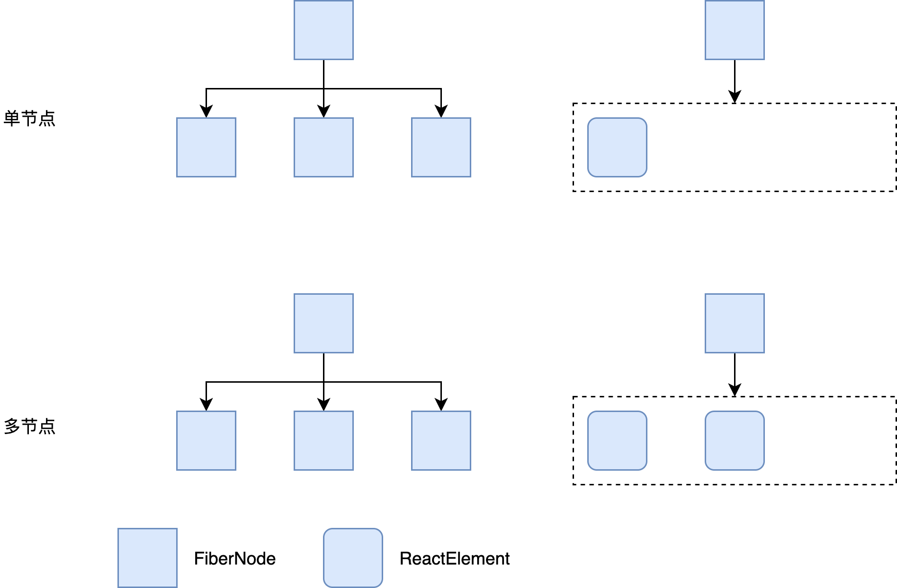
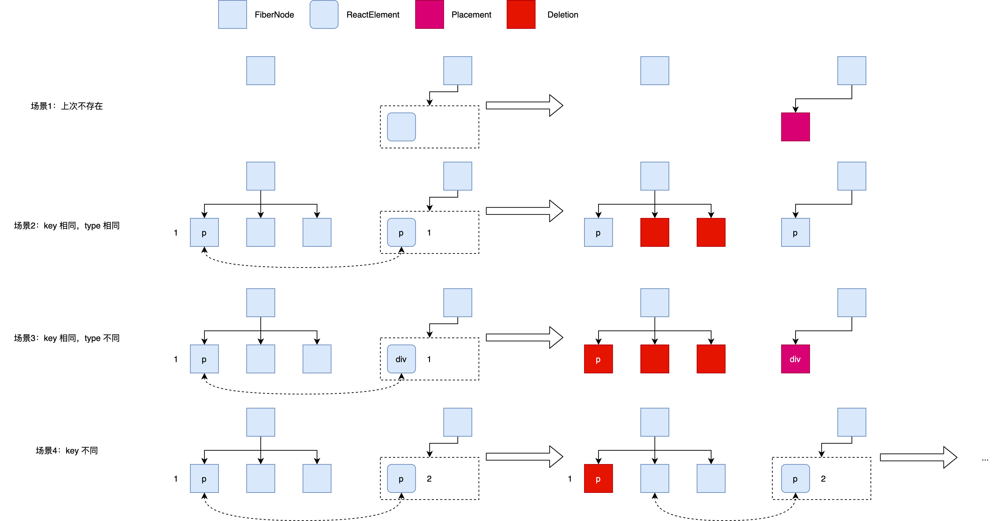
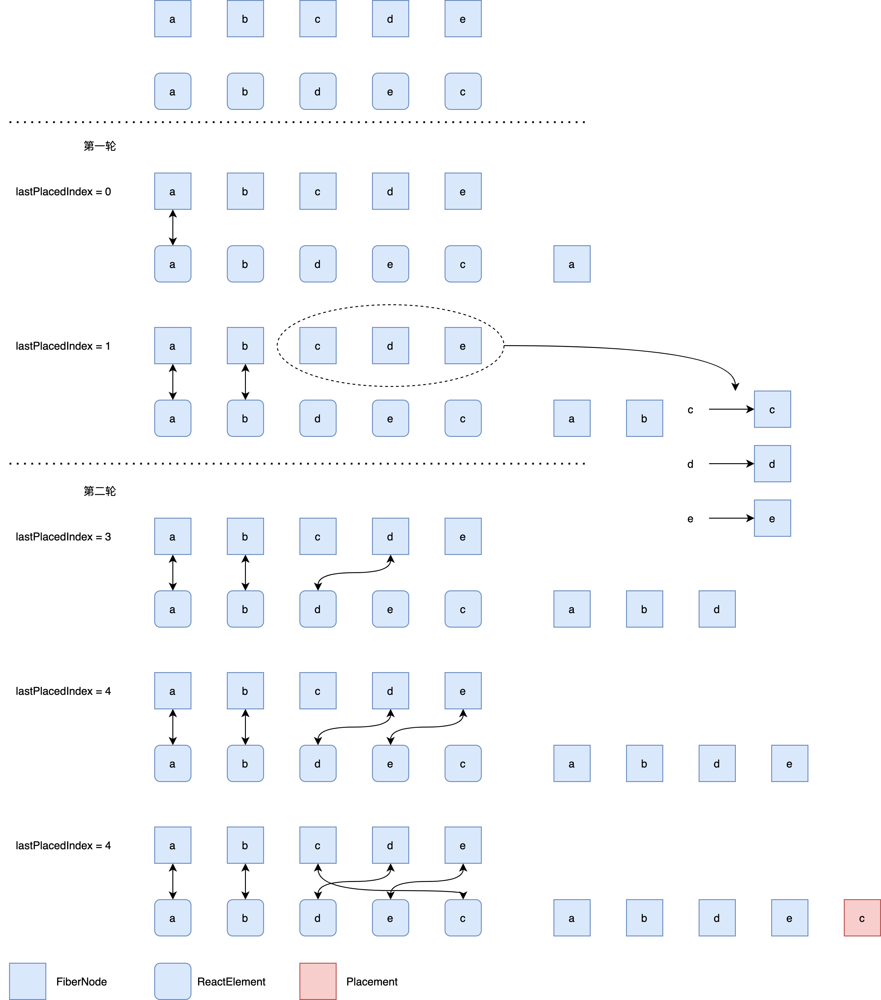
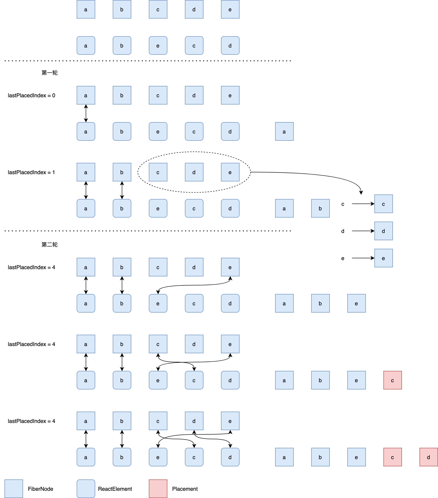

> 说明：本文结论均基于 React 17.0.2 得出，若有出入请参考对应版本源码

# 引言
[上篇文章](/2021/02/08/react-reconcile-bailout/)介绍了 React 协调过程中 `beginWork` 阶段的前半部分，这篇文章我们来介绍后半部分。

# beginWork
同样的，我们还是精简一下代码，只关注感兴趣的部分：

```javascript
function beginWork(
  current: Fiber | null,
  workInProgress: Fiber,
  renderLanes: Lanes,
): Fiber | null {
  ...
  workInProgress.lanes = NoLanes;
  switch (workInProgress.tag) {
    case IndeterminateComponent:
    ...
    case LazyComponent:
    ...
    case FunctionComponent:
    ...
    case ClassComponent:
    ...
    case HostRoot:
    ...
    case HostComponent:
    ...
    case HostText:
    ...
}
```

首先会通过 `workInProgress.tag` 来判断当前处理的 `FiberNode` 是哪种类型，并针对不同的类型调用不同的 update 方法。这些方法虽然名字差别很大，但是最后都逃不过这两句代码：

```javascript
  reconcileChildren(current, workInProgress, nextChildren, renderLanes);
  return workInProgress.child;
```

这里的 `workInProgress` 为当前正在处理的 `FiberNode`，`current` 即为上一次更新的与 `workInProgress` 配对的 `FiberNode`（有可能不存在），`nextChildren` 是这次更新的 `workInProgress` 下新的子节点（ `ReactElement` 数组），`renderLanes` 则是跟更新优先级相关。

接下来看看 `reconcileChildren` 做了什么：

```javascript
export function reconcileChildren(
  current: Fiber | null,
  workInProgress: Fiber,
  nextChildren: any,
  renderLanes: Lanes,
) {
  if (current === null) {
    workInProgress.child = mountChildFibers(
      workInProgress,
      null,
      nextChildren,
      renderLanes,
    );
  } else {
    workInProgress.child = reconcileChildFibers(
      workInProgress,
      current.child,
      nextChildren,
      renderLanes,
    );
  }
}
```

`reconcileChildren` 中根据 `current` 是否存在来决定是应该 `mountChildFibers` 还是 `reconcileChildFibers`，这两个方法其实是类似的，只是 `reconcileChildFibers` 时 `shouldTrackSideEffects` 为 true，会多做一些事情：

```javascript
function ChildReconciler(shouldTrackSideEffects) {
  ...
  return reconcileChildFibers;
}
export const reconcileChildFibers = ChildReconciler(true);
export const mountChildFibers = ChildReconciler(false);
```

我们这里暂时只看 `reconcileChildFibers`：

```javascript
function reconcileChildFibers(
  returnFiber: Fiber,
  currentFirstChild: Fiber | null,
  newChild: any,
  lanes: Lanes,
): Fiber | null {
  ...
  // Handle object types
  const isObject = typeof newChild === 'object' && newChild !== null;

  if (isObject) {
    switch (newChild.$$typeof) {
      case REACT_ELEMENT_TYPE:
        return placeSingleChild(
          reconcileSingleElement(
            returnFiber,
            currentFirstChild,
            newChild,
            lanes,
          ),
        );
      ...
    }
  }

  ...
  if (isArray(newChild)) {
    return reconcileChildrenArray(
      returnFiber,
      currentFirstChild,
      newChild,
      lanes,
    );
  }

  ...
  // Remaining cases are all treated as empty.
  return deleteRemainingChildren(returnFiber, currentFirstChild);
}
```

`reconcileChildFibers` 中根据 `newChild` 的类型来进行不同的处理，我们这里去掉了暂时不关心的部分，仅分析 `newChild` 为对象且是 `REACT_ELEMENT_TYPE` 或者 `newChild` 为数组的情形。事实上 `reconcileChildFibers` 就涉及到了 React 中面试常考的 Diff 算法，接下来我们深入研究一下。

# Diff 算法
## Diff 的是什么？
首先，需要知道的第一个问题是：Diff 算法到底 Diff 的是哪两个东西？是旧的 `FiberNode` 和 新的 `FiberNode`？答案是 No。

从上面的代码可知，传入 `reconcileChildFibers` 的是 `current.child` 和 `nextChildren`，所以 Diff 算法 其实是比较旧的 `FiberNode` 和新的 `ReactElement` 来生成新的 `FiberNode` 的一个过程：




## Diff 分类
根据 Diff 时 `ReactElement` 的类型，我们可以把 Diff 算法分为：

* 单节点 Diff（reconcileSingleElement）：`ReactElement` 是对象。
* 多节点 Diff（reconcileChildrenArray）：`ReactElement` 是数组。




### 单节点 Diff

```javascript
function reconcileSingleElement(
    returnFiber: Fiber,
    currentFirstChild: Fiber | null,
    element: ReactElement,
    lanes: Lanes,
  ): Fiber {
    const key = element.key;
    let child = currentFirstChild;
    while (child !== null) {
      if (child.key === key) {
        const elementType = element.type;
        if (elementType === REACT_FRAGMENT_TYPE) {
          ...
        } else {
          if (
            child.elementType === elementType ||
            // Keep this check inline so it only runs on the false path:
            (__DEV__
              ? isCompatibleFamilyForHotReloading(child, element)
              : false) ||
            (enableLazyElements &&
              typeof elementType === 'object' &&
              elementType !== null &&
              elementType.$$typeof === REACT_LAZY_TYPE &&
              resolveLazy(elementType) === child.type)
          ) {
            deleteRemainingChildren(returnFiber, child.sibling);
            const existing = useFiber(child, element.props);
            existing.ref = coerceRef(returnFiber, child, element);
            existing.return = returnFiber;
            return existing;
          }
        }
        // Didn't match.
        deleteRemainingChildren(returnFiber, child);
        break;
      } else {
        deleteChild(returnFiber, child);
      }
      child = child.sibling;
    }

    if (element.type === REACT_FRAGMENT_TYPE) {
      ...
    } else {
      const created = createFiberFromElement(element, returnFiber.mode, lanes);
      created.ref = coerceRef(returnFiber, currentFirstChild, element);
      created.return = returnFiber;
      return created;
    }
  }
```

去掉一些调试代码以及类型为 `Fragment` 的代码，分析剩下的代码，发现可以分为四种场景：

1. 原来的 `FiberNode` 不存在。只需要创建新的 `FiberNode` 并标记为 `Placement` 即可。
2. 新的 `ReactElement` 和 旧的 `FiberNode` 的 `type` 和 `key` 都相同。可以复用旧的 `FiberNode`，并将旧的 `FiberNode` 的所有兄弟节点标记为。
3. 新的 `ReactElement` 和 旧的 `FiberNode` 的 `key` 相同，`type` 不同。需要将旧的 `FiberNode` 及其兄弟节点都标记为删除，然后创建新的 `FiberNode` 并标记为 `Placement`。
4. 新的 `ReactElement` 和 旧的 `FiberNode` 的 `key` 不同。将当前 `FiberNode` 标记为删除，继续按照 2，3，4 的策略对比其兄弟节点和 `ReactElement` 直到遍历完成。



### 多节点 Diff

```javascript
  function reconcileChildrenArray(
    returnFiber: Fiber,
    currentFirstChild: Fiber | null,
    newChildren: Array<*>,
    lanes: Lanes,
  ): Fiber | null {
    let resultingFirstChild: Fiber | null = null;
    let previousNewFiber: Fiber | null = null;
    let oldFiber = currentFirstChild;
    let lastPlacedIndex = 0;
    let newIdx = 0;
    let nextOldFiber = null;
    // 第一轮循环，依次对比新旧节点，当 key 不同时就会退出
    for (; oldFiber !== null && newIdx < newChildren.length; newIdx++) {
      if (oldFiber.index > newIdx) {
        nextOldFiber = oldFiber;
        oldFiber = null;
      } else {
        nextOldFiber = oldFiber.sibling;
      }
      const newFiber = updateSlot(
        returnFiber,
        oldFiber,
        newChildren[newIdx],
        lanes,
      );
      if (newFiber === null) {
        if (oldFiber === null) {
          oldFiber = nextOldFiber;
        }
        break;
      }
      if (shouldTrackSideEffects) {
        // 新旧节点 key 相同，type 不同
        if (oldFiber && newFiber.alternate === null) {
          deleteChild(returnFiber, oldFiber);
        }
      }
      lastPlacedIndex = placeChild(newFiber, lastPlacedIndex, newIdx);
      if (previousNewFiber === null) {
        resultingFirstChild = newFiber;
      } else {
        previousNewFiber.sibling = newFiber;
      }
      previousNewFiber = newFiber;
      oldFiber = nextOldFiber;
    }

    // 第二轮循环

    // ReactElement 数组遍历完了，需要把剩下的旧的节点都标记为删除
    if (newIdx === newChildren.length) {
      deleteRemainingChildren(returnFiber, oldFiber);
      return resultingFirstChild;
    }

    // 旧的 FiberNode 链表遍历完了，则通过 ReactElement 数组中剩下的节点创建 FiberNode，并标记为 Placement
    if (oldFiber === null) {
      for (; newIdx < newChildren.length; newIdx++) {
        const newFiber = createChild(returnFiber, newChildren[newIdx], lanes);
        if (newFiber === null) {
          continue;
        }
        lastPlacedIndex = placeChild(newFiber, lastPlacedIndex, newIdx);
        if (previousNewFiber === null) {
          // TODO: Move out of the loop. This only happens for the first run.
          resultingFirstChild = newFiber;
        } else {
          previousNewFiber.sibling = newFiber;
        }
        previousNewFiber = newFiber;
      }
      return resultingFirstChild;
    }


    // 将旧的未处理完的 FiberNode 节点保存到 map 中
    const existingChildren = mapRemainingChildren(returnFiber, oldFiber);

    // 遍历新的 ReactElement 数组中的元素，到 map 中找 key 相同的节点
    for (; newIdx < newChildren.length; newIdx++) {
      const newFiber = updateFromMap(
        existingChildren,
        returnFiber,
        newIdx,
        newChildren[newIdx],
        lanes,
      );
      if (newFiber !== null) {
        if (shouldTrackSideEffects) {
          if (newFiber.alternate !== null) {
            existingChildren.delete(
              newFiber.key === null ? newIdx : newFiber.key,
            );
          }
        }
        lastPlacedIndex = placeChild(newFiber, lastPlacedIndex, newIdx);
        if (previousNewFiber === null) {
          resultingFirstChild = newFiber;
        } else {
          previousNewFiber.sibling = newFiber;
        }
        previousNewFiber = newFiber;
      }
    }

    if (shouldTrackSideEffects) {
      existingChildren.forEach((child) => deleteChild(returnFiber, child));
    }

    return resultingFirstChild;
  }
```

因为实际应用场景中列表更新时大部分都是追加或者节点本身的更新，节点位置发生变化的情况相对少见，所以 React 在多节点 Diff 过程中分成了两轮：

第一轮从前往后一一比对，这里分为三种情况：
1. 如果新旧节点 `key` 和 `type` 相同则说明可以复用旧节点，继续往下遍历。
2. `key` 相同 `type` 不同，将旧节点标记为删除，新节点标记为 `Placement`，继续往下遍历。
3. `key` 不同，退出循环。

第一轮结束后，开始第二轮遍历，这里又分为三种情况：
1. 新节点即 `ReactElement` 数组遍历完成了，此时只需要把旧的剩下的节点标记为删除，然后返回。
2. 旧节点链表遍历完成了，此时只需要处理 `ReactElement` 数组中剩下的元素，即通过他们创建新的 `FiberNode` 并标记为 `Placement`，然后返回。
3. 都没有遍历完成，说明第一轮遍历中提前终止了。接下来详细讨论该步骤：

   3.1. 将未遍历完的旧节点以保存为 Map，用 `key` 作为索引。
   3.2. 遍历新节点，通过新节点去 Map 中寻找是否有可以复用的节点。如果没有找到则通过 `ReactElement` 创建新的节点，找到了则复用旧节点来创建新的节点。最后得到的都是 `newFiber`。
   3.3. 调用 `placeChild` 来处理 `newFiber`。这里分三种情形：a. 它是通过 `ReactElement` 创建来的，将其标记为 `Placement`；b. 它是通过复用旧节点而得到的且旧节点的位置小于 `lastPlacedIndex`，将其标记为 `Placement`；c. 它是通过复用旧节点而得到的且旧节点的位置 `oldIndex` 大于 `lastPlacedIndex`，无需标记，更新 `lastPlacedIndex` 为 `oldIndex`。


上面的步骤肯定看了很懵逼，尤其是涉及到 `lastPlacedIndex` 的更新这一块。不妨看下面两个例子：

例一:
```
旧列表：abcde
新列表：abdec
```


该例子最后得到的结果是要把 c 移到最后面。


例二：

```
旧列表：abcde
新列表：abecd
```


该例子最后得到的结果是要把 c 和 d 移到最后面。

同样都只是移动了一个元素，得到的结果却不大一样，例二的代价明显要大，原因就在于 React 的 Diff 算法。

# 总结
本文介绍了 `beginWork` 函数的后半部分并引出了 Diff 算法，讨论了 Diff 算法的作用、分类以及详细步骤，并结合案例进行了对比。


