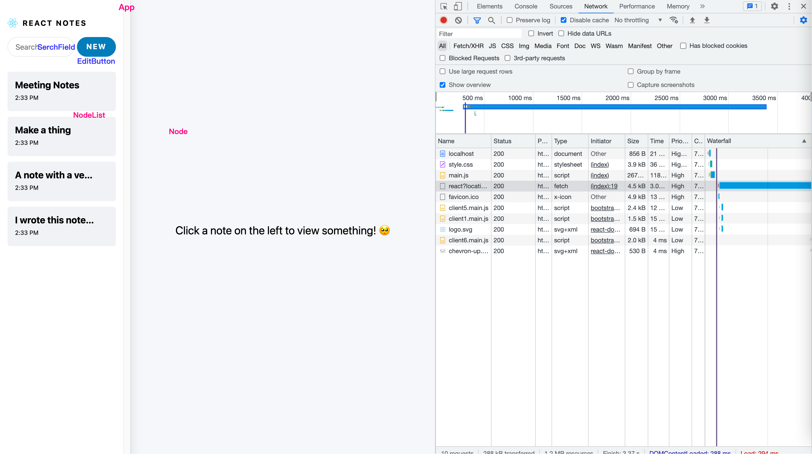
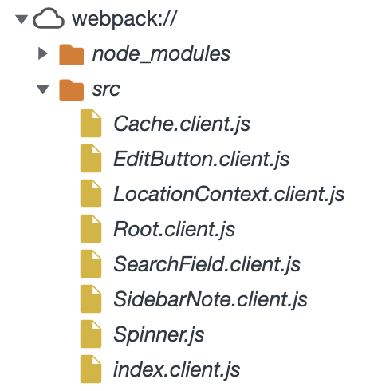
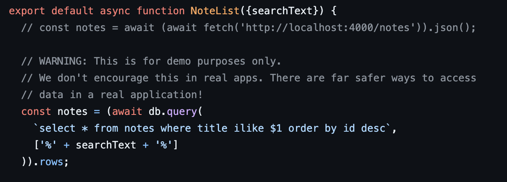
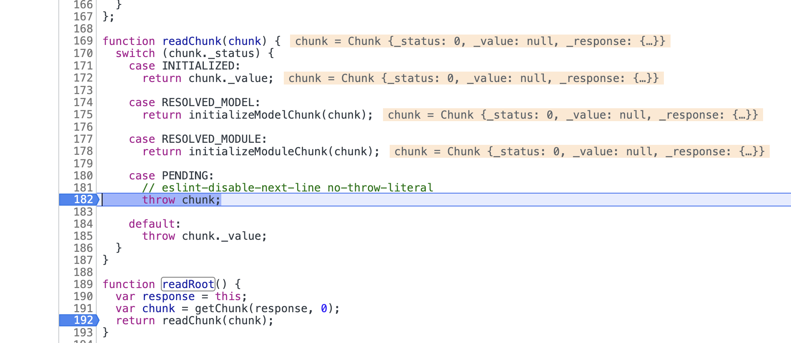
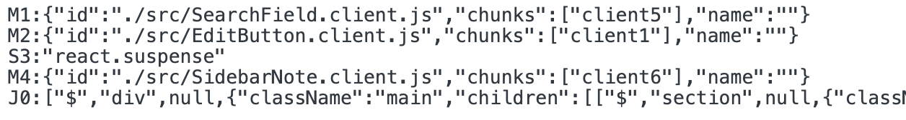
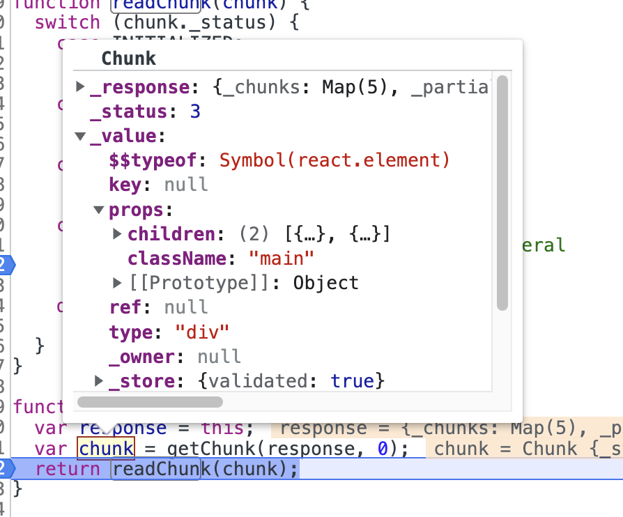
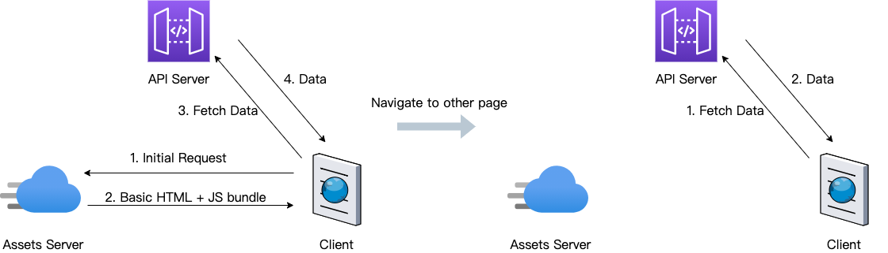
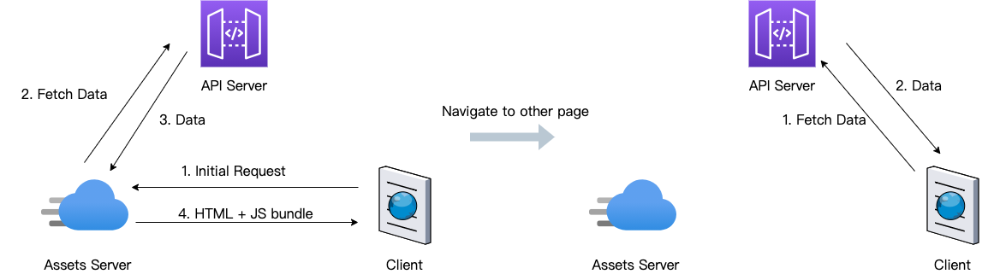
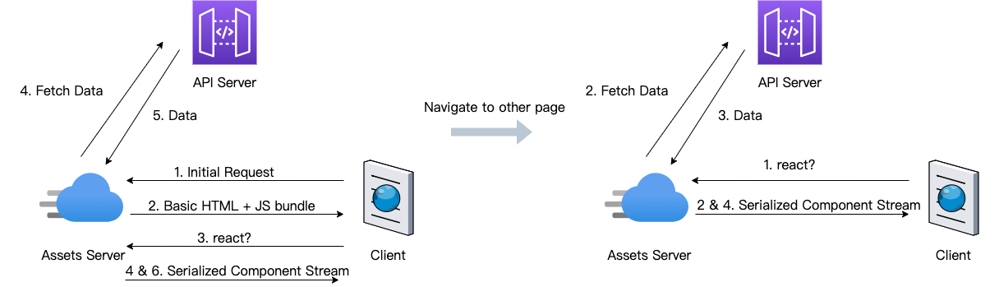
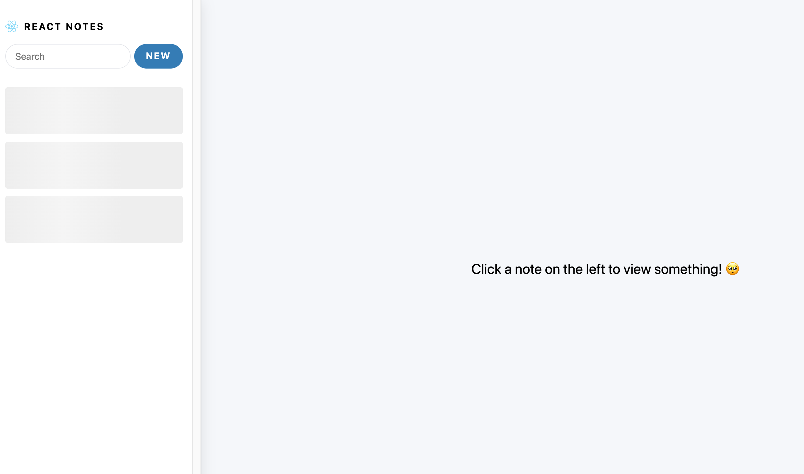

<!-- https://www.thearmchaircritic.org/mansplainings/react-server-components-vs-server-side-rendering#:~:text=RSC%20differs%20from%20SSR%20by,browser%20when%20SSR%20is%20used. -->

[React Server Component](https://github.com/reactjs/rfcs/pull/188) （以下简称 RSC）这个概念已经提出很久了，但是一直对其一知半解，这次就借五一小长假来搞清楚吧。我们通过官网的[例子](https://github.com/reactjs/server-components-demo)来学习一下，不过这个例子还需要安装 postgres，为了简单起见我们用另外一个 [fork](https://github.com/pomber/server-components-demo/) 的版本。

## 浅玩 Server Component Demo

安装好依赖并启动后，在浏览器中打开 `http://localhost:4000`，可以看到如下页面：



这是一个简单的“笔记”应用（App 组件），左侧包含搜索（SearchField）、新增按钮（EditButton）、笔记列表（NoteList）等组件，右侧是详情或新增笔记组件（Note）。其中蓝色组件为 Client Component（只在 client 端渲染，以下简称 CC），红色为 Server Component（只在 server 端渲染，以下简称 SC）。另外，还有一种 Shared Component，即同时可以用在两端的组件，当其被 CC 引入时就成为 CC，反之亦然。

所谓 SC，就是只在 server 端进行渲染，其代码不会出现在客户端：


这样的好处是可以节省掉很多 JS 代码的传输，使得客户端更加轻量。

既然在 server 端进行渲染，那 SC 中就可以使用很多服务端的 API，比如通过 SQL 从数据库获取数据：



这样无疑是有助于性能提升的，原来渲染一个组件需要先下载 JS 代码，然后通过 API 请求获取数据再渲染，现在直接获取到的就是在 server 端渲染好的序列化后的组件，节省了一次网络请求。

那么，它到底是怎么实现的呢？接下来让我们来简单剖析一下。

## 浅析 Server Component 实现原理

我们先从 Client 端入口看起：

```js
export default function Root({initialCache}) {
  return (
    <Suspense fallback={null}>
      <ErrorBoundary FallbackComponent={Error}>
        <Content />
      </ErrorBoundary>
    </Suspense>
  )
}

function Content() {
  const [location, setLocation] = useState({
    selectedId: null,
    isEditing: false,
    searchText: '',
  })
  const response = useServerResponse(location)
  return (
    <LocationContext.Provider value={[location, setLocation]}>
      {response.readRoot()}
    </LocationContext.Provider>
  )
}

export function useServerResponse(location) {
  const key = JSON.stringify(location)
  const cache = unstable_getCacheForType(createResponseCache)
  let response = cache.get(key)
  if (response) {
    return response
  }
  response = createFromFetch(
    fetch('/react?location=' + encodeURIComponent(key))
  )
  cache.set(key, response)
  return response
}
```

上面的代码有两个关键点：

1. 页面如何渲染取决于 `response.readRoot()` 的返回
2. 调用 `useServerResponse` 会发起一个 `/react?location=` 的请求

第一次渲染的时候，由于 `/react?location=` 请求还没有返回，`response.readRoot()` 会 throw 一个 `Chunk` 对象：



之前在 [React 之 Suspense](/2022/04/03/react-suspense/) 中有提到过 React 在进行渲染时有 try catch 的逻辑，不过那里的 error 是 Promise 对象，这里是 `Chunk` 对象而已。同样的，React 会 catch 住这个错误，并显示最近 Suspense 的 fallback，等到 `Chunk` 准备好了才会开始渲染。

接下来我们看看 `/react?location=` 的返回内容：



该数据中，每一行表示一个 `Chunk`，每一行格式如下：

第一个字母表示 `Chunk` 的类型。M 表示 Module，等于 Webpack 中的 Module，即我们写的组件；S 表示 Symbol，即 React 的内置组件；J 表示 Model，用于描述整个应用的模型。

第二个数字表示 `Chunk` 的编号，可以通过它来唯一索引一个 `Chunk`。

冒号后面的内容表示 `Chunk` 的具体数据。

对于这个 Demo，`readRoot` 时会去获取第 0 个 `Chunk`，我们把它格式化一下：

```json
[
  "$",
  "div",
  null,
  {
    "className": "main",
    "children": [
      [
        "$",
        "section",
        null,
        {
          "className": "col sidebar",
          "children": [
            [
              "$",
              "section",
              null,
              {
                "className": "sidebar-header",
                "children": [
                 ...
                ]
              }
            ],
            [
              "$",
              "section",
              null,
              {
                "className": "sidebar-menu",
                "role": "menubar",
                "children": [
                  ["$", "@1", null, {}],
                  ["$", "@2", null, {"noteId": null, "children": "New"}]
                ]
              }
            ],
            ...
          ]
        }
      ],
      ...
    ]
  }
]
```

经过格式化后是不是很眼熟。其实他就是 `App.server.js` 中组件 `App` 序列化后的数据：

```js
export default function App({selectedId, isEditing, searchText}) {
  return (
    <div className='main'>
      <section className='col sidebar'>
        <section className='sidebar-header'>
          
          <strong>React Notes</strong>
        </section>
        <section className='sidebar-menu' role='menubar'>
          <SearchField />
          <EditButton noteId={null}>New</EditButton>
        </section>
        <nav>
          <Suspense fallback={<NoteListSkeleton />}>
            <NoteList searchText={searchText} />
          </Suspense>
        </nav>
      </section>
      <section key={selectedId} className='col note-viewer'>
        <Suspense fallback={<NoteSkeleton isEditing={isEditing} />}>
          <Note selectedId={selectedId} isEditing={isEditing} />
        </Suspense>
      </section>
    </div>
  )
}
```

这个序列化的数据返回给 client 后会被重新解析成 `ReactElement` 对象：



其中，数据中 `sidebar-menu` 的 `children` 是这样表示的：

```js
...
className: 'sidebar-menu',
children: [
  ['$', '@1', null, {}],
  ['$', '@2', null, {noteId: null, children: 'New'}],
],
...
```

这里的 `@1`, `@2` 表示其子组件分别是 1 号 和 2 号 Client Component：


这里还有一个值得学习的地方是在将 JSON 数据格式化为 `ReactElement` 时使用了 `JSON.parse` 的第二个参数，我们可以通过一个简单的例子来练习一下:

```js
const jsonStr = JSON.stringify([
  'div',
  {
    className: 'cls1',
    children: [
      ['span', {className: 'cls2', children: 'Hello'}],
      ['span', {className: 'cls3', children: 'World'}],
    ],
  },
])

const dom = JSON.parse(jsonStr, (key, value) => {
  if (Array.isArray(value) && typeof value[0] === 'string') {
    const ele = document.createElement(value[0])
    ele.className = value[1].className
    const children = value[1].children
    if (Array.isArray(children)) {
      children.forEach((child) => ele.appendChild(child))
    } else {
      ele.appendChild(document.createTextNode(children))
    }
    return ele
  }
  return value
})

console.log(dom.outerHTML)
```

总结一下，所谓的 Server Component 其实就是在 Server 端将组件进行序列化后返回给 Client 端，Client 端再解析成 `ReactElement` 而已。因为组件要经过序列化后传输，所以 Server Component 不能有 `Function` 等无法序列化的参数类型，这也是为什么 Server Component 中不能有跟用户交互相关的代码。

## RSC vs SSR

RSC 因为名字中带有 Server，很自然地会让我们跟 Server Side Rendering（SSR）进行对比，接下来我们就来讨论一下，我们先从 Client Side Rendering（CSR）开始说起。

CSR 我们很熟悉了，它的流程大概如下所示：



它有如下缺点：

1. 由于 Client 端从 Assets Server 获取到的 HTML 是一个空壳，页面内容需要等到 API Server 的数据返回后才能渲染出来，所以 CSR 的 First Contentful Paint（FCP）指标会比较差，且不利于 SEO。

2. 随着应用的不停迭代，JS Bundle 的体积可能会越来越大，这会进一步拖慢 FCP，一般会用路由懒加载等方式来优化。

为了解决上面的问题，就出现了 SSR，它的流程如下所示：



与 CSR 不同的是，初始访问页面时，API 请求从 Client 端移到了 Assets Server 端，由于 Assets Server 与 API Server 之间的通信效率一般要高于 Client 和 API Server，所以这样是有助于提高页面加载的速度。

并且，Assets Server 返回给 Client 的是有内容的 HTML，对于 SEO 也是有好处的。

不过 SSR 仍然存在一些问题：

1. SSR 虽然提升了 FCP，但是整个应用仍然要等到“注水”完成后才能进行交互，也就是 Time to Interactive （TTI）指标仍然比较差。

2. 当跳转到其他页面时，其流程还是跟 CSR 是一样的，没有充分利用到 Assets Server 和 API Server 之间的通信效率。

接下来，我们看看 RSC：



整个流程前面两步跟 CSR 类似，第三步会发起 `react?` 的请求用来获取序列化后的组件数据，之后重点来了，第三步（返回序列化的组件数据）和第四步（从 API Server 获取数据）是并行的，我们可以在上面例子 `NoteList.server.js` 文件中加上这段代码来模拟：

```js
export default function NoteList({searchText}) {
  ...
  // Now let's see how the Suspense boundary above lets us not block on this.
  fetch('http://localhost:4000/sleep/10000')

  return ...
}
```

此时，页面列表部分会展示一个骨架：



直到 API 请求返回后才会更新为真正的内容（第六步）。

而跳转到下一个页面也仍然是这样的流程，只是不需要第一二步了而已。

这样有几个好处：

1. 由于第三步和第四步是同时进行的，用户可以更快的进行交互，提升了 TTI 指标。上面的例子中，我们可以在列表还没有渲染出来时就点击 New 按钮进行新增。但 React18 提出的 [Streaming Server Rendering with Suspense ](https://react.dev/blog/2021/12/17/react-conf-2021-recap#streaming-server-rendering-with-suspense) 似乎也能达到这个效果，关于这个，可以查看小弟另一篇文章[React SSR Stream Rendering & Suspense for Data Fetching](https://juejin.cn/post/7208793449427386426).

2. 即使跳转到了下一个页面，接口请求的逻辑仍然发生在 Assets Server 和 API Server 之间，可以充分利用到两者之间的通信效率。

这样看来，RSC 的出现，确实是有一定的道理的。不过，聪明的你一定发现了，RSC 好像在 SEO 方面并没有任何优势。所以，我觉得未来可能会把两者结合起来，整个应用仍然是基于 RSC 的模型来开发，当用户首次访问应用时，在 Server 端返回渲染好的 HTML：

```
Serialized Component ----> ReactElement --(react-dom/server)--> HTML
```

当用户跳转到下一个页面时，在 Client 解析序列化后的组件为 DOM：

```
Serialized Component ----> ReactElement --(react-dom/client)--> DOM
```

# 思考

RSC 虽然学习完了，但是还是不免想多说几句。

前端这个领域，新框架新概念层出不穷，有时不免会想，为什么一个简单的网页开发工作会变得越来越复杂？

先不急着回答这个问题，还是上面的这个例子，如果我们回到 10 年前，会怎么开发它呢？答案也有很多种，不过一定有一种是这样的：

1. 选一门后端语言（如 Node.js），选择个模板引擎（如 mustache），获取数据，后端直出 HTML。
2. JS 写点用户交互逻辑（可能会用到 jQuery），CSS 写点样式。

看到这样原始的方式，你肯定会吐槽。不过别激动，说不定这是性能最好的。怎么说呢？首先，模板引擎的渲染效率大概率是高于 React 的（毕竟 React 有库本身运行的成本，以及 Diff 过程等），所以 FCP 指标应该是会好于 SSR 的。同时，由于少了很多库相关的 JS 代码，JS 体积也会小很多，TTI 也会比较快。

上面开发的网页有一个问题就是用户体验不太好，在 HTML 返回前，用户需要一直等待（整个过程页面是一片空白）。为了解决这个问题，Facebook 曾经提出过一种叫做 [BigPipe](https://engineering.fb.com/2010/06/04/web/bigpipe-pipelining-web-pages-for-high-performance/) 的技术，可以实现先返回页面的部分内容给用户。关于 BigPipe，也可以看小弟之前写的文章 [Node.js 之 BigPipe](http://www.paradeto.com/2017/06/26/nodejs-bigpipe/)。其原理主要也是用了 HTTP 的 `Transfer-Encoding: chunked`。

所以，你看，没有 React，也没有 SSR，RSP，Stream Rendering 这些概念，我们仍然可以实现一个高性能和具有良好用户体验的网页。

不过，这种方式最大的缺点就是代码不利于维护，有过这种开发经历的童鞋应该深有同感。所以才出现了基于组件的类似 React 的这种前端 UI 库或框架，从此改变了网页开发的方式，也使得前端这个职业登上了历史舞台。

所以为什么一个简单的网页开发工作会变得越来越复杂？因为这是综合考虑性能、用户体验、代码可维护性后的结果。
