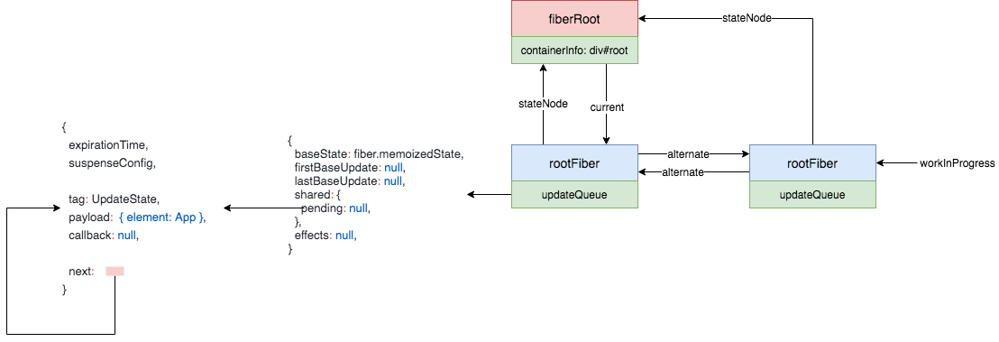
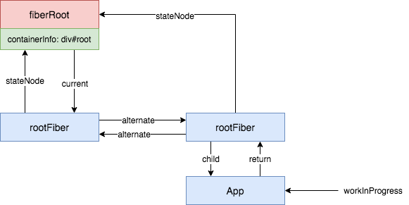
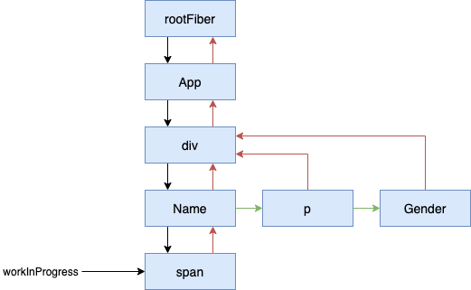
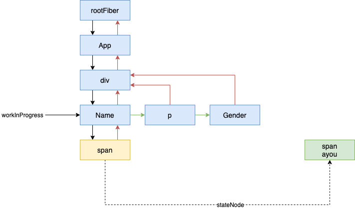
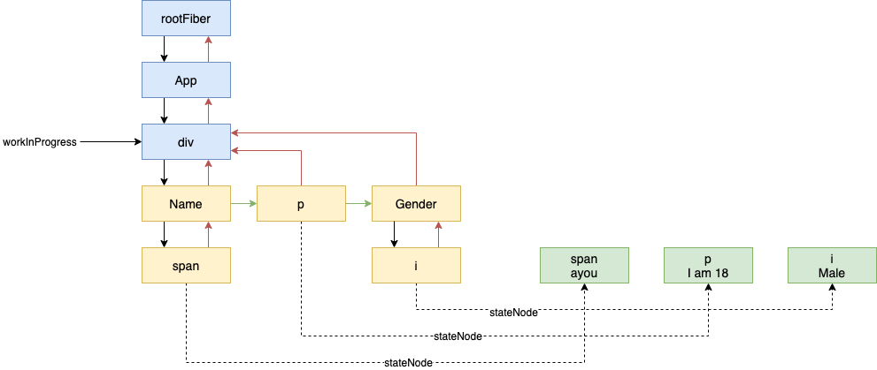
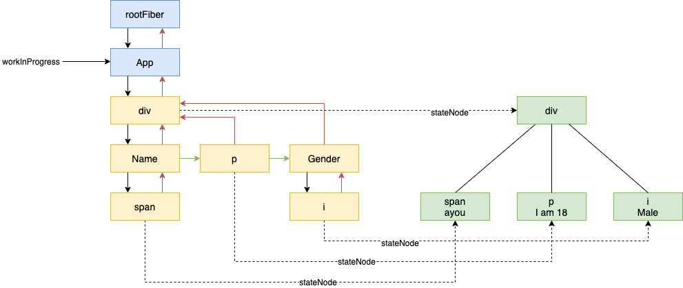
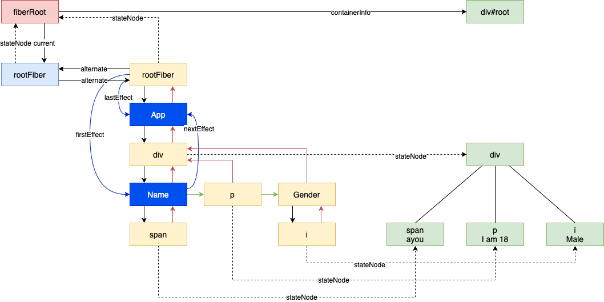

我们以下面这个例子来阐述下首次渲染的流程：

```javascript
function Name({name}) {
  return <span>{name}</span>
}

function Gender() {
  return <i>Male</i>
}

export default function App() {
  const [name, setName] = useState('ayou')
  useEffect(() => {
    setTimeout(() => {
      setName('yoyo')
    }, 2000)
  }, [])
  return (
    <div>
      <Name name={name} />
      <p>I am 18</p>
      <Gender />
    </div>
  )
}
...
ReactDOM.render(<App />, document.getElementById('root'))
```

首先，我们看看 `render`，它是从 `ReactDOMLegacy` 中导出的，并最后调用了 `legacyRenderSubtreeIntoContainer`：

```javascript
function legacyRenderSubtreeIntoContainer(
  parentComponent: ?React$Component<any, any>,
  children: ReactNodeList,
  container: Container,
  forceHydrate: boolean,
  callback: ?Function
) {
  // TODO: Without `any` type, Flow says "Property cannot be accessed on any
  // member of intersection type." Whyyyyyy.
  let root: RootType = (container._reactRootContainer: any)
  let fiberRoot
  if (!root) {
    // 首次渲染
    root = container._reactRootContainer = legacyCreateRootFromDOMContainer(
      container,
      forceHydrate
    )
    fiberRoot = root._internalRoot
    if (typeof callback === 'function') {
      const originalCallback = callback
      callback = function () {
        const instance = getPublicRootInstance(fiberRoot)
        originalCallback.call(instance)
      }
    }
    // Initial mount should not be batched.
    unbatchedUpdates(() => {
      updateContainer(children, fiberRoot, parentComponent, callback)
    })
  } else {
    // 更新
    fiberRoot = root._internalRoot
    if (typeof callback === 'function') {
      const originalCallback = callback
      callback = function () {
        const instance = getPublicRootInstance(fiberRoot)
        originalCallback.call(instance)
      }
    }
    updateContainer(children, fiberRoot, parentComponent, callback)
  }
  return getPublicRootInstance(fiberRoot)
}
```

首次渲染时，经过下面这一系列的操作，会初始化一些东西：

```javascript
ReactDOMLegacy.js
function legacyCreateRootFromDOMContainer(
  container: Container,
  forceHydrate: boolean
): RootType {
  ...
  return createLegacyRoot(
    container,
    shouldHydrate
      ? {
          hydrate: true,
        }
      : undefined
  )
}

ReactDOMRoot.js
function createLegacyRoot(
  container: Container,
  options?: RootOptions,
): RootType {
  return new ReactDOMBlockingRoot(container, LegacyRoot, options);
}
function ReactDOMBlockingRoot(
  container: Container,
  tag: RootTag,
  options: void | RootOptions,
) {
  this._internalRoot = createRootImpl(container, tag, options);
}
function createRootImpl(
  container: Container,
  tag: RootTag,
  options: void | RootOptions,
) {
  ...
  const root = createContainer(container, tag, hydrate, hydrationCallbacks)
  ...
}


ReactFiberReconciler.old.js
function createContainer(
  containerInfo: Container,
  tag: RootTag,
  hydrate: boolean,
  hydrationCallbacks: null | SuspenseHydrationCallbacks,
): OpaqueRoot {
  return createFiberRoot(containerInfo, tag, hydrate, hydrationCallbacks);
}

ReactFiberRoot.old.js
function createFiberRoot(
  containerInfo: any,
  tag: RootTag,
  hydrate: boolean,
  hydrationCallbacks: null | SuspenseHydrationCallbacks,
): FiberRoot {
  ...
  const root: FiberRoot = (new FiberRootNode(containerInfo, tag, hydrate): any)
  const uninitializedFiber = createHostRootFiber(tag)
  root.current = uninitializedFiber
  uninitializedFiber.stateNode = root
  initializeUpdateQueue(uninitializedFiber)
  return root
}
```

经过这一系列的操作以后，会形成如下的数据结构：


然后，会来到：

```javascript
unbatchedUpdates(() => {
  // 这里的 children 是 App 对应的这个 ReactElement
  updateContainer(children, fiberRoot, parentComponent, callback)
})
```

这里 `unbatchedUpdates` 会设置当前的 `executionContext`：

```javascript
export function unbatchedUpdates<A, R>(fn: (a: A) => R, a: A): R {
  const prevExecutionContext = executionContext
  // 去掉 BatchedContext
  executionContext &= ~BatchedContext
  // 加上 LegacyUnbatchedContext
  executionContext |= LegacyUnbatchedContext
  try {
    return fn(a)
  } finally {
    executionContext = prevExecutionContext
    if (executionContext === NoContext) {
      // Flush the immediate callbacks that were scheduled during this batch
      flushSyncCallbackQueue()
    }
  }
}
```

然后执行 `updateContainer`：

```javascript
export function updateContainer(
  element: ReactNodeList,
  container: OpaqueRoot,
  parentComponent: ?React$Component<any, any>,
  callback: ?Function
): ExpirationTime {
  const current = container.current
  const currentTime = requestCurrentTimeForUpdate()
  const suspenseConfig = requestCurrentSuspenseConfig()
  const expirationTime = computeExpirationForFiber(
    currentTime,
    current,
    suspenseConfig
  )

  const context = getContextForSubtree(parentComponent)
  if (container.context === null) {
    container.context = context
  } else {
    container.pendingContext = context
  }

  const update = createUpdate(expirationTime, suspenseConfig)
  // Caution: React DevTools currently depends on this property
  // being called "element".
  update.payload = {element}

  callback = callback === undefined ? null : callback
  if (callback !== null) {
    update.callback = callback
  }

  enqueueUpdate(current, update)
  scheduleUpdateOnFiber(current, expirationTime)

  return expirationTime
}
```

这里，会创建一个 `update`，然后入队，我们的数据结构会变成这样：


接下来就到了 `scheduleUpdateOnFiber`:

```javascript
export function scheduleUpdateOnFiber(
  fiber: Fiber,
  expirationTime: ExpirationTime
) {
  checkForNestedUpdates()
  warnAboutRenderPhaseUpdatesInDEV(fiber)

  const root = markUpdateTimeFromFiberToRoot(fiber, expirationTime)
  if (root === null) {
    warnAboutUpdateOnUnmountedFiberInDEV(fiber)
    return
  }

  // TODO: computeExpirationForFiber also reads the priority. Pass the
  // priority as an argument to that function and this one.
  const priorityLevel = getCurrentPriorityLevel()

  if (expirationTime === Sync) {
    if (
      // Check if we're inside unbatchedUpdates
      (executionContext & LegacyUnbatchedContext) !== NoContext &&
      // Check if we're not already rendering
      (executionContext & (RenderContext | CommitContext)) === NoContext
    ) {
      // Register pending interactions on the root to avoid losing traced interaction data.
      schedulePendingInteractions(root, expirationTime)

      // This is a legacy edge case. The initial mount of a ReactDOM.render-ed
      // root inside of batchedUpdates should be synchronous, but layout updates
      // should be deferred until the end of the batch.
      performSyncWorkOnRoot(root)
    } else {
      // 暂时不看
    }
  } else {
    // 暂时不看
  }
}
```

最后走到了 `performSyncWorkOnRoot`：

```javascript
function performSyncWorkOnRoot(root) {
  invariant(
    (executionContext & (RenderContext | CommitContext)) === NoContext,
    'Should not already be working.'
  )

  flushPassiveEffects()

  const lastExpiredTime = root.lastExpiredTime

  let expirationTime
  if (lastExpiredTime !== NoWork) {
    ...
  } else {
    // There's no expired work. This must be a new, synchronous render.
    expirationTime = Sync
  }

  let exitStatus = renderRootSync(root, expirationTime)

  ...
  const finishedWork: Fiber = (root.current.alternate: any);
  root.finishedWork = finishedWork;
  root.finishedExpirationTime = expirationTime;
  root.nextKnownPendingLevel = getRemainingExpirationTime(finishedWork);
  commitRoot(root);

  return null
}
```

这里，可以分为两个大的步骤：

1. `render`
2. `commit`

## render

首先看看 `renderRootSync`：

```javascript
function renderRootSync(root, expirationTime) {
  const prevExecutionContext = executionContext
  executionContext |= RenderContext
  const prevDispatcher = pushDispatcher(root)

  // If the root or expiration time have changed, throw out the existing stack
  // and prepare a fresh one. Otherwise we'll continue where we left off.
  if (root !== workInProgressRoot || expirationTime !== renderExpirationTime) {
    // 主要是给 workInProgress 赋值
    prepareFreshStack(root, expirationTime)
    startWorkOnPendingInteractions(root, expirationTime)
  }

  const prevInteractions = pushInteractions(root)

  do {
    try {
      workLoopSync()
      break
    } catch (thrownValue) {
      handleError(root, thrownValue)
    }
  } while (true)
  resetContextDependencies()
  if (enableSchedulerTracing) {
    popInteractions(((prevInteractions: any): Set<Interaction>))
  }

  executionContext = prevExecutionContext
  popDispatcher(prevDispatcher)

  if (workInProgress !== null) {
    // This is a sync render, so we should have finished the whole tree.
    invariant(
      false,
      'Cannot commit an incomplete root. This error is likely caused by a ' +
        'bug in React. Please file an issue.'
    )
  }

  // Set this to null to indicate there's no in-progress render.
  workInProgressRoot = null

  return workInProgressRootExitStatus
}
```

这里首先调用 `prepareFreshStack(root, expirationTime)`，这一句主要是通过 `root.current` 来创建 `workInProgress`。调用后，数据结构成了这样：



跳过中间的一些语句，我们来到 `workLoopSync`：

```javascript
function workLoopSync() {
  // Already timed out, so perform work without checking if we need to yield.
  while (workInProgress !== null) {
    performUnitOfWork(workInProgress)
  }
}
```

```javascript
function performUnitOfWork(unitOfWork: Fiber): void {
  // The current, flushed, state of this fiber is the alternate. Ideally
  // nothing should rely on this, but relying on it here means that we don't
  // need an additional field on the work in progress.
  const current = unitOfWork.alternate
  setCurrentDebugFiberInDEV(unitOfWork)

  let next
  if (enableProfilerTimer && (unitOfWork.mode & ProfileMode) !== NoMode) {
    startProfilerTimer(unitOfWork)
    next = beginWork(current, unitOfWork, renderExpirationTime)
    stopProfilerTimerIfRunningAndRecordDelta(unitOfWork, true)
  } else {
    next = beginWork(current, unitOfWork, renderExpirationTime)
  }

  resetCurrentDebugFiberInDEV()
  unitOfWork.memoizedProps = unitOfWork.pendingProps
  if (next === null) {
    // If this doesn't spawn new work, complete the current work.
    completeUnitOfWork(unitOfWork)
  } else {
    workInProgress = next
  }

  ReactCurrentOwner.current = null
}
```

这里又分为两个步骤：

1. `beginWork`，传入当前 `Fiber` 节点，创建子 `Fiber` 节点。
2. `completeUnitOfWork`，通过 `Fiber` 节点创建真实 DOM 节点。

### beginWork

```javascript
function beginWork(
  current: Fiber | null,
  workInProgress: Fiber,
  renderExpirationTime: ExpirationTime
): Fiber | null {
  const updateExpirationTime = workInProgress.expirationTime

  if (current !== null) {
    const oldProps = current.memoizedProps
    const newProps = workInProgress.pendingProps

    if (
      oldProps !== newProps ||
      hasLegacyContextChanged() ||
      // Force a re-render if the implementation changed due to hot reload:
      (__DEV__ ? workInProgress.type !== current.type : false)
    ) {
      // 略
    } else if (updateExpirationTime < renderExpirationTime) {
      // 略
    } else {
      // An update was scheduled on this fiber, but there are no new props
      // nor legacy context. Set this to false. If an update queue or context
      // consumer produces a changed value, it will set this to true. Otherwise,
      // the component will assume the children have not changed and bail out.
      didReceiveUpdate = false
    }
  } else {
    didReceiveUpdate = false
  }

  // Before entering the begin phase, clear pending update priority.
  // TODO: This assumes that we're about to evaluate the component and process
  // the update queue. However, there's an exception: SimpleMemoComponent
  // sometimes bails out later in the begin phase. This indicates that we should
  // move this assignment out of the common path and into each branch.
  workInProgress.expirationTime = NoWork

  switch (workInProgress.tag) {
    case IndeterminateComponent:
    // ...省略
    case LazyComponent:
    // ...省略
    case FunctionComponent:
    // ...省略
    case ClassComponent:
    // ...省略
    case HostRoot:
      return updateHostRoot(current, workInProgress, renderExpirationTime)
    case HostComponent:
    // ...省略
    case HostText:
    // ...省略
    // ...省略其他类型
  }
}
```

这里因为是 `rootFiber`，所以会走到 `updateHostRoot`：

```javascript
function updateHostRoot(current, workInProgress, renderExpirationTime) {
  // 暂时不看
  pushHostRootContext(workInProgress)
  const updateQueue = workInProgress.updateQueue

  const nextProps = workInProgress.pendingProps
  const prevState = workInProgress.memoizedState
  const prevChildren = prevState !== null ? prevState.element : null
  cloneUpdateQueue(current, workInProgress)
  processUpdateQueue(workInProgress, nextProps, null, renderExpirationTime)
  const nextState = workInProgress.memoizedState
  // Caution: React DevTools currently depends on this property
  // being called "element".
  const nextChildren = nextState.element
  if (nextChildren === prevChildren) {
    // 省略
  }
  const root: FiberRoot = workInProgress.stateNode
  if (root.hydrate && enterHydrationState(workInProgress)) {
    // 省略
  } else {
    // 给 rootFiber 生成子 fiber
    reconcileChildren(
      current,
      workInProgress,
      nextChildren,
      renderExpirationTime
    )
    resetHydrationState()
  }
  return workInProgress.child
}
```

经过 `updateHostRoot` 后，会返回 `workInProgress.child` 作为下一个 `workInProgress`，最后的数据结构如下（这里先忽略 `reconcileChildren` 这个比较复杂的函数）：



接着会继续进行 `beginWork`，这次会来到 `mountIndeterminateComponent` （暂时忽略）。总之，经过不断的 `beginWork` 后，我们会得到如下的一个结构：



此时 `next` 为空，我们会走到：

```javascript
if (next === null) {
  // If this doesn't spawn new work, complete the current work.
  completeUnitOfWork(unitOfWork)
} else {
  ...
}
```

### completeUnitOfWork

```javascript
function completeUnitOfWork(unitOfWork: Fiber): void {
  // Attempt to complete the current unit of work, then move to the next
  // sibling. If there are no more siblings, return to the parent fiber.
  let completedWork = unitOfWork
  do {
    // The current, flushed, state of this fiber is the alternate. Ideally
    // nothing should rely on this, but relying on it here means that we don't
    // need an additional field on the work in progress.
    const current = completedWork.alternate
    const returnFiber = completedWork.return

    // Check if the work completed or if something threw.
    if ((completedWork.effectTag & Incomplete) === NoEffect) {
      setCurrentDebugFiberInDEV(completedWork)
      let next
      if (
        !enableProfilerTimer ||
        (completedWork.mode & ProfileMode) === NoMode
      ) {
        next = completeWork(current, completedWork, renderExpirationTime)
      } else {
        startProfilerTimer(completedWork)
        next = completeWork(current, completedWork, renderExpirationTime)
        // Update render duration assuming we didn't error.
        stopProfilerTimerIfRunningAndRecordDelta(completedWork, false)
      }
      resetCurrentDebugFiberInDEV()
      resetChildExpirationTime(completedWork)

      if (next !== null) {
        // Completing this fiber spawned new work. Work on that next.
        workInProgress = next
        return
      }

      if (
        returnFiber !== null &&
        // Do not append effects to parents if a sibling failed to complete
        (returnFiber.effectTag & Incomplete) === NoEffect
      ) {
        // Append all the effects of the subtree and this fiber onto the effect
        // list of the parent. The completion order of the children affects the
        // side-effect order.
        if (returnFiber.firstEffect === null) {
          returnFiber.firstEffect = completedWork.firstEffect
        }
        if (completedWork.lastEffect !== null) {
          if (returnFiber.lastEffect !== null) {
            returnFiber.lastEffect.nextEffect = completedWork.firstEffect
          }
          returnFiber.lastEffect = completedWork.lastEffect
        }

        // If this fiber had side-effects, we append it AFTER the children's
        // side-effects. We can perform certain side-effects earlier if needed,
        // by doing multiple passes over the effect list. We don't want to
        // schedule our own side-effect on our own list because if end up
        // reusing children we'll schedule this effect onto itself since we're
        // at the end.
        const effectTag = completedWork.effectTag

        // Skip both NoWork and PerformedWork tags when creating the effect
        // list. PerformedWork effect is read by React DevTools but shouldn't be
        // committed.
        if (effectTag > PerformedWork) {
          if (returnFiber.lastEffect !== null) {
            returnFiber.lastEffect.nextEffect = completedWork
          } else {
            returnFiber.firstEffect = completedWork
          }
          returnFiber.lastEffect = completedWork
        }
      }
    } else {
      // This fiber did not complete because something threw. Pop values off
      // the stack without entering the complete phase. If this is a boundary,
      // capture values if possible.
      const next = unwindWork(completedWork, renderExpirationTime)

      // Because this fiber did not complete, don't reset its expiration time.

      if (
        enableProfilerTimer &&
        (completedWork.mode & ProfileMode) !== NoMode
      ) {
        // Record the render duration for the fiber that errored.
        stopProfilerTimerIfRunningAndRecordDelta(completedWork, false)

        // Include the time spent working on failed children before continuing.
        let actualDuration = completedWork.actualDuration
        let child = completedWork.child
        while (child !== null) {
          actualDuration += child.actualDuration
          child = child.sibling
        }
        completedWork.actualDuration = actualDuration
      }

      if (next !== null) {
        // If completing this work spawned new work, do that next. We'll come
        // back here again.
        // Since we're restarting, remove anything that is not a host effect
        // from the effect tag.
        next.effectTag &= HostEffectMask
        workInProgress = next
        return
      }

      if (returnFiber !== null) {
        // Mark the parent fiber as incomplete and clear its effect list.
        returnFiber.firstEffect = returnFiber.lastEffect = null
        returnFiber.effectTag |= Incomplete
      }
    }

    const siblingFiber = completedWork.sibling
    if (siblingFiber !== null) {
      // If there is more work to do in this returnFiber, do that next.
      workInProgress = siblingFiber
      return
    }
    // Otherwise, return to the parent
    completedWork = returnFiber
    // Update the next thing we're working on in case something throws.
    workInProgress = completedWork
  } while (completedWork !== null)

  // We've reached the root.
  if (workInProgressRootExitStatus === RootIncomplete) {
    workInProgressRootExitStatus = RootCompleted
  }
}
```

此时这里的 `unitOfWork` 是 `span` 对应的 `fiber`。从函数头部的注释我们可以大致知道该函数的功能：

```javascript
// Attempt to complete the current unit of work, then move to the next
// sibling. If there are no more siblings, return to the parent fiber.

// 尝试去完成当前的工作单元，然后处理下一个 sibling。如果没有 sibling 了，就返回去完成父 fiber
```

这里一路走下去最后会来到 `completeWork` 这里 ：

```javascript
case HostComponent:
  ...
  // 会调用 ReactDOMComponent.js 中的 createELement 方法创建 span 标签
  const instance = createInstance(
    type,
    newProps,
    rootContainerInstance,
    currentHostContext,
    workInProgress
  )

  // 将子元素 append 到 instance 中
  appendAllChildren(instance, workInProgress, false, false)

  workInProgress.stateNode = instance;
```

执行完后，我们的结构如下所示（我们用绿色的圆来表示真实 dom）：



此时 `next` 将会是 `null`，我们需要往上找到下一个 `completedWork`，即 `Name`，因为 `Name` 是一个 `FunctionComponent`，所以在 `completeWork` 中直接返回了 `null`。又因为它有 `sibling`，所以会将它的 `sibling` 赋值给 `workInProgress`，并返回对其进行 `beginWork`。

```javascript
const siblingFiber = completedWork.sibling
if (siblingFiber !== null) {
  // If there is more work to do in this returnFiber, do that next.
  // workInProgress 更新为 sibling
  workInProgress = siblingFiber
  // 直接返回，回到了 performUnitOfWork
  return
}
```

```javascript
function performUnitOfWork(unitOfWork: Fiber): void {
  ...
  if (next === null) {
    // If this doesn't spawn new work, complete the current work.
    // 上面的代码回到了这里
    completeUnitOfWork(unitOfWork)
  } else {
    workInProgress = next
  }

  ReactCurrentOwner.current = null
}
```

这样 `beginWork` 和 `completeWork` 不断交替的执行，当我们执行到 `div` 的时候，我们的结构如下所示：



之所以要额外的分析 `div` 的 `complete` 过程，是因为这个例子方便我们分析 `appendAllChildren`：

```javascript
appendAllChildren = function (
  parent: Instance,
  workInProgress: Fiber,
  needsVisibilityToggle: boolean,
  isHidden: boolean
) {
  // We only have the top Fiber that was created but we need recurse down its
  // children to find all the terminal nodes.
  let node = workInProgress.child
  while (node !== null) {
    if (node.tag === HostComponent || node.tag === HostText) {
      appendInitialChild(parent, node.stateNode)
    } else if (enableFundamentalAPI && node.tag === FundamentalComponent) {
      appendInitialChild(parent, node.stateNode.instance)
    } else if (node.tag === HostPortal) {
      // If we have a portal child, then we don't want to traverse
      // down its children. Instead, we'll get insertions from each child in
      // the portal directly.
    } else if (node.child !== null) {
      node.child.return = node
      node = node.child
      continue
    }
    if (node === workInProgress) {
      return
    }
    while (node.sibling === null) {
      if (node.return === null || node.return === workInProgress) {
        return
      }
      node = node.return
    }
    node.sibling.return = node.return
    node = node.sibling
  }
}
```

由于 `workInProgress` 指向 `div` 这个 `fiber`，他的 `child` 是 `Name`，会进入 `else if (node.child !== null)` 这个条件分支。然后继续下一个循环，此时 `node` 为 `span` 这个 `fiber`，会进入第一个分支，将 `span` 对应的 `dom` 元素插入到 `parent` 之中，此时我们的数据结构为：


这样不停的循环，最后会执行到 `if (node === workInProgress)` 退出，此时所有的子元素都 append 到了 `parent` 之中：


然后继续 `beginWork` 和 `completeWork`，最后会来到 `rootFiber`。不同的是，该节点的 `alternate` 并不为空，且该节点 `tag` 为 `HootRoot`，所以 `completeWork` 时会来到这里：

```javascript
case HostRoot: {
  ...
  updateHostContainer(workInProgress);
  return null;
}
```

```javascript
updateHostContainer = function (workInProgress: Fiber) {
  // Noop
}
```

看来几乎没有做什么事情，到这我们的 `render` 阶段就结束了，最后的结构如下所示：


这里有点要说明的是在处理 `App` 这个 `fiber` 的时候，因为 `App` 的 `effectTag` （Placement 2 & Update 4 & Passive 512）大于 `PerformedWork` （值为 1），所以代码会走到这里：

```javascript
// If this fiber had side-effects, we append it AFTER the children's
// side-effects. We can perform certain side-effects earlier if needed,
// by doing multiple passes over the effect list. We don't want to
// schedule our own side-effect on our own list because if end up
// reusing children we'll schedule this effect onto itself since we're
// at the end.
const effectTag = completedWork.effectTag

// Skip both NoWork and PerformedWork tags when creating the effect
// list. PerformedWork effect is read by React DevTools but shouldn't be
// committed.
if (effectTag > PerformedWork) {
  if (returnFiber.lastEffect !== null) {
    returnFiber.lastEffect.nextEffect = completedWork
  } else {
    returnFiber.firstEffect = completedWork
  }
  returnFiber.lastEffect = completedWork
}
```

所以，`rootFiber` 的 `firstEffect` 和 `lastEffect` 都会指向 `App`。后面分析更新过程的时候会再详细讨论这里。

## commit

`commit` 大致可分为以下过程：

- 准备阶段
- before mutation 阶段（执行 DOM 操作前）
- mutation 阶段（执行 DOM 操作）
- layout 阶段（执行 DOM 操作后）
- 收尾阶段

### 准备阶段

```js
do {
  // 触发useEffect回调与其他同步任务。由于这些任务可能触发新的渲染，所以这里要一直遍历执行直到没有任务
  flushPassiveEffects()
  // 暂时没有复现出 rootWithPendingPassiveEffects !== null 的情景
  // 首次渲染 rootWithPendingPassiveEffects 为 null
} while (rootWithPendingPassiveEffects !== null)
// finishedWork 就是正在工作的 rootFiber
const finishedWork = root.
// 优先级相关暂时不看
const expirationTime = root.finishedExpirationTime
if (finishedWork === null) {
  return null
}
root.finishedWork = null
root.finishedExpirationTime = NoWork

root.callbackNode = null
root.callbackExpirationTime = NoWork
root.callbackPriority_old = NoPriority

const remainingExpirationTimeBeforeCommit = getRemainingExpirationTime(
  finishedWork
)
markRootFinishedAtTime(
  root,
  expirationTime,
  remainingExpirationTimeBeforeCommit
)

if (rootsWithPendingDiscreteUpdates !== null) {
  const lastDiscreteTime = rootsWithPendingDiscreteUpdates.get(root)
  if (
    lastDiscreteTime !== undefined &&
    remainingExpirationTimeBeforeCommit < lastDiscreteTime
  ) {
    rootsWithPendingDiscreteUpdates.delete(root)
  }
}

if (root === workInProgressRoot) {
  workInProgressRoot = null
  workInProgress = null
  renderExpirationTime = NoWork
} else {
}

// 将effectList赋值给firstEffect
// 由于每个fiber的effectList只包含他的子孙节点
// 所以根节点如果有effectTag则不会被包含进来
// 所以这里将有effectTag的根节点插入到effectList尾部
// 这样才能保证有effect的fiber都在effectList中
let firstEffect
if (finishedWork.effectTag > PerformedWork) {
  if (finishedWork.lastEffect !== null) {
    finishedWork.lastEffect.nextEffect = finishedWork
    firstEffect = finishedWork.firstEffect
  } else {
    firstEffect = finishedWork
  }
} else {
  firstEffect = finishedWork.firstEffect
}
```

首次渲染时，准备阶段其他步骤我们先不管，我们主要关注这一段：

```javascript
let firstEffect
if (finishedWork.effectTag > PerformedWork) {
  if (finishedWork.lastEffect !== null) {
    finishedWork.lastEffect.nextEffect = finishedWork
    firstEffect = finishedWork.firstEffect
  } else {
    firstEffect = finishedWork
  }
} else {
  firstEffect = finishedWork.firstEffect
}
```

这里 `finishedWork` 就是 `rootFiber`，`finishedWork.lastEffect` 和 `finishedWork.firstEffect` 都是 `App` 这个 `fiber`，首次渲染时会走这个分支：

```javascript
if (finishedWork.lastEffect !== null) {
  finishedWork.lastEffect.nextEffect = finishedWork
  firstEffect = finishedWork.firstEffect
}
```

所以 `firstEffect` 就是 `App` 这个 `fiber` 了。

### before mutation 阶段

```javascript
const prevExecutionContext = executionContext
executionContext |= CommitContext
const prevInteractions = pushInteractions(root)

// Reset this to null before calling lifecycles
ReactCurrentOwner.current = null

// The commit phase is broken into several sub-phases. We do a separate pass
// of the effect list for each phase: all mutation effects come before all
// layout effects, and so on.

// The first phase a "before mutation" phase. We use this phase to read the
// state of the host tree right before we mutate it. This is where
// getSnapshotBeforeUpdate is called.
focusedInstanceHandle = prepareForCommit(root.containerInfo)
shouldFireAfterActiveInstanceBlur = false

nextEffect = firstEffect
do {
  if (__DEV__) {
    ...
  } else {
    try {
      commitBeforeMutationEffects()
    } catch (error) {
      invariant(nextEffect !== null, 'Should be working on an effect.')
      captureCommitPhaseError(nextEffect, error)
      nextEffect = nextEffect.nextEffect
    }
  }
} while (nextEffect !== null)

// We no longer need to track the active instance fiber
focusedInstanceHandle = null

if (enableProfilerTimer) {
  // Mark the current commit time to be shared by all Profilers in this
  // batch. This enables them to be grouped later.
  recordCommitTime()
}
```

`before mutation` 阶段主要是调用了 `commitBeforeMutationEffects` 方法：

```javascript
function commitBeforeMutationEffects() {
  while (nextEffect !== null) {
    if (
      !shouldFireAfterActiveInstanceBlur &&
      focusedInstanceHandle !== null &&
      isFiberHiddenOrDeletedAndContains(nextEffect, focusedInstanceHandle)
    ) {
      shouldFireAfterActiveInstanceBlur = true
      beforeActiveInstanceBlur()
    }
    const effectTag = nextEffect.effectTag
    if ((effectTag & Snapshot) !== NoEffect) {
      setCurrentDebugFiberInDEV(nextEffect)

      const current = nextEffect.alternate
      // 调用getSnapshotBeforeUpdate
      commitBeforeMutationEffectOnFiber(current, nextEffect)

      resetCurrentDebugFiberInDEV()
    }
    if ((effectTag & Passive) !== NoEffect) {
      // If there are passive effects, schedule a callback to flush at
      // the earliest opportunity.
      if (!rootDoesHavePassiveEffects) {
        rootDoesHavePassiveEffects = true
        scheduleCallback(NormalPriority, () => {
          flushPassiveEffects()
          return null
        })
      }
    }
    nextEffect = nextEffect.nextEffect
  }
}
```

因为 `App` 中 `effectTag` 为 `1000000111`，包括了 `Passive`，所以这里会执行：

```javascript
scheduleCallback(NormalPriority, () => {
  flushPassiveEffects()
  return null
})
```

这里主要是对 `useEffect` 进行[异步调用](https://react.iamkasong.com/renderer/beforeMutation.html#%E8%B0%83%E5%BA%A6useeffect)。

### mutation 阶段

`mutation` 阶段主要是执行了 `commitMutationEffects` 这个方法：

```javascript
function commitMutationEffects(root: FiberRoot, renderPriorityLevel) {
  // TODO: Should probably move the bulk of this function to commitWork.
  while (nextEffect !== null) {
    setCurrentDebugFiberInDEV(nextEffect)

    const effectTag = nextEffect.effectTag

    ...

    // The following switch statement is only concerned about placement,
    // updates, and deletions. To avoid needing to add a case for every possible
    // bitmap value, we remove the secondary effects from the effect tag and
    // switch on that value.
    const primaryEffectTag =
      effectTag & (Placement | Update | Deletion | Hydrating)
    switch (primaryEffectTag) {
      ...
      case PlacementAndUpdate: {
        // Placement
        commitPlacement(nextEffect)
        // Clear the "placement" from effect tag so that we know that this is
        // inserted, before any life-cycles like componentDidMount gets called.
        nextEffect.effectTag &= ~Placement

        // Update
        const current = nextEffect.alternate
        commitWork(current, nextEffect)
        break
      }
      ...
    }
  }
}
```

执行完 `commitPlacement(nextEffect)` 后，整棵 dom 树就被插入到了 `<div id='root'></div>` 之中。

接下来执行 `commitWork(current, nextEffect)`，这里会执行 `useLayoutEffect` 上一次的销毁函数，详见[React 技术揭秘](https://react.iamkasong.com/renderer/mutation.html#placement-effect)。

`mutation 阶段完成后`，会执行：

```javascript
root.current = finishedWork
```

完成 `fiberRootNode` 指向的 `current Fiber` 树。

### layout 阶段 / 首尾阶段

首次渲染这里没有什么值得特别说明的地方，参考 [React 技术揭秘第四章](https://react.iamkasong.com/renderer/prepare.html) 即可。

# 总结

本文大部分内容都参考自 [React 技术揭秘](https://react.iamkasong.com/)，只是通过举例走读了一遍首次渲染流程，加深了下自己的理解。
