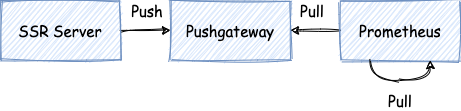
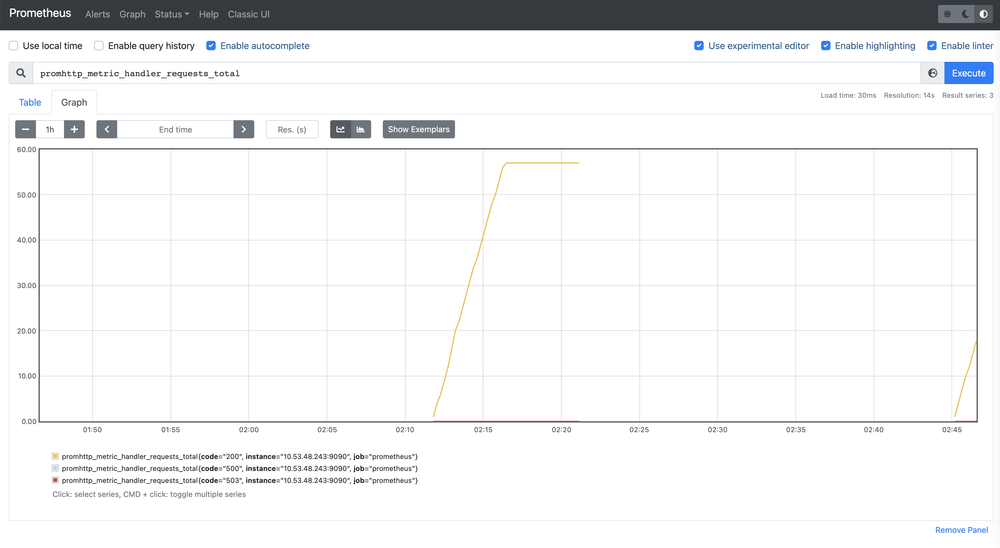
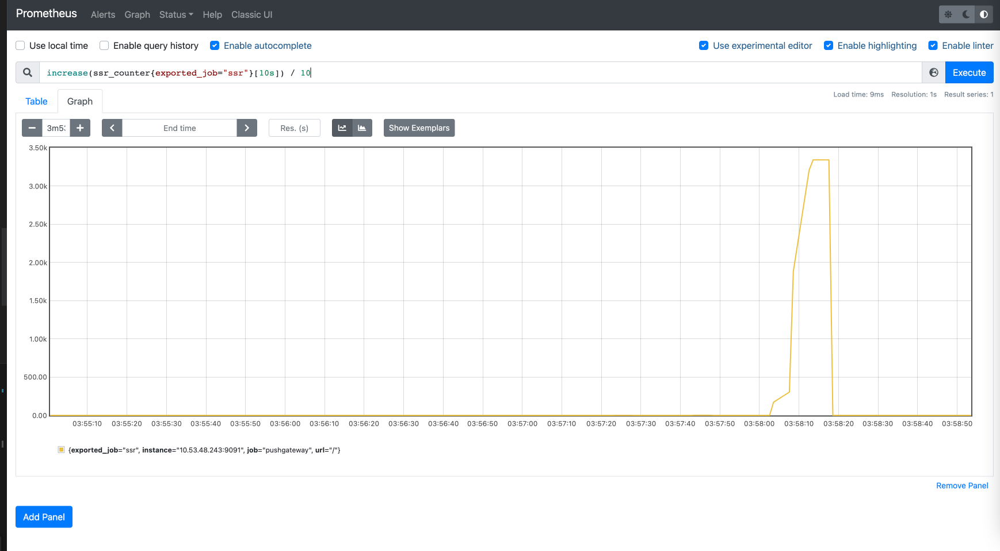
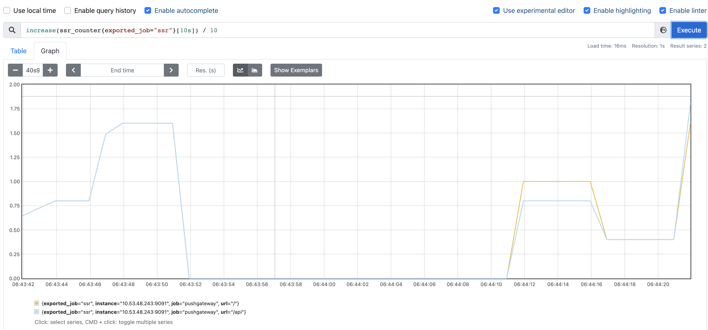
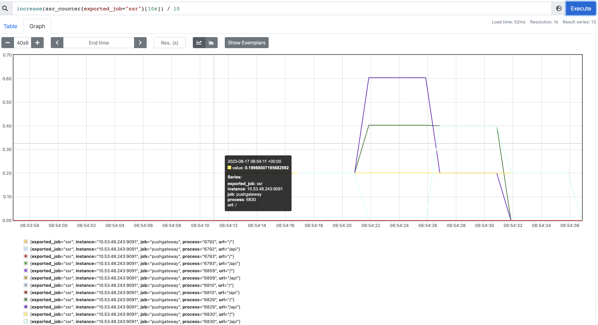
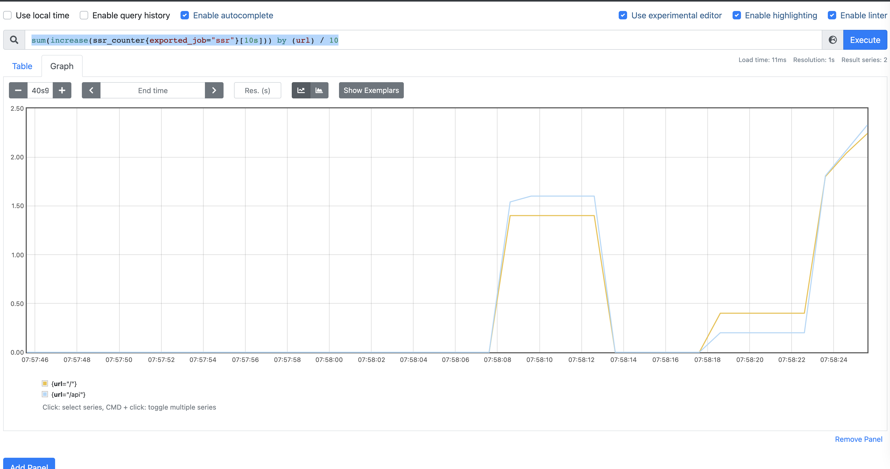
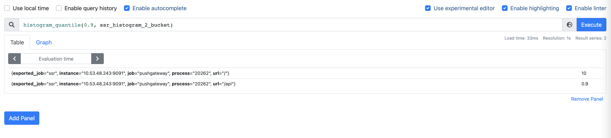
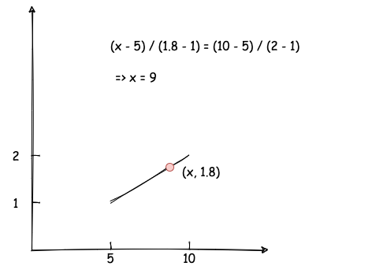

# 前言

SSR 服务成功上线后并不就是万事大吉，建立一套完善的服务监控系统也是非常重要。本文介绍如何通过 promethus 来对 SSR 服务进行监控。

# 环境搭建

使用 docker 搭建 promethus 环境是非常方便的，我们准备好这样一个目录：

```js
.
├── docker-compose.yml
├── prometheus
│   └── config.yml
```

其中 `docker-compose.yml` 内容如下：

```yml
version: '3'

services:
  prometheus:
    image: prom/prometheus:v2.30.3
    ports:
      - 9090:9090
    volumes:
      - ./prometheus:/etc/prometheus
      - prometheus-data:/prometheus
    command: --web.enable-lifecycle  --config.file=/etc/prometheus/config.yml
  prom-pushgateway:
    image: prom/pushgateway
    ports:
      - 9091:9091

volumes:
  prometheus-data:
```

`prometheus/config.yml`：

```js
global:
  scrape_interval: 5s
  scrape_timeout: 5s

scrape_configs:
  - job_name: 'prometheus'
    static_configs:
      - targets: ['10.53.48.243:9090'] // 机器 IP 地址

  - job_name: 'pushgateway'
    static_configs:
      - targets: ['10.53.48.243:9091']
```

然后执行 `docker-compose up`，这样就搞定了。

稍微解释下上面干了啥，我们启动了两个容器 `prometheus`、`prom-pushgateway`。`prometheus` 本身采取的是“拉模式”获取数据，为了实现“推模式”，我们启动了 `prom-pushgateway` 这个中间角色，这样我们的 SSR 服务就可以主动往 `prom-pushgateway` 推数据，而 `prometheus` 仍然从 `prom-pushgateway` 拉数据。`prometheus/config.yml` 配置了中定义了拉取数据的目标，即 `prom-pushgateway` 服务的地址，由于 `prometheus` 本身也会产生一些监控数据，所以这里还配置了它自己的地址。



我们在浏览器中打开 `http://localhost:9090/` 就可以进行体验了：



接下来我们通过几个案例来进一步了解 prometheus 的使用方式。

# 案例

## 案例一：监控 QPS

我们先准备一段代码来初始化监控客户端：

```js
const PromClient = require('prom-client')
const service = 'ssr'
const registry = new PromClient.Registry()
const gateway = new PromClient.Pushgateway(
  'http://localhost:9091',
  {},
  registry
)

export function initMonit() {
  setInterval(async () => {
    try {
      await gateway.pushAdd({
        jobName: service,
      })
    } catch (error) {
      console.error('pushgateway error', error)
    }
  }, 5000)
}

export const counter = new PromClient.Counter({
  registers: [registry],
  name: 'ssr_counter',
  help: 'ssr counter',
  labelNames: ['url'],
})
```

在我们的 `SSR` 代码中增加对请求数量的监控：

```js
...
const {initMonit, counter} = require('./prom')
const app = express()
initMonit()
app.get('/', (req, res, next) => {
  counter.labels({url: req.url}).inc()
  const reactApp = ReactDOMServer.renderToString(React.createElement(App))
  ...
})
...
```

然后我们在网页客户端上就可以通过 PromQL `increase(ssr_counter{exported_job="ssr"}[10s]) / 10` 来监控 QPS 了：



这里简单解释一下这条语句：由于 `PromClient.Counter` 是一个单调递增的数据类型，我们需要通过 `increase(ssr_counter{exported_job="ssr"}[10s])` 求得每个观测点相对于 10 秒前的增量，然后除以 10，就得到了每秒的请求量了，即 QPS。

_PS：更多关于 PromQL 的内容可以参考[官方](https://prometheus.io/docs/prometheus/latest/querying/basics/)_

这里只是监控了一个路由，如果是多个路由怎么办呢？比如，现在增加了一个 `/api` 的路由：

```js
...
app.get('/api', (req, res, next) => {
  res.end('hello')
})
...
```

我们当然可以在这个路由里面加上同样的逻辑，不过用一个中间件来统一处理是更好的做法：

```js
...
app.use((req, res, next) => {
  if (req.url.indexOf('static') === -1) counter.labels({url: req.url}).inc()
  next()
})
...
```

现在所有的请求都监控到了：


我们实际部署的时候一般会使用 pm2 启动多个进程，这个时候如果继续使用上面的方式会有些问题。首先，我们需要在 label 里面增加进程 ID，用来区别不同进程：

```js
export function initMonit() {
  setInterval(async () => {
    try {
      await gateway.pushAdd({
        jobName: service,
        groupings: {process: String(process.pid)},
      })
    } catch (error) {
      console.error('pushgateway error', error)
    }
  }, 5000)
}
```

此时，仍然用上面的 promQL 查询，会得到如下结果：


可以看到，现在的 QPS 是按照单个进程统计的，我们需要把他们加起来，将之前的语句改成这样既可：

```js
sum(increase(ssr_counter{exported_job="ssr"}[10s])) by (url) / 10
```



## 案例二：监控请求耗时

监控请求耗时需要用到一个新的数据类型，即 `PromClient.Histogram`:

```js
export const histogram = new PromClient.Histogram({
  registers: [registry],
  name: 'ssr_histogram',
  help: 'ssr histogram',
  labelNames: ['url'],
})
```

同样的，我们用一个中间件来统一处理：

```js
...
app.use(async (req, res, next) => {
  const startTime = Date.now()
  next()
  if (req.url.indexOf('static') === -1)
    histogram.labels({url: req.url}).observe(Date.now() - startTime)
})
...
```

为了简单起见，我们先启动一个进程进行实验。

我们的数据 `ssr_histogram` 是 Histogram 类型的，但其实 prometheus 为我们自动生成了三个 Counter 类型的数据：

`ssr_histogram_sum`：观测值的总和

`ssr_histogram_count`：观测的次数

`ssr_histogram_bucket`：累积直方图

通过这个 promQL 我们就可以统计接口耗时 90 线了：

```js
histogram_quantile(0.9, ssr_histogram_bucket)
```



下面我们举个例子来说明这个是怎么计算的，比如下面的这个数据：

```js
ssr_histogram_bucket{exported_job="ssr", le="+Inf", process="20379", url="/"} 2
ssr_histogram_bucket{exported_job="ssr", le="0.005", process="20379", url="/"} 0
ssr_histogram_bucket{exported_job="ssr", le="0.01", process="20379", url="/"} 0
ssr_histogram_bucket{exported_job="ssr", le="0.025", process="20379", url="/"} 0
ssr_histogram_bucket{exported_job="ssr", le="0.05", process="20379", url="/"} 0
ssr_histogram_bucket{exported_job="ssr", le="0.1", process="20379", url="/"} 0
ssr_histogram_bucket{exported_job="ssr", le="0.25", process="20379", url="/"} 0
ssr_histogram_bucket{exported_job="ssr", le="0.5", process="20379", url="/"} 0
ssr_histogram_bucket{exported_job="ssr", le="1", process="20379", url="/"} 0
ssr_histogram_bucket{exported_job="ssr", le="10", process="20379", url="/"} 2
ssr_histogram_bucket{exported_job="ssr", le="2.5", process="20379", url="/"} 1
ssr_histogram_bucket{exported_job="ssr", le="5", process="20379", url="/"} 1
```

可以这样计算 90 线：

1. 小于无穷大和小于 10 的值是一样的，说明 90 线不在这个区间。
2. 小于 5 的值 / 小于 10 的值为 0.5，说明 90 线在 5 - 10 这个区间，接下来通过线性插值得到 90 线：



如果是多进程的话，可以这样写：

```js
histogram_quantile(0.9, sum(ssr_histogram_bucket{}) by (le, url))
```

这里得到的是全量数据的 90 线，如果是想统计过去某段时间的，比如 1 分钟，可以这样写：

```js
histogram_quantile(0.9, sum(increase(ssr_histogram_bucket{}[1m])) by (le, url))
```

## 案例三：监控转化率

用户访问 SSR 提供的页面可以分为以下三个步骤：

1. 请求到达服务端
2. 用户加载到 HTML
3. 用户完成注水

其中 1 到 2，2 到 3 都有可能失败，为了监控用户的使用情况，我们需要监控用户在这几个步骤的转化率。

我们先定义一个 Counter 类型的数据：

```js
export const eventCounter = new PromClient.Counter({
  registers: [registry],
  name: 'ssr_event_counter',
  help: 'ssr event counter',
  labelNames: ['event'],
})
```

同时修改 `/api` 路由：

```js
app.get('/api', (req, res, next) => {
  const {event} = req.query
  eventCounter.labels({event}).inc()
  res.end()
})
```

接着，我们在 HTML 脚本和组件里面分别调用 `/api` 接口上报数据：

```html
  ...
    <script>
      fetch('/api?event=htmlLoaded')
    </script>
  </body>
  ...
```

```js
...
useEffect(() => {
  fetch('/api?event=hydrated')
}, [])
...
```

之后可以使用这些语句来统计各个步骤的转化率：

```js
sum(increase(ssr_event_counter{event="htmlLoaded"}[1m])) / sum(increase(ssr_counter{url="/"}[1m])) // 1 -> 2
sum(increase(ssr_event_counter{event="hydrated"}[1m])) / sum(increase(ssr_event_counter{event="htmlLoaded"}[1m])) // 2 -> 3
sum(increase(ssr_event_counter{event="hydrated"}[1m])) / sum(increase(ssr_counter{url="/"}[1m])) // 1 -> 3
```

# 总结

本文通过几个案例简单介绍了使用 prometheus 监控 SSR 服务的方法，实际上 prometheus 还有好几种其他的数据类型，而且 promQL 的功能也很丰富，以后用到了再研究吧。
