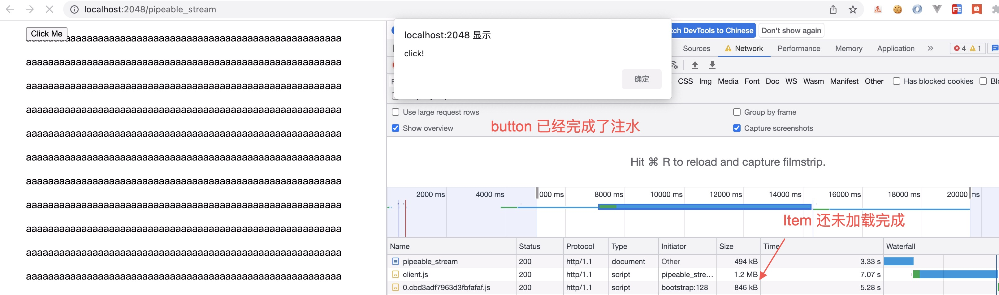

# 前言

React 团队在[这篇文章](https://github.com/reactwg/react-18/discussions/37)中介绍了 React 18 SSR 的新架构，主要用于解决之前 SSR 的几个问题：

1. 必须获取到所有数据以后，才能返回内容
2. 必须加载到所有 JS 代码后，才能开始进行注水
3. 必须等整个应用注水完成后，才能开始进行交互

所以 React 团队提出了用流式渲染（Streaming Render）和选择性注水（Selective Hydration）来分别解决第一个和其他两个问题。

# Streaming Render

> 以下 Demo 使用的 react 及 react-dom 版本为 16.14.0

假设我们有如下应用：

```js
import React from 'react'

const Item = () => {
  const start = Date.now()
  // 人为增加该组件的渲染时间
  while (Date.now() - start < 2) {}
  return <li>a</li>
}

const App = () => {
  return (
    <ul>
      List:
      {[...new Array(3700)].map((_, i) => {
        return <Item />
      })}
    </ul>
  )
}

export default App
```

我们使用 `renderToString` 来进行服务端渲染：

```js
app.get('/string', async (req, res) => {
  const markup = renderToString(<App />)
  res.end(`
    <!DOCTYPE html>
      <html>
        <head>
          <title>Demo</title>
          <style>
            li {
              display: inline-block;
            }
          </style>
        </head>
        <body>
          <div id="root">${markup}</div>
        </body>
      </html>
    `)
})
```

通过浏览器访问，可以看到需要等待比较长的诗句页面才显示出所有内容：


我们换成 `renderToNodeStream` 再试一试：

```js
app.get('/node_stream', (req, res, next) => {
  res.write(`<!DOCTYPE html>
      <html>
        <head>
          <title>Demo</title>
          <style>
            li {
              display: inline-block;
            }
          </style>
        </head>
        <body>
          <div id="root">`)
  const stream = renderToNodeStream(<App />)
  stream.pipe(res, {end: false})
  stream.on('end', () => {
    res.write(`</div>
          </body>
        </html>`)
    res.end()
  })
})
```

可以看到浏览器中先显示了一部分内容，然后才显示所有内容：


这样，当用户访问一个大型的 React 页面时，可以让其尽早的看到一部分内容，从而提供一个比较好的用户体验。

那么，React 每次返回多少内容呢？通过断点调试可以知道，这个值是 16 KB。但是实际返回的长度可能会略大于 16 KB，因为 React 总是会完整的返回标签，比如 `</li>`，而不是拆成两部分 `</` 和 `li>`。


为了能够让开发更好的控制流式渲染每次返回的内容，我们可以结合 `Suspense`，但是由于 16 版本不支持 SSR 使用 `Suspense`，所以接下来我们换成 v18.2.0 继续我们的实验。

假设我们有如下应用，期待的效果是用户先看到 `List:Loading`，4 秒后显示 `List:Loading`。

```js
import React, {Suspense} from 'react'

const Item = ({index}) => {
  return 'a'
}

const Comp = React.lazy(
  () =>
    new Promise((resolve, reject) => {
      setTimeout(() => {
        resolve({default: Item})
      }, 4000)
    })
)

const App = () => {
  return (
    <ul>
      List:
      <Suspense fallback='Loading'>
        <Comp />
      </Suspense>
    </ul>
  )
}

export default App
```

我们先用 `renderToNodeStream` 试试，可以看到，页面并没有像我们所期待的那样，而是一开始显示空白，4 秒后才显示 `List:a`，这实际上已经失去 Streaming Render 的功能了，所以这个函数在 React 18 中被标记为了 `deprecated`，使用 `renderToPipeableStream` 来替代。更多详情请见 [Upgrading to React 18 on the server](https://github.com/reactwg/react-18/discussions/22)。


我们换成 `renderToPipealbeStream` 就可以看到我们期望的效果了：


其原理也很简单，第一次返回的内容为：

```html
<ul>
  List:<!--$?--><template id="B:0"></template
  >Loading<!--/$-->
</ul>
```

第二次返回的内容为：

```html
<div hidden id="S:0">a<!-- --></div>
<script>
  function $RC(a, b) {
    a = document.getElementById(a)
    b = document.getElementById(b)
    b.parentNode.removeChild(b)
    if (a) {
      a = a.previousSibling
      var f = a.parentNode,
        c = a.nextSibling,
        e = 0
      do {
        if (c && 8 === c.nodeType) {
          var d = c.data
          if ('/$' === d)
            if (0 === e) break
            else e--
          else ('$' !== d && '$?' !== d && '$!' !== d) || e++
        }
        d = c.nextSibling
        f.removeChild(c)
        c = d
      } while (c)
      for (; b.firstChild; ) f.insertBefore(b.firstChild, c)
      a.data = '$'
      a._reactRetry && a._reactRetry()
    }
  }
  $RC('B:0', 'S:0')
</script>
```

其中 `<script>` 中的代码主要功能是将 `<template id="B:0"></template>Loading` 用 `a<!-- -->` 来替换。

这样，React 不用等待整个应用的数据全部准备好才开始返回 HTML 内容给用户了，从而解决了第一个问题：“必须获取到所有数据以后，才能返回内容”。

# Selection Hydration

> 以下 Demo 使用的 react 及 react-dom 版本为 18.2.0

我们改写一下我们的例子，来看看 React 是怎么解决第二个问题的：

```js
import React, {Suspense} from 'react'

const Comp = React.lazy(() => import('./Item')) // Item.js 是一个非常大的文件，大于 600 KB

const App = () => {
  return (
    <ul>
      <button onClick={() => window.alert('click!')}>Click Me</button>
      <Suspense fallback='Loading'>
        <Comp />
      </Suspense>
    </ul>
  )
}

export default App
```

这个例子中 `Item.js` 会被单独打包成一个 chunk，我们仍然使用 `renderToPipeableStream` 来进行渲染，可以看到在 `Item.js` 这个 chunk 加载完成前，`button` 已经完成了注水：



这样，第二个问题：“必须加载到所有 JS 代码后，才能开始进行注水” 也解决了。

为了说明第三个问题，我们先准备一下我们的 Demo：

```js
// App.js
import React, {Suspense} from 'react'

const Comp = React.lazy(() => import('./ExpensiveComp'))
const Button = React.lazy(() => import('./Button'))

const App = () => {
  return (
    <div>
      <Suspense fallback={<div>Loading Comp!</div>}>
        <Comp />
      </Suspense>
      <Suspense fallback={<div>Loading Button!</div>}>
        <Button />
      </Suspense>
    </div>
  )
}

export default App

// ExpensiveComp.js
import React from 'react'
const ExpensiveComp = () => {
  return (
    <ul>
      {[...new Array(5)].map((_, i) => (
        <Item key={i} index={i} />
      ))}
    </ul>
  )
}

const Item = ({index}) => {
  const start = Date.now()
  while (Date.now() - start < 1000) {}
  return <li>Item ${index}</li>
}

export default ExpensiveComp

// Button.js
import React from 'react'

const Button = () => {
  return (
    <button
      onClick={() => {
        window.alert('click button!')
      }}>
      Button
    </button>
  )
}

export default Button
```

然后，我们在 `react-dom` 代码中加入一句调试的代码：

```js
function hydrateInstance(instance, type, props, rootContainerInstance, hostContext, internalInstanceHandle, shouldWarnDev) {
  console.log('hydrateInstance-precacheFiberNode', internalInstanceHandle, instance)
  ...
```

正常情况下，React 的注水过程如图所示：


但实际上，我们可以在 `button` 未注水完成时就点击：


是不是这样感觉有点奇怪？按照我们平时的理解，“注水”的一个重要作用就是给元素绑定事件，但是这里还未“注水”却可以响应事件。

其秘诀还是在于 React 的事件委托机制。所有的事件都是绑定到了根元素之上，事件在根元素上触发后可以通过 `event.target` 获取到事件触发的目标元素，通过该元素可以获取到 `<!--$-->` 这个注释元素：

```js
<!--$-->
<button>Button</button>
```

然后通过注释元素上的 `'__reactFiber$' + randomKey`（更多可参考[]()） 这个属性可以获取到其对应的 `FiberNode`，此例中即为 `Suspense`。之后会尝试对齐进行 `hydrate`：

```js
function dispatchEventWithEnableCapturePhaseSelectiveHydrationWithoutDiscreteEventReplay(...) {
attemptSynchronousHydration(fiber)
}
```

这里会重启一轮新的更新流程，当走到第一个 `Suspense` 走到了这里，所以会跳过其下面的子节点。

```js
case SuspenseComponent:
      {
        var state = workInProgress.memoizedState;

        if (state !== null) {
          // 表示还未注水完成
          if (state.dehydrated !== null) {
            pushSuspenseContext(workInProgress, setDefaultShallowSuspenseContext(suspenseStackCursor.current)); // We know that this component will suspend again because if it has
            // been unsuspended it has committed as a resolved Suspense component.
            // If it needs to be retried, it should have work scheduled on it.

            workInProgress.flags |= DidCapture; // We should never render the children of a dehydrated boundary until we
            // upgrade it. We return null instead of bailoutOnAlreadyFinishedWork.

            return null;
          } // I
```

完成这一轮后，会继续未完成的其他更新任务。

# 总结

从上面的几个例子来看，解决这些问题都离不开 `Suspense` 这个组件，毫无疑问这是一个非常重要的组件，值得后续认真研究一下。
