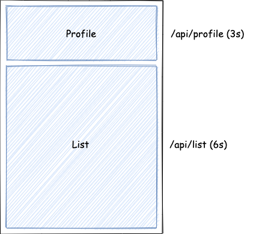

# 前言

之前写过一篇[文章](/2022/09/16/react-ssr-stream-selection-render/)介绍了 React 18 SSR 新架构，今天继续基于此架构实战一下。假设我们的业务背景如下：



我们的页面分为两大块，上面部分是个人介绍，依赖接口 `/api/profile` （耗时约 3s），下面部分是文章列表，依赖接口 `/api/list`（耗时约 6s）。其中文章列表的业务逻辑非常重，代码体积很大，依赖的接口比较慢。

我们先来看下传统的 SSR （服务端获取到所有接口数据后调用 `renderToString` 渲染出内容返回给前端，同时在页面中插入全局的 INITIAL_STATE 供客户端注水）和基于 Stream Rendering & Suspense for Data Fetching （以下简称 Stream SSR）两者的效果对比：

|                    传统 SSR                    |                 Stream SSr                  |
| :--------------------------------------------: | :-----------------------------------------: |
|  |  |

首先，我们来对比下从用户发起请求到用户看到内容这个阶段。传统 SSR 用户看到的都是一个空白页面，一直要等到最耗时的 `/api/list` 接口返回用户才能看到内容。而 Stream SSR 有以下几点的提升：

- 在页面内容返回前有 loading 的提示
- `Profile` 的内容先处理完，先返回，没有被 `List` 阻塞

同样的，注水过程也是如此。传统 SSR 需要等到 JS 加载完后，统一对整个应用进行注水。而 Stream SSR 则先完成了 `Profile` 的注水。

那么，要怎么实现这样的效果呢？接下来让我们 step by step。或者直接看[代码](https://github.com/ParadeTo/react-stream-rendering-suspense)

# React SSR Stream Rendering & Suspense for Data Fetching 实践

## Stream Rendering

首先，为了实现 Stream Rendering，我们需要使用 `renderToPipeableStream`，假设我们有如下 HTML 模板：

```js
<!DOCTYPE html>
<html lang="en">
  <head>
    <meta charset="UTF-8" />
    <meta http-equiv="X-UA-Compatible" content="IE=edge" />
    <meta name="viewport" content="width=device-width, initial-scale=1.0" />
    <title>SSR + MicroFrontend</title>
  </head>
  <body>
    <div id="app1"><!-- app1 --></div>
    <script crossorigin src="http://localhost:8080/dist/client.js"></script>
  </body>
</html>
```

则我们可以按如下方式进行返回：

```js
app.get('/', async (req, res) => {
  const [heal, tail] = html.split('<!-- app1 -->')

  const stream = new Writable({
    write(chunk, _encoding, cb) {
      res.write(chunk, cb)
    },
    final() {
      res.end(tail)
    },
  })

  const {pipe} = renderToPipeableStream(<App />, {
    onShellReady() {
      res.statusCode = 200
      res.write(head)
      pipe(stream)
    },
  })
})
```

看着有点奇怪是吧，这是因为 `renderToPipeableStream` 的返回不再是 Node.js 中的 `ReadableStream` 对象，无法监听 `end` 事件。所以这里通过一个中间的 `Writable` 对象来转接数据，并监测渲染流的结束。

Stream Rendering 的部分搞定了，接下来我们看看 Data Fetching 部分。

## Suspense for Data Fetching

在[这篇文章](/2022/04/03/react-suspense/)曾经提到过结合 `Suspense` 做 Data Fetching，但是之前是自己实现的一个简单的请求工具，为了更贴近实际，这次使用 `react-query`。则组件中可以按照如下方式来请求数据：

```js
async function getList() {
  const rsp = await fetch('http://localhost:9000/api/list')
  const data = await rsp.json()
  return data
}

const List = () => {
  const query = useQuery(['list'], getList)

  return (
    <ul>
      {query.data.map((item) => (
        <li key={item.name}>{item.name}</li>
      ))}
    </ul>
  )
}
```

在使用该组件的时候，可以用 `Suspense` 包裹起来，以便于数据返回前用户可以看到一个 loading 的效果：

```js
const App = () => {
  return (
    <div>
      <Suspense fallback={<p>Loading List...</p>}>
        <List />
      </Suspense>
      ...
    </div>
  )
}
```

同时为了减少入口文件的体积，我们通过异步的方式来引入 `List` 这个比较大的组件：

```js
const List = React.lazy(() => import('./List'))
```

类似的，`Profile` 组件也可以按照同样的方式来处理。

这样，Stream Rendering & Suspense for Data Fetching 基本上算是实现了。不过现在还有个问题，对于每个组件，我们会分别在服务端和客户端都请求一次接口。正确的做法应该是只在服务端请求一次，然后服务端返回 HTML 的时候把接口数据也一并带上，作为 CSR 的初始数据。

[React Query 官网](https://react-query-v3.tanstack.com/guides/ssr)中有介绍 SSR 相关的内容，但是跟传统的 SSR 没什么区别，也是要等到数据都获取完后，才开始渲染：

```js
 function handleRequest (req, res) {
   const queryClient = new QueryClient()
   await queryClient.prefetchQuery('key', fn)
   const dehydratedState = dehydrate(queryClient) // 得到一个接口请求的全局状态

   const html = ReactDOM.renderToString(
     <QueryClientProvider client={queryClient}>
       <Hydrate state={dehydratedState}>
         <App />
       </Hydrate>
     </QueryClientProvider>
   )

   res.send(`
     <html>
       <body>
         <div id="root">${html}</div>
         <script>
           window.__REACT_QUERY_STATE__ = ${JSON.stringify(dehydratedState)};
         </script>
       </body>
     </html>
   `)

   queryClient.clear()
 }
```

这样的做法有几个缺点：

- 整个应用的渲染都被阻塞了，原本可以更早返回的 `Profile` 也被推迟了
- 必须要知道当前页面渲染所需要调用的所有接口，当页面很复杂且由多人维护时这个代码就很不好维护了

下面我们来解决这些问题，最终的方案我称之为“全局状态动态更新”方案。

## 全局状态动态更新

从上面的代码可以知道，通过 `dehydrate(queryClient)` 可以得到一个全局的对象用来描述当前请求得到的数据，那我们是不是可以在组件里面每次有数据获取到时就来更新一下这个对象呢？就像这样：

```js
const query = useQuery(['data'], getList)
const ee = useContext(EventEmitterContext)
if (ee && query.data) {
  ee.emit('updateState')
}
```

然后我们在处理请求的回调函数中监听这个事件，更新全局状态：

```js
  const templateDOM = new JSDOM(`
<!DOCTYPE html>
<html lang="en">
  <head>
  ...
  </head>
  <body>
    <div id="app1"><!-- app1 --></div>
    <script id="reactQueryState">window.__REACT_QUERY_STATE__ = ${JSON.stringify(
      dehydratedState
    )};</script>
    ...
  </body>
</html>
`)
...
ee.on('updateState', () => {
  const dehydratedState = dehydrate(queryClient)
  templateDoc.querySelector(
    '#reactQueryState'
  ).innerHTML = `window.__REACT_QUERY_STATE__ = ${JSON.stringify(
    dehydratedState
  )};`
})
```

这样我们就做到了仍然流式的返回内容给用户，并在这个过程中不停的更新全局数据，最后返回给客户端，而且也不需要了解这个页面渲染所需要的所有接口，即保证了用户体验，又没有丢失代码的可维护性。

React 团队一直在提高用户体验、代码可维护性和性能这些方面进行不停的探索，感觉不久的将来前端的开发方式又要被他们改变了，看来前端还没有死，还能继续折腾。
