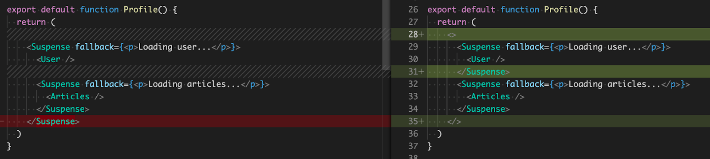
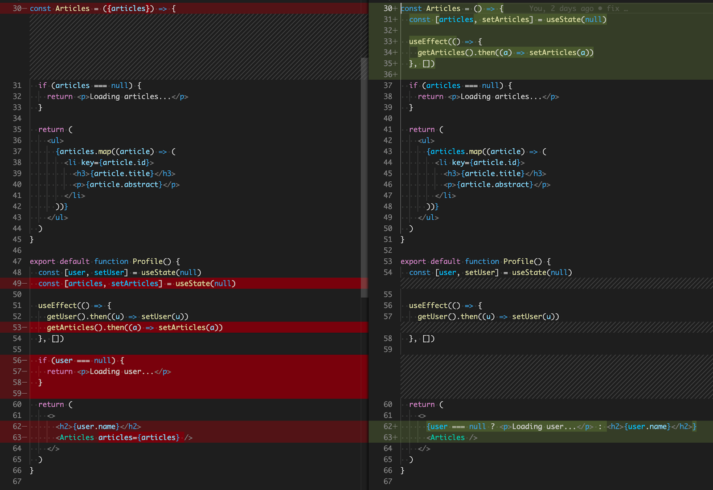
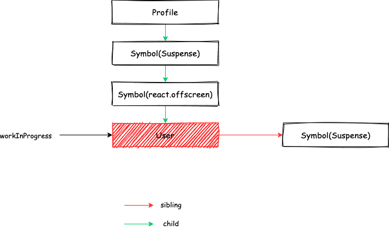
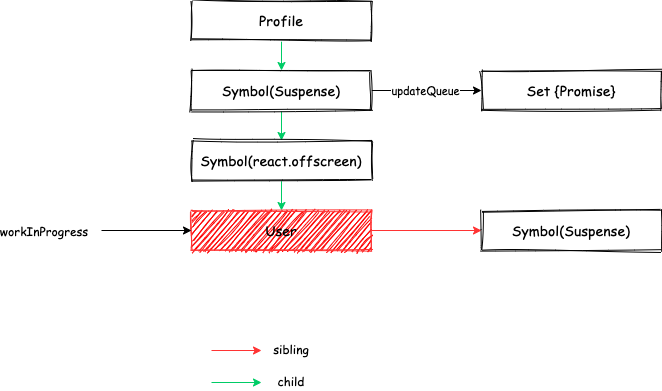
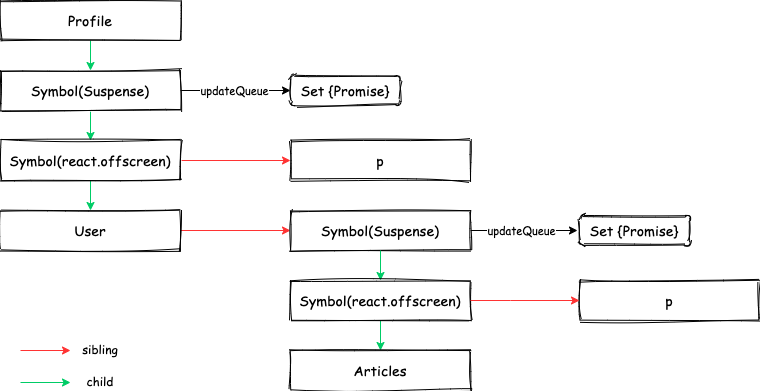
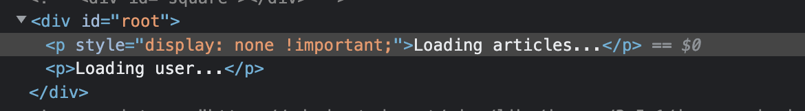

# Suspense 提出的背景

假设我们现在有如下一个应用：

```js
const Articles = () => {
  const [articles, setArticles] = useState(null)

  useEffect(() => {
    getArticles().then((a) => setArticles(a))
  }, [])

  if (articles === null) {
    return <p>Loading articles...</p>
  }

  return (
    <ul>
      {articles.map((article) => (
        <li key={article.id}>
          <h3>{article.title}</h3>
          <p>{article.abstract}</p>
        </li>
      ))}
    </ul>
  )
}

export default function Profile() {
  const [user, setUser] = useState(null)

  useEffect(() => {
    getUser().then((u) => setUser(u))
  }, [])

  if (user === null) {
    return <p>Loading user...</p>
  }

  return (
    <>
      <h2>{user.name}</h2>
      <Articles articles={articles} />
    </>
  )
}
```

该应用是一个用户的个人主页，包含用户的基本信息（例子中只有名字）以及用户的文章列表，并且规定了必须等待用户获取成功后才能渲染其基本信息以及文章列表。
该应用看似简单，但却存在着以下几个问题：

- "Waterfalls"，意思是文章列表必须要等到用户请求成功以后才能开始渲染，从而对于文章列表的请求也会被用户阻塞，但其实对于文章的请求是可以同用户并行的。
- "fetch-on-render"，无论是 `Profile` 还是 `Articles` 组件，都是需要等到渲染一次后才能发出请求。

对于第一个问题，我们可以通过修改代码来优化：

```js
const Articles = ({articles}) => {
  if (articles === null) {
    return <p>Loading articles...</p>
  }

  return (
    <ul>
      {articles.map((article) => (
        <li key={article.id}>
          <h3>{article.title}</h3>
          <p>{article.abstract}</p>
        </li>
      ))}
    </ul>
  )
}

export default function Profile() {
  const [user, setUser] = useState(null)
  const [articles, setArticles] = useState(null)

  useEffect(() => {
    getUser().then((u) => setUser(u))
    getArticles().then((a) => setArticles(a))
  }, [])

  if (user === null) {
    return <p>Loading user...</p>
  }

  return (
    <>
      <h2>{user.name}</h2>
      <Articles articles={articles} />
    </>
  )
}
```

现在获取用户和获取文章列表的逻辑已经可以并行了，但是这样又导致 `Articles` 组件同其数据获取相关的逻辑分离，随着应用变得复杂后，这种方式可能会难以维护。同时第二个问题 "fetch-on-render" 还是没有解决。而 Suspense 的出现可以很好的解决这些问题，接下来就来看看是如何解决的。

# Suspense 的使用

## Suspense 用于数据获取

还是上面的例子，我们使用 Suspense 来改造一下：

```js
// Profile.js
import React, {Suspense} from 'react'
import User from './User'
import Articles from './Articles'

export default function Profile() {
  return (
    <Suspense fallback={<p>Loading user...</p>}>
      <User />
      <Suspense fallback={<p>Loading articles...</p>}>
        <Articles />
      </Suspense>
    </Suspense>
  )
}

// Articles.js
import React from 'react'
import {getArticlesResource} from './resource'

const articlesResource = getArticlesResource()
const Articles = () => {
  debugger
  const articles = articlesResource.read()
  return (
    <ul>
      {articles.map((article) => (
        <li key={article.id}>
          <h3>{article.title}</h3>
          <p>{article.abstract}</p>
        </li>
      ))}
    </ul>
  )
}

// User.js
import React from 'react'
import {getUserResource} from './resource'

const userResource = getUserResource()
const User = () => {
  const user = userResource.read()
  return <h2>{user.name}</h2>
}

// resource.js
export function wrapPromise(promise) {
  let status = 'pending'
  let result
  let suspender = promise.then(
    (r) => {
      debugger
      status = 'success'
      result = r
    },
    (e) => {
      status = 'error'
      result = e
    }
  )
  return {
    read() {
      if (status === 'pending') {
        throw suspender
      } else if (status === 'error') {
        throw result
      } else if (status === 'success') {
        return result
      }
    },
  }
}

export function getArticles() {
  return new Promise((resolve, reject) => {
    const list = [...new Array(10)].map((_, index) => ({
      id: index,
      title: `Title${index + 1}`,
      abstract: `Abstract${index + 1}`,
    }))
    setTimeout(() => {
      resolve(list)
    }, 2000)
  })
}

export function getUser() {
  return new Promise((resolve, reject) => {
    setTimeout(() => {
      resolve({
        name: 'Ayou',
        age: 18,
        vocation: 'Program Ape',
      })
    }, 3000)
  })
}

export const getUserResource = () => {
  return wrapPromise(getUser())
}

export const getArticlesResource = () => {
  return wrapPromise(getArticles())
}
```

首先，在 `Profile.js` 中开始引入 `User` 和 `Articles` 的时候就已经开始请求数据了，即 "Render-as-You-Fetch"（渲染的时候请求），且两者是并行的。当渲染到 `User` 组件的时候，由于此时接口请求还未返回，`const user = userResource.read()` 会抛出异常：

```js
...
  read() {
    if (status === 'pending') {
      throw suspender
    } else if (status === 'error') {
      throw result
    } else if (status === 'success') {
      return result
    }
  },
...
```

而 `Suspense` 组件的作用是，当发现其包裹的组件抛出异常且异常为 `Promise` 对象时，会渲染 `fallback` 中的内容，即 `<p>Loading user...</p>`。等到 `Promise` 对象 `resolve` 的时候会再次触发重新渲染，显示其包裹的内容，又因为获取文章列表的时间比用户短，所以这里会同时显示用户信息及其文章列表（具体过程后续会再进行分析）。这样，通过 `Suspense` 组件，我们就解决了前面的两个问题。

同时，使用 `Suspense` 还会有另外一个好处，假设我们现在改变我们的需求，允许用户信息和文章列表独立渲染，则使用 `Suspense` 重构起来会比较简单：



而如果使用原来的方式，则需要修改的地方比较多：



可见，使用 `Suspense` 会带来很多好处。当然，上文为了方便说明，写得非常简单，实际开发时会结合 [Relay](https://relay.dev/) 这样的库来使用，由于这一款目前还处于试验阶段，所以暂时先不做过多的讨论。

`Suspense` 除了可以用于上面的数据获取这种场景外，还可以用来实现 `Lazy Component`。

## Lazy Component

```js
import React, {Suspense} from 'react'
const MyComp = React.lazy(() => import('./MyComp'))
export default App() {
  return (
    <Suspense fallback={<p>Loading Component...</p>}>
      <MyComp />
    </Suspense>
  )
}
```

我们知道 `import('./MyComp')` 返回的是一个 `Promise` 对象，其 `resolve` 的是一个模块，既然如此那这样也是可以的：

```js
import React, {Suspense} from 'react'

const MyComp = React.lazy(
  () =>
    new Promise((resolve) =>
      setTimeout(
        () =>
          resolve({
            default: function MyComp() {
              return <div>My Comp</div>
            },
          }),
        1000
      )
    )
)

export default function App() {
  return (
    <Suspense fallback={<p>Loading Component...</p>}>
      <MyComp />
    </Suspense>
  )
}
```

甚至，我们可以通过请求来获取 `Lazy Component` 的代码：

```js
import React, {Suspense} from 'react'

const MyComp = React.lazy(
  () =>
    new Promise(async (resolve) => {
      const code = await fetch('http://xxxx')
      const module = {exports: {}}
      Function('export, module', code)(module.exports, module)
      resolve({default: module.exports})
    })
)

export default function App() {
  return (
    <Suspense fallback={<p>Loading Component...</p>}>
      <MyComp />
    </Suspense>
  )
}
```

这也是我们实现[远程组件](/2021/12/10/react-dynamic-component/)的基本原理。

# 原理

介绍了这么多关于 `Suspense` 的内容后，你一定很好奇它到底是如何实现的吧，我们先不研究 React 源码，先尝试自己实现一个 `Suspense`：

```js
import React, {Component} from 'react'

export default class Suspense extends Component {
  state = {
    isLoading: false,
  }

  componentDidCatch(error, info) {
    if (this._mounted) {
      if (typeof error.then === 'function') {
        this.setState({isLoading: true})
        error.then(() => {
          if (this._mounted) {
            this.setState({isLoading: false})
          }
        })
      }
    }
  }

  componentDidMount() {
    this._mounted = true
  }
  componentWillUnmount() {
    this._mounted = false
  }

  render() {
    const {children, fallback} = this.props
    const {isLoading} = this.state

    return isLoading ? fallback : children
  }
}
```

其核心原理就是利用了 “Error Boundary” 来捕获子组件中的抛出的异常，且如果抛出的异常为 `Promise` 对象，则在传入其 `then` 方法的回调中改变 `state` 触发重新渲染。

接下来，我们还是用上面的例子来分析一下整个过程：

```js
export default function Profile() {
  return (
    <Suspense fallback={<p>Loading user...</p>}>
      <User />
      <Suspense fallback={<p>Loading articles...</p>}>
        <Articles />
      </Suspense>
    </Suspense>
  )
}
```

我们知道 React 在渲染时会构建 Fiber Tree，当处理到 `User` 组件时，React 代码中会捕获到异常：

```js
do {
  try {
    workLoopConcurrent()
    break
  } catch (thrownValue) {
    handleError(root, thrownValue)
  }
} while (true)
```



其中，异常处理函数 `handleError` 主要做两件事：

```js
throwException(
  root,
  erroredWork.return,
  erroredWork,
  thrownValue,
  workInProgressRootRenderLanes
)
completeUnitOfWork(erroredWork)
```

其中，`throwException` 主要是往上找到最近的 `Suspense` 类型的 Fiber，并更新其 `updateQueue`：

```js
const wakeables: Set<Wakeable> = (workInProgress.updateQueue: any)
if (wakeables === null) {
  const updateQueue = (new Set(): any)
  updateQueue.add(wakeable) // wakeable 是 handleError(root, thrownValue) 中的 thrownValue，是一个 Promise 对象
  workInProgress.updateQueue = updateQueue
} else {
  wakeables.add(wakeable)
}
```



而 `completeUnitOfWork(erroredWork)` 在[React 源码解读之首次渲染流程](/2020/07/26/react-first-render/)中已经介绍过了，此处就不再赘述了。

`render` 阶段后，会形成如下所示的 Fiber 结构：



之后会进入 `commit` 阶段，将 Fiber 对应的 DOM 插入到容器之中：



注意到 `Loading articles...` 虽然也被插入了，但是确实不可见的。

前面提到过 `Suspense` 的 `updateQueue` 中保存了 `Promise` 请求对象，我们需要在其 `resolve` 以后触发应用的重新渲染，这一步骤仍然是在 `commit` 阶段实现的：

```js
function commitWork(current: Fiber | null, finishedWork: Fiber): void {
  ...
  case SuspenseComponent: {
    commitSuspenseComponent(finishedWork);
    attachSuspenseRetryListeners(finishedWork);
    return;
  }
  ...
}
```

```js
function attachSuspenseRetryListeners(finishedWork: Fiber) {
  // If this boundary just timed out, then it will have a set of wakeables.
  // For each wakeable, attach a listener so that when it resolves, React
  // attempts to re-render the boundary in the primary (pre-timeout) state.
  const wakeables: Set<Wakeable> | null = (finishedWork.updateQueue: any)
  if (wakeables !== null) {
    finishedWork.updateQueue = null
    let retryCache = finishedWork.stateNode
    if (retryCache === null) {
      retryCache = finishedWork.stateNode = new PossiblyWeakSet()
    }
    wakeables.forEach((wakeable) => {
      // Memoize using the boundary fiber to prevent redundant listeners.
      let retry = resolveRetryWakeable.bind(null, finishedWork, wakeable)
      if (!retryCache.has(wakeable)) {
        if (enableSchedulerTracing) {
          if (wakeable.__reactDoNotTraceInteractions !== true) {
            retry = Schedule_tracing_wrap(retry)
          }
        }
        retryCache.add(wakeable)
        // promise resolve 了以后触发 react 的重新渲染
        wakeable.then(retry, retry)
      }
    })
  }
}
```

# 总结

本文介绍了 `Suspense` 提出的背景、使用方式以及原理，从文中可看出 `Suspense` 用于数据获取对我们的开发方式将是一个巨大的影响，但是目前还处在实验阶段，所以留给“中国队”的时间还是很充足的。
