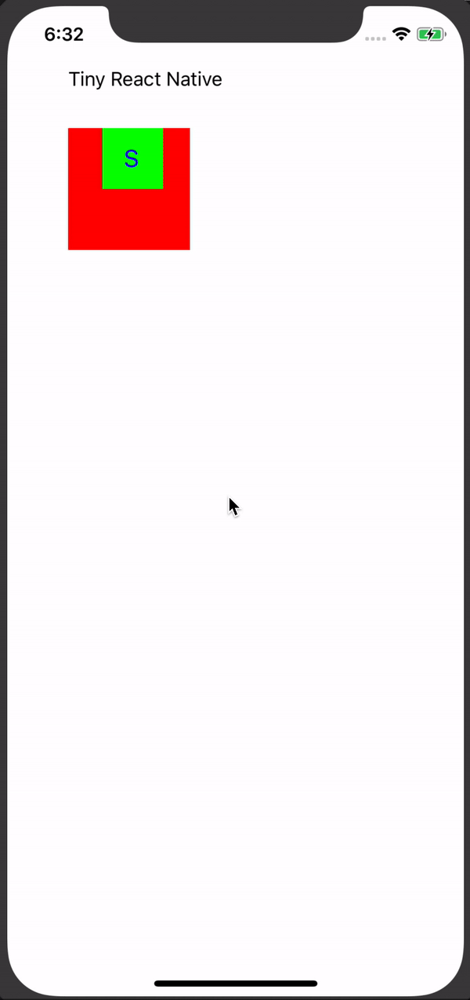
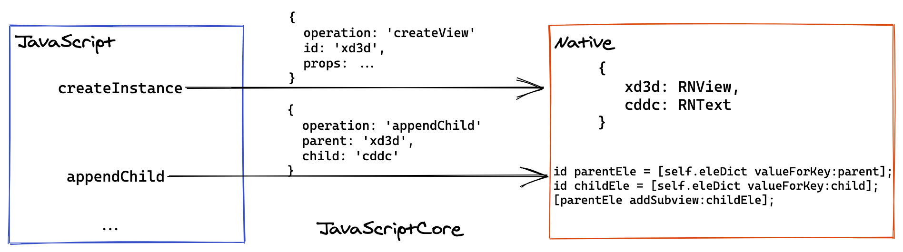

# 引言
上一次，我们成功的把 [React 应用渲染到了 Canvas 上面](/2021/01/28/react-custom-renderer/)。今天我们野心更大一点，来实现一个简单的 React Native，我们叫他 Extremely Tiny React Native。我们最终实现的效果如下图所示：



所对应的 React 代码如下：

```jsx
import React from 'react'
import {View, Text} from './react-native'
import {useEffect, useState, useRef} from 'react'

const W = 100
const innerW = 50

function useUpdate() {
  const [_, _update] = useState()
  return () => _update(Math.random())
}

function App() {
  const x = useRef(0)
  const y = useRef(0)
  const update = useUpdate()
  const animate = () => {
    setTimeout(() => {
      if (y.current === 0 && x.current < W - innerW) {
        x.current += 1
      } else if (x.current >= W - innerW && y.current < W - innerW) {
        y.current += 1
      } else if (y.current >= W - innerW && x.current > 0) {
        x.current -= 1
      } else {
        y.current -= 1
      }
      update()
      animate()
    }, 50)
  }
  useEffect(() => {
    animate()
  }, [])
  return (
    <>
      <Text x={50} y={50} w={W} h={W} r={0} g={0} b={0} a={1} fontSize={16}>
        Tiny React Native
      </Text>
      <View x={50} y={100} w={W} h={W} r={255} g={0} b={0} a={1}>
        <View
          x={x.current}
          y={y.current}
          w={innerW}
          h={innerW}
          r={0}
          g={255}
          b={0}
          a={1}>
          <Text
            x={18}
            y={13}
            w={50}
            h={50}
            r={0}
            g={0}
            b={255}
            a={1}
            fontSize={20}>
            S
          </Text>
        </View>
      </View>
    </>
  )
}
```

# 前置知识准备
实现这个 Extremely Tiny React Native 所需要的两个核心知识是：
  * JavaScriptCore
  * React Custom Renderer


其中 React Custom Renderer 之前已经介绍过了，详见[React 源码解析之 Custom Renderer](/2021/04/30/react-tiny-rn/)，所以这里我们只简单的介绍下 JavaScriptCore。

## JavaScriptCore
`JavaScriptCore` （以下简称 JSCore）是 iOS 上的 JavaScript（以下简称JS）执行引擎，它建立起了 Objective-C（以下简称OC）和 JS 两门语言之间沟通的桥梁。接下来我们举例来看看它的基础用法：

例一：执行 JS 代码：

```objectivec
JSContext *jsCtx = [[JSContext alloc] init];
JSValue *value = [jsCtx evaluateScript:@"function hi(){ return 'hi' }; hi()"];
NSLog(@"%@", value); // hi
```

例二：JS 调用 Native 的方法：

```objectivec
jsCtx[@"log"] = ^(NSString *msg){
    NSLog(@"js:msg:%@",msg);
};
[jsCtx evaluateScript:@"log('hello,i am js side')"];
```

如上，我们在 `JSContext` 对象上挂载了一个 `log` 方法后，JS 代码中即可直接调用该方法。

例三：JS 使用 Native 中的对象：
1. 首先自定义个协议 `JSPersonProtocol` 继承自 `JSExprot`，并定义需要暴露给 JS 的属性和方法：
```objectivec
#import <Foundation/Foundation.h>
#import <JavaScriptCore/JavaScriptCore.h>
NS_ASSUME_NONNULL_BEGIN

// 定义一个协议，可以理解为接口
@protocol JSPersonProtocol <JSExport>
- (NSString *)whatYouName;
@end
```


2. 新建一个`Person` 对象，实现协议和方法：
```objectivec
// 继承 NSObject，实现 JSPersonProtocol 协议
@interface Person : NSObject<JSPersonProtocol>
@property (nonatomic, copy)NSString *name;
- (NSString *)whatYouName;
@end

NS_ASSUME_NONNULL_END
```

```objectivec
#import "Person.h"

@implementation Person
-(NSString *)whatYouName {
    return @"Ayou";
}
@end
```

3. 使用：

```objectivec
Person *p = [[Person alloc]init];
jsCtx[@"person"] = p;
JSValue *name = [jsCtx evaluateScript:@"person.whatYouName()"];
NSLog(@"%@",name); // Ayou
```

# 实现原理


在[React 源码解析之 Custom Renderer](/2021/04/30/react-tiny-rn/)中介绍过 Custom Renderer 需要实现一些宿主相关的接口，如：`createInstance`、`appendChild` 等。

在我们的 Extremely Tiny React Native 中，这些接口都是通过 JSCore 向 Native 发送 JSON 格式的消息，真正的操作在 Native 侧来完成。而传递消息的实现方法上文例三已经介绍过了，这里简单贴一下代码：

```objectivec
@protocol BridgeProtocol <JSExport>

- (void) send:(NSString *)msg;

@end

@interface Bridge : NSObject<BridgeProtocol>
- (void) send:(NSString *)msg;
@end

NS_ASSUME_NONNULL_END
```

```objectivec
- (void) send:(NSString *)msg {
     // 序列化 json 字符串
    NSError *jsonError;
    id jsonObj = [NSJSONSerialization JSONObjectWithData:[msg dataUsingEncoding:NSUTF8StringEncoding] options:0 error:&jsonError];
    NSString *operation = [jsonObj objectForKey:@"operation"];
    ...
}
```

```objectivec
self.jsContext[@"RNBridge"] = [[Bridge alloc] initWithRootViewController:self];
```


比如调用 `createInstance` 时，JS 会通知 Native 侧当前的操作是 `createView`（或 `createText`），即需要在 Native 侧创建一个 `RNView`（或 `RNText`） 的对象：

```objectivec
// RNView
[self.eleDict setObject:[[RNView alloc] init:props] forKey:_id];
// RNText
[self.eleDict setObject:[[RNText alloc] init:props] forKey:_id];
```

同时分配给该对象一个唯一标识符 `id`，方便后续进行其他操作时通过该 `id` 来找到相应的对象，且该 `id` 会挂载在 `FiberNode` 的 `stateNode` 属性之上（这一步是 React 为我们实现的）。

当调用 `appendChild` 时，React 会传入 `parent` 和 `child`（注意这里的 `parent` 和 `child` 是前面提到的 `id`）：

```javascript
appendChild: function (parent, child) {
  RNBridge.send(JSON.stringify({operation: 'appendChild', parent, child}))
},
```

剩下的其他接口按部就班实现就可以了，完整代码详见 [tiny-react-native](https://github.com/ParadeTo/tiny-react-native.git)。

# 总结
利用 JavaScriptCore 和 React Custom Renderer，我们实现了一个 React Native，不过目前它还非常的简单，后续可以考虑进一步增强如下功能：
* 支持 style 属性
* 支持 Reload 的功能
* 支持 Flexbox 布局

