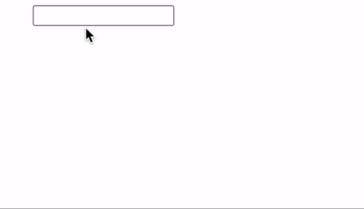
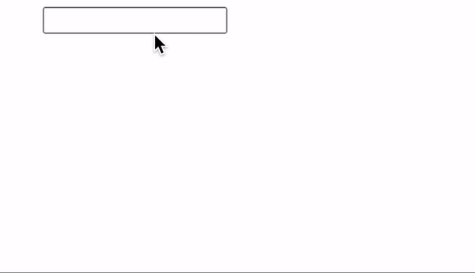

# 引言

React 系列继续，今天来聊一聊 `transition`。话不多说，我们先用一个例子（React 18）来引入今天的主题：

```js
import {useState, memo} from 'react'

const HeavyItem = memo(({query}) => {
  for (let i = 0; i < 99999; i++) {}
  return <div>{query}</div>
})

export default function App() {
  const [inputValue, setInputValue] = useState('')
  const handleChange = (e) => {
    setInputValue(e.target.value)
  }
  return (
    <div style={{paddingLeft: 100, paddingTop: 10}}>
      <input value={inputValue} onChange={handleChange} />
      <div>
        {[...new Array(5000)].map((_, i) => (
          <HeavyItem key={i} query={inputValue} />
        ))}
      </div>
    </div>
  )
}
```

上面例子模拟了一个关键词搜索的应用，注意到其中的每一项搜索结果 `HeavyItem` 其渲染任务是一个非常耗时的操作。所以，我们在搜索的时候会感觉到有明显的卡顿现象：


根本原因在于搜索列表的渲染是一个非常耗时的操作，整个 React 应用的更新都被其所阻塞。但其实列表的更新可以稍后一些，而搜索关键字在 `input` 中的更新必须足够及时才能使得用户使用应用感觉流畅，也就是两个更新的优先级是有先后的，`transition` 的出现，就是为了解决这一类的问题。

# useTransition

## 使用

我们通过 React 提供的 `useTransiton` 来优化上面的例子：

```js
import {useState, useTransition, memo} from 'react'

const HeavyItem = memo(({query}) => {
  for (let i = 0; i < 99999; i++) {}
  return <div>{query}</div>
})

export default function App() {
  const [inputValue, setInputValue] = useState('')
  const [query, setQuery] = useState('')
  const [isPending, startTransition] = useTransition()
  const handleChange = (e) => {
    setInputValue(e.target.value)
    startTransition(() => {
      setQuery(e.target.value)
    })
  }
  return (
    <div style={{paddingLeft: 100, paddingTop: 10}}>
      <input value={inputValue} onChange={handleChange} />
      <div>
        {isPending
          ? 'Loading'
          : [...new Array(5000)].map((_, i) => (
              <HeavyItem key={i} query={query} />
            ))}
      </div>
    </div>
  )
}
```

可以看到，现在搜索体验非常丝滑了：



## 实现原理

当我们在输入框中输入 `a` 时，会触发 `handleChange`：

1. 调用 `setInputValue` 产生一个更新任务（假设为 `inputUpdate1`）。
2. 调用 `startTransition`，首先会以当前优先级 `setPending(true)` （更新任务假设为 `pendingTrueUpdate1`），然后将优先级降低并 `setPending(false)` （更新任务假设为 `pendingFalseUpdate1`）以及调用回调函数执行 `setQuery` （更新任务假设为 `queryUpdate1`）。
3. React 会处理优先级较高的 `inputUpdate1` 和 `pendingTrueUpdate1`，此时页面 input 框中的内容得到更新，并显示 loading。
4. 更新渲染完成后，会开始处理 `pendingFalseUpdate1` 和 `queryUpdate1`，由于此时需要渲染非常昂贵的列表，此过程相对比较长。
5. 当用户继续输入，由于步骤 4 中 React 是使用时间切片的方式来处理，所以用户输入仍然能够得到相应，此时又会触发如下更新任务：

```
// 高优先级
inputUpdate2
pendingTrueUpdate2

// 低优先级
pendingFalseUpdate2
queryUpdate2
```

React 发现有高优先级的更新插入，会取消掉步骤 4 中正在进行的更新任务，开始处理 `inputUpdate2` 和 `pendingTrueUpdate2`。

假设现在输入字符 `a`，在该回调函数中触发的更新任务（假设为 `lowUpdate1`）会被赋予较低的优先级，由于其更新优先级低于 `setInputValue` 触发的更新（假设为 `highUpdate1`），所以 React 会优先处理 `highUpdate1`，更新完成后再处理 `setQuery` 触发的更新任务 `lowUpdate1`。

1. 如果此时用户继续输入，
2. 而数组第一个元素是一个 `boolean` 类型的状态，表示 `startTransition` 中的更新任务当前是否 pending。

下面我们

1.
2.
