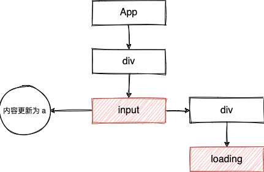
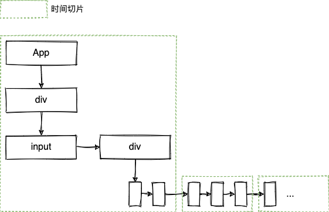
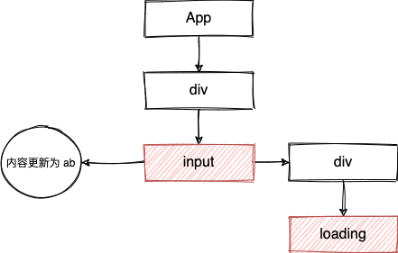
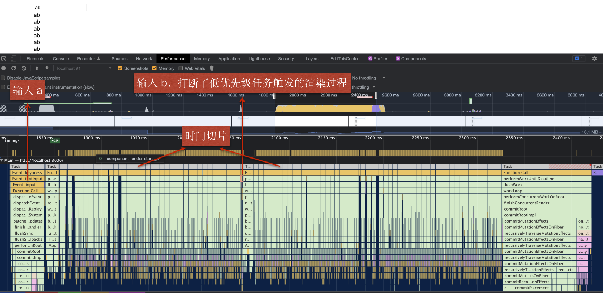
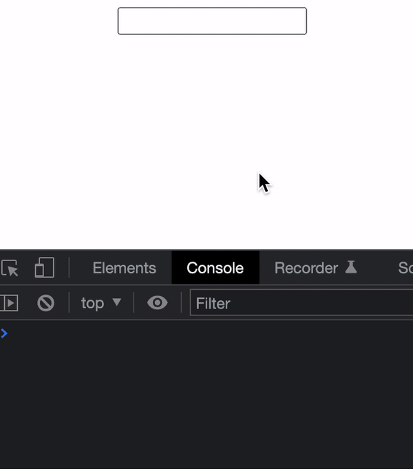
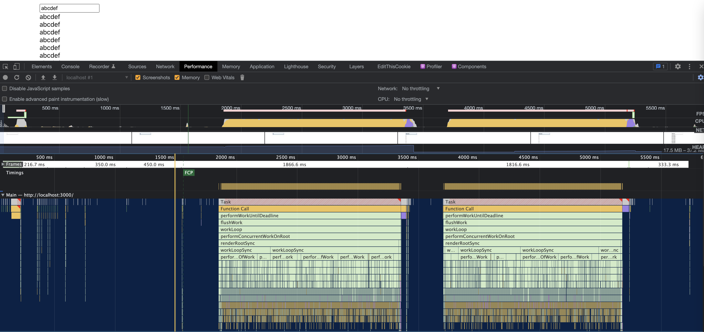

# 引言

React 系列继续，今天来聊一聊 `transition`。话不多说，我们先用一个例子（React 18）来引入今天的主题：

```js
import {useState, memo} from 'react'

const HeavyItem = memo(({query}) => {
  for (let i = 0; i < 99999; i++) {}
  return <div>{query}</div>
})

export default function App() {
  const [inputValue, setInputValue] = useState('')
  const handleChange = (e) => {
    setInputValue(e.target.value)
  }
  return (
    <div style={{paddingLeft: 100, paddingTop: 10}}>
      <input value={inputValue} onChange={handleChange} />
      <div>
        {[...new Array(5000)].map((_, i) => (
          <HeavyItem key={i} query={inputValue} />
        ))}
      </div>
    </div>
  )
}
```

上面例子模拟了一个关键词搜索的应用，注意到其中的每一项搜索结果 `HeavyItem` 中，我们都空循环了 10 万次，用于模拟耗时的渲染过程。所以，我们在搜索的时候会感觉到有明显的卡顿现象：


根本原因在于搜索列表的渲染是一个非常耗时的操作，整个 React 应用的更新都被其所阻塞。但其实列表的更新可以稍后一些，而搜索关键字在 `input` 中的更新必须足够及时才能使得用户使用起来感觉比较流畅，也就是两个更新的优先级是有先后的。而 `transition` 的出现，就是为了解决这一类的问题。

# useTransition

## 使用

我们通过 React 提供的 `useTransiton` 来优化上面的例子：

```js
import {useState, useTransition, memo} from 'react'

const HeavyItem = memo(({query}) => {
  for (let i = 0; i < 99999; i++) {}
  return <div>{query}</div>
})

export default function App() {
  const [inputValue, setInputValue] = useState('')
  const [query, setQuery] = useState('')
  const [isPending, startTransition] = useTransition()
  const handleChange = (e) => {
    setInputValue(e.target.value)
    startTransition(() => {
      setQuery(e.target.value)
    })
  }
  return (
    <div style={{paddingLeft: 100, paddingTop: 10}}>
      <input value={inputValue} onChange={handleChange} />
      <div>
        {isPending
          ? 'Loading'
          : [...new Array(5000)].map((_, i) => (
              <HeavyItem key={i} query={query} />
            ))}
      </div>
    </div>
  )
}
```

可以看到，现在搜索体验非常丝滑了：


## 实现原理

当我们在输入框中输入 `a` 时，会触发 `handleChange`：

1. 调用 `setInputValue` 产生一个更新任务（假设为 `inputUpdate1`）。
2. 调用 `startTransition`，首先会以当前优先级 `setPending(true)` （更新任务假设为 `pendingTrueUpdate1`），然后将优先级降低并 `setPending(false)` （更新任务假设为 `pendingFalseUpdate1`）以及调用回调函数执行 `setQuery` （更新任务假设为 `queryUpdate1`）。

3. React 会处理优先级较高的 `inputUpdate1` 和 `pendingTrueUpdate1`，此时页面 input 框中的内容得到更新，并显示 loading。



4. 更新渲染完成后，会开始处理 `pendingFalseUpdate1` 和 `queryUpdate1`，由于此时需要渲染非常昂贵的列表，React 的 Render 过程可能会需要若干个时间切片才能处理完。



5. 当用户继续输入 `b`，由于步骤 4 中 React 是使用时间切片的方式来处理，所以当某个时间切片结束后，React 会把控制权交出，用户输入能够得到相应，此时又会触发如下更新任务：

```
// 高优先级
inputUpdate2
pendingTrueUpdate2

// 低优先级
pendingFalseUpdate2
queryUpdate2
```

React 发现有高优先级的更新插入，会取消掉步骤 4 中正在进行的更新任务，开始处理 `inputUpdate2` 和 `pendingTrueUpdate2`：





6. 用户没有继续输入，则会将所有低优先级更新任务继续处理完。

# Why not debounce？

在 `transition` 出现之前，我们很容易会想到用 `debounce` （防抖）来解决这样的问题：

```js
import {useRef, useState, memo} from 'react'

function debounce(fn, wait = 300) {
  let timer = null
  return function (...args) {
    if (timer) clearTimeout(timer)
    timer = setTimeout(() => {
      console.log('trigger')
      fn.apply(this, args)
    }, wait)
  }
}

const HeavyItem = memo(({query}) => {
  for (let i = 0; i < 99999; i++) {}
  return <div>{query}</div>
})

export default function App() {
  const [inputValue, setInputValue] = useState('')
  const [query, setQuery] = useState('')
  const debouncedSetQuery = useRef(debounce(setQuery))
  const handleChange = (e) => {
    setInputValue(e.target.value)
    debouncedSetQuery.current(e.target.value)
  }
  return (
    <div style={{paddingLeft: 100, paddingTop: 10}}>
      <input value={inputValue} onChange={handleChange} />
      <div>
        {[...new Array(5000)].map((_, i) => (
          <HeavyItem key={i} query={query} />
        ))}
      </div>
    </div>
  )
}
```

但实际上 `debounce` 并不能解决这个问题。如下所示，我们先输入 `a`，等到 `trigger` 打印后，继续输入 `bcdef`，很明显后面输入的内容并没有立刻渲染出来：



原因在于 `debounce` 只是减少了 `setQuery` 的调用，但是治标不治本，一旦 `setQuery` 调用触发了更新，那 React 的渲染过程还是会阻塞用户交互。

从 `performance` 监控面板发现有两个耗时超过 1s 的任务（React 默认不会开启 Concurrent 模式，所以这里没有时间切片），分别对应着输入 `a` 和 `bcdef` 触发的更新。



俗话说的好，“解铃还须系铃人”。React 通过虚拟 DOM、协调算法等手段给广大前端程序员的开发带来巨大便利的同时也引入了一些成本，通过外部手段很难“根治”病因，还是得官方出马才能解决问题。

# 笔记

https://17.reactjs.org/docs/concurrent-mode-patterns.html

1. 第一次渲染，因为 current 为空，complete suspense 的时候走到了 if

```js
if (
  hasInvisibleChildContext ||
  hasSuspenseContext(
    suspenseStackCursor.current,
    InvisibleParentSuspenseContext
  )
) {
  // If this was in an invisible tree or a new render, then showing
  // this boundary is ok.
  renderDidSuspend()
} else {
  // Otherwise, we're going to have to hide content so we should
  // suspend for longer if possible.
  renderDidSuspendDelayIfPossible()
}
```

先显示 fallback，然后 resolve 后显示内容。

2. 点击 next，startTransition，useTransition 里面其实用到了 updateState，首先 setPening(true)，然后调整更新优先级，setPending(false)，并执行 startTransition 的 callback，会 setResource，后面的两个优先级都较低

3. 重新渲染，更新 pending 为 true（跳过了其他两个更新）
4. 再次渲染，更新 pending 为 false，更新 resource，由于 current 不为空，不需要渲染 fallback，也就是下面的 else

```js
if (
  hasInvisibleChildContext ||
  hasSuspenseContext(
    suspenseStackCursor.current,
    InvisibleParentSuspenseContext
  )
) {
  // If this was in an invisible tree or a new render, then showing
  // this boundary is ok.
  renderDidSuspend()
} else {
  // Otherwise, we're going to have to hide content so we should
  // suspend for longer if possible.
  renderDidSuspendDelayIfPossible()
}
```

5. 等到 promise resolve 后，再次重新渲染
