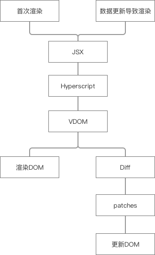
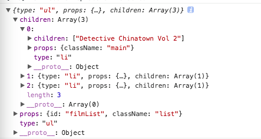

转自：https://segmentfault.com/a/1190000014572815

# 什么是 VDOM
首先我们都知道什么是DOM(Document Object Model)，简单说就是将一个HTML文档抽象表达为树结构。VDOM则是将DOM再抽象一层生成的简化版js对象，这个对象也拥有DOM上的一些属性，比如id, class等，但它是完全脱离于浏览器而存在的。

# 为什么要用 VDOM
随着前端技术的发展，现在的网页应用变得越来越庞大，DOM树也随之变得复杂。当我们要修改DOM的某个元素时，我们需要先遍历找个这个元素，然后才修改能修改。而且如果我们大量地去修改DOM，每次DOM修改浏览器就得重绘（repaint）页面，有的时候甚至还得重排(reflow)页面，浏览器的重排重绘是很损耗性能的。

React是怎么用VDOM解决这个问题的呢？

1. 首先，在React当我们要去修改数据的时候，我们会调用React提供的setState方法来修改数据；
React根据新的数据生成一个新的VDOM，因为VDOM本质上只是一个普通的js对象，所以这个过程是很快的；
2. 然后React拿着新生成VDOM和之前的VDOM进行对比（diff算法），找出不同的地方(新增，删除，修改)，生成一个个的补丁（patches）;
3. 最后React把这些补丁一次性打到DOM上，完成视图的修改。

原理其实还是很直观的，但React到底是怎么用代码实现的呢？其中最关键的一步是React是怎么diff的？如果搞清楚了内部的实现原理，对于我们使用React来写出性能更高的代码至关重要。所以今天我要手把手教大家怎么从零开始实现VDOM。

# 我们的设计蓝图
我们将采用跟React类似的方式

1. 使用JSX来编写组件；
2. 用Babel将JSX转化为纯js(类似hyperscript)；
3. 将hyperscript转化成我们的VDOM；
4. 将VDOM渲染到页面，形成真实的DOM；
5. 手动更新数据并手动触发更新视图操作(这部分是react做的，跟VDOM的实现无关，所以我们手动模拟一下)；
6. 重复步骤二和步骤三，得到新的VDOM；
7. diff新VDOM和旧VDOM，得到需要修改真实DOM的patches；
8. 把patches一次性打到DOM上，只更新DOM上需要更改的地方。



# 项目结构
1. index.html
2. index.js（所有的逻辑都写在这个文件里）
3. .babelrc（babel的配置页）
4. package.json
5. compiled.js（这个文件是babel打包自己生成的，不需要自己写）

详情见 [Github](https://github.com/ParadeTo/vdom-demo)


# 实现首次渲染
## index.js
首先，我们用 JSX 来编写“模板”：

```javascript
function view() {
  return <ul id="filmList" className="list">
    <li className="main">Detective Chinatown Vol 2</li>
    <li>Ferdinand</li>
    <li>Paddington 2</li>
  </ul>
}
```

接下来，我们要将 JSX 编译成 js, 也就是 hyperscript。我们先用 Babel 编译一下，看这段 JSX 转成 js 会是什么样子，打开命令行，输入 `npm run compile`,得到的 compile.js：

```javascript
function view() {
  return h(
    "ul",
    { id: "filmList", className: "list" },
    h(
      "li",
      { className: "main" },
      "Detective Chinatown Vol 2"
    ),
    h(
      "li",
      null,
      "Ferdinand"
    ),
    h(
      "li",
      null,
      "Paddington 2"
    )
  );
}
```

可以看出 `h` 函数接收的参数，第一个参数是 node 的类型，比如 ul,li，第二个参数是 node 的属性，之后的参数是 node 的 children，假如 child 又是一个 node 的话，就会继续调用 `h` 函数。

清楚了 Babel 会将我们的JSX编译成什么样子后，接下来我们就可以继续在 index.js 中来写 `h` 函数了。

```javascript
function flatten(arr) {
  return [].concat(...arr)
}

function h(type, props, ...children) {
  return {
    type,
    props: props || {},
    children: flatten(children)
  }
}
```

我们的 `h` 函数主要的工作就是返回我们真正需要的 hyperscript 对象，只有三个参数，第一个参数是节点类型，第二个参数是属性对象，第三个是子节点的数组。


`flatten(children)` 这个操作是因为 children 这个数组里的元素有可能也是个数组，那样就成了一个二维数组，所以我们需要将数组拍平成一维数组。

我们现在可以先来看一下 `h` 函数最终返回的对象长什么样子。

```javascript
function render() {
  console.log(view())
}
```

我们在render函数中打印出执行完 view() 的结果，再 `npm run compile` 后，用浏览器打开我们的 index.html，看控制台输出的结果。



可以，很完美！这个对象就是我们的 VDOM 了！

下面我们就可以根据VDOM, 来渲染真实 DOM 了。先改写 render 函数:

```javascript
function render(el) {
  el.appendChild(createElement(view(0)))
}
```

createElement 函数生成 DOM，然后再插入到我们在 index.html 中写的根节点 app。注意 render 函数式在 index.html 中被调用的。

```javascript
function createElement(node) {
  if (typeof(node) === 'string') {
    return document.createTextNode(node)
  }

  let { type, props, children } = node
  const el = document.createElement(type)
  setProps(el, props)
  children.map(createElement)
    .forEach(el.appendChild.bind(el))

  return el
}

function setProp(target, name, value) {
  if (name === 'className') {
    return target.setAttribute('class', value)
  }

  target.setAttribute(name, value)
}

function setProps(target, props) {
  Object.keys(props).forEach(key => {
    setProp(target, key, props[key])
  })
}
```

我们来仔细看下 createElement 函数。假如说 node，即 VDOM 的类型是文本，我们直接返回一个创建好的文本节点。否则的话，我们取出 node 中类型，属性和子节点, 先根据类型创建相应的目标节点，然后再调用 setProps 函数依次设置好目标节点的属性，最后遍历子节点，递归调用 createElement 方法，将返回的子节点插入到刚刚创建的目标节点里。最后返回这个目标节点。

还需要注意的一点是，jsx 中 class 的写成了 className，所以我需要特殊处理一下。

大功告成，complie 后浏览器打开 index.html 看看结果吧。

# 实现更新渲染
## 改写 view()
```javascript
function view(count) { 
  const r = [...Array(count).keys()]
  return <ul id="filmList" className={`list-${count % 3}`}>
    { r.map(n => <li>item {(count * n).toString()}</li>) }
  </ul>
}
```

我们的 view 函数接收一个参数 count，变量 r 表示从 0 到 count-1 的一个数组。假如 count=3, r=[0, 1, 2]。ul 的 className 的值有三种可能：list-0, list-1, list-2。li 的数量取决于count。

## 改写 render()

```javascript
function render(el) {
  const initialCount = 0

  el.appendChild(createElement(view(initialCount)))
  setTimeout(() => tick(el, initialCount), 1000)
}

function tick(el, count) {
  const patches = diff(view(count + 1), view(count))
  patch(el, patches)

  if(count > 5) { return }
  setTimeout(() => tick(el, count + 1), 1000)
}
```

render 函数有两个修改，首先调用 view() 的时候传入 count=0。其次，写了一个定时器，1 秒后执行tick 函数。tick 函数接收两个参数，el 代表节点元素，count 是当前计数值。

tick 函数依次做了这几件事：

1. 调用diff函数，对比新旧两个 VDOM，根据两者的不同得到需要修改的补丁
2. 将补丁 patch 到真实 DOM 上
3. 当计数器小于等于 5 的时候，将 count 加 1，再继续下一次 tick
4. 当计数器大于 5 的时候，结束

下面我们来实现 diff 函数和 patch 函数。

## 常量
我们先列出来新旧两个 VDOM 对比，会有哪些不同。在 index.js 文件的最前面声明一下几个常量。

```javascript
const CREATE = 'CREATE'   //新增一个节点
const REMOVE = 'REMOVE'   //删除原节点
const REPLACE = 'REPLACE'  //替换原节点
const UPDATE = 'UPDATE'    //检查属性或子节点是否有变化
const SET_PROP = 'SET_PROP'  //新增或替换属性
const REMOVE_PROP = 'REMOVE PROP'  //删除属性
```

## diff()
```javascript
function diff(newNode, oldNode) {
   if (!oldNode) {
     return { type: CREATE, newNode }
   }

   if (!newNode) {
     return { type: REMOVE }
   }

   if (changed(newNode, oldNode)) {
     return { type: REPLACE, newNode }
   }

   if (newNode.type) {
     return {
       type: UPDATE,
       props: diffProps(newNode, oldNode),
       children: diffChildren(newNode, oldNode)
     }
   }
}
```

1. 假如旧节点不存在，我们返回的 patches 对象, 类型为新增节点；
2. 假如新节点不存在，表示是删除节点；
3. 假如两者都存在的话，调用 changed 函数判断他们是不是有变动；
4. 假如两者都存在，且 changed() 返回 false 的话，判断新节点是否是 VDOM（根据 type 是否存在来判断的，因为 type 不存在的话，newNode 要么是空节点，要么是字符串）。假如新节点是 VDOM，则返回一个 patches 对象，类型是 UPDATE，同时对 props 和 children 分别进行 diffProps 和diffChildren 操作。

下面我们一次看一下 changed, diffProps, diffChildren 函数。

### changed()
```javascript
function changed(node1, node2) {
  return typeof(node1) !== typeof(node2) ||
         typeof(node1) === 'string' && node1 !== node2 ||
         node1.type !== node2.type
}
```

检查新旧 VDOM 是否有变动的方法很简单，

1. 首先假如数据类型都不一样，那肯定是变动了；
2. 其次假如两者的类型都是纯文本，则直接比较两者是否相等；
3. 最后比较两者的类型是否相等。

### diffProps()
```javascript
function diffProps(newNode, oldNode) {
  let patches = []

  let props = Object.assign({}, newNode.props, oldNode.props)
  Object.keys(props).forEach(key => {
    const newVal = newNode.props[key]
    const oldVal = oldNode.props[key]
    if (!newVal) {
      patches.push({type: REMOVE_PROP, key, value: oldVal})
    }

    if (!oldVal || newVal !== oldVal) {
      patches.push({ type: SET_PROP, key, value: newVal})
    }
  })

  return patches
}
```

比较新旧 VDOM 的属性的变化，并返回相应的 patches。

1. 首先我们采用最大可能性原则，将新旧 VDOM 的所有属性都合并赋值给一个新的变量 props
2. 遍历 props 变量的所有 Keys，依次比较新旧 VDOM 对于这个KEY的值
3. 假如新值不存在，表示这个属性被删除了
4. 假如旧值不存在，或者新旧值不同，则表示我们需要重新设置这个属性

### diffChildren()
```javascript
function diffChildren(newNode, oldNode) {
  let patches = []

  const maximumLength = Math.max(
    newNode.children.length,
    oldNode.children.length
  )
  for(let i = 0; i < maximumLength; i++) {
    patches[i] = diff(
      newNode.children[i],
      oldNode.children[i]
    )
  }

  return patches
}
```

同样采用最大可能性原则，取新旧 VDOM 的 children 的最长值作为遍历 children 的长度。然后依次比较新旧 VDOM 的在相同 INDEX 下的每一个 child。

**这里需要强烈注意一下**

为了简化，我们没有引入 key 的概念，直接比较的是相同 index 下的 child。所以假如说一个列表 ul 有5 项，分别是 li1, li2, li3, li4, li5; 如果我们删掉了第一项，新的变成了 li2, li3, li4, li5。那么 diffchildren 的时候，我们会拿 li1 和 li2 比较，依次类推。这样一来，本来只是删除了li1, 而 li2, li3, li4, li5 没有任何变化，我们得出的 diff 结论却是 [li替换，li2替换, li3替换, li4替换, li5删除]。所以react让大家渲染列表的时候，必须添加 Key。

截止到现在，我们已经得到了我们需要的补丁。下面我们要将补丁 Patch 到 DOM 里。

## patch()
```javascript
function patch(parent, patches, index = 0) {
  if (!patches) {
    return
  }

  const el = parent.childNodes[index]
  switch (patches.type) {
    case CREATE: {
      const { newNode } = patches
      const newEl = createElement(newNode)
      parent.appendChild(newEl)
      break
    }
    case REMOVE: {
      parent.removeChild(el)
      break
    }
    case REPLACE: {
      const {newNode} = patches
      const newEl = createElement(newNode)
      return parent.replaceChild(newEl, el)
      break
    }
    case UPDATE: {
      const {props, children} = patches
      patchProps(el, props)
      for(let i = 0; i < children.length; i++) {
        patch(el, children[i], i)
      }
    }
  }
}
```

1. 首先当 patches 不存在时，直接 return，不进行任何操作
2. 利用 childNodes 和 Index 取出当前正在处理的这个节点，赋值为 el
3. 开始判断补丁的类型
4. 当类型是 CREATE 时，生成一个新节点，并 append 到根节点
5. 当类型是 REMOVE 时，直接删除当前节点 el
6. 当类型是 REPLACE 时，生成新节点，同时替换掉原节点
7. 当类型是 UPDATE 时，需要我们特殊处理
8. 调用 patchProps 将我们之前 diffProps 得到的补丁渲染到节点上
9. 遍历之前 diffChildren 得到的补丁列表，再依次递归调用 patch

最后我们再补充一下 patchProps 函数

### patchProps()
```javascript
function patchProps(parent, patches) {
  patches.forEach(patch => {
    const { type, key, value } = patch
    if (type === 'SET_PROP') {
      setProp(parent, key, value)
    }
    if (type === 'REMOVE_PROP') {
      removeProp(parent, key, value)
    }
  })
}

function removeProp(target, name, value) { //@
  if (name === 'className') {
    return target.removeAttribute('class')
  }

  target.removeAttribute(name)
}
```

这个就不用我解释了，代码很直观，setProp 函数在上一集我们已经定义过了。这样一来，我们就完成了整个数据更新导致 DOM 更新的完整过程。
npm run compile 后打开浏览器查看效果，你应该看到是一个背景颜色在不同变化，同时列表项在逐渐增加的列表。