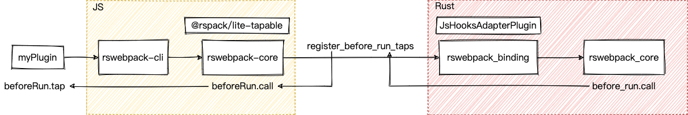

> 参考 [mini-webpack](https://github.com/lizuncong/mini-webpack)，使用 Rust 从零实现一个简单的 webpack，深入理解 webpack 的同时，还锻炼了 Rust 的技能，简直赢麻了！
>
> 代码地址：https://github.com/ParadeTo/rs-webpack
>
> 本文对应 Pull Request：https://github.com/ParadeTo/rs-webpack/pull/6

上篇文章在 Rust 侧实现了 Plugin 系统，但是留了个尾巴，即如何把用户用 JS 开发的插件也集成到 rs-webpack 中。这篇文章就来实现一下。

比如，我现在用 JS 开发了一个这样的插件，怎么让他正常工作呢？

```js
module.exports = class MyPlugin {
    apply(compiler) {
        compiler.hooks.beforeRun.tap('myplugin', (compiler) => {
            console.log("before run", compiler)
        })
    }
}
```

前面既然已经不可避免的参考了 rspack，那就继续抄呗。研究完后发现它的做法大致如下图所示：



我们自定义的 JS 插件 `myPlugin` 会经 rswebpack-cli 传入 rswebpack-core。rswebpack-core 中会使用 rspack 团队开发的一个类 `tapable` 的库 `@rspack/lite-tapable` 创建一个 `beforeRun` 的 Hook：


```js
export class Compiler {
    bindingRsWebpack: BindingRsWebpack
    hooks: {
        beforeRun: liteTapable.SyncHook<[string]>;
    }
    ...
}
```

同时，跟 Rust 中一样，这里 `Compiler` 初始化时，会遍历所有的 plugins 并执行他们的 `apply` 方法：


```js
constructor(props: RawConfig) {
    const {plugins} = props
    plugins.forEach(plugin => {
        plugin.apply(this)
    })
}
```

然后通过一系列操作包装一个 `register_before_run_taps` 的函数传给 Rust。`register_before_run_taps` 里面包装了对于 `beforeRun` 的 `call` 函数的调用:


```js
this.registers = {
    registerBeforeRunTaps: this.#createHookRegisterTaps(
        RegisterJsTapKind.BeforeRun,
        () => this.hooks.beforeRun,
        queried => (native: string) => {
            // beforeRun.call 
            queried.call(native);
        }
    ),
}
this.bindingRsWebpack = new BindingRsWebpack(props, this.registers)
```

这个函数执行后会返回一个数组，里面每一个都可以作为 Rust 这边同样的 `before_run` Hook 的 interceptor（仅实现了 call 方法）：

```rs
#[async_trait]
impl Interceptor<BeforeRunHook> for RegisterBeforeRunTaps {
  async fn call(
    &self,
    hook: &BeforeRunHook,
  ) -> rswebpack_error::Result<Vec<<BeforeRunHook as Hook>::Tap>> {
    if let Some(non_skippable_registers) = &self.inner.non_skippable_registers {
      if !non_skippable_registers.is_non_skippable(&RegisterJsTapKind::BeforeRun) {
        return Ok(Vec::new());
      }
    }
    let js_taps = self.inner.call_register(hook).await?;
    let js_taps = js_taps
      .iter()
      .map(|t| Box::new(BeforeRunTap::new(t.clone())) as <BeforeRunHook as Hook>::Tap)
      .collect();
    Ok(js_taps)
  }
}
```

rswebpack_binding 中会通过 `JsHooksAdapterPlugin` 应用这些 interceptor：

```rs
impl Plugin for JsHooksAdapterPlugin {
  fn name(&self) -> &'static str {
    "rspack.JsHooksAdapterPlugin"
  }

  fn apply(&self, _ctx: PluginContext<&mut ApplyContext>) -> rswebpack_error::Result<()> {
    _ctx
      .context
      .compiler_hooks
      .before_run
      .intercept(self.register_before_run_taps.clone());
  }
}
```

PS：interceptor 中的 call 函数会在每次调用 Hook 的 call 函数时执行，比如下面这个例子

```js
const hook = new SyncHook(['arg1', 'arg2'])

hook.tap('test', (...args) => {
  console.log('test', ...args)
})

hook.intercept({
  // trigger when execute hook.call
  call: (...args) => {
    console.log('Execute interceptor call', ...args)
  },
})

hook.call('a1', 'a2')

// log
Execute interceptor call a1 a2
test a1 a2
```

当 Rust 这边的`before_run` 调用 `call` 时，这些 interceptor 的 `call` 也都会执行，然后包装在这些 interceptor 中的 JS 这边的 `beforeRun.call` 也会执行，从而又触发执行 `myPlugin` 中对应 Hook 的 Tap 函数。

这样整个 Plugin 系统就算完成了，完整的改动见[这里](https://github.com/ParadeTo/rs-webpack/pulls)，代码就不一一过了，顺着上图的顺序多分析一下应该能理解的。

系列文章的初衷是想通过重新实现 webpack 来加深对他的理解，结果发现自己 Rust 水平有限，没有能力实现一个 Plugin 系统，大部分时间都花在了集成 Rspack 上面。

这个过程中发现很多地方都不是很了解，先 mark 一下，有时间再研究研究：

* Napi 中的 ThreadsafeFunction 等。Node.js 结合这个应该可以做很多事情，后面看看能不能挖掘一些案例出来。
* Rust 中的异步处理、tokio。
* Rust 并发编程：多线程，channel 等。
* Rust 中的宏编程，这玩意即难写又不好调试。


