# 前言

日常工作中已经用了很久的 Sentry 了，但是对一些概念和功能还是一知半解，比如：Event 和 Issues，fingerprint 等。趁这次 CY 风波之际，重新学习一下。

# 基本概念及使用

## 环境准备

准备一个 Sentry 调试环境一个最方便的办法就是通过 docker，可以参考 Sentry 官方文档[Self-Hosted Sentry](https://develop.sentry.dev/self-hosted/)。一切准备好以后，就可以在浏览器中访问 Sentry 了：

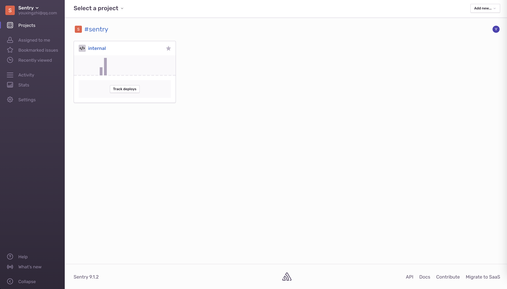

可以看到，首页已经有一个项目了，这个项目是 Sentry 自己使用的，无法删除。我们新建一个 platform 为 `JavaScript` 项目：
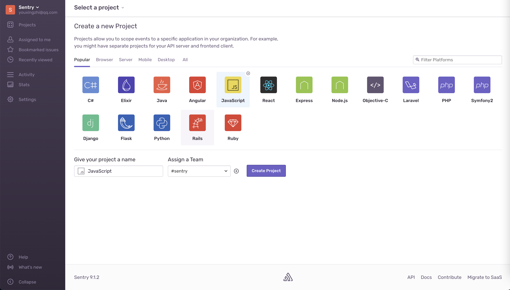
创建好后就可以按照下图接入到我们的项目之中了：
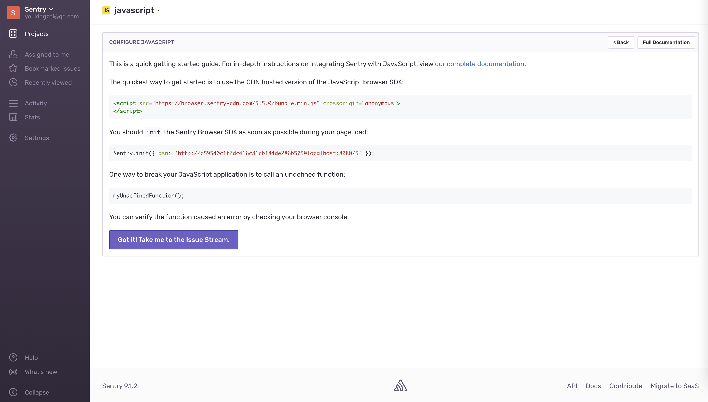
根据上面的指引接入以后，就可以看到我们的第一条 Issue 下的第一个 Event 了：
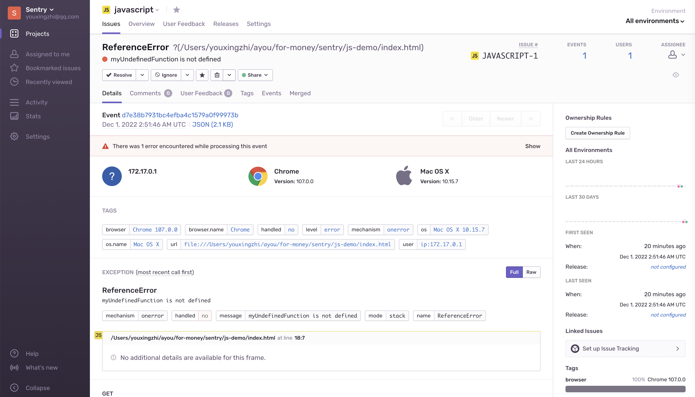

可以看到，这个页面有很多信息，接下来就详细介绍一下该页面的一些重要信息。

## Event & Issue

每次通过 `Sentry.captureException(error)` 捕获并上报一条异常时，就会发送一条 Event 给 Sentry：

```js
try {
  myUndefinedFunction()
} catch (error) {
  Sentry.captureException(error)
}
```

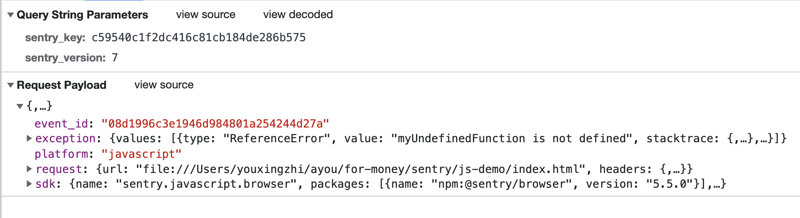

Sentry 会根据异常的 `message`，堆栈等信息将不同的 Event 归类为同一个 Issue。我们也可以使用 `fingerprint` 来自定义归类方式。

如下所示:

```js
Sentry.init({
  dsn: 'http://c59540c1f2dc416c81cb184de286b575@localhost:8080/5',
})
try {
  myUndefinedFunction1()
} catch (error) {
  Sentry.captureException(error)
}

try {
  myUndefinedFunction2()
} catch (error) {
  Sentry.captureException(error)
}
```

这两个 Event 因为 `message` 不同会被归类为不同的 Issue:

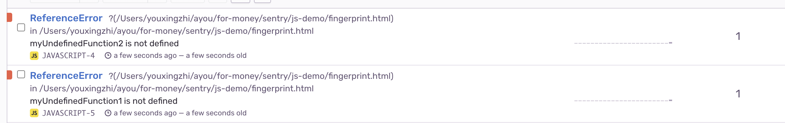

我们可以通过如下方式将他们归为一类：

```js
Sentry.init({
  dsn: 'http://c59540c1f2dc416c81cb184de286b575@localhost:8080/5',
  beforeSend: function (event, hint) {
    const exception = hint.originalException
    if (exception instanceof ReferenceError) {
      event.fingerprint = ['This is ReferenceError']
    }
    return event
  },
})
```

现在这两个 Event 就属于同一个 Issue 了：
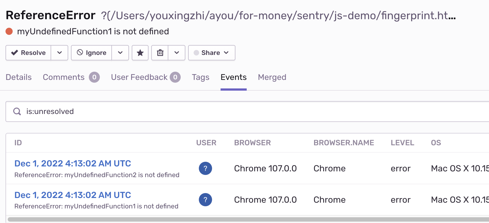

还可以在这里查看当前 Event 的 JSON 数据：

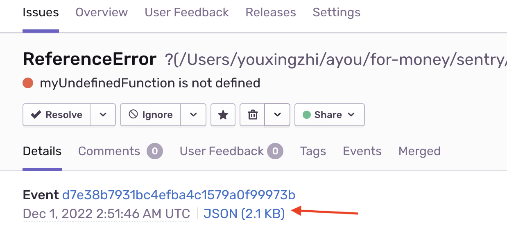

可以看到 `fingerprint` 确实是我们自定义的：

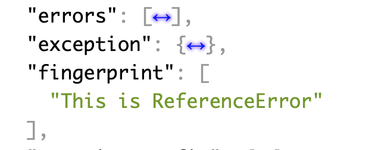

## Title

接下来我们看看头部标题部分：

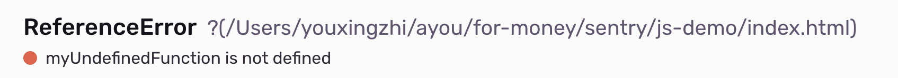

其中 `ReferenceError` 和 `myUndefinedFunction is not defined` 分别是 异常对象 `Error` 的 `name` 和 `message`：

```js
const err = new ReferenceError('i am message')
console.log(err.name, err.message) // ReferenceError, i am message
```

`ReferenceError` 后面的 `?(/Users...)` 是这个 Event 异常堆栈的栈顶信息。因为当前 Event 是在 `<script>` 标签下直接捕获上报的，所以这里是一个 `?`，括号里面是异常发生的文件名。

下面举例说明：

```js
class MyError extends Error {
  name = 'MyError'
}

function fn() {
  Sentry.captureException(new MyError('message'))
}

fn()
```

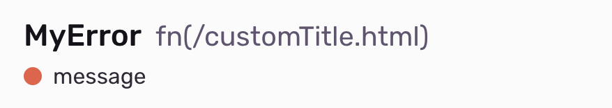

可以看到，上报的异常名字和 `message` 都变成了我们自定义的。`name` 后面的错误堆栈信息也符合预期，错误是在 `fn` 这个函数下发生的，文件名为 `customTitle.html`。既然说到了错误堆栈，那接下来就继续研究一下。

## Exception

页面往下可以看到更多的堆栈信息，但发现没有显示出错的代码，并且页面还提示了一个错误，这是什么原因呢？
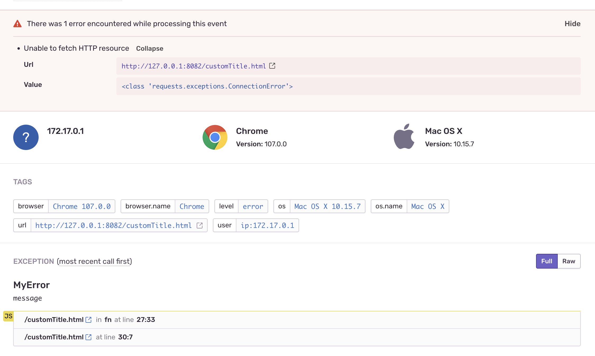

页面提示 `<class 'requests.exceptions.ConnectionError'>`，应该是网络连接相关的问题，猜想可能是 docker 容器无法访问到 `http://127.0.0.1:8082/customTitle.html` 这个页面，那我们换成本机 IP 试试。

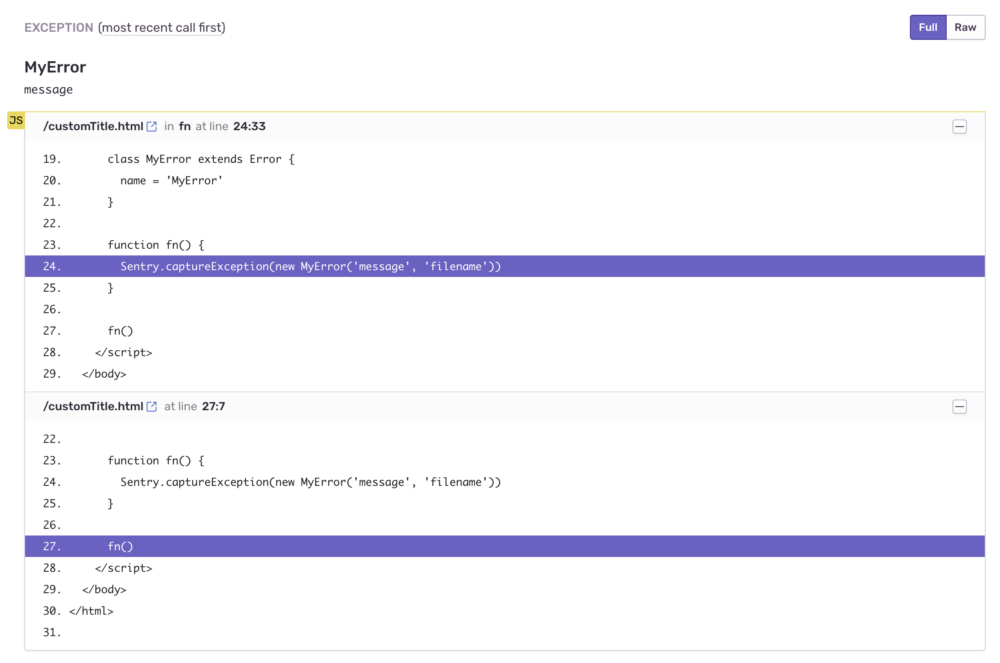

果然，成功的显示了错误堆栈信息，那这个信息是怎么来的呢？答案就是 `Error` 的 `stack` 这个属性：

```js
function fn() {
  const e = new Error('error')
  // Error: error\n    at fn (http://10.53.49.108:8082/index.html:20:19)\n    at http://10.53.49.108:8082/index.html:24:7
  e.stack
}
fn()
```

观察到 `stack` 是一个字符串，用 `\n` 分隔成多行，每一行表示一个栈帧，所以我们可以通过对每一行进行正则匹配得到每个栈帧的方法名、行列号等信息。稍微调试一下 Sentry 源码，发现确实如我们所料：

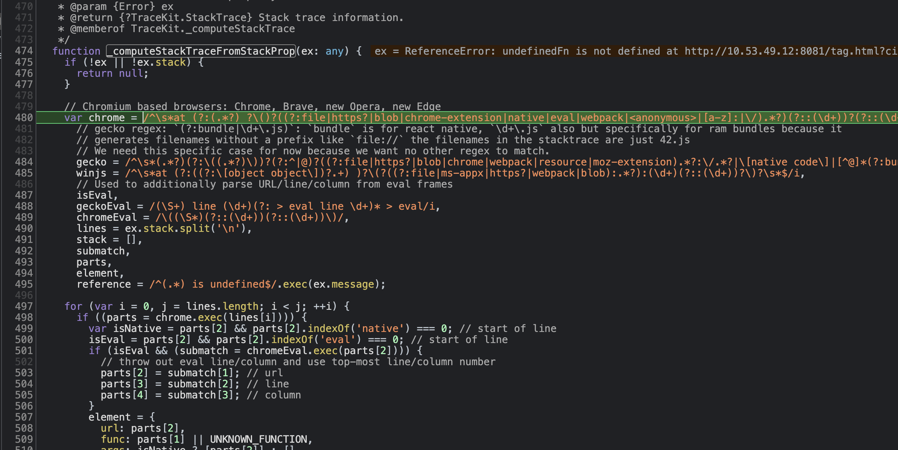

## Tags

Tags 是字符串类型的 key/value 队，并且支持索引和搜索。Sentry 默认会设置一些 Tags，我们也可以自定义 Tags，比如：

```js
try {
  undefinedFn()
} catch (error) {
  Sentry.withScope(function (scope) {
    scope.setTag('city', new URLSearchParams(location.search).get('city'))
    Sentry.captureException(error)
  })
}
```


可以按如下方式进行搜索：

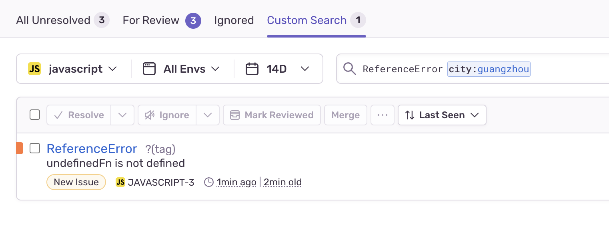

## Breadcrumbs

Breadcrumbs 用于支持在异常捕获前，收集更多的信息，从而更好的辅助于定位问题。比如：

```js
window.onload = function () {
  const $btn = document.querySelector('#btn')
  $btn.addEventListener('click', async () => {
    try {
      console.log('search')
      Sentry.addBreadcrumb({
        category: 'custom',
        message: 'Custom breadcrumb',
        level: 'info',
      })
      await fetch('https://www.google.com.hk/complete/search')
    } catch (error) {
      Sentry.captureException(error)
    }
  })
}
```

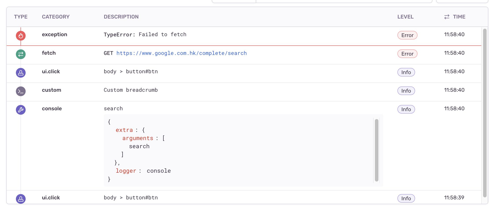

可以看到 Sentry 默认给元素点击、日志打印都加上了 Breadcrumbs，同时也支持自定义 Breadcrumbs。注意到这里有两个 `ui.click` 的记录，其中第一个是 `button` 按钮本身点击的事件，第二个是冒泡到 `document` 后的事件。这点在源码中的注释也进行了说明：
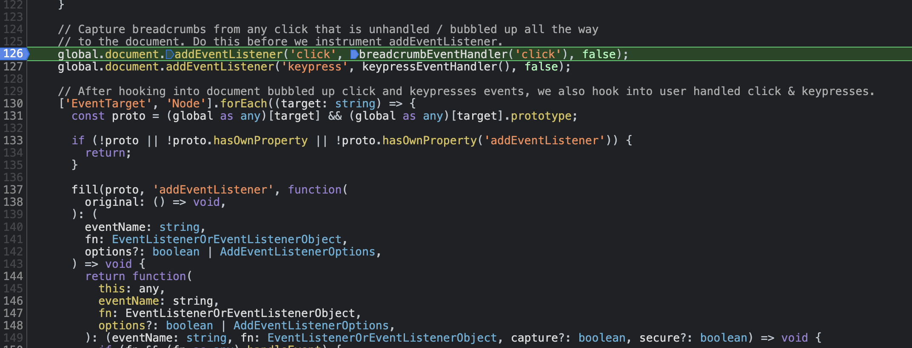

其他如 `Context`, `Scope` 等就不一一研究了，用到了再来看吧，接下来实战一下。

# 集成 React

首先我们用 vite 创建一个 `react + ts` 的项目并安装好依赖，然后在 Sentry 平台上创建一个 React 项目，并按照如下方式接入：


##

```

```
