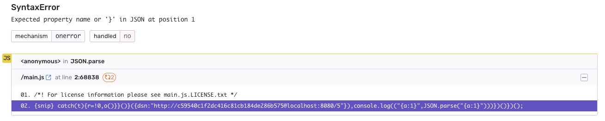
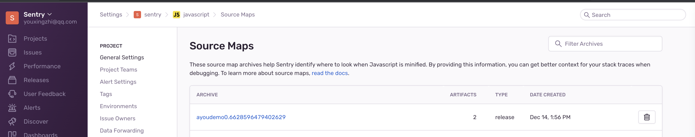
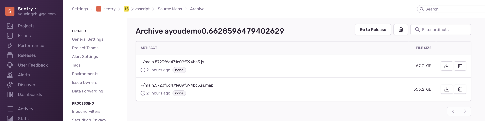
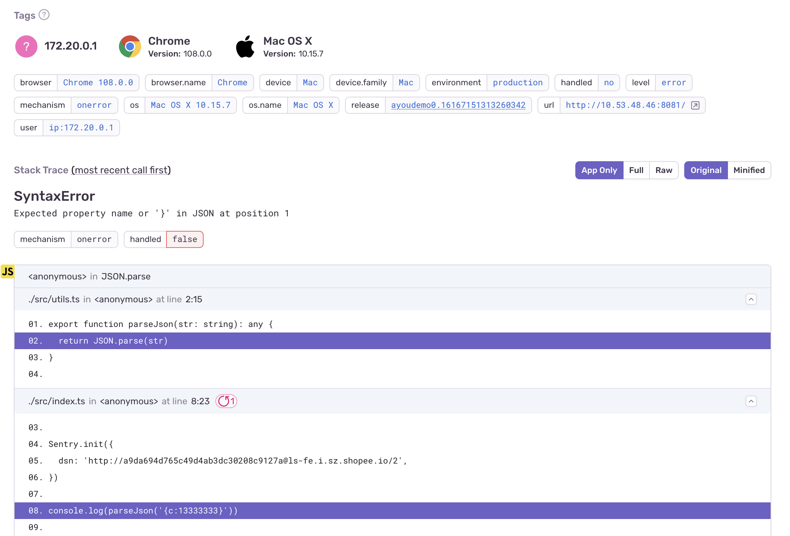

# 前言

日常工作中已经用了很久的 Sentry 了，但是对一些概念和功能还是一知半解，比如：Event 和 Issues，fingerprint 等。趁这次 CY 风波之际，重新学习一下。

# 环境准备

准备一个 Sentry 调试环境一个最方便的办法就是通过 docker，可以参考 Sentry 官方文档[Self-Hosted Sentry](https://develop.sentry.dev/self-hosted/) 或官方 docker [镜像](https://hub.docker.com/_/sentry) 。一切准备好以后，就可以在浏览器中访问 Sentry 了：


可以看到，首页已经有一个项目了，这个项目是 Sentry 自己使用的，无法删除。我们新建一个 platform 为 `JavaScript` 项目：

创建好后就可以按照下图接入到我们的项目之中了：

根据上面的指引接入以后，就可以看到我们的第一条 Issue 下的第一个 Event 了：


可以看到，这个页面有很多信息，接下来就详细介绍一下该页面的一些重要信息。

# Event & Issue

每次通过 `Sentry.captureException(error)` 捕获并上报一条异常时，就会发送一条 Event 给 Sentry：

```js
try {
  myUndefinedFunction()
} catch (error) {
  Sentry.captureException(error)
}
```


Sentry 会根据异常的 `message`，堆栈等信息将不同的 Event 归类为同一个 Issue。我们也可以使用 `fingerprint` 来自定义归类方式。

如下所示:

```js
Sentry.init({
  dsn: 'http://c59540c1f2dc416c81cb184de286b575@localhost:8080/5',
})
try {
  myUndefinedFunction1()
} catch (error) {
  Sentry.captureException(error)
}

try {
  myUndefinedFunction2()
} catch (error) {
  Sentry.captureException(error)
}
```

这两个 Event 因为 `message` 不同会被归类为不同的 Issue:


我们可以通过如下方式将他们归为一类：

```js
Sentry.init({
  dsn: 'http://c59540c1f2dc416c81cb184de286b575@localhost:8080/5',
  beforeSend: function (event, hint) {
    const exception = hint.originalException
    if (exception instanceof ReferenceError) {
      event.fingerprint = ['This is ReferenceError']
    }
    return event
  },
})
```

现在这两个 Event 就属于同一个 Issue 了：


还可以在这里查看当前 Event 的 JSON 数据：


可以看到 `fingerprint` 确实是我们自定义的：


# Title

接下来我们看看头部标题部分：


其中 `ReferenceError` 和 `myUndefinedFunction is not defined` 分别是 异常对象 `Error` 的 `name` 和 `message`：

```js
const err = new ReferenceError('i am message')
console.log(err.name, err.message) // ReferenceError, i am message
```

`ReferenceError` 后面的 `?(/Users...)` 是这个 Event 异常堆栈的栈顶信息。因为当前 Event 是在 `<script>` 标签下直接捕获上报的，所以这里是一个 `?`，括号里面是异常发生的文件名。

下面看一个有多个调用栈的例子：

```js
class MyError extends Error {
  name = 'MyError'
}

function fn() {
  Sentry.captureException(new MyError('message'))
}

fn()
```


可以看到，上报的异常名字和 `message` 都变成了我们自定义的。`name` 后面的错误堆栈信息也符合预期，错误是在 `fn` 这个函数下发生的，文件名为 `customTitle.html`。既然说到了错误堆栈，那接下来就继续研究一下。

# Exception

页面往下可以看到 `Exception` 部分展示了更多的堆栈信息，但发现没有显示出错的代码，并且页面还提示了一个错误，这是什么原因呢？


页面提示 `<class 'requests.exceptions.ConnectionError'>`，应该是网络连接相关的问题，猜想可能是 docker 容器无法访问到 `http://127.0.0.1:8082/customTitle.html` 这个页面，那我们换成本机 IP 试试。


果然，成功的显示了错误堆栈信息，那这个信息是怎么来的呢？答案就是 `Error` 的 `stack` 这个属性，比如下面这个例子：

```js
function fn() {
  const e = new Error('error')
  // Error: error\n    at fn (http://10.53.49.108:8082/index.html:20:19)\n    at http://10.53.49.108:8082/index.html:24:7
  console.log(e.stack)
}
fn()
```

观察到 `stack` 是一个字符串，用 `\n` 分隔成多行，每一行表示一个栈帧，我们可以通过对每一行进行正则匹配得到每个栈帧的方法名、行列号等信息。稍微调试一下 Sentry 源码，发现确实如我们所料：


然而在生产环境中，我们的代码会经过编译混淆等处理，此时错误堆栈中无法准确知道异常发生的原始代码位置，不利于我们定位问题：



那应该怎么处理呢？接下来实践一下：

首先，我们新建一个简单的 `ts+webpack` 的项目：

```js
// src/index.ts
import * as Sentry from '@sentry/browser'
import {parseJson} from './utils'

Sentry.init({
  dsn: 'http://c59540c1f2dc416c81cb184de286b575@localhost:8080/5',
})

console.log(parseJson('{a:13333333}'))

// src/utils.ts
export function parseJson(str: string): any {
  return JSON.parse(str)
}
```

打包配置如下：

```js
const path = require('path')
const {CleanWebpackPlugin} = require('clean-webpack-plugin')
const HtmlWebPackPlugin = require('html-webpack-plugin')
const SentryWebpackPlugin = require('@sentry/webpack-plugin')

module.exports = {
  entry: './src/index.ts',
  devtool: 'hidden-source-map',
  mode: 'production',
  output: {
    filename: '[name].[hash].js',
    path: path.resolve(__dirname, 'dist'),
  },
  module: {
    rules: [
      {
        test: /\.tsx?$/,
        use: 'babel-loader',
        exclude: /node_modules/,
      },
    ],
  },
  resolve: {
    extensions: ['.ts', '.js'],
  },
  plugins: [
    new CleanWebpackPlugin(),
    new HtmlWebPackPlugin({
      title: 'Demo',
    }),
    new SentryWebpackPlugin({
      org: process.env.SENTRY_ORG,
      project: process.env.SENTRY_PROJECT,
      include: './dist',
      authToken: process.env.SENTRY_AUTH_TOKEN,
      release: process.env.RELEASE,
    }),
  ],
}
```

然后，我们指定 webpack 的 `devtool` 为 `hidden-source-map`。然后进行 build，则 webpack 会生成 source map，但是不会在原来的代码后面加上 `sourceMappingURL=****` 来标识 source map 的文件名，生成环境这样配置显然是合理的。

`SentryWebpackPlugin` 这个插件会帮我们上传 source map 到 sentry 服务器，且需要正确设置 sentry 相关的配置，可参考 [Configuration and Authentication](https://docs.sentry.io/product/cli/configuration/)。

最后，记得把生成的 `*.js.map` 文件删除掉，以免发布到线上让外部可访问到。

现在，我们可以在 Sentry 平台上看到上传的文件了：




错误堆栈也可以看到原始的代码位置：


# Tags

Tags 是字符串类型的 key/value 队，并且支持索引和搜索。Sentry 默认会设置一些 Tags，我们也可以自定义 Tags，比如：

```js
try {
  undefinedFn()
} catch (error) {
  Sentry.withScope(function (scope) {
    scope.setTag('city', new URLSearchParams(location.search).get('city'))
    Sentry.captureException(error)
  })
}
```


可以按如下方式进行搜索：


# Breadcrumbs

Breadcrumbs 用于支持在异常捕获前，收集更多的信息，从而更好的辅助于定位问题。比如：

```js
window.onload = function () {
  const $btn = document.querySelector('#btn')
  $btn.addEventListener('click', async () => {
    try {
      console.log('search')
      Sentry.addBreadcrumb({
        category: 'custom',
        message: 'Custom breadcrumb',
        level: 'info',
      })
      await fetch('https://www.google.com.hk/complete/search')
    } catch (error) {
      Sentry.captureException(error)
    }
  })
}
```


可以看到 Sentry 默认给元素点击、日志打印都加上了 Breadcrumbs，同时也支持自定义 Breadcrumbs。注意到这里有两个 `ui.click` 的记录，其中第一个是 `button` 按钮本身点击的事件，第二个是冒泡到 `document` 后的事件。这点在源码中的注释也进行了说明：


Issues 页面我认为最重要的几个内容就暂时研究到这，其他部分之后用到了再说。
