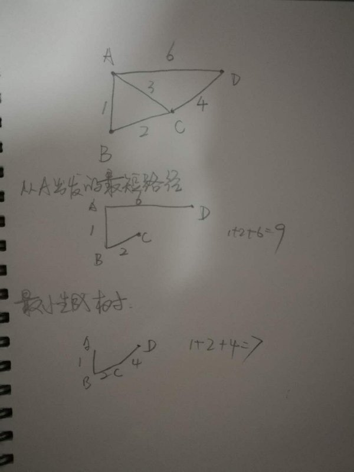

# 两者区别
* 最短路径是解决一个图中从某点出发到图中其他点的最短路径问题

* 最小生成树是解决用最小的代价将图上的所有点连接起来的问题



# js实现

dijkstra实现的最短路径和prim实现的最小生成树代码非常相似：

* dijkstra

```javascript
/**
* S： 起点
* M： 邻接矩阵
*/
function dijkstra(S, M) {
  let D = [];
  let vNum = M.length;
  let result = [], route = [];
  // 初始化
  for (let i = 0; i < vNum; i++) {
    if (i === 0) {
      result[i] = 0;
      route[i] = 0;
    } else {
      result[i] = Infinity;
      route[i] = 0;
    }
    D[i] = M[S][i];
  }
  // 添加剩余的点到T集合
  for (let i = 1; i < vNum; i++) {
    let sp = Infinity;
    let newPoint = -1;
    // 选择V-T中距离起点最近的点添加到V集合中，并记录其到起点的距离
    for (let j = 0; j < vNum; j++)
      if (result[j] === Infinity && D[j] < sp) {
        newPoint = j;
        sp = D[j];
      }
    result[newPoint] = sp;

    // 更新V-T集合中各点到起点的最短距离
    for (let j = 0; j < vNum; j++) {
      if (result[j] === Infinity && D[j] > sp + M[newPoint][j]) {
        D[j] = sp + M[newPoint][j];
        route[j] = newPoint;
      }
    }
  }
  return {result, route};
}
```

* prim

```javascript
/**
* S: 图中任意一点
* M: 邻接矩阵
*/
function prim(S, M) {
    let D = [];
    let vNum = M.length;
    let result = [], route = [];
    // 初始化
    for (let i = 0; i < vNum; i++) {
        if (i === 0) {
            result[i] = 0;
            route[i] = 0;
        } else {
            result[i] = Infinity;
            route[i] = 0;
        }
        D[i] = M[S][i];
    }
    // 添加剩余的点到T集合
    for (let i = 1; i < vNum; i++) {
        let sp = Infinity;
        let newPoint = -1;
        // 选择V-T中距离T最近的点添加到T集合中，并记录其到T的距离
        for (let j = 0; j < vNum; j++)
            if (result[j] === Infinity && D[j] < sp) {
                newPoint = j;
                sp = D[j];
            }
        result[newPoint] = sp;

        // 更新V-T集合中各点到T集合的最短距离
        for (let j = 0; j < vNum; j++) {
            if (result[j] === Infinity && D[j] > M[newPoint][j]) {
                D[j] = M[newPoint][j];
                route[j] = newPoint;
            }
        }
    }
    return {result, route};
}
```


