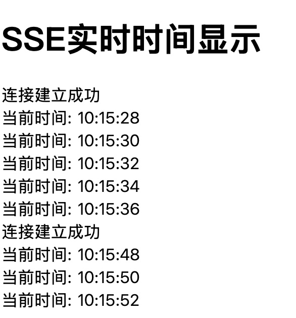
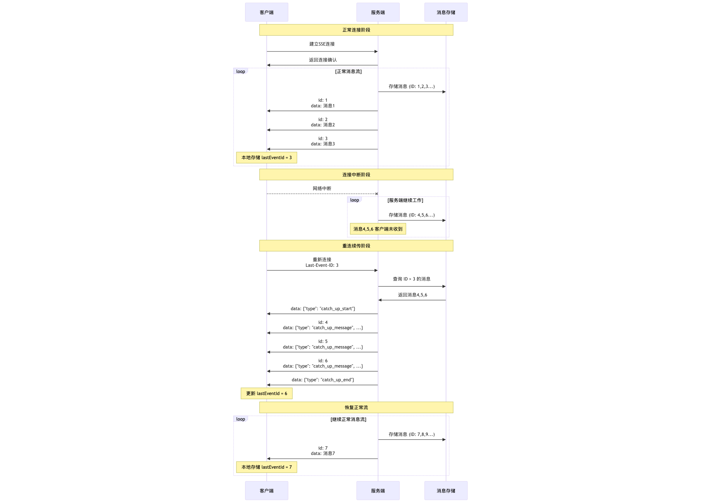
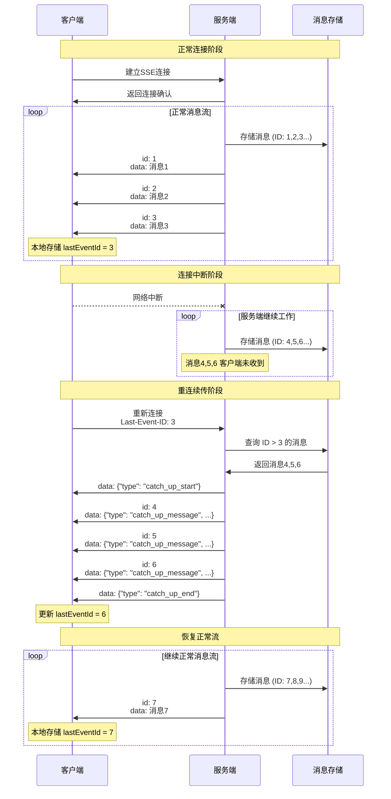
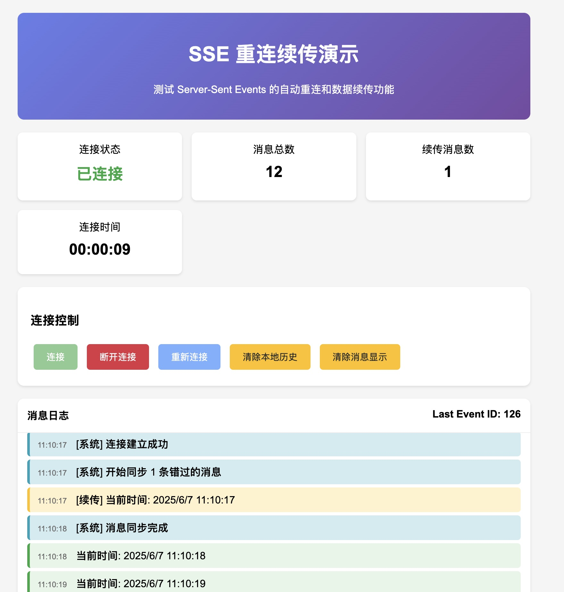

## 为什么要学习 SSE？

随着 AI 技术的爆发式发展，SSE 在以下场景中变得尤为重要：

1. **AI 聊天机器人流式回复**：ChatGPT、Claude 等 AI 助手通过 SSE 逐字输出回复，提供打字机效果
2. **AI 代码生成**：GitHub Copilot 等工具实时生成代码片段
3. **AI 图像生成进度**：Stable Diffusion 等工具显示生成进度和中间结果
4. **实时 AI 分析**：股票分析、数据挖掘结果的实时推送

### SSE vs WebSocket：如何选择？

| 特性           | SSE                     | WebSocket            |
| -------------- | ----------------------- | -------------------- |
| **通信方向**   | 单向（服务端 → 客户端） | 双向                 |
| **协议**       | 基于 HTTP               | 独立协议             |
| **复杂度**     | 简单                    | 相对复杂             |
| **自动重连**   | 内置支持                | 需要手动实现         |
| **防火墙穿透** | 优秀（HTTP 协议）       | 可能被阻止           |
| **适用场景**   | 实时推送、通知、监控    | 实时聊天、游戏、协作 |
| **浏览器支持** | 广泛支持                | 广泛支持             |

**选择建议**：

- ✅ **选择 SSE**：如果只需要服务端推送数据（如 AI 回复、通知、监控）
- ✅ **选择 WebSocket**：如果需要双向实时通信（如在线游戏、协作编辑）

## SSE 基础原理

### 什么是 SSE？

Server-Sent Events (SSE) 是 HTML5 标准的一部分，允许服务器主动向客户端推送数据。它基于 HTTP 协议，使用简单的文本格式传输数据。

### 基本工作流程

```
客户端                    服务端
   |                        |
   |-- GET /events -------->|  建立连接
   |<-- 200 OK -------------|  返回事件流
   |<-- data: message1 -----|  推送消息1
   |<-- data: message2 -----|  推送消息2
   |<-- ...              ---|  持续推送
```

## 最简单的 SSE 示例

让我们从一个最基础的例子开始：

### 服务端代码（Node.js）

```javascript
const express = require('express')
const app = express()

app.use(express.static('.'))

app.get('/events', (req, res) => {
  // 设置SSE响应头
  res.writeHead(200, {
    'Content-Type': 'text/event-stream',
    'Cache-Control': 'no-cache',
    Connection: 'keep-alive',
    'Access-Control-Allow-Origin': '*',
  })

  // 发送初始消息
  res.write('data: 连接建立成功\n\n')

  // 每隔2秒发送当前时间
  const timer = setInterval(() => {
    const now = new Date().toLocaleTimeString()
    res.write(`data: 当前时间: ${now}\n\n`)
  }, 2000)

  // 处理连接关闭
  req.on('close', () => {
    clearInterval(timer)
    console.log('客户端断开连接')
  })
})

app.listen(3000, () => {
  console.log('SSE服务器运行在 http://localhost:3000')
})
```

### 客户端代码（HTML + JavaScript）

```html
<!DOCTYPE html>
<html>
  <head>
    <title>简单的SSE示例</title>
  </head>
  <body>
    <h1>SSE实时时间显示</h1>
    <div id="messages"></div>

    <script>
      const eventSource = new EventSource('/events')
      const messagesDiv = document.getElementById('messages')

      eventSource.onmessage = function (event) {
        const messageEl = document.createElement('div')
        messageEl.textContent = event.data
        messagesDiv.appendChild(messageEl)
      }

      eventSource.onerror = function (event) {
        console.error('SSE错误:', event)
      }
    </script>
  </body>
</html>
```

这个简单的例子展示了 SSE 的核心概念：服务端持续推送数据，客户端实时接收并显示。

## SSE 消息格式详解

SSE 使用简单的文本格式传输数据，每个消息由以下字段组成：

### 基本字段

```
field: value
field: value

```

### 标准字段说明

#### 1. `data` - 数据字段

```
data: 这是消息内容
data: 可以有多行数据
```

```js
res.write('data: 这是消息内容\n')
res.write('data: 可以有多行数据\n')
res.write('\n')
```

#### 2. `event` - 事件类型

```
event: user-login
data: {"userId": 123, "name": "张三"}
```

```js
res.write('event: user-login\n')
res.write('data: {"userId": 123, "name": "张三"}\n')
res.write('\n')
```

客户端需要监听 `user-login` 事件：

```js
eventSource.addEventListener('user-login', function (event) {
  console.log('data', event.data)
})
```

#### 3. `id` - 事件 ID

```
id: 123
data: 带ID的消息
```

```js
res.write('id: 9527\n')
res.write('data: 带ID的消息\n')
res.write('\n')
```

#### 4. `retry` - 重连间隔

```
retry: 5000
data: 设置5秒重连间隔
```

## 自动重连机制

SSE 的一个重要优势是内置的自动重连功能。当连接断开时，浏览器会自动尝试重新连接。

还是用上面的最简单的 SSE 示例。

1. 启动服务后打开页面等待一会
2. 停止服务后等待一会
3. 重启服务

可以看到前端页面结果如下：



## 数据续传机制

当网络中断时，客户端可能会错过一些重要消息。为了让客户端重新连接时，能够接受到这些消息，需要实现数据续传。

### 数据续传原理

数据续传的核心机制是通过 **Last-Event-ID** 来跟踪消息的连续性：

1. **消息标识**：服务端为每条消息分配唯一的递增 ID
2. **ID 存储**：客户端将收到的最后一个事件 ID 存储在本地
3. **重连检测**：客户端重连时，通过 `Last-Event-ID` 告知服务端最后收到的消息 ID
4. **补发机制**：服务端查找历史消息，将错过的消息批量发送给客户端
5. **状态同步**：完成补发后，恢复正常的实时消息流

### 数据续传时序图





以下是一个例子



```js
// 服务端
const express = require('express')
const app = express()

app.use(express.static('.'))

// 消息历史存储
const messageHistory = []
const MAX_HISTORY_SIZE = 1000
let messageId = 0

// 当前连接的客户端（单客户端）
let currentClient = null

// 添加消息到历史记录
function addToHistory(messageData) {
  messageHistory.push({
    id: messageData.id,
    data: messageData,
    timestamp: Date.now(),
  })

  // 保持历史记录大小在限制范围内
  if (messageHistory.length > MAX_HISTORY_SIZE) {
    messageHistory.shift()
  }
}

// 获取指定ID之后的消息
function getMessagesAfter(lastEventId) {
  if (!lastEventId) return []

  const lastId = parseInt(lastEventId)
  if (isNaN(lastId)) return []

  return messageHistory.filter((msg) => msg.id > lastId).map((msg) => msg.data)
}

app.get('/events', (req, res) => {
  const lastEventId = req.headers['last-event-id'] || req.query.lastEventId
  console.log('新连接，Last-Event-ID:', lastEventId)

  res.writeHead(200, {
    'Content-Type': 'text/event-stream',
    'Cache-Control': 'no-cache',
    Connection: 'keep-alive',
    'Access-Control-Allow-Origin': '*',
    'Access-Control-Allow-Headers': 'Last-Event-ID',
  })

  // 存储当前客户端连接
  currentClient = res

  // 发送连接确认
  res.write(
    `data: ${JSON.stringify({
      type: 'connected',
      message: '连接建立成功',
      timestamp: new Date().toISOString(),
    })}\n\n`
  )

  // 如果有Last-Event-ID，发送错过的消息
  if (lastEventId) {
    const missedMessages = getMessagesAfter(lastEventId)
    console.log(`发送 ${missedMessages.length} 条错过的消息`)

    if (missedMessages.length > 0) {
      // 发送续传开始标记
      res.write(
        `data: ${JSON.stringify({
          type: 'catch_up_start',
          message: `开始同步 ${missedMessages.length} 条错过的消息`,
          count: missedMessages.length,
        })}\n\n`
      )

      // 批量发送错过的消息
      missedMessages.forEach((msg, index) => {
        setTimeout(() => {
          if (currentClient) {
            try {
              res.write(
                `id: ${msg.id}\ndata: ${JSON.stringify({
                  ...msg,
                  type: 'catch_up_message',
                  originalType: msg.type,
                })}\n\n`
              )
            } catch (error) {
              console.log('发送续传消息失败:', error.message)
              currentClient = null
            }
          }
        }, index * 100) // 每100ms发送一条
      })

      // 发送续传结束标记
      setTimeout(() => {
        if (currentClient) {
          try {
            res.write(
              `data: ${JSON.stringify({
                type: 'catch_up_end',
                message: '消息同步完成',
                syncCount: missedMessages.length,
              })}\n\n`
            )
          } catch (error) {
            console.log('发送续传结束标记失败:', error.message)
            currentClient = null
          }
        }
      }, missedMessages.length * 100 + 200)
    }
  }

  // 处理连接关闭
  req.on('close', () => {
    console.log('连接关闭')
    currentClient = null
  })

  req.on('error', (error) => {
    console.log('连接错误:', error.message)
    currentClient = null
  })
})

// 模拟定期发送消息
setInterval(() => {
  const messageData = {
    id: ++messageId,
    type: 'message',
    message: '当前时间: ' + new Date().toLocaleString(),
    timestamp: new Date().toISOString(),
  }

  // 存储到历史记录
  addToHistory(messageData)

  // 发送到当前连接的客户端
  if (currentClient) {
    try {
      currentClient.write(
        `id: ${messageData.id}\ndata: ${JSON.stringify(messageData)}\n\n`
      )
      console.log('消息已发送:', messageData.message)
    } catch (error) {
      console.log('消息发送失败:', error.message)
      currentClient = null
    }
  } else {
    console.log('无客户端连接，消息仅存储到历史:', messageData.message)
  }
}, 1000)

console.log('SSE服务器启动在 http://localhost:3000')
console.log('访问 http://localhost:3000 查看演示页面')

app.listen(3000)
```

```html
<!-- 客户端 -->
<!DOCTYPE html>
<html lang="zh">
  <head>
    <meta charset="UTF-8" />
    <meta name="viewport" content="width=device-width, initial-scale=1.0" />
    <title>SSE 重连续传演示</title>
    <style>
      body {
        font-family: Arial, sans-serif;
        max-width: 800px;
        margin: 0 auto;
        padding: 20px;
        background-color: #f5f5f5;
      }
      .header {
        background: linear-gradient(135deg, #667eea 0%, #764ba2 100%);
        color: white;
        padding: 20px;
        border-radius: 10px;
        margin-bottom: 20px;
        text-align: center;
      }
      .controls {
        background: white;
        padding: 20px;
        border-radius: 10px;
        margin-bottom: 20px;
        box-shadow: 0 2px 4px rgba(0, 0, 0, 0.1);
      }
      .status-panel {
        display: grid;
        grid-template-columns: repeat(auto-fit, minmax(200px, 1fr));
        gap: 15px;
        margin-bottom: 20px;
      }
      .status-card {
        background: white;
        padding: 15px;
        border-radius: 8px;
        box-shadow: 0 2px 4px rgba(0, 0, 0, 0.1);
        text-align: center;
      }
      .status-value {
        font-size: 24px;
        font-weight: bold;
        margin: 10px 0;
      }
      .status-connected {
        color: #28a745;
      }
      .status-disconnected {
        color: #dc3545;
      }
      .status-catching-up {
        color: #ffc107;
      }
      .btn {
        padding: 10px 20px;
        border: none;
        border-radius: 5px;
        cursor: pointer;
        font-size: 14px;
        margin: 5px;
        transition: background-color 0.3s;
      }
      .btn-primary {
        background-color: #007bff;
        color: white;
      }
      .btn-primary:hover {
        background-color: #0056b3;
      }
      .btn-danger {
        background-color: #dc3545;
        color: white;
      }
      .btn-danger:hover {
        background-color: #c82333;
      }
      .btn-success {
        background-color: #28a745;
        color: white;
      }
      .btn-success:hover {
        background-color: #218838;
      }
      .btn-warning {
        background-color: #ffc107;
        color: #212529;
      }
      .btn-warning:hover {
        background-color: #e0a800;
      }
      .btn:disabled {
        opacity: 0.6;
        cursor: not-allowed;
      }
      .messages-container {
        background: white;
        border-radius: 10px;
        max-height: 400px;
        overflow-y: auto;
        box-shadow: 0 2px 4px rgba(0, 0, 0, 0.1);
      }
      .messages-header {
        padding: 15px;
        border-bottom: 1px solid #eee;
        font-weight: bold;
        position: sticky;
        top: 0;
        background: white;
      }
      #messages {
        padding: 15px;
      }
      .message {
        padding: 8px 12px;
        margin: 5px 0;
        border-radius: 5px;
        border-left: 4px solid;
      }
      .new-message {
        background-color: #e8f5e8;
        border-left-color: #28a745;
      }
      .catch-up-message {
        background-color: #fff3cd;
        border-left-color: #ffc107;
      }
      .system-message {
        background-color: #d1ecf1;
        border-left-color: #17a2b8;
      }
      .timestamp {
        font-size: 12px;
        color: #666;
        margin-right: 10px;
      }
      .content {
        font-weight: 500;
      }
    </style>
  </head>
  <body>
    <div class="header">
      <h1>SSE 重连续传演示</h1>
      <p>测试 Server-Sent Events 的自动重连和数据续传功能</p>
    </div>

    <div class="status-panel">
      <div class="status-card">
        <div>连接状态</div>
        <div class="status-value" id="connection-status">未连接</div>
      </div>
      <div class="status-card">
        <div>消息总数</div>
        <div class="status-value" id="message-count">0</div>
      </div>
      <div class="status-card">
        <div>续传消息数</div>
        <div class="status-value" id="catchup-count">0</div>
      </div>
      <div class="status-card">
        <div>连接时间</div>
        <div class="status-value" id="connection-time">--:--:--</div>
      </div>
    </div>

    <div class="controls">
      <h3>连接控制</h3>
      <button id="connect-btn" class="btn btn-success">连接</button>
      <button id="disconnect-btn" class="btn btn-danger" disabled>
        断开连接
      </button>
      <button id="reconnect-btn" class="btn btn-primary" disabled>
        重新连接
      </button>
      <button id="clear-history-btn" class="btn btn-warning">
        清除本地历史
      </button>
      <button id="clear-messages-btn" class="btn btn-warning">
        清除消息显示
      </button>
    </div>

    <div class="messages-container">
      <div class="messages-header">
        <span>消息日志</span>
        <span style="float: right;" id="last-event-id">Last Event ID: --</span>
      </div>
      <div id="messages"></div>
    </div>

    <script>
      class SSEClientWithCatchUp {
        constructor(url) {
          this.url = url
          this.lastEventId = localStorage.getItem('sse_last_event_id')
          this.isCatchingUp = false
          this.eventSource = null
          this.messageCount = 0
          this.catchupCount = 0
          this.connectionStartTime = null
          this.connectionTimer = null

          this.updateUI()
        }

        connect() {
          if (this.eventSource) {
            this.eventSource.close()
          }

          const url = this.lastEventId
            ? `${this.url}?lastEventId=${this.lastEventId}`
            : this.url

          console.log('正在连接...', {url, lastEventId: this.lastEventId})

          this.eventSource = new EventSource(url)
          this.connectionStartTime = Date.now()
          this.startConnectionTimer()

          this.eventSource.onopen = () => {
            console.log('✅ SSE 连接已建立')
            this.updateConnectionStatus('已连接', 'connected')
            this.updateButtons(true)
          }

          this.eventSource.onmessage = (event) => {
            // 保存最新的事件ID
            if (event.lastEventId) {
              this.lastEventId = event.lastEventId
              localStorage.setItem('sse_last_event_id', this.lastEventId)
              document.getElementById(
                'last-event-id'
              ).textContent = `Last Event ID: ${this.lastEventId}`
            }

            const data = JSON.parse(event.data)
            this.handleMessage(data)
          }

          this.eventSource.onerror = () => {
            console.log('❌ 连接错误')
            this.updateConnectionStatus('连接错误', 'disconnected')
            this.updateButtons(false)
            this.stopConnectionTimer()
          }
        }

        disconnect() {
          if (this.eventSource) {
            console.log('🔌 手动断开连接')
            this.eventSource.close()
            this.eventSource = null
          }
          this.updateConnectionStatus('已断开', 'disconnected')
          this.updateButtons(false)
          this.stopConnectionTimer()
        }

        reconnect() {
          console.log('🔄 重新连接中...')
          this.updateConnectionStatus('重连中...', 'catching-up')
          this.connect()
        }

        clearHistory() {
          localStorage.removeItem('sse_last_event_id')
          this.lastEventId = null
          document.getElementById('last-event-id').textContent =
            'Last Event ID: --'
          console.log('🗑️ 已清除本地历史记录')
          this.displaySystemMessage(
            '已清除本地 Last Event ID，下次连接将从头开始接收消息'
          )
        }

        clearMessages() {
          document.getElementById('messages').innerHTML = ''
          this.messageCount = 0
          this.catchupCount = 0
          this.updateCounters()
          console.log('🗑️ 已清除消息显示')
        }

        handleMessage(data) {
          switch (data.type) {
            case 'connected':
              console.log('✅ 连接确认:', data.message)
              this.displaySystemMessage(data.message)
              break
            case 'catch_up_start':
              this.isCatchingUp = true
              this.updateConnectionStatus('数据续传中...', 'catching-up')
              console.log('🔄 开始数据续传:', data.message)
              this.displaySystemMessage(data.message)
              break
            case 'catch_up_message':
              console.log('📦 续传消息:', data.message)
              this.displayMessage(data, true)
              this.catchupCount++
              break
            case 'catch_up_end':
              this.isCatchingUp = false
              this.updateConnectionStatus('已连接', 'connected')
              console.log('✅ 数据续传完成:', data.message)
              this.displaySystemMessage(data.message)
              break
            case 'message':
              console.log('📨 新消息:', data.message)
              this.displayMessage(data, false)
              break
            case 'heartbeat':
              console.log('💓 心跳:', data.timestamp)
              break
          }
          this.updateCounters()
        }

        displayMessage(data, isCatchUp) {
          const messageEl = document.createElement('div')
          messageEl.className = `message ${
            isCatchUp ? 'catch-up-message' : 'new-message'
          }`
          messageEl.innerHTML = `
      <span class="timestamp">${new Date(
        data.timestamp
      ).toLocaleTimeString()}</span>
      <span class="content">${isCatchUp ? '[续传] ' : ''}${data.message}</span>
    `
          document.getElementById('messages').appendChild(messageEl)
          // messageEl.scrollIntoView({ behavior: 'smooth' })

          if (!isCatchUp) {
            this.messageCount++
          }
        }

        displaySystemMessage(message) {
          const messageEl = document.createElement('div')
          messageEl.className = 'message system-message'
          messageEl.innerHTML = `
      <span class="timestamp">${new Date().toLocaleTimeString()}</span>
      <span class="content">[系统] ${message}</span>
    `
          document.getElementById('messages').appendChild(messageEl)
          // messageEl.scrollIntoView({ behavior: 'smooth' })
        }

        updateConnectionStatus(status, className) {
          const statusEl = document.getElementById('connection-status')
          statusEl.textContent = status
          statusEl.className = `status-value status-${className}`
        }

        updateButtons(connected) {
          document.getElementById('connect-btn').disabled = connected
          document.getElementById('disconnect-btn').disabled = !connected
          document.getElementById('reconnect-btn').disabled = connected
        }

        updateCounters() {
          document.getElementById('message-count').textContent =
            this.messageCount
          document.getElementById('catchup-count').textContent =
            this.catchupCount
        }

        startConnectionTimer() {
          this.connectionTimer = setInterval(() => {
            if (this.connectionStartTime) {
              const elapsed = Date.now() - this.connectionStartTime
              const time = new Date(elapsed).toISOString().substr(11, 8)
              document.getElementById('connection-time').textContent = time
            }
          }, 1000)
        }

        stopConnectionTimer() {
          if (this.connectionTimer) {
            clearInterval(this.connectionTimer)
            this.connectionTimer = null
          }
          document.getElementById('connection-time').textContent = '--:--:--'
        }

        updateUI() {
          this.updateConnectionStatus('未连接', 'disconnected')
          this.updateButtons(false)
          this.updateCounters()
          document.getElementById(
            'last-event-id'
          ).textContent = `Last Event ID: ${this.lastEventId || '--'}`
        }
      }

      // 初始化客户端
      const client = new SSEClientWithCatchUp('/events')

      // 绑定按钮事件
      document.getElementById('connect-btn').addEventListener('click', () => {
        client.connect()
      })

      document
        .getElementById('disconnect-btn')
        .addEventListener('click', () => {
          client.disconnect()
        })

      document.getElementById('reconnect-btn').addEventListener('click', () => {
        client.reconnect()
      })

      document
        .getElementById('clear-history-btn')
        .addEventListener('click', () => {
          if (
            confirm(
              '确定要清除本地历史记录吗？这将导致下次连接时重新接收所有消息。'
            )
          ) {
            client.clearHistory()
          }
        })

      document
        .getElementById('clear-messages-btn')
        .addEventListener('click', () => {
          client.clearMessages()
        })

      // 页面加载完成后自动连接
      window.addEventListener('load', () => {
        setTimeout(() => {
          client.connect()
        }, 1000)
      })
    </script>
  </body>
</html>
```

## 总结

Server-Sent Events (SSE) 是基于 HTTP 的服务端推送技术，特别适合 AI 聊天、实时通知等单向数据流场景。本文介绍了 SSE 的基本数据格式，断线重连及数据续传功能。
