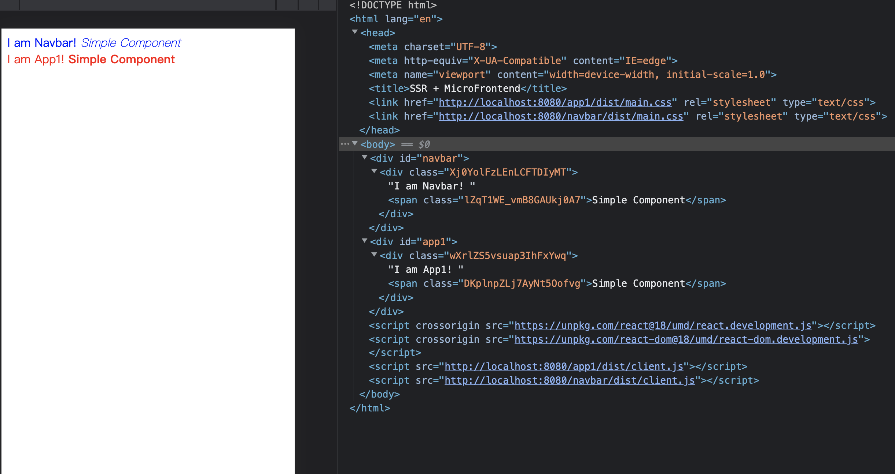

# 前言

第一次见到这个概念是在 [single-spa](https://single-spa.js.org/docs/ssr-overview) 官网上。不得不说，前端真能搞事情，我一个都还没搞清楚呢，现在还要把这两个搞到一起。行吧，我学还不行？为了更好的理解，本文不会照搬官网的 Demo，而是从头再搞一遍。完整代码见 [SSR-MicroFrontend](https://github.com/ParadeTo/SSR-MicroFrontend)。

最终效果如下所示：



# 原理介绍

首先，我们的项目包括这几个部分：

```js
packages
│   ├── app1 // 子应用 1
│   ├── base // 基座
│   └── navbar // 子应用 2
└── readme.md
```

_本文 `webpack` 版本为 5_

## 基座

其中，基座的主要功能：

1. 接收请求。
2. 准备好 HTML 模板。
3. 拉取子应用 server 端入口文件，每个子应用的这个文件会导出 `renderOnServerSide` 方法，该方法返回 `renderToString` 执行后的 `content`。
4. 将每个子应用的 `content` 插入到 HTML 模板中的对应位置。
5. 插入子应用的资源文件（CSS 和 JS）到 HTML 模板。
6. 返回 HTML。

代码大概长这样：

```js
const {JSDOM} = require('jsdom')

app.get('/', async (req, res) => {
  const templateDOM = new JSDOM(`
<!DOCTYPE html>
<html lang="en">
  <head>
    <title>SSR + MicroFrontend</title>
  </head>
  <body>
    <div id="navbar"></div>
    <div id="app1"></div>
    <script crossorigin src="https://unpkg.com/react@18/umd/react.development.js"></script>
    <script crossorigin src="https://unpkg.com/react-dom@18/umd/react-dom.development.js"></script>
  </body>
</html>
`)

  // nav
  const navContent = await getContent(
    'http://localhost:8080/navbar/dist/server.js'
  )
  // app1
  const app1Content = await getContent(
    'http://localhost:8080/app1/dist/server.js'
  )
  templateDoc.querySelector('#navbar').innerHTML = navContent
  templateDoc.querySelector('#app1').innerHTML = app1Content

  // 插入 css js resources 等资源
  ...

  res.end(templateDOM.serialize())
})
```

上面这段代码中 `getContent` 这个函数比较重要，它的功能是远程拉取代码并执行，得到代码所导出的模块：

```js
async function getContent(url) {
  const rsp = await fetch(url)
  const code = await rsp.text()
  const wrapper = new Function('require, exports, module', code)
  wrapper(require, module.exports, module)
  return module.exports.renderOnServerSide().content
}
```

可以看到，我们这里使用 `new Function` 生成了一个函数来执行远程获取到的代码。

接下来，我们看看子应用是怎么打包的。

## 子应用

以 `app1` 为例，代码

```js
// app1
├── src
│   ├── App.css
│   ├── App.js
│   ├── SimpleComp
│   ├── client.entry.js
│   └── server.entry.js
├── webpack.config.js
```

其中，我们需要关注的是 `client.entry.js` 和 `server.entry.js`，但是它们其实都很简单：

```js
// client.entry.js
import React from 'react'
import {hydrateRoot} from 'react-dom'
import App from './App'

hydrateRoot(document.getElementById('app1'), <App />)

// server.entry.js
import {renderToString} from 'react-dom/server'
import React from 'react'

import App from './App'

export function renderOnServerSide() {
  const content = renderToString(<App />)
  return {content}
}
```

`client.entry.js` 会运行在浏览器客户端，用于给应用注水。`server.entry.js` 上面提到过了，基座会远程获取这个文件并得到 `renderOnServerSide` 这个方法执行返回该子应用的内容。

接下来，需要着重介绍一下打包配置。首先，对于两个入口文件，我们需要有不同的配置，我们先介绍 `server.entry.js`，有几个点需要注意：

1. 打包输出格式需要为 `commonjs2`（`umd` 也行），因为我们是在 Node.js 环境中来运行。这个可以在 `output` 中配置：

```js
output: {
  libraryTarget: 'commonjs2',
},
```

2. 我们需要把 `react` 和 `react-dom` 等库设置成 `externals`，这样可以减小子应用打包后的体积。我们可以在基座中统一提供这些库给所有子应用使用。

```js
externals: [/react/, /react-dom/],
```

设置成这样后，打包后的代码就不会处理这些库了，会长这样：

```js
/***/ "react":
/*!************************!*\
  !*** external "react" ***!
  \************************/
/***/ ((module) => {

module.exports = require("react");

/***/ }),
```

3. 注意样式的处理，这个后面统一再讨论。

我们再来看一下 `client.entry.js`，也有几个点需要注意：

1. 需要把 `react` 和 `react-dom` 等库设置成 `externals`，但是这里跟 `server.entry.js` 又有点不同：

```js
externals: {
  react: 'React',
  'react-dom': 'ReactDOM',
},
```

客户端的这些库我们通过在基座的 HTML 模板中插入的 `script` 标签来提供：

```html
<script
  crossorigin
  src="https://unpkg.com/react@18/umd/react.development.js"
></script>
<script
  crossorigin
  src="https://unpkg.com/react-dom@18/umd/react-dom.development.js"
></script>
```

注意，最好保证服务端和客户端的 `react` 等库版本一致。

2. 注意样式的处理。

两者都提到了样式的处理，也是本文最麻烦的一个地方，不过经过一番折腾终于搞定了，而且受惠于前端丰富的工具，改了几个参数就实现了。下面来看看到底怎么做的：

## 样式处理

样式处理最开始的想法是基座在调用 `renderOnServerSide` 不仅返回 HTML 片段内容，还返回所有的样式规则，这个可以用 `isomorphic-style-loader` 这个库来实现：

```js
// server.entry.js
import StyleContext from 'isomorphic-style-loader/StyleContext'
import App from './App'

export function renderOnServerSide() {
  const css = new Set()
  const insertCss = (...styles) =>
    styles.forEach((style) => css.add(style._getCss()))
  const content = ReactDOM.renderToString(
    <StyleContext.Provider value={{insertCss}}>
      <App />
    </StyleContext.Provider>
  )
  return {content, css}
}

// App.js
import useStyles from 'isomorphic-style-loader/useStyles'
import s from './App.scss'

const App = (props) => {
  useStyles(s)
  return (
    <div className={s.root}>
      <h1 className={s.title}>Hello, world!</h1>
    </div>
  )
}

export default App
```

然后，基座中把这些 CSS 规则也插入到 HTML 模板中：

```js
const html = `<!doctype html>
    <html>
      <head>
        <script src="client.js" defer></script>
        <style>${[...css].join('')}</style>
      </head>
    </html>`
```

不过，这个方法需要改写每个组件（要么用高阶函数，要么使用 `useStyles`），对代码侵入有点大，所以没有考虑。

本文用的是另外一种方法。

首先，我们在打包子应用的 `client.entry.js` 时，把所有 CSS 文件都提取出来，这个通过 `mini-css-extract-plugin` 实现。

然后，我们使用 `webpack-manifest-plugin` 来生成一份资源清单，生成结果如下所示：

```json
{
  "main.css": "/app1/dist/main.css",
  "main.js": "/app1/dist/client.js",
  "client.js.map": "/app1/dist/client.js.map"
}
```

这样，我们就可以在基座中拉取每个子应用的资源清单，并把 CSS 和 JS 资源都插入到 HTML 中了。

到这里我们马上要成功了，不过还有两个问题要处理：

- server 端的 CSS 怎么处理？

由于 server 端不需要插入样式，所以我们只需要用到 `css-loader`，并按照如下进行配置：

```js
loader: 'css-loader',
options: {
  modules: {
    exportOnlyLocals: true,
  },
},
```

这个实现的效果是当我们开启 `CSS Module` 时，在服务端仍然能得到经过 `hash` 的类名，且不需要插入样式到 HTML 中。

- 如何防止类名冲突？

虽然开启 `CSS Module` 后类名会经过 `hash` 处理，但是实际验证发现如果不同子应用下同一个类名及所在文件名也相同时，经过 `hash` 以后的名称仍然可能冲突，为了避免这种情况，我们会想到给每个应用的样式都加一个命名空间，这个似乎又很麻烦。经过一番调研后，我发现 `css-loader` 还有一个这样的属性：`localIdentHashSalt`，即在计算 `hash` 的时候加点“盐”，我们给每个子应用不同的盐不就 OK 了么，这下又省事了。

# 总结

本文受 single spa 的 SSR + 微前端概念的启发，实现了一个简单的 DEMO。基座通过拉取各个子应用生代码成 HTML 的片段，并最后组装成完整的 HTML 文件，同时通过一些特殊的打包配置解决了 CSS 的加载及样式隔离。这个复杂的概念初看感觉高大上，但是通过不断拆解迭代，发现其实也就那么回事，果然前端没有新鲜事，只有新概念。
