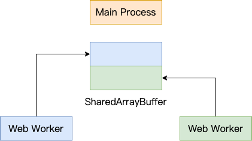

之前分别用 [JS](/2022/10/01/wasm-video-filter/)，[Golang WebAssembly](/2022/10/01/wasm-video-filter/) 和 [Rust WebAssembly](/2024/02/27/wasm-video-filter-rust/) 实现过视频实时滤镜效果，证明了 WebAssembly 的性能确实要更好一些。但其实当处理图像这种较大的数据时，另一个比较常用的做法是分块并行处理，这就要用到 Web Worker 了。

We have implemented image convolution using [JS](/2022/10/01/wasm-video-filter/), [Golang WebAssembly](/2022/10/01/wasm-video-filter/) and [rust WebAssembly](/2024/02/27/wasm-video-filter-rust/) previously. Which proves that WebAssembly's performance is indeed better. But in fact, when dealing with large data such as images, another common practice is to split the data into blocks and process them in parallel. And it's time to use Web Workers.

思路也很简单，在主进程中我们把图像分成好几个块，然后传给各个 Web Worker 进行处理，然后接受处理后的结果拼接起来。不过在进程间传递大量数据显然是一个比较低效的方式，所以这里我们使用 `SharedArrayBuffer`，让主进程跟各 Web Worker 之间共享一块内存，这样就只需要传递 `SharedArrayBuffer` 的引用就可以了:

The method is also very simple, in the main process, we divide the image into several blocks, and then send it to various Web Workers to process, and then accept the processed results to join together. However, passing large amounts of data between processes is obviously an inefficient way, so we use `SharedArrayBuffer` to share memory between the main process and each Web Worker, so we only need to pass a reference to `SharedArrayBuffer`:

```js
// main.js
const worker = new Worker('...')
const sharedArrayBuffer = new SharedArrayBuffer(imageData.buffer.byteLength)
new Uint8ClampedArray(sharedArrayBuffer).set(imageData)

worker.postMessage({start, end, width, sharedArrayBuffer})

// webworker.js
onmessage = async (e: MessageEvent) => {
  const {
    data: {sharedArrayBuffer, start, end, width},
  } = e
  const uint8ClampedArray = new Uint8ClampedArray(sharedArrayBuffer)

  // update sharedArrayBuffer using uint8ClampedArray
  for (let i = start; i < end; i++) {
    for (let j = 0; j < width; j++) {
      uint8ClampedArray[i * width + j] = 100 // Red
      uint8ClampedArray[i * width + j + 1] = 100 // Green
      uint8ClampedArray[i * width + j + 2] = 100 // Blue
    }
  }
}
```

上述代码中的 `start` 和 `end` 分别表示当前 Web Worker 需要处理的起始和结束行号，`width` 表示 `
Canvas 宽度。用图来表示就像这样：

In the above code, `start` and `end` represent the start and end line numbers that the current Web Worker needs to process, and `width` is Canvas's width. It can be explained like this:



把 Canvas 宽高设大一点后，对比之前的 JS 版本，效果还是很明显的：

After increasing width and height of the Canvas, the effect is significantly better than the previous JS version:


到这，你肯定会想到，如果在 Web Worker 里面再用上 WebAssembly 那岂不是效果更炸裂？

At this point, you must be thinking, if we use WebAssembly in the Web Worker, won't the result become fantastic?

我们来试试，只需要在 Web Worker 里面再把数据共享给 WASM 处理，然后再使用修改后的 `memory.buffer` 来更新 `SharedArrayBuffer` 对应的块就可以了：

Let's try it out. We just need to share the data with WASM in the Web Worker, and then update the block in `SharedArrayBuffer` with the modified `memory.buffer`:

```js
onmessage = async (e: MessageEvent) => {
  const {
    data: {sharedArrayBuffer, start, end, width},
  } = e
  const ptr = return_pointer()
  const uint8ClampedArrayForMemBuf = new Uint8ClampedArray(memory.buffer)
  const uint8ClampedArrayForSharedBuf = new Uint8ClampedArray(sharedArrayBuffer)
  // Sync the block data to WASM
  uint8ClampedArrayForMemBuf.set(
    uint8ClampedArrayForSharedBuf.slice(start * width * 4, end * width * 4)
  )
  // Image convolution
  filter_shared_mem(
    ptr,
    width,
    end - start,
    new Float32Array([].concat(...kernel))
  )
  // Update the block in SharedArrayBuffer using modified memory.buffer
  uint8ClampedArrayForSharedBuf.set(
    new Uint8ClampedArray(memory.buffer).slice(ptr, (end - start) * width * 4),
    start * width * 4
  )
}
```

这里需要注意的地方是从 `SharedArrayBuffer` 中同步数据到 `memory.buffer` 以及更新 `SharedArrayBuffer` 中的数据时，都只需要关注前 Web Worker 所属的块就可以了。

Note that when you synchronize data from `SharedArrayBuffer` to `memory.buffer` or update `SharedArrayBuffer` with modified `memory.buffer`, you only need to process the block belongs to current Web Worker.

看一下效果，确实又提升了：

The result is really improved:


而且，通过分块的方式，还解决了另外一个内存相关的问题。为什么这么说呢，因为增大了 canvas 的宽高，相当于增加了需要处理的图像数据大小，此时如果切到图中的 `Rust WebAssembly (Shared Memory)` 会报 `RangeError: offset is out of bounds` 错误，原因在于图像大小已经超过了 WebAssembly 中初始的 Memory 的大小。虽然 MDN 上介绍了可以使用 `memory.grow()` 方法来扩大内存，但是还是会有别的错误，暂时未能解决。

Moreover, another memory-related problem is solved by this way. What? Because increasing the width and height of Canvas is equivalent to increasing the size of image data to be processed. If you select the `Rust WebAssembly (Shared Memory)` option on the image above. You will get a `RangeError will be reported: offset is out of bounds` error. The reason is that the image size has exceeded the initial Memory size in WebAssembly. (According to MDN, the size can be expand be call `grow()`, but I got another error after using it.)
