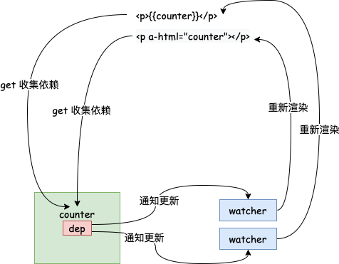

# 需求分析

话不多说，直接上代码：

```javascript
<div id="app">
  <p k-text="counter"></p>
  <p>{{obj.age}}</p>
  <p k-html="desc"></p>
  <input type="text" k-model="desc" />
  <button @click="resetDesc">重置 desc</button>
  <button @click="addProperty">新增属性</button>
</div>
<script src="avue.js"></script>
<script>
  const desc = '你好吗'
  const app = new AVue({
    el: '#app',
    data: {
      obj: {},
      counter: 1,
      desc,
    },
    methods: {
      resetDesc() {
        this.desc = desc
      },
      addProperty() {
        this.$set(this.obj, 'age', 18)
      },
    },
  })
  setInterval(() => {
    app.counter++
  }, 1000)
</script>
```

为了实现这些功能，我们分几步走：

1. 首次渲染
2. 响应式系统
3. 事件绑定
4. 双向绑定

# 首次渲染

我们先来实现一下首次渲染，首次渲染我们需要做的事情比较简单：解析模板，获取数据，渲染。

## AVue

```javascript
class AVue {
  constructor(options) {
    // 保存选项
    this.$options = options
    this.$data = options.data
    this.$methods = options.methods

    // 编译器
    new Compiler(options.el, this)
  }

  getVal(exp) {
    // 将匹配的值用 . 分割开，如 vm.data.a.b
    exp = exp.split('.')

    // 归并取值
    return exp.reduce((prev, next) => {
      return prev[next]
    }, this.$data)
  }
}
```

`AVue` 类的构造函数中会将外部传进来的参数进行保存，然后初始化一个编译器对模板进行编译。

这里还实现了方法 `getVal` 用来从 `obj.age.a.b` 这样的表达式中“递归地”进行取值。

注：`Vue` 中的做法是把模板编译成了渲染函数，就像这样：

```javascript
function render() {
  with (this) {
    return _c(
      'div',
      {
        attrs: {
          id: 'app',
        },
      },
      [
        _c('p', {
          domProps: {
            textContent: _s(counter),
          },
        }),
        _v(' '),
        _c('p', {
          domProps: {
            innerHTML: _s(obj.age),
          },
        }),
        _v(' '),
        _c('p', {
          domProps: {
            innerHTML: _s(desc),
          },
        }),
        _v(' '),
        _c('input', {
          directives: [
            {
              name: 'model',
              rawName: 'v-model',
              value: desc,
              expression: 'desc',
            },
          ],
          attrs: {
            type: 'text',
          },
          domProps: {
            value: desc,
          },
          on: {
            input: function ($event) {
              if ($event.target.composing) return
              desc = $event.target.value
            },
          },
        }),
        _v(' '),
        _c(
          'button',
          {
            on: {
              click: resetDesc,
            },
          },
          [_v('重置 desc')]
        ),
        _v(' '),
        _c(
          'button',
          {
            on: {
              click: addProperty,
            },
          },
          [_v('新增属性')]
        ),
      ]
    )
  }
}
```

其中，`_c` 就是 `$createElement`，位于 `core/instance/render.js`，其他函数 `_v`, `_s` 见 `core/instance/render-helpers/index.js`。

## Compiler

```javascript
class Compiler {
  constructor(el, vm) {
    this.$vm = vm
    this.$el = document.querySelector(el)

    // 执行编译
    this.compile(this.$el)
  }

  compile(el) {
    // 遍历这个el
    el.childNodes.forEach((node) => {
      // 是否是元素
      if (node.nodeType === 1) {
        this.compileElement(node)
      } else if (this.isText(node)) {
        this.compileText(node)
      }

      // 递归
      if (node.childNodes) {
        this.compile(node)
      }
    })
  }

  // 解析绑定表达式
  compileText(node) {
    // 获取正则匹配表达式，从vm里面拿出它的值
    // node.textContent = this.$vm[RegExp.$1]
    this.update(node, RegExp.$1, 'text')
  }

  // 编译元素
  compileElement(node) {
    // 处理元素上面的属性，典型的是a-，@开头的
    const attrs = node.attributes
    Array.from(attrs).forEach((attr) => {
      const attrName = attr.name
      const exp = attr.value
      if (attrName.indexOf('a-') === 0) {
        // 截取指令名称
        const dir = attrName.substring(2)
        // 看看是否存在对应方法，有则执行
        this[dir] && this[dir](node, exp)
      }
    })
  }

  // k-text
  text(node, exp) {
    this.update(node, exp, 'text')
  }

  // k-html
  html(node, exp) {
    this.update(node, exp, 'html')
  }

  update(node, exp, dir) {
    const fn = this[dir + 'Updater']
    fn && fn(node, this.$vm.getVal(exp))
  }

  textUpdater(node, val) {
    node.textContent = val
  }

  htmlUpdater(node, val) {
    node.innerHTML = val
  }

  // 文本节点
  isText(node) {
    return node.nodeType === 3 && /\{\{(.*)\}\}/.test(node.textContent)
  }
}
```

`Compiler` 构造函数中会调用 `compile` 方法来编译我们的模板。这里分元素类型和文本类型。

遇到元素类型就解析上面的指定，如果命中了就执行相关的指定方法（这里暂时只时间了 `test` 和 `html` 指令），同时解析出指定的表达式，通过 `getVal` 得到值，根据不同的指令进行相关的渲染。

文本类型则需要解析出双大括号中的表达式，最后调用 `text` 指令的方法。

# 响应式数据系统

先不急着写代码，我们先来画个流程图来梳理下我们的思路：



我们需要在首次渲染获取值的时候通过拦截 `get` 方法来收集每个 key 所对应的依赖，即 `watcher`，并给每个 key 分配一个 `dep` 来负责管理。注意到一个 key 可能在页面中多次被使用，所以这里我们一个 key 可能对应着多个 `watcher`，这里 `dep` 和 `watcher` 的关系是一对多的。当给 key 赋值的时候，我们需要去通知对应的 `watcher` 进行更新，`watcher` 则会对视图进行重新渲染。

注：`Vue` 中为了避免一个组件中存在太多的 `watcher` 影响性能，实际上是一个组件只有一个 `watcher`（不包括 `computed` 属性产生的）

流程图出来了，我们来实现一下：

```javascript
class AVue {
  constructor(options) {
    // 保存选项
    this.$options = options
    this.$data = options.data
    this.$methods = options.methods

    observe(this.$data)

    // 代理，使得访问 vm.a 时可以访问到 vm.$data.a
    proxy(this)

    // 编译器
    new Compiler(options.el, this)
  }
  ...
```

首先看一下 `proxy` 函数：

```javascript
function proxy(vm) {
  Object.keys(vm.$data).forEach((key) => {
    Object.defineProperty(vm, key, {
      get() {
        return vm.$data[key]
      },
      set(val) {
        vm.$data[key] = val
      },
    })
  })
}
```

该函数只是做了一下代理，这样就可以通过实例直接访问 `$data` 中的属性了。

再来看一下 `observe` 这个函数：

```javascript
function observe(value) {
  if (typeof value !== 'object' || value == null) {
    return
  }

  // 创建Observer实例:以后出现一个对象，就会有一个Observer实例
  return new Observer(value)
}
```

该函数类似一个工厂函数，当传入的值为对象时，返回一个 `Observer` 实例，即 value 被观察后的一个对象。

```javascript
function def(obj, key, val, enumerable) {
  Object.defineProperty(obj, key, {
    value: val,
    enumerable: !!enumerable,
    writable: true,
    configurable: true,
  })
}

class Observer {
  constructor(value) {
    def(value, '__ob__', this)

    this.value = value
    this.walk(value)
  }

  // 遍历对象做响应式
  walk(obj) {
    Object.keys(obj).forEach((key) => {
      defineReactive(obj, key, obj[key])
    })
  }
}
```

`Observer` 中做了几件事：

1. 定义了 `__ob__` 属性，该属性通过 `Object.defineProperty` 来定义，且无法被遍历。
2. 将要观察的值挂载在 `value` 属性上。
3. 因为 `value` 是一个对象，所以遍历 `value` 的 key 来 `defineReactive`。

在看 `defineReactive` 前，我们先快速的看一下 `Dep` 和 `Watcher`：

```javascript
// 管理一个依赖，未来执行更新
class Watcher {
  constructor(vm, exp, updateFn) {
    this.vm = vm
    this.exp = exp
    this.updateFn = updateFn

    // 标记当前的 watcher
    Dep.target = this
    // 读一下当前exp，触发依赖收集
    vm.getVal(exp)
    // 依赖完成后重置一下
    Dep.target = null
  }

  // 未来会被dep调用
  update() {
    this.updateFn.call(this.vm, this.vm.getVal(this.exp))
  }
}

// 保存所有watcher实例，当某个key发生变化，通知他们执行更新
class Dep {
  constructor() {
    this.deps = []
  }

  addDep(watcher) {
    this.deps.push(watcher)
  }

  notify() {
    this.deps.forEach((dep) => dep.update())
  }
}
```

这两个比较好懂，就不赘述了。我们看一下 `defineReactive`：

```javascript
function defineReactive(obj, key, val) {
  // 每一个 ke 对应一个 dep
  const dep = new Dep()
  // 递归地进行观察
  observe(val)
  // 这里形成了一个闭包，val这个内部变量会被外部访问到
  Object.defineProperty(obj, key, {
    get() {
      if (Dep.target) {
        dep.addDep(Dep.target)
      }
      return val
    },
    set(newVal) {
      if (newVal !== val) {
        val = newVal
        // 对新的值也进行观察
        observe(newVal)
        dep.notify()
      }
    },
  })
}
```

这里要注意的有几点：

1. 需要对 `val` 递归地进行观察。
2. `val` 是函数的参数，相当于是函数的内部变量，因为它是可以被外部访问到的，所以这里实际上形成了闭包。这样我们在 `set` 函数里面对 `val` 进行赋值是有用的。
3. `set` 中传入的新值也需要进行观察。

最后，别忘了我们的 `watcher`，它应该在初始渲染的时候被实例化：

```javascript
update(node, exp, dir) {
  const fn = this[dir + 'Updater']
  fn && fn(node, this.$vm.getVal(exp))

  new Watcher(this.$vm, exp, () => {
    fn && fn(node, this.$vm.getVal(exp))
  })
}
```

这样，我们的响应式系统的雏形就写好了。

不过，我们现在的响应式系统是无法处理新增属性这样的需求的，需要我们进行一些优化。

我们先来分析一下目前的问题：一个 `dep` 是服务于某一个 `key` 的，所以当 `key` 对应的值中新增了属性时是无法触发 `key` 的 `set` 方法的。所以新增 `key` 就不能用 js 原生的写法了，只能通过调用 `$set` 来进行，这样，我们才有可能在 `$set` 函数里面手动的去通知 `watcher` 进行更新。

```javascript
class AVue {
  ...
  $set(target, propertyName, value) {
    target[propertyName] = value
    const ob = target.__ob__
    // 对新的 key 定义响应式操作
    defineReactive(ob.value, propertyName, value)
    // 每初始化一个 Observer 对象，也要相应的给它分配一个 Dep 对象
    // 且该 Dep 对象管理的 watcher 是跟该 Observer 对象对应的 key 的 Dep 对象所管理的一样
    // 通知 watcher 更新
    ob.dep.notify()
    return value
  }
  ...
}

class Observer {
  constructor(value) {
    this.dep = new Dep()
    ...
  }
  ...
}
```

然后，在收集依赖的地方，依赖某个 key 的 watcher 也必须同时依赖 key 所对应的值：

```javascript
function defineReactive(obj, key, val) {
  const dep = new Dep()
  // key 对应的值经过观察后返回的 Observer 对象
  const childOb = observe(val)
  // 这里形成了一个闭包
  // val这个内部变量会被外部访问到
  Object.defineProperty(obj, key, {
    get() {
      if (Dep.target) {
        dep.addDep(Dep.target)
        // 收集跟 key 相同的依赖
        if (childOb) {
          childOb.dep.addDep(Dep.target)
        }
      }
      return val
    },
    ...
}
```

# 事件绑定

这里暂时只实现了 `@click` 事件，我们需要再编译器中增加对事件的解析：

```javascript
  ...
  if (attrName.indexOf('a-') === 0) {
    // 截取指令名称
    const dir = attrName.substring(2)
    // 看看是否存在对应方法，有则执行
    this[dir] && this[dir](node, exp)
  } else if (attrName.indexOf('@') === 0) {
    const dir = attrName.substring(1)
    this[dir] && this[dir](node, exp)
  }
  ...

  click(node, exp) {
    node.addEventListener('click', this.$vm[exp].bind(this.$vm))
  }
```

同时，需要对 `$methods` 也进行代理：

```javascript
function proxy(vm) {
  ...
  Object.keys(vm.$methods).forEach((key) => {
    Object.defineProperty(vm, key, {
      get() {
        return vm.$methods[key]
      },
    })
  })
}
```

# 双向绑定

我们要实现类似 `v-model` 的双向绑定效果，这里我们叫做 `a-model`。首先我们需要添加指令对应的函数：

```javascript
  // k-model
  model(node, exp) {
    this.update(node, exp, 'model')
  }

  modelUpdater(node, val) {
    node.value = val
  }
```

这样双向绑定的 `value` 这一向就完成了，接下来要添加 `@input` 那一向：

```javascript
class AVue {
  setVal(exp, val) {
    exp.split('.').reduce((data, current, index, arr) => {
      if (index === arr.length - 1) {
        return (data[current] = val)
      }
      return data[current]
    }, this.$data)
  }
}
...
  // k-model
  model(node, exp) {
    this.update(node, exp, 'model')
    node.addEventListener('input', (e) => {
      this.$vm.setVal(exp, e.target.value)
    })
  }
...
```

这一向其实也比较简单，就是监听 `input` 事件，将事件返回的值赋值给 `$data` 对应的 key。

# 总结

通过任务拆解以后，发现实现一个简单的 `Vue` 并不是那么的难，还是得多动手。
