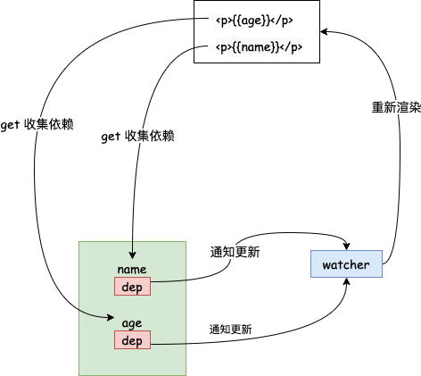
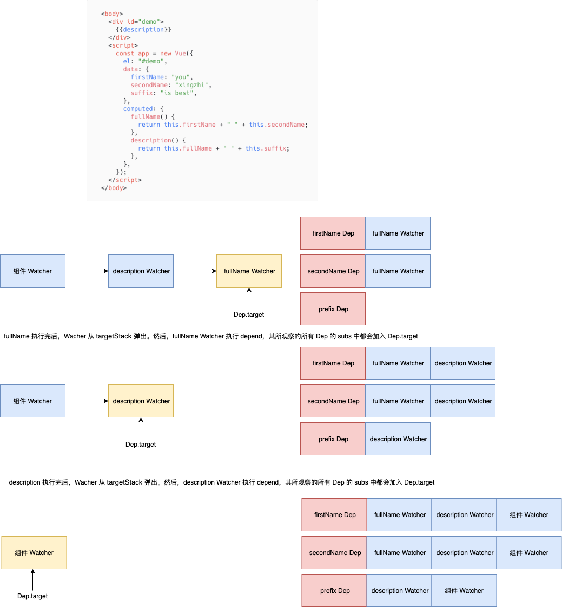
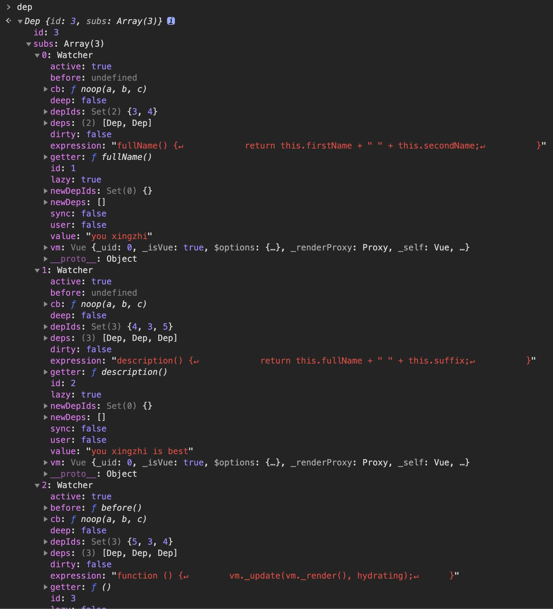

上把打了个酱油快速走读了一下首次渲染流程，这把我们玩个核心，来看看 Vue 中最经典的部分：响应式数据原理。啥都不说，我们先上图：



# 定义响应式数据

我们在初始化 `Vue` 的时候，会执行 `initState(vm)`

```javascript
export function initState(vm: Component) {
  ...
  if (opts.data) {
    initData(vm)
  } else {
    observe((vm._data = {}), true /* asRootData */)
  }
  ...
}
```

这里最重要的是 `initData` 这个方法：

```javascript
function initData(vm: Component) {
  let data = vm.$options.data
  data = vm._data = typeof data === 'function' ? getData(data, vm) : data || {}
  ...
  observe(data, true /* asRootData */)
}
```

这里也没什么特别的，关键是 `observe(data, true /* asRootData */)` 这一句：

```javascript
export function observe(value: any, asRootData: ?boolean): Observer | void {
  if (!isObject(value) || value instanceof VNode) {
    return
  }
  let ob: Observer | void
  if (hasOwn(value, '__ob__') && value.__ob__ instanceof Observer) {
    ob = value.__ob__
  } else if (
    shouldObserve &&
    !isServerRendering() &&
    (Array.isArray(value) || isPlainObject(value)) &&
    Object.isExtensible(value) &&
    !value._isVue
  ) {
    ob = new Observer(value)
  }
  if (asRootData && ob) {
    ob.vmCount++
  }
  return ob
}
```

这里也只是通过传进来的 `value` 实例化了一个 `Observer` 对象：

```javascript
export class Observer {
  value: any
  dep: Dep
  vmCount: number // number of vms that has this object as root $data

  constructor(value: any) {
    this.value = value
    this.dep = new Dep()
    this.vmCount = 0
    def(value, '__ob__', this)
    if (Array.isArray(value)) {
      const augment = hasProto ? protoAugment : copyAugment
      augment(value, arrayMethods, arrayKeys)
      this.observeArray(value)
    } else {
      this.walk(value)
    }
  }

  /**
   * Walk through each property and convert them into
   * getter/setters. This method should only be called when
   * value type is Object.
   */
  walk(obj: Object) {
    const keys = Object.keys(obj)
    for (let i = 0; i < keys.length; i++) {
      defineReactive(obj, keys[i])
    }
  }

  /**
   * Observe a list of Array items.
   */
  observeArray(items: Array<any>) {
    for (let i = 0, l = items.length; i < l; i++) {
      observe(items[i])
    }
  }
}
```

这里分数组和对象分别进行了处理，我们先来看看 `defineReactive`：

```javascript
export function defineReactive(
  obj: Object,
  key: string,
  val: any,
  customSetter?: ?Function,
  shallow?: boolean
) {
  const dep = new Dep()

  const property = Object.getOwnPropertyDescriptor(obj, key)
  if (property && property.configurable === false) {
    return
  }

  // cater for pre-defined getter/setters
  const getter = property && property.get
  const setter = property && property.set
  if ((!getter || setter) && arguments.length === 2) {
    val = obj[key]
  }

  let childOb = !shallow && observe(val)
  Object.defineProperty(obj, key, {
    enumerable: true,
    configurable: true,
    get: function reactiveGetter() {
      const value = getter ? getter.call(obj) : val
      if (Dep.target) {
        dep.depend()
        if (childOb) {
          childOb.dep.depend()
          if (Array.isArray(value)) {
            dependArray(value)
          }
        }
      }
      return value
    },
    set: function reactiveSetter(newVal) {
      const value = getter ? getter.call(obj) : val
      /* eslint-disable no-self-compare */
      if (newVal === value || (newVal !== newVal && value !== value)) {
        return
      }
      /* eslint-enable no-self-compare */
      if (process.env.NODE_ENV !== 'production' && customSetter) {
        customSetter()
      }
      if (setter) {
        setter.call(obj, newVal)
      } else {
        val = newVal
      }
      childOb = !shallow && observe(newVal)
      dep.notify()
    },
  })
}
```

这里分别给数据定义了 `get` 和 `set` 方法，执行 `get` 方法的时候会进行依赖收集。

# 依赖收集

我们看看依赖收集做了什么：

```javascript
  depend () {
    if (Dep.target) {
      Dep.target.addDep(this)
    }
  }
```

这里的 `Dep.target` 又是哪来的呢，其实它就是 `Watcher` 的实例。

```javascript

export default class Watcher {
  ...

  constructor (
    vm: Component,
    expOrFn: string | Function,
    cb: Function,
    options?: ?Object,
    isRenderWatcher?: boolean
  ) {
    ...
    if (typeof expOrFn === 'function') {
      this.getter = expOrFn
    } else {
      this.getter = parsePath(expOrFn)
      if (!this.getter) {
        this.getter = function () {}
        process.env.NODE_ENV !== 'production' && warn(
          `Failed watching path: "${expOrFn}" ` +
          'Watcher only accepts simple dot-delimited paths. ' +
          'For full control, use a function instead.',
          vm
        )
      }
    }
    this.value = this.lazy
      ? undefined
      : this.get()
  }

  /**
   * Evaluate the getter, and re-collect dependencies.
   */
  get () {
    pushTarget(this)
    let value
    const vm = this.vm
    try {
      value = this.getter.call(vm, vm)
    } catch (e) {
      if (this.user) {
        handleError(e, vm, `getter for watcher "${this.expression}"`)
      } else {
        throw e
      }
    } finally {
      // "touch" every property so they are all tracked as
      // dependencies for deep watching
      if (this.deep) {
        traverse(value)
      }
      popTarget()
      this.cleanupDeps()
    }
    return value
  }
  ...
```

上一章说了，在组件 `$mount` 的时候会初始化一个 `Wathcer`，
在 `Watcher` 初始化的时候会执行 `this.get`， `pushTarget` 将前`Dep.target` 设置为当前的 `Watcher`。同时，执行 `this.get` 的时候，还会调用 `this.getter.call(vm, vm)`，这个 `getter` 就是构造函数中传递进来的 `expOrFn`，它是啥呢，它就是：

```javascript
updateComponent = () => {
  vm._update(vm._render(), hydrating)
}
```

其中 `vm._render` 执行的时候会对数据进行取值操作，从而触发 `defineProperty` 中的 `get` 方法。

# 触发更新

当数据被赋值的时候会触发 `set` 方法，调用 `dep.notify()`，最后会调用 `Watcher` 类中的：

```javascript
  update () {
    /* istanbul ignore else */
    if (this.lazy) {
      this.dirty = true
    } else if (this.sync) {
      this.run()
    } else {
      queueWatcher(this)
    }
  }
```

`queueWatcher`：

```javascript
export function queueWatcher(watcher: Watcher) {
  const id = watcher.id
  // 相同的 watcher 只入队一次
  if (has[id] == null) {
    has[id] = true
    if (!flushing) {
      queue.push(watcher)
    } else {
      // if already flushing, splice the watcher based on its id
      // if already past its id, it will be run next immediately.
      let i = queue.length - 1
      while (i > index && queue[i].id > watcher.id) {
        i--
      }
      queue.splice(i + 1, 0, watcher)
    }
    // 一次更新只开启一个任务
    if (!waiting) {
      waiting = true
      nextTick(flushSchedulerQueue)
    }
  }
}
```

我们先看看 `flushSchedulerQueue`：

```javascript
function flushSchedulerQueue() {
  flushing = true
  let watcher, id

  // Sort queue before flush.
  // This ensures that:
  // 1. Components are updated from parent to child. (because parent is always
  //    created before the child)
  // 2. A component's user watchers are run before its render watcher (because
  //    user watchers are created before the render watcher)
  // 3. If a component is destroyed during a parent component's watcher run,
  //    its watchers can be skipped.
  queue.sort((a, b) => a.id - b.id)

  // do not cache length because more watchers might be pushed
  // as we run existing watchers
  for (index = 0; index < queue.length; index++) {
    watcher = queue[index]
    if (watcher.before) {
      watcher.before()
    }
    id = watcher.id
    has[id] = null
    watcher.run()
    // 用户有可能在 watch 里面给响应式数据赋值从而导致无限循环
    // in dev build, check and stop circular updates.
    if (process.env.NODE_ENV !== 'production' && has[id] != null) {
      circular[id] = (circular[id] || 0) + 1
      if (circular[id] > MAX_UPDATE_COUNT) {
        warn(
          'You may have an infinite update loop ' +
            (watcher.user
              ? `in watcher with expression "${watcher.expression}"`
              : `in a component render function.`),
          watcher.vm
        )
        break
      }
    }
  }

  // keep copies of post queues before resetting state
  const activatedQueue = activatedChildren.slice()
  const updatedQueue = queue.slice()

  resetSchedulerState()

  // call component updated and activated hooks
  callActivatedHooks(activatedQueue)
  callUpdatedHooks(updatedQueue)
}
```

其他更多细节可以参考我们自己 DIY 的[响应式系统](/2020/06/07/vue-diy/)。

这里我们看看数组是怎么处理的。

# 数组处理

```javascript
if (Array.isArray(value)) {
  // 覆盖数组实例的原型
  if (hasProto) {
    protoAugment(value, arrayMethods)
  } else {
    copyAugment(value, arrayMethods, arrayKeys)
  }
  this.observeArray(value)
} else {
  ...
```

我们先看看 `protoAugment`：

```javascript
function protoAugment(target, src: Object) {
  /* eslint-disable no-proto */
  target.__proto__ = src
  /* eslint-enable no-proto */
}
```

看来还得看看 `arrayMethods`：

```javascript
import {def} from '../util/index'

const arrayProto = Array.prototype
// 继承除了 methodsToPatch 以外的其他属性或方法
export const arrayMethods = Object.create(arrayProto)

const methodsToPatch = [
  'push',
  'pop',
  'shift',
  'unshift',
  'splice',
  'sort',
  'reverse',
]

/**
 * Intercept mutating methods and emit events
 */
methodsToPatch.forEach(function (method) {
  // cache original method
  const original = arrayProto[method]
  def(arrayMethods, method, function mutator(...args) {
    // 数组方法的默认行为
    const result = original.apply(this, args)

    // 变更通知：获取小管家
    const ob = this.__ob__
    // 插入操作：会导致新元素进入，他们需要社会主义教育
    let inserted
    switch (method) {
      case 'push':
      case 'unshift':
        inserted = args
        break
      case 'splice':
        inserted = args.slice(2)
        break
    }
    if (inserted) ob.observeArray(inserted)
    ob.dep.notify()
    return result
  })
})
```

我们举例来说说这一串的操作是干了个啥：

```
[1, 2, 3] --__proto__--> arrayMethods --__proto__--> Array.prototype
```

其中 `arrayMethods` 对 7 个数组方法进行了包装，使得在对数进行操作的时候可以通知 `Watcher` 进行更新。这里的 `ob.dep` 是个啥呢。比如说 `data` 中有这样一个属性 `arr: [1,2]`，在对 arr 进行依赖收集的时候有如下代码，这里的 `childOb.dep` 和上文的 `ob.dep` 是同一个对象。

```javascript
...
dep.depend()
if (childOb) {
  childOb.dep.depend()
  if (Array.isArray(value)) {
    dependArray(value)
  }
}
```

具体来说，这里的 `childOb` 就是 `[1,2]` 这个对象经过 `observe` 返回后的 `Observer` 实例，它有 `dep` 属性。从这里可以看到它和 `arr` 拥有一样的依赖，即下面这两个操作都会触发通知相同的 `Watcher` 去更新：

```javascript
// 1
this.arr = [3, 4]
// 2
this.arr.push(3)
```

# computed 的处理

```javascript
const computedWatcherOptions = {lazy: true}
function initComputed(vm: Component, computed: Object) {
  // $flow-disable-line
  const watchers = (vm._computedWatchers = Object.create(null))
  // computed properties are just getters during SSR
  const isSSR = isServerRendering()

  for (const key in computed) {
    const userDef = computed[key]
    const getter = typeof userDef === 'function' ? userDef : userDef.get

    if (!isSSR) {
      // create internal watcher for the computed property.
      watchers[key] = new Watcher(
        vm,
        getter || noop,
        noop,
        computedWatcherOptions
      )
    }

    // component-defined computed properties are already defined on the
    // component prototype. We only need to define computed properties defined
    // at instantiation here.
    if (!(key in vm)) {
      defineComputed(vm, key, userDef)
    }
  }
}
```

这里遍历了 `computed` 里面的每一个属性，并且为每一个属性初始化了一个 `Watcher` 对象。这样，当我们在 `computed` 里面访问 `data` 里面的属性时，就可以收集到依赖了。注意到这里传入了 `{ lazy: true }`，我们看看会有什么效果：

```javascript
    this.dirty = this.lazy // for lazy watchers
    ...
    this.value = this.lazy
      ? undefined
      : this.get()
```

该属性仅仅是标记了当前数据是 “脏的”，并且不会立即求值。所谓 “脏的” 指的是当前值已经脏了，需要重新求值了，这个后面会再提到。

然后我们看看 `defineComputed` 做了啥：

```javascript
export function defineComputed(
  target: any,
  key: string,
  userDef: Object | Function
) {
  // 不考虑服务端渲染，这里为 true
  const shouldCache = !isServerRendering()
  // 只看 computed 值为函数的情况
  if (typeof userDef === 'function') {
    sharedPropertyDefinition.get = shouldCache
      ? createComputedGetter(key)
      : createGetterInvoker(userDef)
    sharedPropertyDefinition.set = noop
  }
  Object.defineProperty(target, key, sharedPropertyDefinition)
}
```

这里跑到了 `createComputedGetter` 这个方法：

```javascript
function createComputedGetter(key) {
  return function computedGetter() {
    const watcher = this._computedWatchers && this._computedWatchers[key]
    if (watcher) {
      if (watcher.dirty) {
        watcher.evaluate()
      }
      if (Dep.target) {
        watcher.depend()
      }
      return watcher.value
    }
  }
}
```

当我们第一次访问计算属性的时候会触发 `get`，由于 `dirty` 为 true，所以这里会走 `watcher.evaluate` 进行求值，并将 `this.dirty` 置为 false，这样下次再对 `computed` 进行求值的时候就不会执行 `watcher.evaluate()` 了，这样就实现了缓存功能。

```javascript
  evaluate () {
    this.value = this.get()
    this.dirty = false
  }
```

而当 `computed` 依赖的数据变化的时候，会触发 `Watch` 的 `update`：

```javascript
  update () {
    /* istanbul ignore else */
    // computed
    if (this.lazy) {
      this.dirty = true
    } else if (this.sync) {
      this.run()
    } else {
      // 入队
      queueWatcher(this)
    }
  }
```

这里仅仅是把 `dirty` 又重置为了 `true` 以使得下次对 `computed` 进行求值的时候重新执行 `watcher.evaluate()`。

缓存部分说完了，我们来看看下面这一段代码做了什么：

```javascript
if (Dep.target) {
  watcher.depend()
}
```

```javascript
  depend () {
    let i = this.deps.length
    while (i--) {
      this.deps[i].depend()
    }
  }
```

这里有点难理解，我们用一个例子来说明：



首次渲染的时候组件会实例化一个 `Watcher` 对象，会触发对 `description` 的求值，这里又会实例化一个 `Watcher`，而 `description` 中对 `fullName` 进行求值，又会实例化一个 `Watcher`。这样就形成了一个依赖栈，靠近栈底的元素会依赖其上面的元素。

当执行 `fullName` 的时候，由于其依赖了 `firstName` 和 `secondName`，所以它会被添加进两者的 `dep` 中。收集完后会执行 `popTarget()`，此时 `Dep.target` 指向 `description` 的 `Watcher`，然后会执行 `watcher.depend()` 。注意这里的 `watcher` 还是 `fullName` 的，即 `fullName` 依赖啥，其他依赖 `fullName` 的也需要跟我有同样的依赖。举个例子：儿子依赖老爸，老爸是个啃老族依赖父母，所以孙子也间接依赖了爷爷奶奶。整下的就举一反三了。

我们调试下代码，发现跟我们的分析是相符的：


