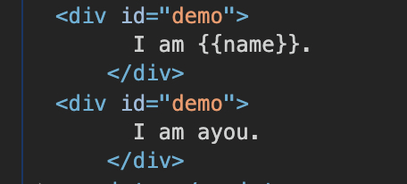
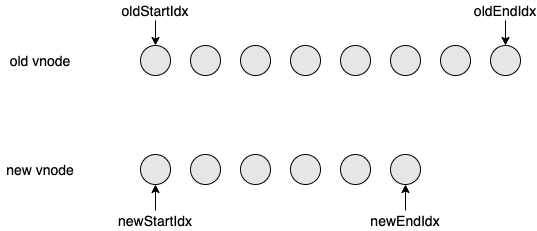
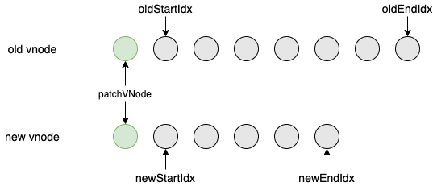
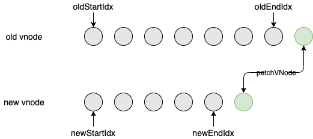
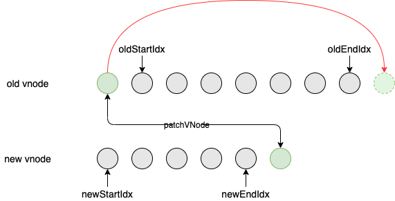
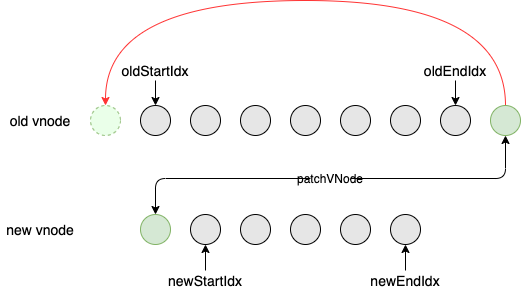
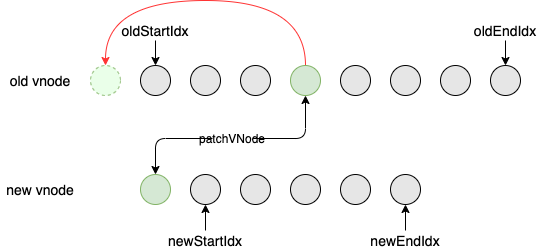
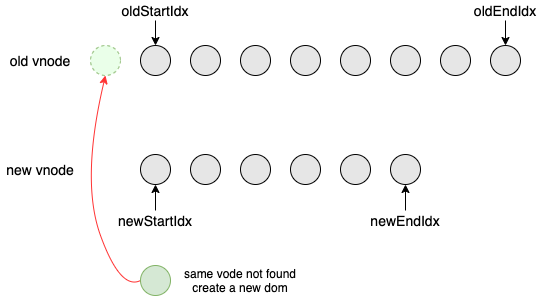
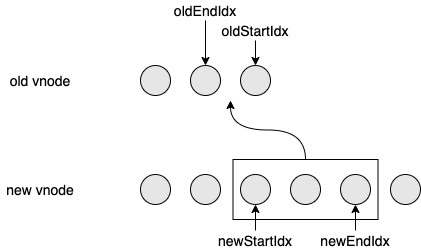
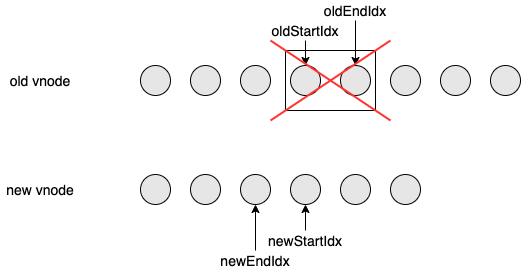

前面几章路过 `patch` 函数的时候都是点到为止，现在好好分析一下。

```javascript
return function patch(oldVnode, vnode, hydrating, removeOnly) {
  // 新的不存在，删除
  if (isUndef(vnode)) {
    if (isDef(oldVnode)) invokeDestroyHook(oldVnode)
    return
  }

  let isInitialPatch = false
  const insertedVnodeQueue = []

  // 老的不存在，新增
  if (isUndef(oldVnode)) {
    // empty mount (likely as component), create new root element
    isInitialPatch = true
    createElm(vnode, insertedVnodeQueue)
  }
  // 两者都存在，更新
  else {
    const isRealElement = isDef(oldVnode.nodeType)
    if (!isRealElement && sameVnode(oldVnode, vnode)) {
      // 比较两个vnode
      patchVnode(oldVnode, vnode, insertedVnodeQueue, null, null, removeOnly)
    } else {
      ...
    }
  }

  invokeInsertHook(vnode, insertedVnodeQueue, isInitialPatch)
  return vnode.elm
}
```

分析 `patch` 方法，两个 `vnode` 进行对比，结果无非就是三种情况。

1. 新的不存在，表示要删除旧节点
2. 老的不存在，表示要新增节点
3. 都存在，进行更新，这里又分成了两种情况：

   3.1 不是真实节点，且新旧节点的是同一类型的节点（根据 key 和 tag 等来判断）

   3.2 其他情况，比如根组件首次渲染

# 场景 3.2 其他情况，比如根组件首次渲染

我们用下面这个例子先来调试下 3.2 这种场景：

```html
<div id="demo">
  I am {{name}}.
</div>
<script>
  const app = new Vue({
    el: '#demo',
    data: {
      name: 'ayou',
    },
  })
</script>
```

第一次进入到 `patch` 这个函数的时候是根组件挂载时，此时因为 `oldVnode` 为 `demo` 这个真实的元素，我们会走到这里：

```javascript
if (isRealElement) {
  // either not server-rendered, or hydration failed.
  // create an empty node and replace it
  // 真实节点转为虚拟节点，并把真实节点放到 oldVnode.elm 上
  oldVnode = emptyNodeAt(oldVnode)
}

// replacing existing element
const oldElm = oldVnode.elm
const parentElm = nodeOps.parentNode(oldElm)

// 创建真实的 dom 或者组件并插入到 parentElm
createElm(
  vnode,
  insertedVnodeQueue,
  // extremely rare edge case: do not insert if old element is in a
  // leaving transition. Only happens when combining transition +
  // keep-alive + HOCs. (#4590)
  oldElm._leaveCb ? null : parentElm,
  // 新的 dom 会放到旧的 dom 的后面，所以有一瞬间两者都会存在
  // 这样的好处是第一次渲染可以避免对 children 进行无谓的 diff，当然这种做法仅适用于 hydrating 为 false 的时候
  nodeOps.nextSibling(oldElm)
)
```

这一段的工作包括：

1. 将真实节点转为虚拟节点
2. 得到旧节点的父元素
3. 通过 `vnode` 创建真实的节点并插入到旧节点的后面，所以有一瞬间会同时存在两个 `id` 为 `demo` 的 `div`。



然后，跳过中间 `isDef(vnode.parent)` 这一段，我们来到：

```javascript
if (isDef(parentElm)) {
  removeVnodes([oldVnode], 0, 0)
} else if (isDef(oldVnode.tag)) {
  invokeDestroyHook(oldVnode)
}
```

这里会执行 `removeVnodes` 把旧的元素给删除掉，就不过多展开了。

然后，我们回过头来看看 `createElm` 具体是怎么实现的吧：

```javascript
function createElm(
  vnode,
  insertedVnodeQueue,
  parentElm,
  refElm,
  nested,
  ownerArray,
  index
) {
  if (isDef(vnode.elm) && isDef(ownerArray)) {
    // This vnode was used in a previous render!
    // now it's used as a new node, overwriting its elm would cause
    // potential patch errors down the road when it's used as an insertion
    // reference node. Instead, we clone the node on-demand before creating
    // associated DOM element for it.
    vnode = ownerArray[index] = cloneVNode(vnode)
  }

  vnode.isRootInsert = !nested // for transition enter check

  // 创建自定义组件
  if (createComponent(vnode, insertedVnodeQueue, parentElm, refElm)) {
    return
  }

  // 创建原生标签
  const data = vnode.data
  const children = vnode.children
  const tag = vnode.tag
  if (isDef(tag)) {
    vnode.elm = vnode.ns
      ? nodeOps.createElementNS(vnode.ns, tag)
      : nodeOps.createElement(tag, vnode)
    setScope(vnode)

    /* istanbul ignore if */
    if (__WEEX__) {
      ...
    } else {
      createChildren(vnode, children, insertedVnodeQueue)
      if (isDef(data)) {
        // 事件、属性等等初始化
        invokeCreateHooks(vnode, insertedVnodeQueue)
      }
      // 插入节点
      insert(parentElm, vnode.elm, refElm)
    }

    if (process.env.NODE_ENV !== 'production' && data && data.pre) {
      creatingElmInVPre--
    }
  } else if (isTrue(vnode.isComment)) {
    vnode.elm = nodeOps.createComment(vnode.text)
    insert(parentElm, vnode.elm, refElm)
  } else {
    vnode.elm = nodeOps.createTextNode(vnode.text)
    insert(parentElm, vnode.elm, refElm)
  }
}
```

这里首先创建了一个 `tag` 类型的元素，并赋值给 `vnode.elm`。因为传进来的 `vnode` 是原生标签，所以最后会走到：

```javascript
createChildren(vnode, children, insertedVnodeQueue)
if (isDef(data)) {
  // 事件、属性等等初始化
  invokeCreateHooks(vnode, insertedVnodeQueue)
}
// 插入节点
insert(parentElm, vnode.elm, refElm)
```

其中 `createChildren` 中又调用了 `createElm`：

```javascript
function createChildren(vnode, children, insertedVnodeQueue) {
  if (Array.isArray(children)) {
    if (process.env.NODE_ENV !== 'production') {
      checkDuplicateKeys(children)
    }
    for (let i = 0; i < children.length; ++i) {
      createElm(
        children[i],
        insertedVnodeQueue,
        vnode.elm,
        null,
        true,
        children,
        i
      )
    }
  } else if (isPrimitive(vnode.text)) {
    nodeOps.appendChild(vnode.elm, nodeOps.createTextNode(String(vnode.text)))
  }
}
```

这样不停递归地调用 `createElm`, 最后执行 `insert(parentElm, vnode.elm, refElm)` 的时候，`vnode.elm` 就是一颗完整的 `dom` 树了，执行完 `insert` 以后，这颗树就插入到了 `body` 之中。

# 场景 2 老的不存在，表示要新增节点

我们可以通过下面这个例子来调试一下：

```html
<div id="demo">
  <comp></comp>
</div>
<script>
  Vue.component('comp', {
    template: '<p>I am comp</p>',
  })
  const app = new Vue({
    el: '#demo',
  })
</script>
```

这个例子中，我们只需要关注第二次进入 `patch` 的流程，即自定义组件的挂载过程。因为之前组件化渲染流程已经说过，自定义组件在 `$mount` 的时候也会走到 `patch` 之中，不过，这时因为旧的节点并不存在，所以会走到：

```javascript
if (isUndef(oldVnode)) {
  // empty mount (likely as component), create new root element
  isInitialPatch = true
  createElm(vnode, insertedVnodeQueue)
} else {
}
```

`createElm` 函数上面已经介绍过了，后面的逻辑就是一样的了。

# 场景 3.1 不是真实节点，且新旧节点的是同一类型的节点

接下来就是我们的重头戏了，我们先看看这个例子：

```javascript
<div id="demo">
  <p>I am {{name}}</p>
</div>
<script>
  const app = new Vue({
    el: "#demo",
    data: {
      name: "ayou",
    },
    mounted() {
      setTimeout(() => {
        this.name = "you";
      }, 2000);
    },
  });
</script>
```

我们在定时器中对 `name` 进行了重新赋值，此时会触发组件的更新，最终走到 `patch` 函数：

```javascript
...
if (!isRealElement && sameVnode(oldVnode, vnode)) {
  // patch existing root node
  // 比较两个vnode
  patchVnode(oldVnode, vnode, insertedVnodeQueue, null, null, removeOnly)
}
...
```

我们去掉一些我们暂时不关心的代码，看看 `patchVnode`：

```javascript
function patchVnode(
  oldVnode,
  vnode,
  insertedVnodeQueue,
  ownerArray,
  index,
  removeOnly
) {
  if (oldVnode === vnode) {
    return
  }

  ...
  // 获取两个节点孩子节点数组
  const oldCh = oldVnode.children
  const ch = vnode.children

  // 属性更新
  if (isDef(data) && isPatchable(vnode)) {
    for (i = 0; i < cbs.update.length; ++i) cbs.update[i](oldVnode, vnode)
    if (isDef((i = data.hook)) && isDef((i = i.update))) i(oldVnode, vnode)
  }

  // 内部比较
  // 新节点不是文本节点
  if (isUndef(vnode.text)) {
    // 都有孩子，进行孩子的更新
    if (isDef(oldCh) && isDef(ch)) {
      if (oldCh !== ch)
        updateChildren(elm, oldCh, ch, insertedVnodeQueue, removeOnly)
    } else if (isDef(ch)) {
      // 新的有孩子，老的没孩子
      if (process.env.NODE_ENV !== 'production') {
        checkDuplicateKeys(ch)
      }
      if (isDef(oldVnode.text)) nodeOps.setTextContent(elm, '')
      // 批量新增
      addVnodes(elm, null, ch, 0, ch.length - 1, insertedVnodeQueue)
    } else if (isDef(oldCh)) {
      // 老的有孩子，新的没孩子，批量删除
      removeVnodes(oldCh, 0, oldCh.length - 1)
    } else if (isDef(oldVnode.text)) {
      nodeOps.setTextContent(elm, '')
    }
  } else if (oldVnode.text !== vnode.text) {
    // 文本节点更新
    nodeOps.setTextContent(elm, vnode.text)
  }
}
```

这里有两个工作：

1. 更新属性
2. 更新 `children` 或者更新文本

其中，更新属性的代码是平台相关的，比如浏览器中相关的代码在 `src/platforms/web/runtime/modules` 中，这一块暂时不是我们的重点，我们先略过。

文本节点的更新我们暂时不讨论，我们先看看 `children` 的更新，它分为几种情况：

1. 新旧节点都有孩子，进行孩子的更新
2. 新的有孩子，旧的没有孩子，进行批量添加
3. 新的没有孩子，旧的有孩子，进行批量删除

其中，新增和删除都比较简单，这里就暂时先不讨论。

我们要着重分析的是 `updateChildren`， 它的主要作⽤是⽤⼀种较⾼效的⽅式⽐对新旧两个 `vnode` 的 `children` 得出最⼩操作补丁。执⾏⼀个双循环是传统⽅式，`vue` 中针对 web 场景特点做了特别的算法优化。



在新⽼两组 `vnode` 节点的左右头尾两侧都有⼀个变量标记，在遍历过程中这⼏个变量都会向中间靠拢。当 `oldStartIdx` > `oldEndIdx` 或者 `newStartIdx` > `newEndIdx` 时结束循环。以下是遍历规则：

⾸先，`oldStartIdx`、`oldEndIdx` 与 `newStartIdx`、`newEndIdx` 两两交叉⽐较，共有 4 种情况：

1. `oldStartIdx` 与 `newStartIdx` 所对应的 node 是 `sameVnode`：



2. `oldEndIdx` 与 `newEndIdx` 所对应的 node 是 `sameVnode`：



3. `oldStartIdx` 与 `newEndIdx` 所对应的 node 是 `sameVnode`：



这种情况不光要进行两者的 `patchVNode`，还需要将旧的节点移到 `oldEndIdx` 后面。

4. `oldEndIdx` 与 `newStartIdx` 所对应的 node 是 `sameVnode`：



同样，这种情况不光要进行两者的 `patchVNode`，还需要将旧的节点移到 `oldStartIdx` 前面。

如果四种情况都不匹配，就尝试从旧的 `children` 中找到一个 `sameVnode`，这里又分成两种情况：

1. 找到了



这种情况首先进行两者的 `patchVNode`，然后将旧的节点移到 `oldStartIdx` 前面。

2. 没找到

这种情况首先会通过 `newStartIdx` 指向的 `vnode` 创建一个新的元素，然后插入到 `oldStartIdx` 前面。



最后，如果新旧子节点中有任何一方遍历完了，还需要做一个收尾工作，这里又分为两种情况：

1. 旧的先遍历完



这种情况需要将新的 `children` 中未遍历的节点进行插入，插入的位置后面看源码可以看到。

1. 新的先遍历完



这种情况需要将旧的 `children` 中未遍历的节点进行删除。

规则清楚了，再看代码就很简单了：

```javascript
function updateChildren(
  parentElm,
  oldCh,
  newCh,
  insertedVnodeQueue,
  removeOnly
) {
  // 前后4个游标和4个对应节点
  let oldStartIdx = 0
  let newStartIdx = 0
  let oldEndIdx = oldCh.length - 1
  let oldStartVnode = oldCh[0]
  let oldEndVnode = oldCh[oldEndIdx]
  let newEndIdx = newCh.length - 1
  let newStartVnode = newCh[0]
  let newEndVnode = newCh[newEndIdx]
  let oldKeyToIdx, idxInOld, vnodeToMove, refElm

  // removeOnly is a special flag used only by <transition-group>
  // to ensure removed elements stay in correct relative positions
  // during leaving transitions
  const canMove = !removeOnly

  if (process.env.NODE_ENV !== 'production') {
    checkDuplicateKeys(newCh)
  }

  // 循环条件：开始游标小于等于结束游标
  while (oldStartIdx <= oldEndIdx && newStartIdx <= newEndIdx) {
    if (isUndef(oldStartVnode)) {
      // 当前位置的节点已经被移动到了前面，需要再往后移一位
      oldStartVnode = oldCh[++oldStartIdx] // Vnode has been moved left
    } else if (isUndef(oldEndVnode)) {
      // 当前位置的节点已经被移到到了后面，需要再往前移一位
      oldEndVnode = oldCh[--oldEndIdx]
    } else if (sameVnode(oldStartVnode, newStartVnode)) {
      // 两个开头
      patchVnode(
        oldStartVnode,
        newStartVnode,
        insertedVnodeQueue,
        newCh,
        newStartIdx
      )
      oldStartVnode = oldCh[++oldStartIdx]
      newStartVnode = newCh[++newStartIdx]
    } else if (sameVnode(oldEndVnode, newEndVnode)) {
      // 两个结尾
      patchVnode(oldEndVnode, newEndVnode, insertedVnodeQueue, newCh, newEndIdx)
      oldEndVnode = oldCh[--oldEndIdx]
      newEndVnode = newCh[--newEndIdx]
    } else if (sameVnode(oldStartVnode, newEndVnode)) {
      // Vnode moved right
      // 老开头和新结尾
      patchVnode(
        oldStartVnode,
        newEndVnode,
        insertedVnodeQueue,
        newCh,
        newEndIdx
      )
      canMove &&
        nodeOps.insertBefore(
          parentElm,
          oldStartVnode.elm,
          nodeOps.nextSibling(oldEndVnode.elm)
        )
      oldStartVnode = oldCh[++oldStartIdx]
      newEndVnode = newCh[--newEndIdx]
    } else if (sameVnode(oldEndVnode, newStartVnode)) {
      // Vnode moved left
      // 老结尾和新开头
      patchVnode(
        oldEndVnode,
        newStartVnode,
        insertedVnodeQueue,
        newCh,
        newStartIdx
      )
      canMove &&
        nodeOps.insertBefore(parentElm, oldEndVnode.elm, oldStartVnode.elm)
      oldEndVnode = oldCh[--oldEndIdx]
      newStartVnode = newCh[++newStartIdx]
    } else {
      // 从新的开头拿一个，然后去老数组中查找
      if (isUndef(oldKeyToIdx))
        oldKeyToIdx = createKeyToOldIdx(oldCh, oldStartIdx, oldEndIdx)
      idxInOld = isDef(newStartVnode.key)
        ? oldKeyToIdx[newStartVnode.key]
        : findIdxInOld(newStartVnode, oldCh, oldStartIdx, oldEndIdx)
      // 没找到，创建
      if (isUndef(idxInOld)) {
        // New element
        createElm(
          newStartVnode,
          insertedVnodeQueue,
          parentElm,
          oldStartVnode.elm,
          false,
          newCh,
          newStartIdx
        )
      } else {
        vnodeToMove = oldCh[idxInOld]
        if (sameVnode(vnodeToMove, newStartVnode)) {
          // 找到了先打补丁
          patchVnode(
            vnodeToMove,
            newStartVnode,
            insertedVnodeQueue,
            newCh,
            newStartIdx
          )
          oldCh[idxInOld] = undefined
          // 移动到 oldStartVnode.elm 之前
          canMove &&
            nodeOps.insertBefore(parentElm, vnodeToMove.elm, oldStartVnode.elm)
        } else {
          // same key but different element. treat as new element
          // 没找到，创建一个新的，插入到 oldStartVnode.elm 之前
          createElm(
            newStartVnode,
            insertedVnodeQueue,
            parentElm,
            oldStartVnode.elm,
            false,
            newCh,
            newStartIdx
          )
        }
      }
      newStartVnode = newCh[++newStartIdx]
    }
  }

  // 老的先结束，批量新增，插入位置为
  // newCh[newEndIdx + 1].elm 的前面（如果 newCh[newEndIdx + 1] 存在）
  // 或者插入到最后（如果 newCh[newEndIdx + 1] 不存在）
  if (oldStartIdx > oldEndIdx) {
    refElm = isUndef(newCh[newEndIdx + 1]) ? null : newCh[newEndIdx + 1].elm
    addVnodes(
      parentElm,
      refElm,
      newCh,
      newStartIdx,
      newEndIdx,
      insertedVnodeQueue
    )
  } else if (newStartIdx > newEndIdx) {
    // 新的先结束，批量删除
    removeVnodes(oldCh, oldStartIdx, oldEndIdx)
  }
}
```

到此，整个 `patch` 的过程就大致分析完了。
