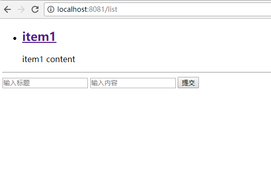
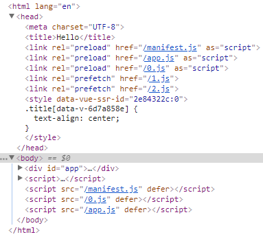
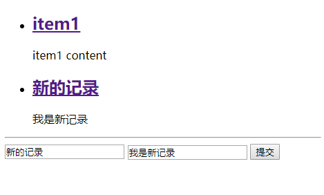

为了解决 vue 项目的 seo 问题，最近研究了下服务端渲染，所以就有了本文的记录。

# 项目结构
```
├─.babelrc // babel 配置文件
├─index.template.html // html 模板文件
├─server.js // 提供服务端渲染及 api 服务
├─src // 前端代码
|  ├─app.js // 主要用于创建 vue 实例
|  ├─App.vue // 根组件
|  ├─entry-client.js // 客户端渲染入口文件
|  ├─entry-server.js // 服务端渲染入口文件
|  ├─stores // vuex 相关
|  ├─routes // vue-router 相关
|  ├─components // 组件
├─dist // 代码编译目标路径
├─build // webpack 配置文件
```

项目的主要目录结构如上所示，其中 `package.json` 请查看[项目](https://github.com/ParadeTo/vue-ssr)。关于为什么要使用状态管理库 [Vuex](https://github.com/vuejs/vuex/)，官网有明确的[解释](https://ssr.vuejs.org/zh/data.html)。后文有例子帮助进一步理解。

接下来我们暂时不管服务端渲染的事情，先搭建一个简单的 `vue` 的开发环境。

# 搭建 vue 开发环境
利用 `webpack` 可以非常快速的搭建一个简单的 `vue` 开发环境，可以直接乘[电梯](https://github.com/ParadeTo/vue-ssr/tree/step1-dev)前往。

为了高效地进行开发，`vue` 开发环境应该有代码热加载和请求转发的功能。这些都可以使用 `webpack-dev-server` 来轻松实现，只需配置 `webpack` 的 `devServer` 项：

```javascript
module.exports = merge(baseWebpackConfig, {
  devServer: {
    historyApiFallback: true,
    noInfo: true,
    overlay: true,
    proxy: config.proxy
  },
  devtool: '#eval-source-map',
  plugins: [
    new HtmlWebpackPlugin({
      filename: 'index.html',
      template: 'index.template.html',
      inject: true // 插入css和js
    }),
    new webpack.HotModuleReplacementPlugin(),
    new FriendlyErrors()
  ]
})
```

然后启动时添加 `--hot` 参数即可：

```javascript
cross-env NODE_ENV=development webpack-dev-server --config build/webpack.dev.conf.js --open --hot
```

注意到 `router` 和 `store` 以及 `vue` 都采用了工厂函数来生成实例，这是为了方便代码在后面的服务端渲染中进行复用，因为 “Node.js 服务器是一个长期运行的进程。必须为每个请求创建一个新的 Vue 实例” ([官网](https://ssr.vuejs.org/zh/structure.html))。

同样，前端请求使用的是 `axios` 库，也是为了照顾服务端。

在项目根目录下运行 `npm run server` 启动后端 api 服务，然后运行 `npm run dev` ，`webpack` 会自动在默认浏览器中打开 `http://localhost:8080` 地址，即可看到效果。

# 服务端渲染
基于上面搭建好的项目基础上来搭建服务端渲染就比较容易了，让我们开始吧。或者直接看最后的[代码](https://github.com/ParadeTo/vue-ssr/tree/step2-ssr)。

要实现服务端渲染，只需增加如下 `webpack` 配置：
```javascript
module.exports = merge(baseWebpackConfig, {
  entry: './src/entry-server.js',
  // 告知 `vue-loader` 输送面向服务器代码(server-oriented code)。
  target: 'node',
  output: {
    filename: 'server-bundle.js',
    libraryTarget: 'commonjs2',
  },
  plugins: [
     new VueSSRServerPlugin()
  ]
})
```

注意到 `entry` 的文件路径跟之前的不太一样，这里使用的是专门为服务端渲染准备的入口文件：

```javascript
import { createApp } from './app'
// 这里的 context 是服务端渲染模板时传入的
export default context => {
  // 因为有可能会是异步路由钩子函数或组件，所以我们将返回一个 Promise，
  // 以便服务器能够等待所有的内容在渲染前，
  // 就已经准备就绪。
  return new Promise((resolve, reject) => {
    const { app, router, store } = createApp()

    const { url } = context
    const { fullPath } = router.resolve(url).route

    if (fullPath !== url) {
      return reject({ url: fullPath })
    }

    router.push(url)

    // 等到 router 将可能的异步组件和钩子函数解析完
    router.onReady(() => {
      const matchedComponents = router.getMatchedComponents()
      // 匹配不到的路由，执行 reject 函数，并返回 404
      if (!matchedComponents.length) {
        return reject({ code: 404 })
      }

      // 执行所有组件中的异步数据请求
      Promise.all(matchedComponents.map(({ asyncData }) => asyncData && asyncData({
        store,
        route: router.currentRoute
      }))).then(() => {
        context.state = store.state
        resolve(app)
      }).catch(reject)
    }, reject)
  })
}
```

其中的 `asyncData` 可能会让人疑惑，稍后我们用一个例子来说明。现在，然我们来编译一下，运行 `npm run build:server` ，将会在 `dist` 目录下得到 vue-ssr-server-bundle.json 文件。可以看到，该文件包含了 `webpack` 打包生成的所有 `chunk` 并指定了入口。后面服务端会基于该文件来做渲染。

现在就让我们移步服务端，新增一些代码：

```
...
 const { createBundleRenderer } = require('vue-server-renderer')
 const bundle = require('./dist/vue-ssr-server-bundle.json')

 const renderer = createBundleRenderer(bundle, {
   template: fs.readFileSync('./index.template.html', 'utf-8')
 })
...
// 服务端渲染
server.get('*', (req, res) => {
  const context = { url: req.originalUrl }
  renderer.renderToString(context, (err, html) => {
    if (err) {
      if (err.code === 404) {
        res.status(404).end('Page not found')
      } else {
        res.status(500).end('Internal Server Error')
      }
    } else {
      res.end(html)
    }
  })
})
```

新增代码不多，首先使用上面生成的文件创建了一个 `renderer` 对象，然后调用其 `renderToString` 方法并传入包含请求路径的对象作为参数来进行渲染，最后将渲染好的数据即 `html` 返回。

运行 `npm run server` 启动服务端，打开 `http://localhost:8081` 就可以看到效果了：



## 关于 asyncData
前面提到了 `asyncData` ，现在以该例子来梳理一下。首先，看看组件中的代码：

```javascript
...
<script>
export default {
  asyncData ({ store, route }) {
    // 触发 action 后，会返回 Promise
    return store.dispatch('fetchItems')
  },
  data () {
    return {
      title: "",
      content: ""
    }
  },
  computed: {
    // 从 store 的 state 对象中的获取 item。
    itemList () {
      return this.$store.state.items
    }
  },
  methods: {
    submit () {
      const {title, content} = this
      this.$store.dispatch('addItem', {title, content})
    }
  }
}
</script>
```
这是一个很简单的组件，包括一个列表，该列表的内容通过请求从后端获取，一个表单，用于提交新的记录到后端保存。其中 `asyncData` 是我们约定的函数名，表示渲染组件需要预先执行它获取初始数据，它返回一个 `Promise`，以便我们在后端渲染的时候可以知道什么时候该操作完成。这里，该函数触发了 `fetchItems` 以更新 `store` 中的状态。还记得我们的 entry-server.js 文件吗，里面正是调用了组件的 `asyncData` 方法来进行数据预取的。


在开发阶段，我们同样需要进行数据预取，为了复用 `asyncData` 代码，我们在组件的 `beforeMount` 中调用该方法，我们将这个处理逻辑通过 `Vue.mixin` 混入到所有的组件中：

```
Vue.mixin({
  beforeMount() {
    const { asyncData } = this.$options
    if (asyncData) {
      // 将获取数据操作分配给 promise
      // 以便在组件中，我们可以在数据准备就绪后
      // 通过运行 `this.dataPromise.then(...)` 来执行其他任务
      this.dataPromise = asyncData({
        store: this.$store,
        route: this.$route
      })
    }
  }
})
```


还有一个问题就是我们生成的 html 中并没有引入任何 js，用户无法进行任何交互，比如上面的列表页，用户无法提交新的内容。当然，如果这个页面是只给爬虫来“看”的话这样就足够了，但如果考虑到真实的用户，我们还需要在 html 中引入前端渲染的 js 文件。

# 前端渲染
该部分的代码可以直接查看[这里](https://github.com/ParadeTo/vue-ssr/tree/step3-client)。

前端渲染部分需要先增加一个 `webpack` 的配置文件用于生成所需的 js, css 等静态文件：

```
module.exports = merge(baseWebpackConfig, {
  plugins: [
    new webpack.optimize.UglifyJsPlugin({
      compress: {
        warnings: false,
        drop_console: true
      }
    }),
    // 重要信息：这将 webpack 运行时分离到一个引导 chunk 中，
    // 以便可以在之后正确注入异步 chunk。
    // 这也为你的 应用程序/vendor 代码提供了更好的缓存。
    new webpack.optimize.CommonsChunkPlugin({
      name: "manifest",
      minChunks: Infinity
    }),
    // 此插件在输出目录中
    // 生成 `vue-ssr-client-manifest.json`。
    new VueSSRClientPlugin()
  ]
})
```

同时，前端渲染还需要有自己的入口文件 `entry-client`，该文件在讲 `asyncData` 的时候有所提及：

```
import Vue from 'vue'
import {
  createApp
} from './app.js'
// 客户端特定引导逻辑……
const {
  app,
  router,
  store
} = createApp()
if (window.__INITIAL_STATE__) {
  store.replaceState(window.__INITIAL_STATE__)
}

Vue.mixin({
  beforeMount() {
    const { asyncData } = this.$options
    if (asyncData) {
      // 将获取数据操作分配给 promise
      // 以便在组件中，我们可以在数据准备就绪后
      // 通过运行 `this.dataPromise.then(...)` 来执行其他任务
      this.dataPromise = asyncData({
        store: this.$store,
        route: this.$route
      })
    }
  }
})
// 这里假定 App.vue 模板中根元素具有 `id="app"`
router.onReady(() => {
  app.$mount('#app')
})
```

现在我们 `npm run build:client` 编译一下，dist 目录中可以得到若干文件：

```
0.js
1.js
2.js
app.js
manifest.js
vue-ssr-client-manifest.json
```

其中，js 文件都是需要引入的文件，json 文件像是一个说明文档，这里暂不讨论其原理，感兴趣的可以查看[这里](https://github.com/happylindz/blog/issues/6)。

最后，`server.js` 中，稍微做一点点修改：


```
 const clientManifest = require('./dist/vue-ssr-client-manifest.json')

 const renderer = createBundleRenderer(bundle, {
   template: fs.readFileSync('./index.template.html', 'utf-8'),
   clientManifest
 })
```

然后 `npm run server` 启动服务，再打开 `http://localhost:8081`，可以看到渲染后的 html 文件中已经引入了 js 资源了。


列表页中也可以提交新记录了：



# 总结
本文先从搭建一个简单的 vue 开发环境开始，然后基于此实现了服务端渲染，并引入了客户端渲染所需的资源。通过这个过程跑通了 vue 服务端渲染的大致流程，但很多地方还需更进一步深入：

* 样式的处理
  本文并没有对样式进行处理，需进一步研究

* 编译后文件的解释
  文章中编译生成的 json 等文件到底是怎么用的呢？

* 针对爬虫和真实用户的不同策略
  服务端渲染其实主要是用来解决 seo 的问题，所以可以在服务端通过请求头判断来源并做不同处理，若是爬虫则进行服务端渲染（不需要引入客户端渲染所需的资源），若是普通用户则还是用原始的客户端渲染方式。

