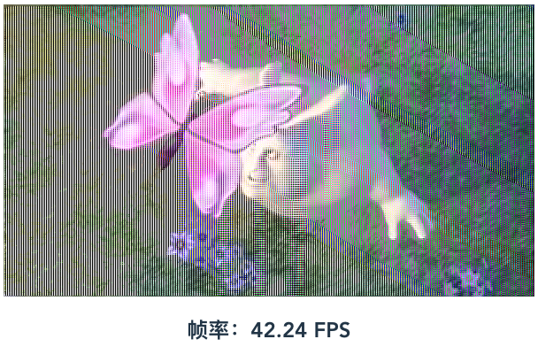
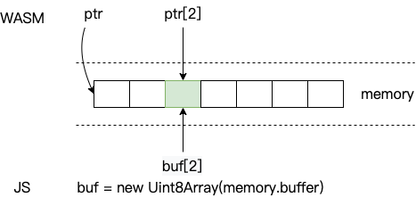
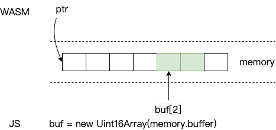
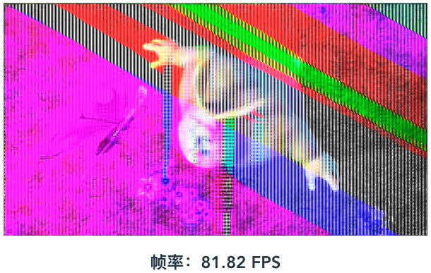

之前立过一个 [Flag](/2022/10/01/wasm-video-filter/) 要用 Rust WebAssembly 来实现视频实时滤镜效果，今天来完成一下。

I set a [flag](/2022/10/01/wasm-video-filter/) previously, which is to implement video filter effect in real time by Rust WebAssembly. Now let's complete it.

首先，我们按照 [Rust and WebAssembly](https://rustwasm.github.io/docs/book/) 的教程先搭建起我们的开发环境。

Firstly, we can setup the development environment according to [Rust and WebAssembly](https://rustwasm.github.io/docs/book/).

查阅 [wasm-bindgen](https://rustwasm.github.io/docs/wasm-bindgen/introduction.html) 文档后发现，可以直接将 `CanvasRenderingContext2d` 从 JS 传递到 WASM：

After reading [wasm-bindgen](https://rustwasm.github.io/docs/wasm-bindgen/introduction.html) document, we found the `CanvasRenderingContext2d` object can be passed from JS to WASM:

```js
import('./pkg')
  .then((wasm) => {
    ...
    const ctx = canvas.getContext('2d')
    ...
    wasm.draw(ctx, 600, 600, -0.15, 0.65)
  })
  .catch(console.error)
```

```rust
use web_sys::{CanvasRenderingContext2d, ImageData};

#[wasm_bindgen]
pub fn draw(
    ctx: &CanvasRenderingContext2d,
    width: u32,
    height: u32,
    real: f64,
    imaginary: f64,
) -> Result<(), JsValue> {
    // The real workhorse of this algorithm, generating pixel data
    let c = Complex { real, imaginary };
    let data = get_julia_set(width, height, c);
    let data = ImageData::new_with_u8_clamped_array_and_sh(Clamped(&data), width, height)?;
    ctx.put_image_data(&data, 0.0, 0.0)
}
```

这样实现起来就跟 JS 很相似了：

So, the implementation is very similar to JS:

```rust
#[wasm_bindgen]
pub fn filter(
    ctx_hidden: &CanvasRenderingContext2d,
    ctx: &CanvasRenderingContext2d,
    width: u32,
    height: u32,
    kernel: Vec<f32>,
) {
    set_panic_hook();
    // Like const imageData = ctx.getImageData(0, 0, canvas.width, canvas.height) in JS
    let image_data = ctx_hidden
        .get_image_data(0.0, 0.0, width as f64, height as f64)
        .unwrap();
    // Like imageData.data in JS
    let mut data = image_data.data();
    let data_ref = data.deref_mut();
    let h = (kernel.len() as f64).sqrt() as u32;
    let half = h / 2;

    // Image convolution
    for y in half..(height - half) {
        for x in half..(width - half) {
            let px = ((y * width + x) * 4) as usize;
            let mut r = 0_f32;
            let mut g = 0_f32;
            let mut b = 0_f32;
            for cy in 0..h {
                for cx in 0..h {
                    let cpx = (((y + cy - half) * width + (x + cx - half)) * 4) as usize;
                    let k = kernel[(cy * h + cx) as usize];
                    r += (data_ref[cpx + 0] as f32) * k;
                    g += (data_ref[cpx + 1] as f32) * k;
                    b += (data_ref[cpx + 2] as f32) * k;
                }
            }
            data_ref[px + 0] = r as u8;
            data_ref[px + 1] = g as u8;
            data_ref[px + 2] = b as u8;
        }
    }

    // Create new imageData using modified data
    let image_data =
        ImageData::new_with_u8_clamped_array_and_sh(Clamped(data_ref), width, height).unwrap();

    // Like ctx.putImageData(imageData, 0, 0) in JS
    ctx.put_image_data(&image_data, 0.0, 0.0)
        .expect("put image data panic")
}

```

对比 JS 和 Rust WASM 的结果，发现 Rust WASM 的性能要更好一些：

Comparing the JS and Rust WASM, we found that Rust WASM performs better:




当然，我们也可以继续参考之前 Golang 的方法，通过在 JS 和 WASM 之间共享内存来实现。通过搜索，我们可以找到这个[例子](https://rustwasm.github.io/docs/wasm-bindgen/reference/types/pointers.html)：

Of course, we can still refer to the previous Golang approach by sharing memory between JS and WASM. We can find an example:

```rust
use std::ptr;
use wasm_bindgen::prelude::*;

#[wasm_bindgen]
pub fn take_pointer_by_value(x: *mut u8) {}

#[wasm_bindgen]
pub fn return_pointer() -> *mut u8 {
    ptr::null_mut()
}
```

```js
import {
  take_pointer_by_value,
  return_pointer,
} from './guide_supported_types_examples'
import {memory} from './guide_supported_types_examples_bg'

let ptr = return_pointer()
let buf = new Uint8Array(memory.buffer)
let value = buf[ptr]
console.log(`The byte at the ${ptr} address is ${value}`)

take_pointer_by_value(ptr)
```

上述代码可以用下图来进行理解：

The following figure explains the code above:



在 WASM 中可以通过指针偏移操作来访问或修改共享内存，而在 JS 中由于 `memory.buffer` 是 ArrayBuffer 类型，不能直接操作，需要创建“类型化数组对象”如 `Uint8Array` 来读写其内容。除了 `Uint8Array` 外，还有 `Uint16Array` 等其他类型，更多内容可以参考 [MDN](https://developer.mozilla.org/en-US/docs/Web/JavaScript/Reference/Global_Objects/TypedArray)。他们的不同之处主要在于数组元素的取值范围以及所占用的字节数不同，比如上面的例子如果换成 `Uint16Array` 就会像这样：

In WASM, you can access or modify the shared memory through the pointer offset. But in JS, as `memory.buffer` is `ArrayBuffer` type, you cannot directly manipulate the contents of it. Instead, you need to create one of the "typed array objects" like `Uint8Array` to read and write the contents of the buffer. In addition to `Uint8Array`, there are other types such as `Uint16Array`. Refer to [MDN](https://developer.mozilla.org/en-US/docs/Web/JavaScript/Reference/Global_Objects/TypedArray) for more information. They differ mainly in the range of array elements' value and the number of bytes every element takes up. For example, if we replace the type by 'Uint16Array', the figure will be like this:



所以，通过共享内存，我们可以把图像数据从 JS 同步到 WASM，然后在 WASM 中修改共享内存的值，最后从共享内存中读出更新后的结果。代码大概长这样：

So, by shared memory, we can synchronize image data from JS to WASM, then modify the shared memory value in WASM, and finally read the updated result from the shared memory. The code will be like this:

```rust
#[wasm_bindgen]
pub fn filter_shared_mem(ptr: *mut u8, width: u32, height: u32, kernel: Vec<f32>) {
    unsafe {
        let h = (kernel.len() as f64).sqrt() as u32;
        let half = h / 2;
        for y in half..(height - half) {
            for x in half..(width - half) {
                let px = ((y * width + x) * 4) as usize;
                let mut r = 0_f32;
                let mut g = 0_f32;
                let mut b = 0_f32;
                for cy in 0..h {
                    for cx in 0..h {
                        let cpx = (((y + cy - half) * width + (x + cx - half)) * 4) as usize;
                        let k = kernel[(cy * h + cx) as usize];
                        r += (*ptr.wrapping_add(cpx + 0) as f32) * k;
                        g += (*ptr.wrapping_add(cpx + 1) as f32) * k;
                        b += (*ptr.wrapping_add(cpx + 2) as f32) * k;
                    }
                }
                *ptr.wrapping_add(px + 0) = r as u8;
                *ptr.wrapping_add(px + 1) = g as u8;
                *ptr.wrapping_add(px + 2) = b as u8;
            }
        }
    }
}
```

```js
import {return_pointer, filter_shared_mem} from 'rust-filter/rust_filter'
import {memory} from 'rust-filter/rust_filter_bg.wasm'

const ptr = return_pointer()
const uint8ClampedArray = new Uint8ClampedArray(memory.buffer)
// Sync imageData to shared memory
const imageData = ctx.getImageData(0, 0, canvas.width, canvas.height)
uint8ClampedArray.set(imageData)
// Update shared memory
filter_shared_mem(
  ptr,
  canvas.width,
  canvas.height,
  new Float32Array([].concat(...kernel))
)
// Update imageData using modified memory.buffer, as the memory.buffer's size is larger than our image's data, we need to slice.
pixels.data.set(
  new Uint8ClampedArray(memory.buffer).slice(
    0,
    canvas.width * canvas.height * 4
  )
)
// Render to canvas
ctx.putImageData(imageData, 0, 0)
```

结果发现，共享内存的性能相比直接传递 `CanvasRenderingContext2d` 还要好一些：

It turns out that shared memory approach performs better:


