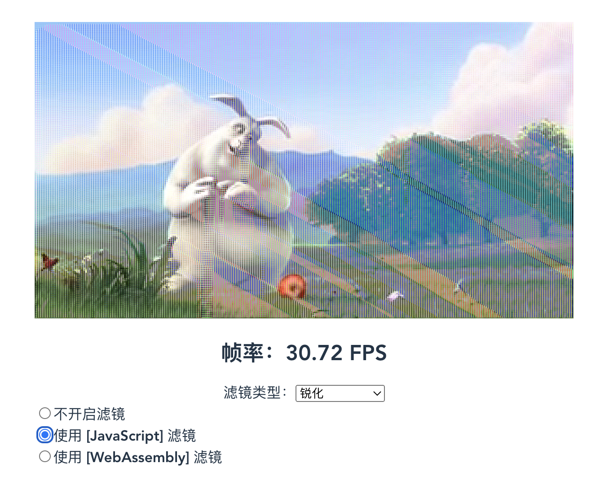

# 前言

WebAssembly 出来已经很久了，但是一直都没有实践过，实在是不应该，所以就趁这次国庆假期浅学一下吧。毛主席说过，“实践是检验真理的唯一标准”，所以我们今天就实现一个“视频实时滤镜效果”的功能。也可直接看[代码](https://github.com/ParadeTo/video-filter)。

# 基本原理介绍

## 视频处理

我们知道，视频其实是由一幅幅的图像组成的，每一辅图像称为一“帧”。所以，我们可以通过 `canvas` 来获取视频的图像数据，对图像数据进行处理完后再绘制到 `canvas` 上去，然后通过 `requestAnimationFrame` 让图像动起来，代码大致如下：

```js
function draw() {
  ...
  // 将当前视频播放的“帧”绘制到 canvas 上面
  context2D.drawImage(
    video,
    0,
    0,
    video.videoWidth,
    video.videoHeight,
    0,
    0,
    canvas.width,
    canvas.height
  )

  // 得到图像数据
  const pixels = context2D.getImageData(0, 0, canvas.width, canvas.height)

  // 处理
  const newData = filter()

  // 修改 canvas 上的内容
  pixels.data.set(newData)
  context2D.putImageData(pixels, 0, 0)
  ...
  requestAnimationFrame(draw)
}
```

## 帧率

为了衡量我们的滤镜算法效率，我们需要计算图像的帧率（FPS），大致思想是先取最近 20 次 `draw` 函数的平均执行时间，然后用其除 1000：

```js
function draw() {
  const timeStart = performance.now()
  ...
  let timeUsed = performance.now() - timeStart
  arr.push(timeUsed)

  calcFPS(arr)
  requestAnimationFrame(draw)

}

function calcFPS(arr: number[]) {
  const n = 20
  if (arr.length > n) {
    arr.shift()
  } else {
    return NaN
  }
  let averageTime =
    arr.reduce((pre, item) => {
      return pre + item
    }, 0) / n
  return 1000 / averageTime
}
```

## 滤镜算法

本文采用图像处理技术中常用的[卷积](https://blog.csdn.net/chaipp0607/article/details/72236892)操作来对图像添加滤镜，卷积操作中需要使用“卷积核”，比如下面这个卷积核可以对图像起到锐化的效果：

```bash
[
  [-1, -1, -1],
  [-1, 9, -1],
  [-1, -1, -1],
]
```

理解了卷积操作的含义后，实现一个卷积算法：

```js
function filterByJS(
  data: Uint8ClampedArray,
  width: number,
  height: number,
  kernel: number[][]
) {
  const h = kernel.length,
    w = h
  const half = Math.floor(h / 2)

  for (let y = half; y < height - half; ++y) {
    for (let x = half; x < width - half; ++x) {
      const px = (y * width + x) * 4
      let r = 0,
        g = 0,
        b = 0

      for (let cy = 0; cy < h; ++cy) {
        for (let cx = 0; cx < w; ++cx) {
          const cpx = ((y + (cy - half)) * width + (x + (cx - half))) * 4
          r += data[cpx + 0] * kernel[cy][cx]
          g += data[cpx + 1] * kernel[cy][cx]
          b += data[cpx + 2] * kernel[cy][cx]
        }
      }
      data[px + 0] = r > 255 ? 255 : r < 0 ? 0 : r
      data[px + 1] = g > 255 ? 255 : g < 0 ? 0 : g
      data[px + 2] = b > 255 ? 255 : b < 0 ? 0 : b
    }
  }
  return data
}
```

有了上面的知识做铺垫后，我们就可以实现一个 JS 版本的滤镜功能了：



不过接下来才是我们的重点，实现一个 WebAssembly 的版本。

# WebAssembly 版本

首先得选一门语言，C/C++ 和 Rust 是个不错的选择，奈何臣妾实在是不会，所以只能选好学又易上手的 Golang 了。

首先，我们新建一个 Golang 项目，并添加我们的代码：

```go
package main

import (
	"reflect"
	"syscall/js"
	"unsafe"
)

// 转换一下
func parseKernel(kernel js.Value) [3][3]int {
	var arr [3][3]int
	for i := 0; i < 3; i++ {
		for j := 0; j < 3; j++ {
			arr[i][j] = kernel.Index(i).Index(j).Int()
		}
	}
	return arr
}

// 对大于 255，小于 0 的像素值进行处理
func getVal(val int) uint8 {
  ...
}

// 开辟一块内存空间，并返回指针给 JS 侧，JS 侧使用方式：
// const {internalPtr: ptr} = window.initShareMemory(size)
func initShareMemory(this js.Value, args []js.Value) any {
	size := args[0].Int()
	buffer := make([]uint8, size)
	boxedPtr := unsafe.Pointer(&buffer)
	boxedPtrMap := map[string]interface{}{
		"internalptr": boxedPtr,
	}
	return js.ValueOf(boxedPtrMap)
}

// 滤镜算法，JS 侧使用方式：
// window.filterByGO(ptr, canvas.width, canvas.height, kernel)
func filterByGO(this js.Value, args []js.Value) any {
	width := args[1].Int()
	height := args[2].Int()
	size := width * height * 4
	sliceHeader := &reflect.SliceHeader{
		Data: uintptr(args[0].Int()),
		Len:  size,
		Cap:  size,
	}

	ptr := (*[]uint8)(unsafe.Pointer(sliceHeader))
	kernel := parseKernel(args[3])

	w := len(kernel)
	half := w / 2
	for y := half; y < height-half; y++ {
		for x := half; x < width-half; x++ {
			px := (y*width + x) * 4
			r := 0
			g := 0
			b := 0

			for cy := 0; cy < w; cy++ {
				for cx := 0; cx < w; cx++ {
					cpx := ((y+(cy-half))*width + (x + (cx - half))) * 4
					r += int((*ptr)[cpx+0]) * kernel[cy][cx]
					g += int((*ptr)[cpx+1]) * kernel[cy][cx]
					b += int((*ptr)[cpx+2]) * kernel[cy][cx]
				}
			}
			(*ptr)[px+0] = getVal(r)
			(*ptr)[px+1] = getVal(g)
			(*ptr)[px+2] = getVal(b)
		}
	}
	return nil
}

func main() {
	quit := make(chan interface{})
	js.Global().Set("filterByGO", js.FuncOf(filterByGO))
	js.Global().Set("initShareMemory", js.FuncOf(initShareMemory))
	<-quit
}
```

然后是我们的 JS 侧：

```js
WebAssembly.instantiateStreaming(fetch('/main.wasm'), go.importObject).then(
  (result) => {
    const goInstance = result.instance
    go.run(goInstance)

    const size = canvas.height * canvas.width * 4
    // 得到内存的指针
    const {internalptr: ptr} = window.initShareMemory(size)
    // 通过这块内存实例化一个 Uint8ClampedArray 对象 mem，mem 和 ptr 都指向这一块内存
    const mem = new Uint8ClampedArray(goInstance.exports.mem.buffer, ptr, size)
    mem.set(pixels.data)
    window.filterByGO(ptr, width, height, kernel)
  }
)
```
