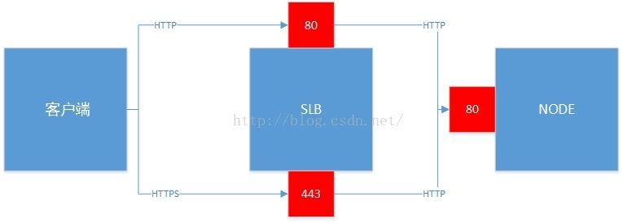
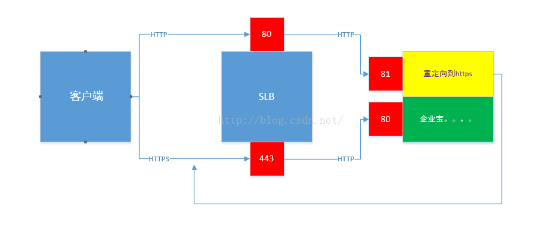

公司产品为了安全考虑必须要用https协议，但是用户在浏览器地址栏中一般不会主动输入https。所以，如何自动从http跳转到https是一个必须要解决的问题。网上大部分的做法是SLB->(https/http)NGIX->(http)NODE。然后由NGIX来实现自动跳转的功能，我们公司没有部署NGIX。然后我们的运维说，你们前端自己去跳吧。

这个很好办，页面上几行代码就搞定：
```javascript
var url = window.location.href;  
if(url.indexOf('https') < 0) {  
  url = url.replace('http:', 'https:');  
  window.location.replace(url);  
}  
```

但是，这样的问题是每一次http的访问都相当于两次访问（同样的css、js、图片，都下载了两次）。不行，我们得在服务器内部就进行跳转。于是，我们写出了这样的代码：
```javascript
app.use(function(req, res, next) {  
  if (req.originalUrl.indexOf("https") < 0) {  
    res.setHeader('Location','http://*****');  
    res.status(301).end();  
  } else {  
    next();  
  }  
});
```

结果是，生产环境上报502错误，意思是SLB无法检测到健康的服务，无法将请求进行转发。
后来仔细想了想，按照上面的做法，是这么个情况:


由于SLB到NODE都是http协议，所以NODE所处理的请求都会进行重定向，并返回301到SLB，而SLB是有一个健康检查的机制，详情可以[看这里](https://help.aliyun.com/knowledge_detail/13057332.html)，我们生产上是配置的返回2**的状态码才认为服务正常。所以，就有了上面的错误。

解决办法，在node端再启动一个服务，监听81端口，SLB监听80端口（http）的数据转发给此服务：


这样的话，81端口SLB的健康检查机制就必须要用TCP的方法。

虽然暂时解决了，但是后面换成NGIX还是有意义的，还可以将静态资源迁移到上面。
