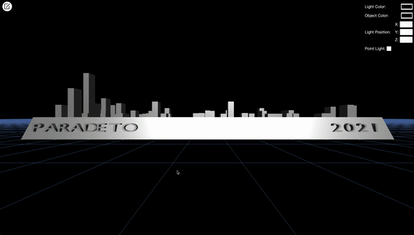
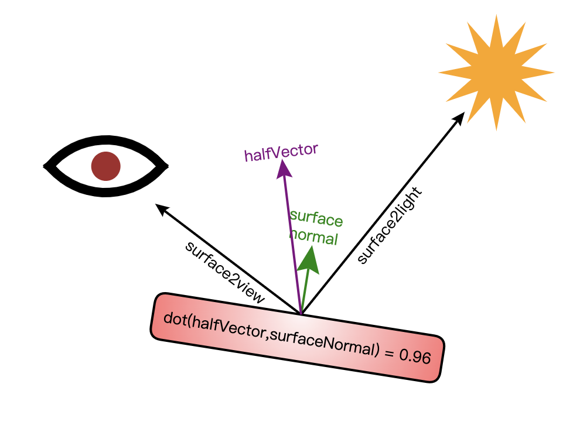
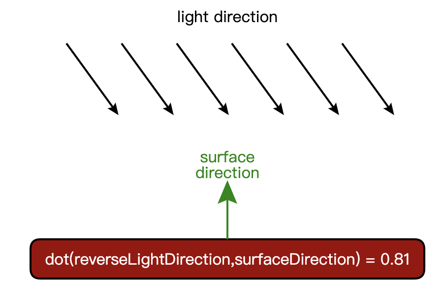
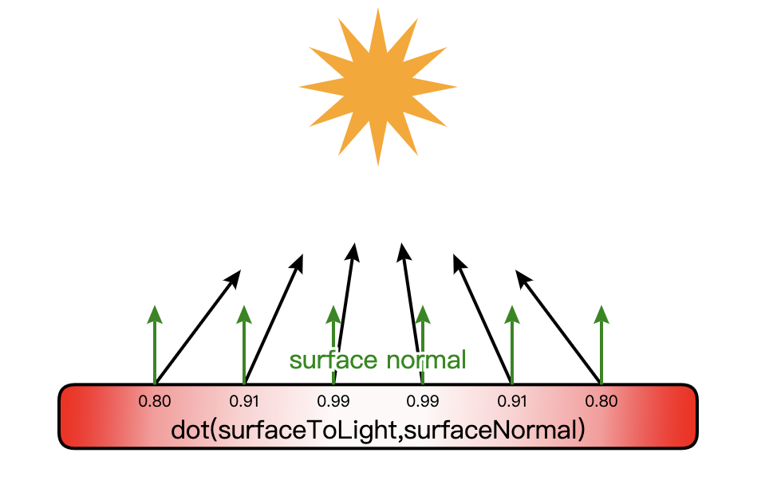
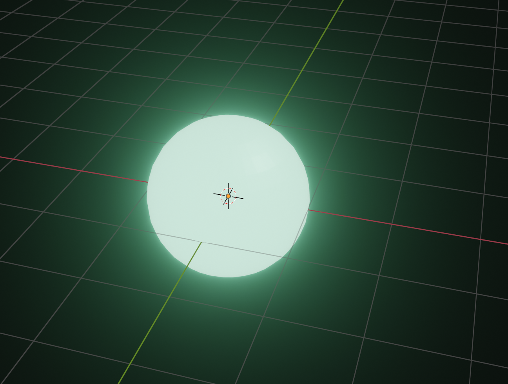
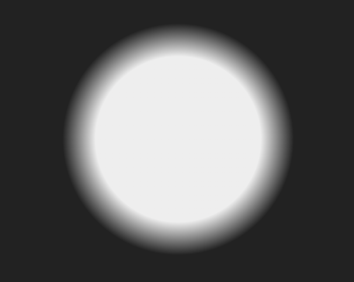

# 先睹为快

接[上回](/2022/10/17/webgl-github-skyline/)实现了一个乞丐版的 Github Skyline 后，这次又新加了一些东西，虽然不多，但是也肝了一周。

老规矩，先来看下效果：


主要是加了这些东西：

- 增加了镜面反射，这样看起来就很有质感了
- 增加了点光源，然而图里面效果不明显
- 增加了参数面板，可以调整光源和物体的颜色、光源的位置，可以对点光源进行切换
- 发布到了线上，可以[在线体验](http://www.paradeto.com/webgl-github-map/)

代码地址仍然是[这里](https://github.com/ParadeTo/webgl-park)，下面简单介绍下怎么实现的。

# 镜面反射

上篇文章介绍物体表面反射的光按照如下公式计算：

```bash
反射光颜色=漫反射光颜色+环境反射光颜色
```

但其实还应该加上镜面反射才显得更加自然：

```bash
反射光颜色=漫反射光颜色+环境反射光颜色+镜面反射光颜色
```

而物体上某一个片元的镜面反射光可以这样计算：



如图，`surface2view` 和 `surface2light` 分别是物体上某点到视点和光源的向量，`halfVector` 是他们的角平分线向量，也就是两个向量的和，`surfaceNormal` 是该点的法向量，则可以用 `halfVector` 和 `surfaceNormal` 两向量的点积来描述反射光的强度。

则，`surfaceNormal` 和 `halfVector` 的夹角越小时，反射光越强，反之越大。当夹角为 0 度时，表示光源发出的光刚好全部被反射进入视点；当夹角大于等于 90 度时，完全没有光进入视点。

更多关于镜面反射的知识可以参考[WebGL 3D - Point Lighting](https://webglfundamentals.org/webgl/lessons/webgl-3d-lighting-point.html)

# 点光源

电光源与平行光源的差别在于，对于一个平面平行光到面上每个点的法线夹角是一样的，这样平行光源下的某个平面，其反射光颜色是一致的：

而点光源则不同，离光源越近，夹角越小，反之越大，这样同一个平面上不同点的反射光颜色不同：


所以，对于平行光源，只需要处理每个顶点的颜色即可。而对于点光源，则需要对每个片元进行处理，即根据每个片元的位置计算点光源的方向：

```glsl
lightDirection = normalize(uLightPosition - vPosition);
```

同时还需要知道每个片元的法向量，因为我们对顶点的位置都左乘了一个变换矩阵 `uModelMatrix`，所以还得根据这个矩阵来计算出顶点对应法向量需要施加的变换，即需要左乘的矩阵 `uNormalMatrix`，而 `uNormalMatrix` 等于 `uModelMatrix` 的逆转置矩阵，证明如下：

设 $\vec{v}$ 和 $\vec{n}$ 分别表示顶点向量以及法向量，$\vec{v}_{new}$ 和 $\vec{n}_{new}$ 是变换后的向量和法向量，则有：

$$
\vec{v}_{new}^T\vec{n}_{new} = 0
$$

设 $M$ 是对顶点向量的变换矩阵，$N$ 是对法向量的变换矩阵，则有：

$${(M\vec{v})}^T{(N\vec{n})} = 0$$
$$=>$$
$$\vec{v}^TM^TN\vec{n} = 0$$

又因为 $\vec{v}^T\vec{n}$ 为 0，如果要让上式成立，我们只需要让 $M^TN$ 为单位矩阵 $I$ 即可，即 $N = {M^{-1}}^T$。

# 如何绘制一个发光的球体

本以为这是一道送分题，这么普遍的需求，随便 Google 一下应该到处都是，结果发现并不是这样。

网上搜索到比较相关的是[这篇文章](https://learnopengl.com/Advanced-Lighting/Bloom)，这篇文章是先将 Webgl 场景中的发光物体提取出来，然后对其进行高斯模糊处理，最后跟原始的场景进行混合。看效果确实不错，但是实在是肝不动了，想找个简单些的方法。

那继续用 Blender 大法吧，这么成熟的软件搞个发光的物体应该很简单吧。确实如此，按照这个[教程](https://www.youtube.com/watch?v=WTFj9B6eFgk)操作即可：



然后导出 `obj` 格式的文件，按照它给的数据绘制不就 ok 了？但是导出后发现文件只有物体本身的信息，并没有物体周围那一圈光晕相关的数据。

看来画一个发光的球不是那么的简单。那换个思路呢？比如画一个发光的圆，发光的效果我们用“渐变”来实现，就像这样：

```html
<style>
  body {
    background-color: #222;
  }
  #circle {
    margin: 100px auto;
    width: 200px;
    height: 200px;
    border-radius: 100px;
    background: radial-gradient(
      circle at center,
      #eee,
      #eee 50%,
      #eee 50%,
      #222 70%
    );
  }
</style>
<body>
  <div id="circle"></div>
</body>
```



片元着色器中可以按照如下方式实现“径向渐变”的圆：

```glsl
float dis = distance(gl_PointCoord, vec2(0.5, 0.5));
if (dis < 0.5) {
  float e = 0.6;
  float r = 0.5;
  vec4 start = vec4(uLightColor.rgb, 1);
  vec4 end = vec4(0.0, 0.0, 0.0, 1);
  gl_FragColor = mix(start, end, (dis / r - e) / (1.0 - e));
} else {
  discard;
}
```

注意，这里绘制是使用的“点”模式 `gl.POINTS`。

这样我们通过“围魏救赵”的方法解决了这个问题，因为我们的光源一般离视点比较远，所以这个效果看着也还不错。

# 总结

爆肝了两周终于实现了一个还算 OK 的效果，实在是太麻烦了，已经迫不及待想学习下 Babylon.js 了，下周继续爆肝。
