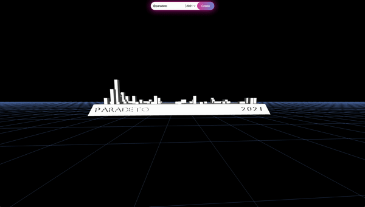
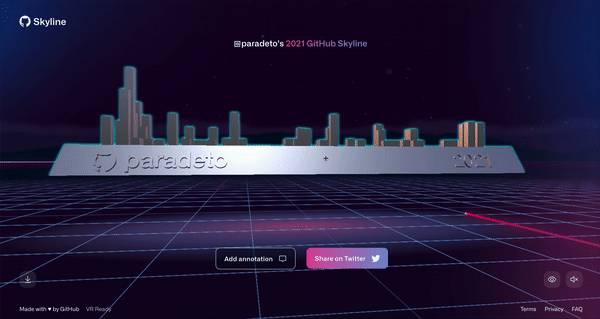
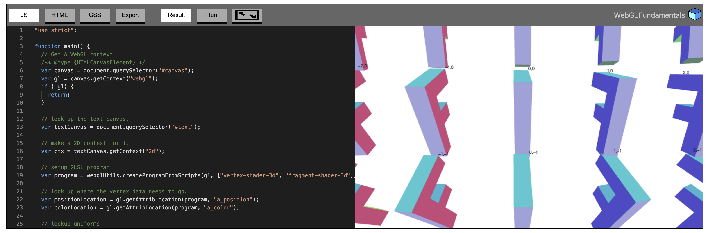
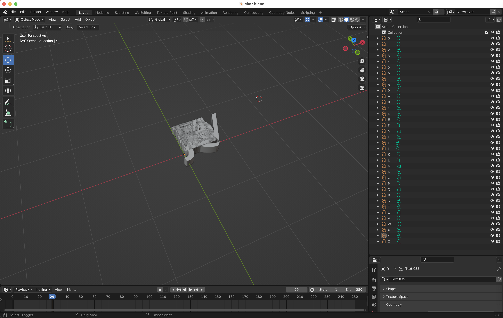
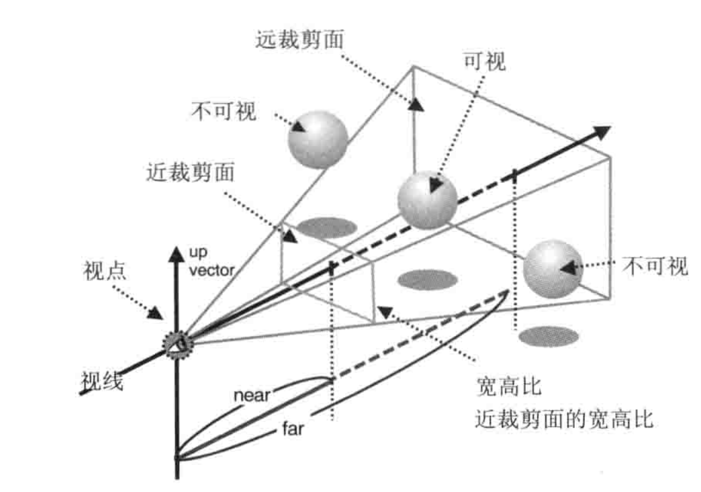

# 前言

最近学习了一下《WebGL 编程指南》这本书，为了检验自己的学习成果，模仿 [GitHub Skyline](https://skyline.github.com/paradeto/2021) 实现了一个乞丐版（[代码](https://github.com/ParadeTo/webgl-park/tree/master/github-contri-map)）的：

对比原版：

显然，差距很大：

- 原版用的是点光源，乞丐版是平行光源
- 缺少 Github 的 Logo
- 缺少各种动画效果
- 原版的纹理等各方面明显更加好看 😂

抛开这些差距不谈，让我们来看看用原生 WebGL 是怎么实现这个东西的吧。

# 实现过程介绍

接下来会从三个方向来介绍实现的过程：

- 模型，即物体以及物体的变换效果。
- 光源，包括光源方向、颜色，以及物体如何反射光。
- 观察者，从哪个方向观察物体，使用什么投影观察物体。

## 模型

本文将模型分成了四大部分，即最下面的网格，往上的梯形体，梯形体上的长方体（表示每天的 contributions），梯形体上的文字。

### 网格

绘制网格是最简单的，绘制一批横竖相间的线条即可，不过这里为了方便，在横竖两个方向上分别只定义了一条线的数据，其他线都是通过修改模型的变换矩阵实现的（其他地方也都是采取的类似的方法）：

```js
const points = new Float32Array([0, 0.0, 1.0, 0, 0.0, -1.0])
if (!this.initArrayBuffer('aPosition', points, gl.FLOAT, 3)) return
for (let i = 0; i < this.lineNum; i++) {
  this.setModelMatrix((matrix) => {
    matrix
      .scale(1, 1, 2000)
      .translate(
        i * this.lineGap - ((this.lineNum - 1) * this.lineGap) / 2,
        -this.trapezoidHeight * 2,
        0
      )
  })
  gl.drawArrays(gl.LINES, 0, 2)
}
```

### 梯形体及长方体

梯形体以及长方体的绘制实际上可以统一为绘制一个六面体，需要先定义好每个面的顶点、顶点的法向量、顶点的颜色：

```js
    v6----- v5
   /|      /|
  v1------v0|
  | |     | |
  | |v7---|-|v4
  |/      |/
  v2------v3

// 顶点
const vertexs = new Float32Array([
  ..., // v0-v1-v2-v3 front
  ..., // v0-v3-v4-v5 right
  ..., // v0-v5-v6-v1 up
  ..., // v1-v6-v7-v2 left
  ..., // v7-v4-v3-v2 down
  ..., // v4-v7-v6-v5 back
])

// 法向量
const normals = new Float32Array([
  ..., // v0-v1-v2-v3 front
  ..., // v0-v3-v4-v5 right
  ..., // v0-v5-v6-v1 up
  ..., // v1-v6-v7-v2 left
  ..., // v7-v4-v3-v2 down
  ..., // v4-v7-v6-v5 back
])

// 颜色
const colors =new Float32Array([
  ..., // v0-v1-v2-v3 front
  ..., // v0-v3-v4-v5 right
  ..., // v0-v5-v6-v1 up
  ..., // v1-v6-v7-v2 left
  ..., // v7-v4-v3-v2 down
  ..., // v4-v7-v6-v5 back
])
```

然后通过顶点索引的方式来绘制物体：

```js
// 每个面对应的顶点的索引
var indices = new Uint8Array([
  ...,    // front
  ...,    // right
  ...,    // up
  ...,    // left
  ...,    // down
  ...     // back
]);
gl.drawElements(gl.TRIANGLES, n, gl.UNSIGNED_BYTE, 0)
```

不过，长方体每个顶点的法向量可以心算得到，但是梯形的话还得通过向量叉乘计算得到：

```js
    v1------v0
    |        |
   |          |
  |            |
 v2------------v3
```

比如，上面这个梯形的法向量就可以通过向量 `v0v1` 叉乘 `v0v3` 得到。

每个长方体代表的 contributions 记录数据可以通过这个接口获取：`https://skyline.github.com/{name}/{year}.json`。本来想着把这个工具发布到 Github 个人主页上去，但是由于这个接口没有设置 CORS 等响应头，所以只能通过代理在本地使用了。如果有大佬知道 Github 官方有提供类似的接口的，麻烦告知一下，小弟不胜感激！

### 文字

文字的绘制是最难的一环，而且书里面也没有提到。并且 WebGL 也没有提供类似 Canvas 2D 绘制文字的 `fillText` 和 `strokeText` 等 API。

既然这样，那只能面向 Google 编程了。搜索 `webgl draw text` 得到的第一条记录是 WebGLFundamentals 网站上的文章，看样子是一个非常靠谱的网站，而且效果都有了：



抄过来不就 OK 了么！

但是，当我仔细研究了一下代码后发现，人家这里绘制的文字不是那个 `F`，而是 `F` 脚下那个黑色的数字。搞了半天，这里还是只介绍了如何绘制 2D 文字。

如果有个地方可以下载到所有字母的顶点以及法线数据就好了，这样我们就能跟绘制长方体一样把文字绘制出来了。

既然这样，那何不我们自己创造这个数据？刚好书里提到了 Blender 导出的模型数据的解析方法，而且还有现成的代码可以参考。那我们就用 Blender 这个工具来生成：



然后导出 `.obj` 格式的数据即可。

这样，最难的一部分也搞定了。

## 光照

根据书中的理论，物体（非镜面）反射的光颜色计算公式为：

```
反射光颜色=漫反射光颜色+环境反射光颜色
```

而`漫反射光颜色`又等于：

```
// θ 是入射光与法向量的夹角
漫反射光颜色=入射光颜色*物体表面基底色*cosθ
// 或者
漫反射光颜色=入射光颜色*物体表面基底色*(入射光向量与法向量内积/(入射光向量长度*法向量长度))
```

而`环境反射光颜色`等于：

```
环境反射光颜色=环境光颜色*表面基底色
```

代码表示如下：

```glsl
// 法向量归一化
vec3 n = normalize(normal.xyz);
// 法向量和光线（已经过归一化）的内积
float nDotL = max(dot(uLightDirection, n), 0.0);
// 漫反射光颜色=入射光颜色*物体表面基底色*(入射光向量与法向量内积/(入射光向量长度*法向量长度)) 由于入射光向量与法向量都经过了归一化，所以这里乘以内积
vec3 diffuse = uLightColor * aColor.xyz * nDotL;
// 环境反射光颜色=环境关颜色*表面基底色
vec3 ambient = uAmbientLightColor * aColor.xyz;
// 反射光颜色=漫反射光颜色+环境反射光颜色
vColor = vec4(diffuse + ambient, 1);
```

## 观察者

本文采用透视投影：



如图所示，透视投影会形成一个梯形体，在这个里面的物体会投影到近裁剪面，然后将近裁剪面缩放到 1:1 的 WebGL 坐标系中得到的最后的图形就是我们看到的结果。我们可以通过如下方式来设置投影矩阵：

```js
// 参数分别是垂直视角、宽高比、近裁剪面距离，远裁剪面距离
projMatrix.setPerspective(100, this.canvas.width / this.canvas.height, 1, 500)
```

这里要注意的是宽高比需要和 canvas 的保持一致，否则会出现图形变形的问题。比如原本预期的是正方形，投影后成了矩形。

研究 Github Skyline 发现，用户可以拖动鼠标来从不同的角度观察物理，所以我们单独定义了一个视图矩阵：

```js
const viewMatrix = new Matrix4()
// 表示从 (0,0,95) 的位置往 (0,0,0) 的位置看，前头顶朝向是 (0,1,0)
viewMatrix.setLookAt(0, 0, 95, 0, 0, 0, 0, 1, 0)
```

同时，我们还可以左右上下调整我们的视角，也就是对视图矩阵进行旋转：

```js
const angle = (Math.PI * this.rotateY) / 180
const s = Math.sin(angle)
const c = Math.cos(angle)
// 先绕 Y 轴旋转，然后再绕之前的 X 轴旋转
viewMatrix.rotate(this.rotateY, 0, 1, 0).rotate(this.rotateX, c, 0, s)
```

注意这里为了保持跟 Github Skyline 一样的交互效果，绕 Y 轴旋转后，需要计算出原来的 X 轴的方向后再绕其进行旋转。

最后每个顶点最终的坐标就由投影矩阵、视图矩阵、模型矩阵乘以顶点的原始坐标得到：

```glsl
gl_Position = uProjMatrix * uViewMatrix  * uModelMatrix * aPosition;
```

# 总结

实现完这么一个东西以后，对 WebGL 最深的体会就是，实在是太麻烦了。难怪会有那么多如 `Three.js`，`Babylon.js` 等 3D 引擎库出现，否则开发一个 3D 产品出来的门槛未免也太高了。不过理解了 WebGL 的基础知识后对使用这些工具会提供更多的帮助，所以学习一下还是有必要的。

另外，《WebGL 编程指南》这本书写得非常不错，对新手很友好，强烈推荐。而且我发现竟然是我研究生同学（非同班）翻译的，原来我现在学的东西竟然是人家 8 年前就会的，差距真大，再次体会了那句话：“少壮不努力，老大徒伤悲”。
