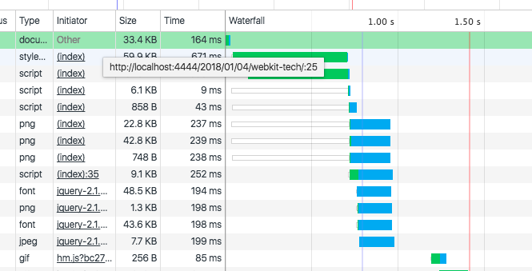

# 浏览器和浏览器内核
## 浏览器
### 浏览器简介
* 第一个浏览器 WorldWideWeb (Nexus)
* 1993 年，Mosaic 浏览器诞生 （网景浏览器 Netscape）
* 1995 年，IE
* 2004 年，Firefox 1.0
* 2003 年，Safari （webkit 内核）
* 2008 年，chrominum （webkit 内核）
* 2013 年，blink内核（源于 webkit）

### 浏览器特性
* 网络
* 资源管理
* 网页浏览
* 多页面管理
* 插件和拓展
* 账户和同步
* 安全机制
* 开发者工具

### HTML
HTML (HyperText Markup Language)

2012 年，HTML5 推出，包含十个类别：

* 离线(offline)
* 存储(storage)
* 连接(connectivity)
* 文件访问(file access)
* 语义(semantics)
* 音频和视频(audio/video)
* 3D和图形(3D/graphics)
* 展示(presentation)
* 性能(performance)
* 其他(Nuts and bolts)

### 用户代理和浏览器行为
User Agent

## 浏览器内核及特性
### 内核和主流内核
内核/渲染引擎：将 HTML/CSS/JavaScript 文本及相应的资源文件转变成可视化（可听化）的图像结果的模块

* Trident: IE
* Gecko: Firefox
* Webkit: Safari, Chromium/Chrome, Android, ChromeOS, WebOS

### 内核特征
* HTML 解释器
* CSS 解释器
* 布局
* JavaScript 引擎
* 绘图

## Webkit 内核
### Webkit 介绍

* webkit 嵌入式接口（API）: 这是狭义的webkit
* webcore
* javascript 引擎
* 调用系统或依赖库接口的桥接层

### webkit 和 webkit2
这里指狭义的 webkit。

webkit2 是一组新的编程接口

### chromium 内核：blink
2013年从 webkit 分离出来

未来会加入的新技术：

* 跨进程的 iframe
* 重新整理和修改 webkit 网络方面的架构和接口
* 将 DOM 树引入 JavaScript 引擎中
* 性能优化

# HTML 网页和结构
## 网页结构
### 框结构
### 层次结构
以下面代码为例说明层次结构：

```html
<!DOCTYPE html>
<html lang="en">
<head>
    <meta charset="UTF-8">
    <title>Title</title>
    <style>
        video, div, canvas {
            transform: rotateY(30deg) rotateX(-45deg);
        }
    </style>
</head>
<body>
    <video autoplay src="http://www.w3school.com.cn/i/movie.ogg"></video>
    <div>
        <canvas id="a2d"></canvas><br>
        <canvas id="a3d"></canvas>
    </div>
    <script>
        var size = 300

        var a2dCtx = document.getElementById('a2d').getContext('2d')
        a2dCtx.canvas.width = size
        a2dCtx.canvas.height = size
        a2dCtx.fillStyle = "rgba(0,192,192,80)"
        a2dCtx.fillRect(0,0,200,200)

        var a3dCtx = document.getElementById('a3d').getContext('experimental-webgl')
        a3dCtx.canvas.width = size
        a3dCtx.canvas.height = size
        a3dCtx.clearColor(0.0, 192.0/255.0, 192.0/255.0, 80.0/255.0)
        a3dCtx.clear(a3dCtx.COLOR_BUFFER_BIT)
    </script>
</body>
</html>
```


* 根层：整个网页
* 层1：video，为它创建一个新的层可以更有效地处理视频解码器和浏览器之间的交互和渲染问题
* 层2：div，因为需要进行3d变换
* 层3和层4：对应 canvas，因为需要绘图

`chrome` 调试器里面的 `layers` 模块可以看到 

# webkit 的网页渲染过程
三个阶段

* url 到构建完 DOM 树
图中蓝线表示 `DOMContentLoaded` 事件触发，红线表示 `onLoad` 事件触发


* CSS + DOM  构建 RenderObject 树，根据网页层次结构创建 RenderLayer 树， 构建 Webkit 绘图上下文
* 绘图上下文到生成最终的图像


# WebKit 架构和模块
## WebKit 架构和模块
### 架构


* 虚线表示在不同的浏览器中的实现是不一样的，实线基本上是共享的。
* chrominum 中的 js 引擎是 v8 引擎

## 基于 Blink 的 Chromium 浏览器结构
### Chromium 浏览器的架构及模块
#### 架构和模块


#### 多进程模型
* 避免单个页面的不响应影响整个浏览器
* 第三方插件崩溃不会影响页面或浏览器的稳定性，因为插件也是使用单独进程来运行
* 方便安全模型实施，沙箱模型是基于多进程架构的


