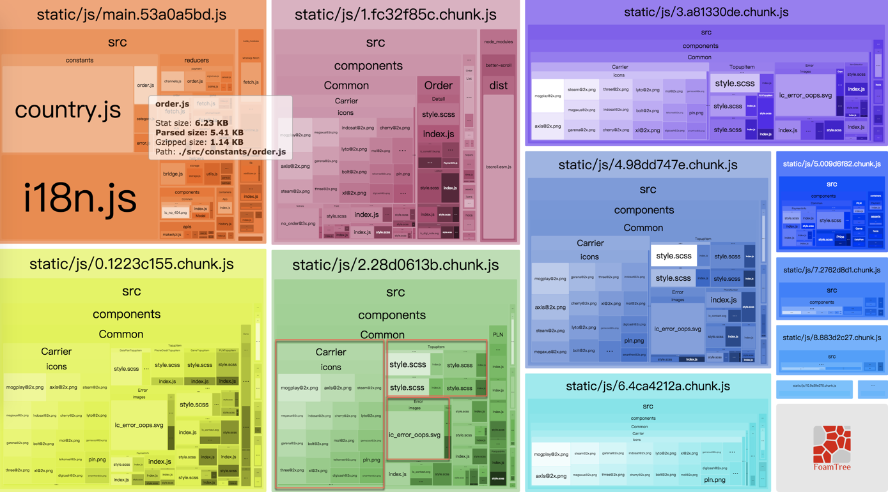
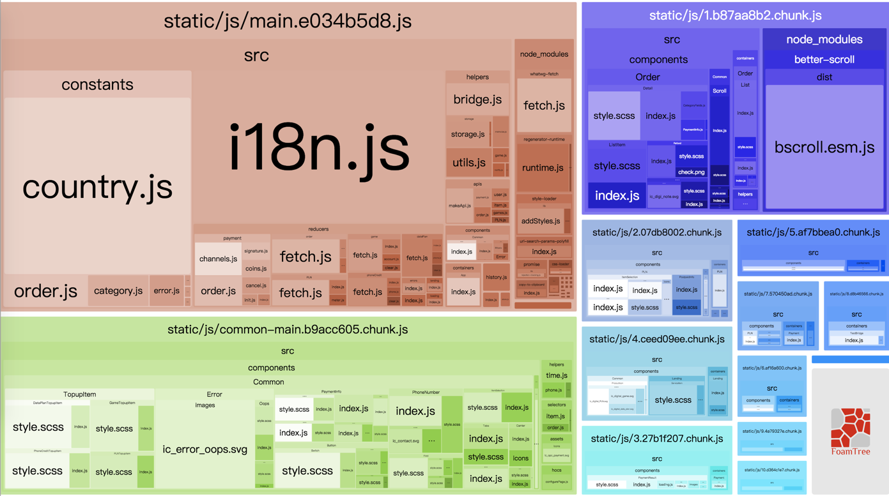

# DllPlugin
一个 creat-react-app 创建的项目中，像 `react`, `react-dom` 等这样的基础库应该是不会经常变动的，所以如果将它们和业务代码分开来打包的话，即使业务代码有变动也不会影响到这些基础代码，这样就可以有效的利用浏览器的缓存。说到这里，可能有人会想到 webpack 的 `CommonsChunkPlugin` 也可以实现这样的功能。不过两者不同的是 `DllPlugin` 是事前将基础代码打包，如果基础代码没有变化的话，以后就不用打包，直接使用，这个有点像 c++ 的动态链接库的概念，这也是它为什么要叫 `DllPlugin` 的原因了。而 `CommonsChunkPlugin` 每次打包的时候都会重新打包这些基础代码。显然，按照上面的说法，`DllPlugin` 还可以提高打包的速度。

下面说一下使用 `DllPlugin` 的步骤。

## 编写 webpack.config.dll.js
我们在 config 目录下新建一个 `webpack.config.dll.js` 用来对基础代码进行打包配置：

```javascript
const path = require('path')
const webpack = require('webpack')
const paths = require('./paths')
const getClientEnvironment = require('./env')
const HtmlWebpackPlugin = require('html-webpack-plugin')

const publicPath = paths.servedPath
const publicUrl = publicPath.slice(0, -1)
const env = getClientEnvironment(publicUrl)

module.exports = {
  entry: {
    vendor: [
      'classnames',
      'i18next',
      'object-assign',
      'promise',
      'react',
      'react-dom',
      'react-i18next',
      'react-loadable',
      'react-logger',
      'react-redux',
      'react-router-dom',
      'react-router-redux',
      'redux',
      'redux-actions',
      'redux-logger',
      'redux-saga',
      'redux-thunk',
      'reselect'
    ]
  },
  output: {
    path: paths.appPublic,
    filename: 'static/js/[name].[chunkhash:8].js',
    library: '[name]_library', // same with webpack.DllPlugin name option
    publicPath: publicPath
  },
  plugins: [
    new webpack.DllPlugin({
      path: path.resolve(paths.appPublic, 'static/js/[name]-manifest.json'),
      name: '[name]_library',
      context: paths.appPublic
    }),
    new HtmlWebpackPlugin({
      inject: true,
      template: paths.appHtmlTemplate, // public/template
      minify: {
        removeComments: true,
        collapseWhitespace: true,
        removeRedundantAttributes: true,
        useShortDoctype: true,
        removeEmptyAttributes: true,
        removeStyleLinkTypeAttributes: true,
        keepClosingSlash: true,
        minifyJS: true,
        minifyCSS: true,
        minifyURLs: true
      }
    }),
    new webpack.DefinePlugin(env.stringified),
    new webpack.optimize.UglifyJsPlugin({
      compress: {
        warnings: false
      },
      output: {
        comments: false,
        // Turned on because emoji and regex is not minified properly using default
        // https://github.com/facebookincubator/create-react-app/issues/2488
        ascii_only: true
      },
      sourceMap: false
    })
  ]
}
```

这里有几点说明一下：
1. 打包出来的文件名会像这样 `vendor.659ad6e1.js`，这里我们把 `vendor` 的输出到 `public/static/js` 下，目的是为了执行 `npm run build` 时将 `public` 下的文件全拷贝到 `build`。
2. `output` 的属性 `library` 必须和 `DllPlugin` 的 `name` 一致。
3. `DllPlugin` 的 `path` 指定了 `vendor` 的描述文件 `vendor-manifest.json` 的输出路径，该文件用于通知 webpack 哪些库不需要打包。
4. `HtmlWebpackPlugin` 的作用是为了将生成的 `vendor` 插入到 html 文件之中，我们在 `public/template` 下面新建了一个 `index.html` 用作 `HtmlWebpackPlugin` 的 `template`，最后输出一个新的 `index.html` 到 `public` 下面。
5. `DefinePlugin` 和 `UglifyJsPlugin` 是为了优化打包后的 `vendor` 的体积。


然后运行 `NODE_ENV=production webpack --config ./config/webpack.config.dll.js` 即可得到我们所要的文件：

```
├── index.html
├── static
│   └── js
│       ├── vendor-manifest.json
│       └── vendor.88387554.js
└── template
    └── index.html
```

## 修改 webpack.config.prod.js
我们在 `webpack.config.prod.js` 的 `plugins` 中增加如下插件来告诉 webpack 打包时将 `vendor` 中的库排除掉。

```javascript
new webpack.DllReferencePlugin({
  context: paths.appPublic,
  manifest: require(path.resolve(paths.appPublic, 'static/js/vendor-manifest.json'))
})
```

最后，我们来对比下使用该插件的前后的对比:

*before*
```javascript
✨  Done in 23.03s.
```

```
-rw-r--r--  1 youxingzhi  staff   252510  8 13 18:28 0.8cca93f2.chunk.js
-rw-r--r--  1 youxingzhi  staff   233671  8 13 18:28 1.1df14c3d.chunk.js
-rw-r--r--  1 youxingzhi  staff     3015  8 13 18:28 10.e379af0a.chunk.js
-rw-r--r--  1 youxingzhi  staff   232284  8 13 18:28 2.55f29fc1.chunk.js
-rw-r--r--  1 youxingzhi  staff   207196  8 13 18:28 3.5b6bdb85.chunk.js
-rw-r--r--  1 youxingzhi  staff   207192  8 13 18:28 4.ba2211aa.chunk.js
-rw-r--r--  1 youxingzhi  staff    45886  8 13 18:28 5.9611f855.chunk.js
-rw-r--r--  1 youxingzhi  staff    21278  8 13 18:28 6.b83fe6aa.chunk.js
-rw-r--r--  1 youxingzhi  staff   114200  8 13 18:28 7.2134ba2c.chunk.js
-rw-r--r--  1 youxingzhi  staff    29477  8 13 18:28 8.c8f9c515.chunk.js
-rw-r--r--  1 youxingzhi  staff    24036  8 13 18:28 9.9a56bc85.chunk.js
-rw-r--r--  1 youxingzhi  staff   551011  8 13 18:28 main.c7b5bf05.js
```

总大小约为 1.83M


*after*

```javascript
✨  Done in 18.23s.
```

```
-rw-r--r--  1 youxingzhi  staff  250133  8 13 18:47 0.1223c155.chunk.js
-rw-r--r--  1 youxingzhi  staff  233124  8 13 18:47 1.fc32f85c.chunk.js
-rw-r--r--  1 youxingzhi  staff    7032  8 13 18:47 10.9a39e375.chunk.js
-rw-r--r--  1 youxingzhi  staff  229972  8 13 18:47 2.28d0613b.chunk.js
-rw-r--r--  1 youxingzhi  staff  204931  8 13 18:47 3.a81330de.chunk.js
-rw-r--r--  1 youxingzhi  staff  204927  8 13 18:47 4.98dd747e.chunk.js
-rw-r--r--  1 youxingzhi  staff   45462  8 13 18:47 5.009d6f82.chunk.js
-rw-r--r--  1 youxingzhi  staff  113812  8 13 18:47 6.4ca4212a.chunk.js
-rw-r--r--  1 youxingzhi  staff   29069  8 13 18:47 7.2762d8d1.chunk.js
-rw-r--r--  1 youxingzhi  staff   23646  8 13 18:47 8.883d2c27.chunk.js
-rw-r--r--  1 youxingzhi  staff    3011  8 13 18:47 9.be1dcb3e.chunk.js
-rw-r--r--  1 youxingzhi  staff  251264  8 13 18:47 main.53a0a5bd.js
-rw-r--r--  1 youxingzhi  staff  343146  8 13 18:46 vendor.88387554.js
```

总大小约为 1.85M


虽然优化后的总大小增加了约 20K 的大小（暂时不知道为啥），但是通过把这些公共且稳定的基础代码抽离出来以后，原来的各个文件都有了不同程度的瘦身，这么做还是有些价值的。

# HappyPack
happypack 是 webpack 的一个插件，目的是通过多进程模型，来加速代码构建，关于该插件的原理可以参考[这里](http://taobaofed.org/blog/2016/12/08/happypack-source-code-analysis/)。下面我们来看看我们的项目是怎么使用的：

在 `webpack.config.base.js` 中针对 `eslint-loader` 使用 happypack 插件：

```javascript
{
  test: /\.(js|jsx|mjs)$/,
  enforce: 'pre',
  use: 'happypack/loader?id=prejs',
  // use: [
  //   {
  //     options: {
  //       formatter: eslintFormatter,
  //       eslintPath: require.resolve('eslint')
  //     },
  //     loader: require.resolve('eslint-loader')
  //   }
  // ],
  include: paths.appSrc
},
...
new HappyPack({
  id: 'prejs',
  threads: 4,
  loaders: [{
    options: {
      formatter: eslintFormatter,
      eslintPath: require.resolve('eslint')
    },
    loader: require.resolve('eslint-loader')
  }]
})
```

在 `webpack.config.prod.js` 中针对 `babel-loader` 使用 happypack 插件：

```javascript
{
  test: /\.(js|jsx|mjs)$/,
  include: paths.appSrc,
  use: 'happypack/loader?id=js' // require.resolve('babel-loader'),
  // options: {
  //   compact: true
  // }
},
...
new HappyPack({
  id: 'js',
  threads: 4,
  loaders: [{
    options: {
      compact: true
    },
    loader: require.resolve('babel-loader')
  }]
})
```


然后再构建一次，发现速度又有了提升：

```
✨  Done in 16.21s.
```

# 使用 BundleAnalyzerPlugin 分析打包后结果
我们在 `package.json` 中增加一条命令 `build:analyze: ANALYZE=true node scripts/build.js`，然后在配置文件中添加这条语句：

```javascript
if (process.env.ANALYZE) {
  config.plugins.push(new BundleAnalyzerPlugin())
}

module.exports = config
```

运行 `yarn run build` 后，得到如下结果：



这里有两个地方可以进一步优化：

1. 我们异步加载的路由文件中打包了很多重复的组件，如图中红框所示的 `Error` 和 `TopupItem` 等，这些组件都可以提取到一个公共的文件中。
2. 有很多图片内联到了 js 代码中，可以提取出来

针对第二个问题，我们将 `url-loader` 的 `limit` 参数调小一些即可。而针对第一个问题，则需要 `CommonsChunkPlugin` 登场了。

# CommonsChunkPlugin
这里一直没有搞成功，直到我看到了[这篇文章](https://zhuanlan.zhihu.com/p/26710831)，才知道可以用 `CommonsChunkPlugin` 的 `async` 这个属性：

```javascript
// async chunk common
new webpack.optimize.CommonsChunkPlugin({
  async: 'common',
  minChunks: 2
})
```

再次执行打包命令，得到结果:



这样就把异步路由里面的公共组件都提取到了 `common-main.****` 中了。

# 总结
这次优化我们首先使用 `DllPlugin` 把一些稳定的基础库提取到了 `vendor.****.js` 中，如果基础库没有升级的话，这个文件可以长期存在于用户的缓存中。然后我们使用 `HappyPlugin` 并行处理一部分打包流程，提高了打包的速度。最后我们通过 `CommonsChunkPlugin` 将异步路由中的公共组件提取出来，虽然增加了一些初始加载的代码，但是减少了很多重复组件的代码，另外将图片抽离出来，使得最后打包出来的总体积减少到了 0.88M，效果还是不错的。