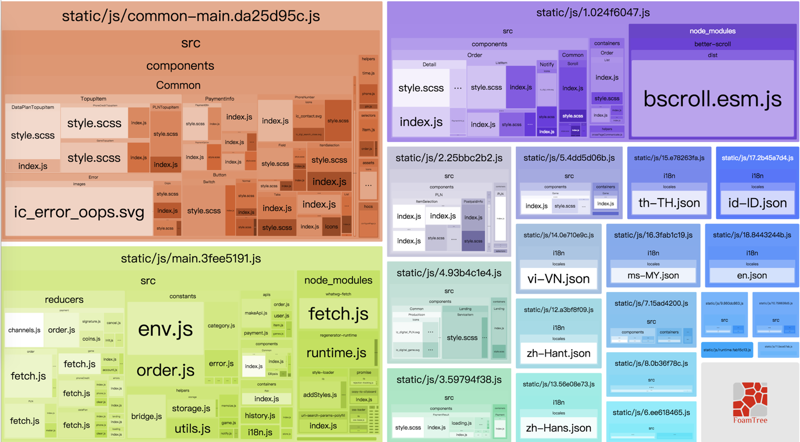

# 回顾
[前面](/2018/08/13/webpack-bundle-optimize1/)我们已经对我们的项目做过了一次优化，优化后的结果如下图所示：


可以看到 `main.***.js` 中还有 `country.js` 和 `i18n.js` 两块大家伙。很明显，这两个东西都跟我们的 i18n 翻译数据有关，下面我们就来优化这一块。

# 处理 process.env
`country.js` 和 `i18n.js` 中都使用了 `process.env` 这个对象，也就是说资源被重复的使用了，所以我们这里将其提取出来放到 `constants/env.js` 下面，然后导出供其他模块使用:

```javascript
export default process.env
```

# 异步加载翻译文件
我们项目现在的做法是将所有语言都一起打包到了最终的 `main` 文件中，这显然没有必要，比较合理的做法是只打包该地区的默认语言到 `main` 文件中，然后根据用户选择的语言来动态加载翻译文件。

## 打包默认语言
我们在 `config` 下面新建一个 `languages.js`，然后生成默认语言及其翻译资源并导出：

```javascript
const localesHash = require('../i18n/localesHash')
const resourcesHash = require('../i18n/resourcesHash')

const COUNTRY = process.env.COUNTRY || 'sg'
const country = (COUNTRY).toUpperCase()
const defaultLng = localesHash[country][0]

const resources = {
  [defaultLng]: {
    common: resourcesHash[defaultLng]
  }
}

exports.resources = resources
exports.defaultLng = defaultLng
```

然后将它们加入到 `env.js` 中：

```javascript
LANGUAGE: {
  resources: languages.resources,
  defaultLng: languages.defaultLng
}
```

在 `i18n.js` 中使用方式跟之前类似，不过这里将之前匹配 app 语言的代码删去了，因为我们需要动态的加载我们的翻译文件。

```javascript
import i18next from 'i18next'
import env from '@const/env'
import { firstLetterUpper, getLocale } from './helpers/utils'

let LANGUAGE = env.LANGUAGE
LANGUAGE = typeof LANGUAGE === 'string' ? JSON.parse(LANGUAGE) : LANGUAGE

const { defaultLng, resources } = LANGUAGE

i18next
  .init({
    lng: defaultLng,
    fallbackLng: defaultLng,
    defaultNS: 'common',
    keySeparator: false,
    debug: env.NODE_ENV === 'development',
    resources,
    interpolation: {
      escapeValue: false
    },
    react: {
      wait: false,
      bindI18n: 'languageChanged loaded',
      bindStore: 'added removed',
      nsMode: 'default'
    }
  })
```

## 动态加载翻译文件
说道动态加载，首先想到可以使用 webpack 提供的 `import` 函数，所以我们在 `i18n.js` 中增加了如下函数:

```javascript
export const loadResource = lng => {
  let p

  return new Promise((resolve, reject) => {
    if (isMatch(defaultLng, lng)) resolve()

    switch (lng) {
      case 'th-TH':
        p = import('../i18n/locales/th-TH.json')
        break
      case 'id-ID':
        p = import('../i18n/locales/id-ID.json')
        break
      case 'ms-MY':
        p = import('../i18n/locales/ms-MY.json')
        break
      case 'vi-VN':
        p = import('../i18n/locales/vi-VN.json')
        break
      case 'zh-Hans':
        p = import('../i18n/locales/zh-Hans.json')
        break
      case 'zh-Hant':
        p = import('../i18n/locales/zh-Hant.json')
        break
      default:
        p = import('../i18n/locales/en.json')
    }

    p.then(data => {
      i18next.addResourceBundle(lng, 'common', data)
      changeLanguage(lng)
    })
      .then(resolve)
      .catch(reject)
  })
}
```

该函数传入需要加载的语言，如果加载的语言与该地区默认语言一致的话，就直接 `resolve`，否则动态加载相应的翻译文件。

然后将 `src/index.js` 改成如下所示：

```javascript
loadResource(lng)
  .then(() => {
    ReactDOM.render(
      <I18nextProvider i18n={i18n}>
        <Provider store={store}>
          <ConnectedRouter history={history}>
            <App />
          </ConnectedRouter>
        </Provider>
      </I18nextProvider>,
      document.getElementById('root')
    )
  })
```

意思就是要等翻译文件加载完成后，再渲染我们的 react 组件。

## 问题
按照上面这样修改以后，我们发现我们的首页并没有像预期一样显示正确的内容，原因是我们的首页数据是写在 `reducers/landing/index.js` 中的，然后这些 `reducers` 在 `src/store.js` 中被统一导入，而 `store.js` 又在 `src/index.js` 中导入，而此时我们的翻译文件并没有加载完成，所以这里的翻译就是使用的旧的资源了。

为了解决这个问题，只好稍微改一下我们的代码了。我们先修改 `reducers/landing/index.js`：
```javascript
const serviceList = [
  {
    name: 'phone_credit',
    icon: 'phoneCredit',
    url: `/phone-credit`
  },
  {
    name: 'data_plan',
    icon: 'dataPlan',
    url: `/data-plan`
  },
  {
    name: 'game',
    icon: 'game',
    url: '/game'
    // isPromo: true
    // forbidden: true
  },
  ...
```

我们把翻译的工作拿到组件里面去做：

```javascript
const ServiceItem = ({ name, url, icon ...
...
<p>{tUpperCase(name)}</p>
...
```

这样，我们就大功告成了，让我们看看最后的杰作：


