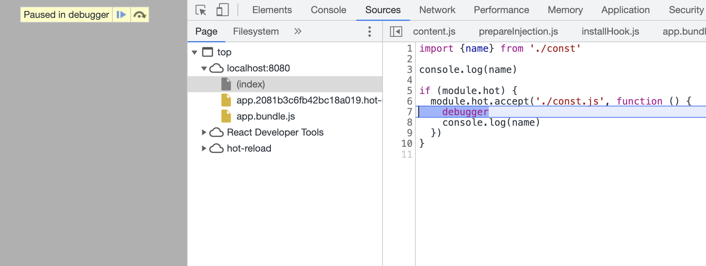
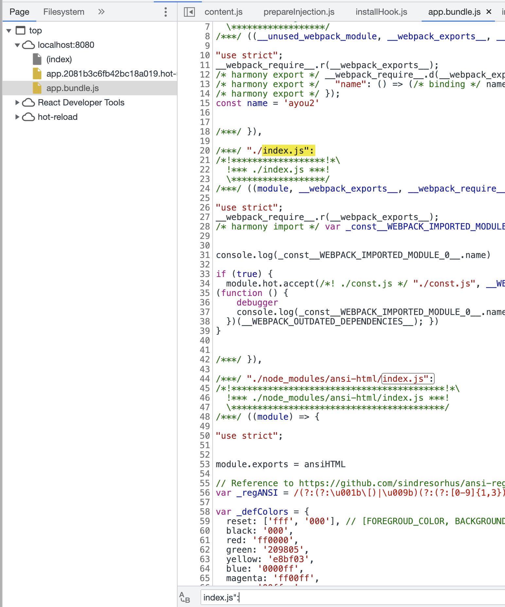

网上看过很多关于 webpack HRM 的介绍，对整个流程已经有了一个大致的了解，但是有几个地方一直没有搞清楚，比如下面这个代码：

```js
// const.js
export const name = 'ayou'

// index.js
import {name} from './const'

console.log(name)

if (module.hot) {
  // or import.meta.webpackHot
  module.hot.accept('./const.js', function () {
    console.log(name)
  })
}
```

第一个问题是，`module`（或者 `import.meta`）是个啥东西，JS 中好像没有 `module` 或 `import.meta` 这个对象呀。

第二个问题是，`accept` 回调函数中的 `name` 是怎么更新为新的值的，看代码他引用的还是文件顶部的那个 `name` 呀。

为了搞清楚这个问题，我们还是来调试一下吧。

我们先在回调函数中打个断点，启动 webpack dev server，然后修改 `const.js` 中的 `name`，则浏览器会停在断点处：



这样还是看不出什么，我们需要看一下原始的代码：



我们在 `app.***.js` 中搜索 `index.js":`，找到这个模块的代码拷贝出来看看：

```js
;(module, __webpack_exports__, __webpack_require__) => {
  'use strict'
  __webpack_require__.r(__webpack_exports__)
  /* harmony import */ var _const__WEBPACK_IMPORTED_MODULE_0__ =
    __webpack_require__(/*! ./const */ './const.js')

  console.log(_const__WEBPACK_IMPORTED_MODULE_0__.name)

  if (true) {
    module.hot.accept(
      /*! ./const.js */ './const.js',
      (__WEBPACK_OUTDATED_DEPENDENCIES__) => {
        /* harmony import */ _const__WEBPACK_IMPORTED_MODULE_0__ =
          __webpack_require__(/*! ./const.js */ './const.js')
        ;(function () {
          debugger
          console.log(_const__WEBPACK_IMPORTED_MODULE_0__.name)
        })(__WEBPACK_OUTDATED_DEPENDENCIES__)
      }
    )
  }

  /***/
}
```

这样，问题的答案就很显然了。

第一个问题：`module` 是个啥东西？
答：是 webpack 运行时插入的一个对象，用来表示一个模块。webpack 在打包的时候，会将每个模块的代码都会被放到一个函数中，函数参数是 `module, exports, require`，在加载这个模块的时候会传入这几个参数，然后执行该函数。这个跟 Node.js 中的模块机制是类似的。

第二个问题：`accept` 回调函数中的 `name` 是怎么更新为新的值的？
答：从打包后的结果来看，主要原因在于 webpack 在回调函数中添加了重新引入 `const.js` 模块的代码，从而使得导出的对象得到了更新。
